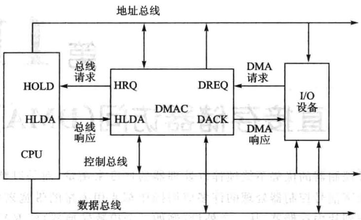
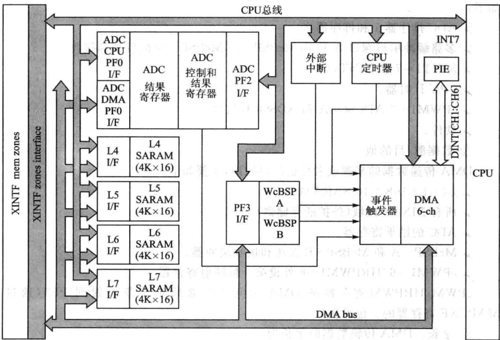
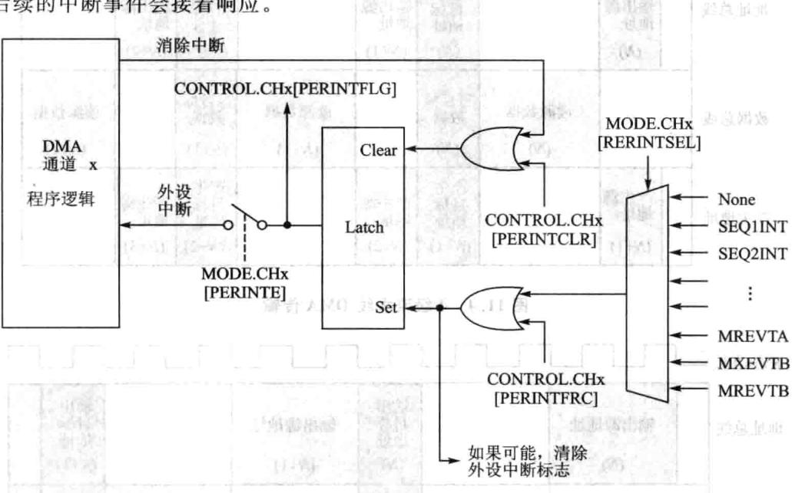
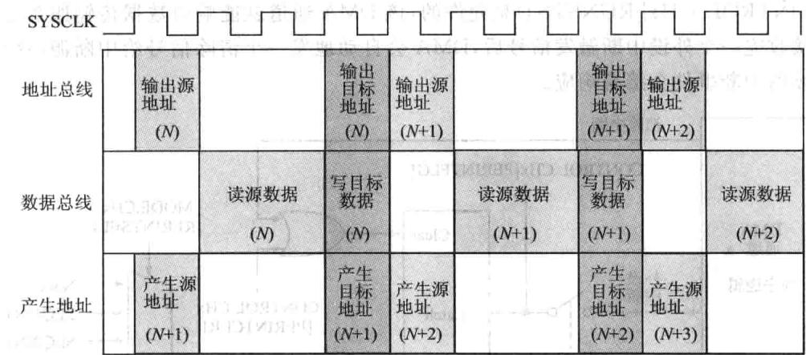
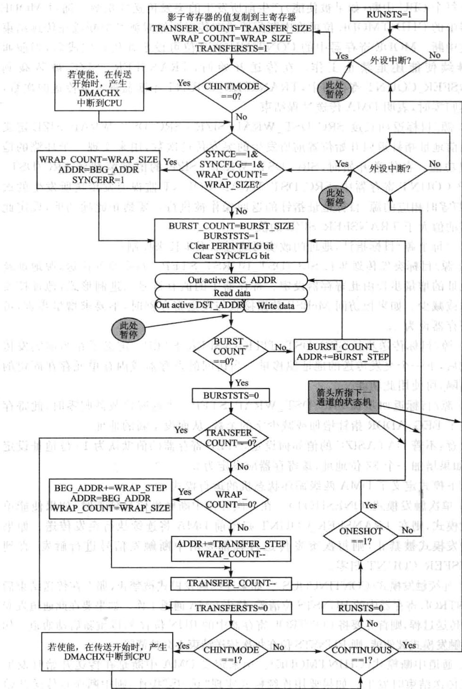
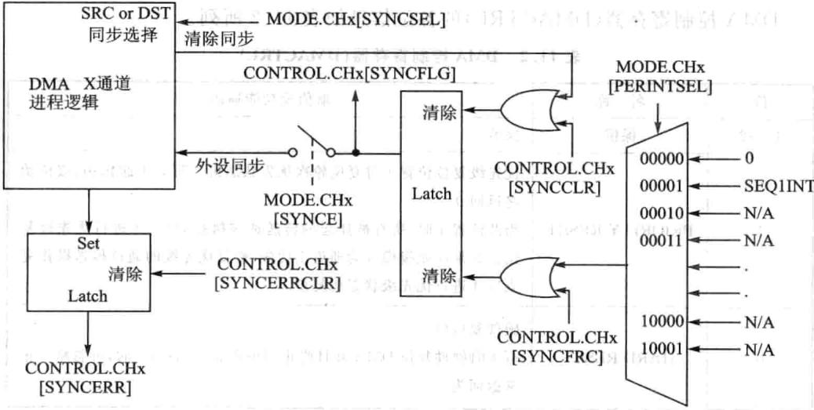
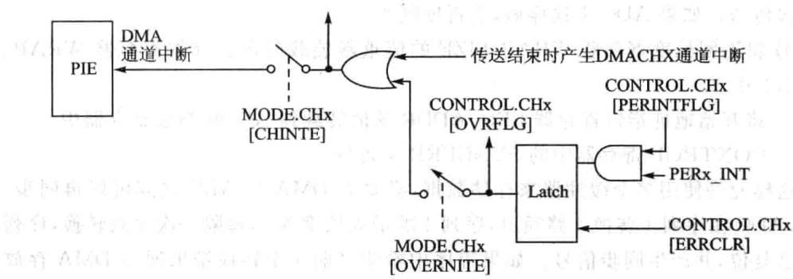
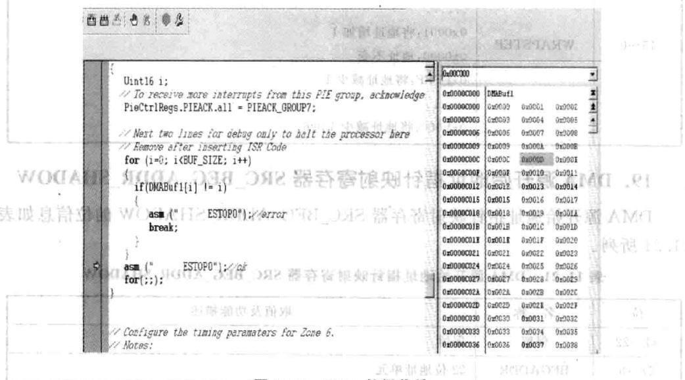

# 第 11 章

## 直接存储器访问(DMA)模块

数字信号控制器的优势不能纯粹以处理器的速度来衡量，而是以整个系统的能来衡量。数字信号控制器处理的许多应操作都要用量的带宽来移动数据，如从外存储器到片内存储器，从一个外设（例如一个模数转换器）到RAM，从一个外设到另一个外设之间。例如当控制器读写A/D采集的数据时或者读写外部扩展存储器内容时，内存与外设间会存在着大量的数据交换，而且这种交换是经常性的。对于这样的数据交换，若采用中断方式响应，每传送一次数据，就要经历中断处理的全部步骤，CPU就会不断地进中断的相关操作，如将工作现场寄存器压堆栈，中断结束时，恢复现场，CPU频繁地进工作现场的切换，效率非常低。有没有一种专用通道，专用的控制器来负责这类经常性的操作，而将CPU资源释放出来呢?

### 11.1 DMA模块概述

直接存储器访问DMA（DirectMemoryAccess)模块就是用硬件实现存储器与存储器之间、存储器与I/O设备之间直接进高速数据传送，不需要CPU的干预，减少了中间环节，而且存储器地址的修改和传送均由硬件自动完成，所以极大地提高了批量数据的传送速度。

实现DMA传送的关键部件是DMA控制器（DMAC)。系统总线分别受到CPU和DMAC这两个部件的控制，即CPU可以向地址总线、数据总线和控制总线发送信息（非DMA式)，DMAC也可以向地址总线、数据总线和控制总线发送信息(DMA式)。

但在同一时刻，系统总线只能接受一个部件的控制。究竟哪个部件来控制系统总线，是通过这两个部件之间的“联络信号”控制实现的。DMA取得总线控制权前处于受控状态，此时，CPU可对DMAC进行初始化编程，也可从DMAC中读出状态，这时DMA处于从态，DMAC上电或复位时，DMAC动处于从态。在DMAC获得总线控制权之后，DMAC取代CPU而成为系统总线的主控者，接管和控制系统总线。通过总线向存储器或I/O设备发出地址、读/写信号，以控制在两个实体之间的数据传送。这时候DMA处于主动态。DMA系统组成框图如图11.1所示。

DMA传送过程致有以下个步骤：

①当外设输入数据准备好，外设向DMA发出一个选通信号，将数据送到数据

图11.1DMA模块系统组成

端口；向DMA发出请求。

②DMA控制器向CPU发出总线请求信号(HOLD)高电平。

③CPU在现行总线周期结束后响应，向DMA发出响应信号（HLDA)高电平。

④CPU待该总线周期结束时，放弃对总线控制，DMA控制器接管三态总线，接口将数据送上数据总线，并撤消DMA请求。

⑤内存收到数据以后，给DMA个回答，于是DMA修改地址指针，改变传送字节数。检查传送是否结束。没有结束，下次接口准备好数据，再进行一次新的传输。

⑥当计数值计为0，DMA传输过程便告结束。DMA控制器撤消总线请求(HOLD变低），在下一个时钟周期上升沿使总线响应HLDA变低，DMA释放总线，CPU取得总线控制权。

在高速大数据量场合的情况下，显然DMA传输方式要比CPU中断处理方式来得优越得多。但并不是每个控制器都有DMA通道，即便有DMA通道的控制器，其通道数也是有限的，因为DMA通道是有额外硬件开销的。在DMA期间由DMAC（直接存储器存取控制器）控制总线，负责一批数据的传输，数据传送完成后，再把总线的控制权交还给CPU。由于DMA传送期间，CPU让出总线控制权，这就可能影响诸如中断请求的及时响应和处理；又因为DMA传送方式的高速度是以增加系统的复杂性和成本为代价的（即硬件控制代替软件控制）。所以，在些系统中，当对传送速度和传送量要求不高时，一般并不用DMA方式。

### 11.2 F28335的DMA模块

## 1．F28335的DMA模块的基本特点

F28335的DMA模块主要结构如图11.2所，DMA数据传输是基于事件触发的，这就意味着DMA需要外设中断触发来启动DMA的数据传输。F28335共有18个不同的触发源，图中右边所示即为触发源，外设触发源如表11.1所列。其中有8个外部中断触发源，全部引自GPIO引脚，这样DMA的事件触发是很灵活的。DMA不能通过数据源定时触发，若要定时触发可以借助于外设中断触发源中CPU定时器来实现。F28335共有6个DMA通道，每个通道都可以有各的触发源，通过各独的PIE中断告知CPUDMA数据传输的开始与结束，这6个通道中，第通道有着更的优先级。DMA模块的核其实是个与地址控制逻辑紧密关联的状态机，在数据传输过程中让数据块动地重新配置，就好像是两个缓冲器之间在打乒乓球样，我们把这种机制也叫做DMA的乒乓机制。DMA总线结构包括个22位地址总线，个32位数据读总线，和个32位数据写总线，与DMA总线相连的资源，好比乒乓球运动员，分别是数据传送的地址源与数据源，地址源与数据源的接口通过总线互相相连，这个接口DMA可能会访问，CPU也会访问。与DMA总线相连的资源如图中左边所示，①XINTF区域0、6、7、8，L4SARAM、L5SARAM、L6SARAM、L7SARAM;②ADC存储器映射结果寄存器；③MCBSP-A和MCBSP-B数据接收寄存器（DDR2/DDR1）和数据发送寄存器（DXR2/DXR1）④映射到外设3的ePWM1-6/HRPWM1-6寄存器。

图11.2 DMA结构图

|外设|中断触发源|
|---|---|
|CPU|DMA软件位（CHx.CONTROL.PERINIFRC)|
|ADC|排序器1中断排序器2中断|
|外部中断|外部中断1～7、外部中断13|
|CPU定时器|CPU定时器0、1、2溢出|
|McBSP-A,McBSP-B|发送缓冲器空、接收缓冲器满|
|Epwm1~6|ADC启动信号|

表11.1DMA外设中断触发源

F28335的DMA的基本特性如下：

①6个DMA通道，6个通道都具有独立的PIE中断。

②外设中断触发源。

DMA模块是基于事件触发的，因此要求一个外设触发器启动DMA数据的传递。例如它能通过将一个定时器配置成中断触发源，从而变成一个周期性的定时驱动器，中断触发源可以为6个DMA通道分别单独配制。F28335的外设中断触发源如下：

ADC排序器1和排序器2。

多路缓冲串行端口A和B(McBSP-A,McBSP-B)的发送和接收。

➢XINT1～7和XINT13。

CPU计时器。

ePWM1~6 ADCSOCA和ADSOCB信号。

软件。

③数据源/目的地。

DMA传递数据的来源或者传输的目的地，主要如下：

所有XINTF区域(外扩的存储器)。

ADC的结果寄存器。

McBSP-A和McBSP-B发送和接收缓冲器。

ePWM1~6/HRPWM1~6外设第3帧映射寄存器。

ePWM/HRPWM寄存器被DMA访问之前必须被重新映射到 PF3（通过MAPCNF寄存器的0位设置）。

④字长。DMA传输数据的字长为：

字的大小：16位或32位（McBSPs只限于16位）。

读写操作：4周期/字（对于McBSP5周期/字进行读取）。

## 2.F28335的DMA模块的触发机制

外设中断触发DMA数据传送的原理如图11.3所示。F28335的DMA每个通道都可以选择各自独立的触发源，触发源有18个，包括与GPIO引脚连接的8个外部中断触发源，这样的触发源的选择是很灵活的。在外设中断触发的时候，首先通过各自通道的模式寄存器（MODE.CHX）的外设中断触发源选择位（MODE.CHX（PERINTSEL））来选择触发源，有效的中断触发发生后，控制寄存器的外设中断触发标志位（PERINTFLG）会被置位，如果相应DMA通道的模式寄存器中的外设中断允许位（MODE.CHX.[PERINTE]）是使能的，并且控制寄存器中运行状态位(CONTROL,CHx[RUNSTS)是允许的，该DMA通道就能响应数据传输服务了。在接收完一个外设中断触发信号后，DMA会自动地发一个清除信号给中断源，这样后续的中断事件会接着响应。

图11.3外设中断触发原理图

软件触发的时候可以不管通道模式寄存器中触发源的选择，可以通过控制寄存器中的外设中断强制位CONTROL.CHxPERINTFRC]的置位来强制触发，同样，可以通过控制寄存器中的外设中断清除位CONTROL.CHx[PERINTCLR]位来清除挂起的DMA触发。

旦个特定的中断触发置位了控制寄存器中的中断触发标志位PERINT-FLG，该位一直保持置位（挂起)状态，直到状态机的优先级逻辑允许该通道进数据传输，数据传输开始，标志位就被清零。数据正在传输过程中，一个新的中断触发产生了，在正常的优先级别下，数据传输完成后才会去响应新的中断触发。如果那个新的中断触发还处在挂起状态，即未被执，又来了一个新的中断触发，即第3个中断触发，这时候控制寄存器中的溢出标志位CONTROL.CHx[OVRFLG]会被置位以示错误。如果一个外设中断触发发生了，而与此同时标志位正在清除中，外设中断触发有一定优先权的，外设中断标志位还是会被置位。

## 3.F28335的DMA模块的流水线机制

DMA进行数据传输时采用了4级流水线，将数据传输主要分成如下工序：产生数据源地址，输出数据源地址，读数据源数据，产生目的源地址，输出目的源地址，写目的源数据，如图11.4所示。有个例外情况的是，当将McBSP作为数据源时，读取McBSPDDR寄存器的值时，会拖延DMA一个时钟周期，如图11.5所示。

|SYSCLK|||||||||||||||||
|---|---|---|---|---|---|---|---|---|---|---|---|---|---|---|---|---|
|地址总线|11 输出 输出源地址 目标||输出源地址|||||输出 首标 地址|||||||||
|数据总线|(N)|读原始数据|地址 (M) 写目标 数据|(N+1) 路||读原始数据||(N+1) 写目标 数据|||||||||
|||||(N)|(M) 产生|产生源 地址||(N+1)||(N+1) 产生 目标 地址|||||||
|产生地址|产生源 地址 (N+1)|||目标 地址 (N+1)|(N+2)|南中||(N+2)|||||||||

图11.4 4级流水线DMA传输图11.5MIcBsp作为数据源的时候的流水线操作

此外还有一些其他操作也会影响到DMA通道的吞吐，如下所示。

①在每次数据传输之前要增加一个周期的延迟。

②当从CH1高优先级中断返回时也会周期延迟。

③32位传输速度是16位传输速度的两倍，传输一个32位的字与传输一个16位的字所花的时间是一样的。

④与CPU的冲突可能增加延迟时间。

例如：从ADC到RAM传递128个16位的字，通道被配置成1波传递16个字，每个字要花4个时钟周期，8波能传完，总共需要520个时钟周期：V

如果通道被配置成传递32位的字，传递过程为8bursts×[(4cycles/word×8words/burst)十1264cycles,共需要264个时钟周期，所花时间差不多减半。也就是对DMA传输而言，采用32位数据线传输，若以16位为字进传输，则浪费了半吞吐量。

## 4.F28335的DMA模块的CPU仲裁机制

通常情况下，DMA的运行是独立于CPU运行的。但是有时候DMA与CPU会同时通过同个接访问存储器或外设寄存器，这时候就需要进CPU仲裁程序。例外的情况是，ADC寄存器（内存映射PFO)被CPU与DMA同时访问的时候不会有冲突，即使是访问不同的地址。访问任何个不同的接口或者CPU要通过个DMA正在访问的接口，即访问同一接口的时间是不同时的，都不会产生冲突。有可能产生冲突的内部接口如下：

## （1）访问外部存储器接□

①如果CPU和DMA在同一周期内访问任何一个XINTF区域，DMA被响应，CPU的所有访问被挂起(CPU访问正常的优先权顺序是写-读-获取)。

②如果CPU访问一个XINTF的区域处于挂起状态或者正在被处理，此时DMA正试图访问该区域，DMA访问会被搁置，直到挂起的CPU访问完成为止。例如一个CPU的读或写的访问在挂起状态，CPU的获取访问在被执行中，先是完成这个获取访问，然后是CPU的写，接着CPU的读，最后才是DMA访问。

③如果CPU与DMA同时试图进写操作，则延时个时钟周期。

如果DMA或者CPU写XINTF区域，那么XINTF的缓冲器有助于CPU或者DMA避免延迟。如果DMA或CPU读XINTF区域，那么会有明显的延迟。这要注意的是，如果DMA被延迟，DMA可能会错过高优先权的DMA事件，如在产生高速率数据的ADC模块里的DMA传输。在这种情况下，就不能采用DMA来传输XINTF里的数据，DMA延迟时间太长，会丢失关键的DMA事件。

DMA不持半途中XINTF的读操作。如果DMA正在访问XINTF的一个区域并且DMA访问被延迟了，CPU会发一个硬件重启HARDRESET指令来中DMA的访问，HARDRESTE就像是DMA的系统重启命令，因此，HARDRESET会被应用在XINTF上，以从外设崩溃的状态中恢复过来，XINTF与DMA中的写缓冲器的数据与被挂起的数据信息全部会丢失。

## (2)其他外设/存储器

①CPU与DMA同一周期内访问相同接口，DMA优先，CPU被延迟。

②CPU正在访问，另一个CPU对同一接口的访问在挂起状态，如果CPU正在进行写处理，一个读访问在挂起状态，CPU写操作完以后，DMA访问先于读访问执行。对于同一个接口，对于挂起的CPU访问而，DMA访问有更高优先权。如果CPU正在进读-修改-写操作，DMA在相同位置上执个写操作，该操作正好发生在CPU读操作和写操作之间，则DMA的写操作可能会丢失，因此建议不要把CPU和DMA混在一起访问同一接口。

## 5.F28335的DMA模块的通道优先级机制

通道优先级确定时有两个方案：ROUND-robin模式和通道1高优先级模式。

## (1）ROUND-robin模式

ROUND-robin模式就是轮次模式，在这个模式下，所有通道有相同的优先权，每个通道以“轮次”响应的形式被响应到。响应形式如下：CH1→CH2→CH3→CH4→CH5→CH6→CH1→CH2→…。

在上述情况下，每个通道发送一波字以后，下一个通道就会被响应，用户可以指定每个通道的一波字的数量，一旦第6通道（或者是最后一个被使能的通道)响应结束后，并且没有其余被挂起的响应，轮次模式状态机就进人了空闲状态。

在空闲状态下，通道1，如果被使能，总是被第一个响应，然而，如果DMA目前正处理通道X，所有在X与最后通道之间的通道，即X~6之间的通道会在CH1之前被响应，一定意义上可以认为所有通道都是等优先权的。例如第1、4、5通道都是使能的，第4通道正在被执行，在第4通道响应完成之前，第1、5通道接到来自相关外设的中断触发，这时第1、5通道都被挂起，通道4响应结束后，通道5会被响应，在通道5.响应结束后，通道1才会被响应，通道1完成后，若没有其他被挂起的任务，则轮次模式状态机就进了空闲状态。

更复杂的情况如下：

①假设所有通道都被使能，DMA正处在个空闲状态。

②在相同周期里，CH1、CH3和CH5同时被第一次触发。

③首先CH1响应传递数据，CH3、CH5未被响应。

④CH1响应完成之前，DMA又收到一个CH2的请求，此时被挂起的请求分别来自，CH2、CH3、CH5。

⑤CH1完成后,CH2被响应。

⑥CH2响应完成后，CH3响应，接着是CH5。

⑦当CH5被服务时，DMA又收到来自CH1、CH3和CH6的请求。

⑧CH5完成后，CH6响应，然后是CH1，接着是CH3。

⑨CH3完成后，若无其他触发发生，轮次模式状态机进空闲状态。

轮次模式状态机可以通过DMA的DMACTRL[PRIORITYRESET]控制寄存器的优先权重启位进行重启到空闲状态。

## （2）通道1高优先级模式

在这个模式中，通道1有高优先权。如果通道1触发事件发生，其余任何通道在当前字传完（还不是这一波传完）后即被终止，通道1响应，完成数据传送。数据传送完成后，又回到原来执行的传送中。除1以外的其余通道还是平等的，还是以轮次模式执行。

## 》高优先级：CH1。

》低优先级：CH2→CH3→CH4→CH5→CH6→CH2→…。

如CH1、CH4、CH5被使能，工作在通道1高优先级模式，CH4正在被执行，在CH4完成之前，CH1、CH5收到相应外设中断触发信号，被挂起，当CH4传送完当前字以后，还没到CH4完成1波数据的传送，CH4的任务就被中止，转而去执行高优先级的CH1，当CH1的数据传输完以后，再回来执CH4、然后是CH5。若执行完CH5以后就没有任务了，则轮次模式状态机进空闲状态。

通常通道1的高优先级模式会在ADC采集数据中使用，因为ADC的数据速率太快，这种高优先级模式也可以用在跟外设设备的连接中。

## 6.F28335的DMA模块的地址指针与发送控制方法

DMA模块的内部状态机是两级嵌套的循环结构，当一个外部设备的中断触发信号到来时，内部循环开始一次突发传送。一次突发传送被定义为一次传送的最小单位，可通过BURST_SIZE寄存器为每个通道设定突发传送的数据量。BURSTSIZE允许在次突发传送中最多传送32个16位的字；通过TRANSFER_SIZE寄存器可设置每个外环的尺寸，并且定义在一次传送过程中突发传送的循环次数，由于TRANSFER_SIZE是一个16位的寄存器，所以在一次传送过程中总数据量可满足任何传送要求。在每次传送的开始或结尾，可以产生一次CPU中断，这是由MODE.CHX[CHINTMODE]位决定的。

在MODE.CHX[ONESHOT]位默认设置下，DMA在一次外设中断触发下仅产生一次突发传送。当此次突发传送结束后，即使当前通道的触发信号再次到来，状态机也将根据优先级顺序移动到下一个通道，这样可以防个通道独占DMA总线。如果所要传送的总数据量大于一次突发传送的最大数据量，那么可以通过将

MODE.CHx[ONESHOT]置位来完成整个传送过程。但需要注意的是，在此模式下将会导致次触发事件占绝部分的DMA带宽。

每个DMA通道都包含源地址与目标地址的映射地址指针（即SRC_ADDR和DST_ADDR），这些指针在传送状态机运行过程中可独立控制，每次传送开始时，每个指针映射地址中的值将分别装载到其当前寄存器中。在内部循环运行时，每完成一个字的传送，源或目标寄存器BURST_STEP的值将被添加到当前SRC/DST_ADDR中。每次内环结束时，可采用两种方法清除当前地址指针：第一种（默认），将SRC/DST_TRANSFER_STEP寄存器中的标记值添加到相应的指针中；第二种，通过返回过程，返回地址将被加载到当前地址指针中，当返回过程开始时，SRC/DST_TRANSFER_STEP寄存器被忽略。

当SRC/DST_WRAP_SIZE寄存器中设定的突发传送次数完成时，发生地址返回。每个DMA通道有2个映射地址指针SRC_BEG_ADDR和DST_BEG_ADDR，从而允许源与目标独控制。如果SRC_ADDR与DST_ADDR一样，那么在传送开始时当前寄存器SRC/DST_BEG_ADDR将从其身映射单元中加载数据。当设定的突发传送次数完成时，一个返回过程将发生：

①当前寄存器SRC/DST_BEG_ADDR将根据SRC/DST_WRAP_STEP寄存器中的标记值进行增加；

②当前寄存器SRC/DST_BEG_ADDR中的新值将装载到SRC/DST_ADDR当前寄存器中。

另外，返回计数器（SRC/DST_WRAP_COUNT)将会重新加载SRC/DST_WRAP_SIZE的值，为下次返回做准备，这就允许在一次传送过程中产生多次返回操作。

DMA的地址指针有当前寄存器与映射寄存器，从允许户在DMA作时间为下次传送过程在映射寄存器中设定相应的值。具有映射单元的指针有：

①源/标地址指针(SRC/DST_ADDR)。映射寄存器中的值即为读/写操作的首地址，每次传送开始时，映射寄存器中的值将装载到当前寄存器中。

②源/目标开始地址指针(SRC/DST_BEG_ADDR）。每次传送开始时，映射寄存器中的值将装载到当前寄存器中，当前寄存器的值在添加到SRC/DST_ADDR寄存器中之前将先根据SRC/DST_WRAP_STEP寄存器中的值增加。

对于每个通道，传送过程由以下长度值进行控制：

①源和目标突发传送长度BURST_SIZE（内部循环次数）。BURST_SIZE定义了一次突发传送所传递字的个数，在突发传送开始前，BURST_SIZE的值被加载到BURST_COUNT寄存器中，每次完成一个字的传送，BURST_COUNT减1，直到归零时表明本次突发传送结束。当前通道的为由MODE寄存器中ONE_SHOT位定义，每次突发传送的最大字数由外设决定；如果ADC的突发传送可为16个寄存器，则McBSP突发传送字的个数被限制为1，因为其没有接收与发送缓冲器。对于RAM单元，突发传送的最大字的个数可由BURST_SIZE设定为32。

②源和目标传送次数TRANSFER_SIZE（外部循环次数）。TRANSFER_SIZE指定在每个CPU中断（如果被使能）产生前所发生的突发传送的次数。通过MODE寄存器中的CHINTMODE位可将中断配置成在传送开始时触发中断或在传送结束时触发中断。MODE寄存器中的CONTINUOUS位可设定在传送完成后，当前通道是继续使能还是禁止工作。在传送开始时，TRANSFER_SIZE被装载到TRANSFER_COUNT寄存器中，TRANSFER_COUNT不断监视突发传送的次数，直到其归零时，表明DMA传送过程结束。

③源/目标返回长度SRC/DST_WRAP_SIZE。SRC/DST_WRAP_SIZE定义了在当前地址指针返回开始位置前所发生的突发传送次数，用来实现一个环绕的地址类型功能。在传送开始时，SRC/DST_WRAP_SIZE的值被装载到SRC/DST_WRAP_COUNT寄存器中，SRC/DST_WRAP_COUNT监视突发传送所发生的次数，当归零时相应的源/标地址指针的返回操作被执。要禁此项功能，设定此寄存器的值大于TRANSFER_SIZE的值。

对于每个源/目标指针，地址的改变可通过以下步长来控制：

①源/目标突发传送步长SRC/DST_BURST_STEP。每次突发传送，源地址及目标地址的增量步长由此寄存器设定。寄存器中的值有符号二进制形式，地址按要求增加或减少。如果像访问McBSP数据接收与发送寄存器时，不要求增量步进，可将此寄存器设为0。

②源/目标传送步长SRC_DST_TITRANSFER_STEP。定义了在当前突发传送完成后，下一个突发传送的地址偏移量。当访问的寄存器或内存单元存在固定的地址间隔，可使用此功能。

③源/标返回步长SRC/DST_WRAP_STEP。当返回计数器归零时，此寄存器定义了BEG_ADDR指针增加或减少字的个数，从而设定新的地址。

注意：不管DATASIZE的值如何设定，STEP寄存器的值默认为16位地址设定步长，如果增加一个32位地址，该寄存器应设定为2。

以下模式定义了DMA两级循环状态机的运模式：

①单次触发模式（ONESHOT）。在一次外设中断触发信号到来时，如果使能单次触发模式，则在TRANSFER_COUNT归零前DMA将连续执突发传送。如果单次触发模式被禁止，则每次突发传送过程都要由中断触发信号进行触发，直到TRANSFER_COUNT归零。

②连续触发模式(CONTINUOUS)。如果连续触发模式被禁止，那么在传送结束后将CONTROL寄存器中的RUNSTS位清零，禁止DMA通道工作。如果要在此通道发起又一次传送过程，则首先要将CONTROL寄存器中的RUN位置1，以重新启动通道。如果连续触发模式被使能，则RUNSTS位在每次传送结束不会被清除。

③通道中断模式（CHINTMODE）。用来定义DMA中断是在传送开始时发生还是在传送结束时发生。如果要用连续模式实现“乒-乓”操作，则中断应在传送开始时发生；如果DMA没有工作在连续模式，则中断通常在传送结束时产生。

以上所有特点及模式选择如图11.6所示。

图11.6 DMA状态图

## 7.F28335的DMA模块的ADC同步特征

当ADC转换器工作在连续转换模式且使能覆盖功能时，DMA可以与ADC的序列1中断（SEQIINT）进行硬件同步。在此模式下，ADC可以连续地转换序列中的各个通道，并在序列末尾不对序列指针进行复位。DMA收到触发信号时并不知道ADC的序列指针指向哪个ADCRESULT寄存器，因此DMA与ADC之间存在潜在的不同步问题。当ADC配置为上述模式时，每当转换序列指向RESULTO寄存器时，将给DMA提供一个同步信号，DMA用这个同步信号去完成一个返回过程或开始一次传送。如果ADC不这样做，会再度同步。

①将返回长度寄存器WRAP_SIZE的值重新装载到返回计数寄存器WRAP_COUNT中。

②将开始地址指针寄存器BEG_ADDR的值装载到ADDR当前寄存器中。

③CONTROL寄存器中的SYNCERR位置位。

这样允许使用多个缓冲器来存储数据，必要时DMA与ADC之间可以再同步。例如，ADC在序列1转换4路通道，序列1的最大长度为8，每隔一次序列转换，序列会复位，并产同步信号。如果程序中希望将前4个转换结果通过DMA存放到缓冲器A中，将后4个转换结果通过DMA存放到缓冲器B中，一旦DMA因冲突而遗漏次触发信号，DMA和ADC将产不同步，此时，DMA将CONTROL寄存器中的SYNCERR位置1，并实施上述再同步过程，使DMA与ADC重新同步。

同步源可通过MODE寄存器中的PERINTSEL位选择，如图11.7所示。对于选择的源和通道，如果SYNC使能，在该通道在RUN置位后第个SYNC信号接收到时才开始传送，所有外设中断触发信号在第一个SYNC事件前被忽略。

图11.7 DMA模块的ADC同步

## 8.F28335的DMA溢出检测特征

DMA有溢出检测逻辑。当DMA接收到一次外部中断触发信号时，CONTROL寄存器中的PERINTFLG位置位，并将相应的通道在DMA状态机中挂起，当该通道的突发传送开始时，PERINTFLG被清零。如果PERINTFLG置位后在该通道的突发传送开始前又有新的触发信号到来，则第二个触发信号被丢失，并将CON-TROL寄存器中的错误标志位OVERFLG置位，如图11.8所示。如果溢出中断被使能，则该通道将向PIE模块发出中断请求。

图11.8DMA溢出检测

### 11.3 F28335的DMA模块的寄存器

## 1.DMA控制寄存器(DMACTRL)

DMA控制寄存器(DMACTRL)的各位信息如表11.2所列。

|位|名称|取值及功能描述|
|---|---|---|
|15~2|保留|保留|
|1|PRIORITYRESET|优先级复位位置1时复位轮次优先状态机。写0不起作用，该位始终返回0当此位置1时，所有被挂起的传送请求执完后，才进行优先级复位。如果优先级模式为通道1优先，则低优先级的通道传送操作完成后才进行优先级状态机复位|
|0|HARD RESET|硬件复位位写1时硬件复位DMA并且终当前所有访问；写0时，可忽略。正常返回为0|

表11.2 DMA控制寄存器(DMACTRL)

## 2.DMA调试控制寄存器（DEBUGCTRL)

DMA调试控制寄存器（DEBUGCTRL)的位信息如表11.3所列。

|位|名称|取值及功能描述|
|---|---|---|
|15|FREE|仿真控制位0：DMA继续运行，直到当前DMA读操作完成并且当前DMA被冻结1：DMA不受仿真挂起的影响|
|14~0|保留|保留|

表11.3 DMA调试控制寄存器(DEBUGCTRL)

## 3.DMA修订寄存器(REVISION)

DMA修订寄存器(REVISION)的位信息如表11.4所列。

|位|名称|取值及功能描述|
|---|---|---|
|15~8|TYPE|DMA类型指示位，用来表明此DMA模块的类型，不同型号的DSP芯其DMA模块的类型可能不同0000:xF2833x系列DSP中DMA的型号为类型0|
|7~0|REV|DMA修正指示位，用来表明DMA模块被改进过，不同型号的芯片可能会对以前芯内DMA模块进修正0000：表明此DMA模块为首款，未被改进过|

表11.4DMA修订寄存器(REVISION)

## 4.DMA优先级控制寄存器（PRIORITYCTRL1）

DMA优先级控制寄存器（PRIORITYCTRL1)的位信息如表11.5所列。

|位|名称|取值及功能描述|
|---|---|---|
|15~1|保留|保留|
|0|CH1 PRIORITY|用来控制CH1是否具有高优先级0:所有通道具有相同优先级1:CH1具有较高优先级注：只有当所有通道都禁止时，才能设置通道的优先级|

表11.5 DMA优先级控制寄存器(PRIORITYCTRL1)

## 5.DMA优先级状态寄存器(PRIORITYSTAT)

DMA优先级状态寄存器(PRIORITYSTAT)的各位信息如表11.6所列。

|位|名称    园|取值及功能描述AHAV|
|---|---|---|
|15~7|保留|保留|
|6~4|ACTIVESTS_SHADOW|通道状态映射寄存器。只有当CH1被设为高优先级时才用到此位段，当CH1正在执行时，ACTIVESTS位被复制到映射单元中，表明CH1所抢占的通道。当CH1执行完成时，映射寄存器单元中的值被复制到ACTIVESTS中，如果此位段的值是0或与ACTIVESTS位相同，表明CH1执期间无通道被挂起。CH1未使用高优先级模式时，此位段被忽略|
|||000:无通道被挂起001:CH1401AV1M器音春T對A1 $1 1 0 : { \mathrm { C H } } 6$|
|3|保留|保留|
|||用来表明哪个通道正在执行|
|2~0|ACTIVESTS|000:无通道被执行001:CH1;...   110:CH6|

表11.6 DMA优先级状态寄存器（PRIORITYSTAT）

## 6.DMA模式寄存器(MODE)

DMA模式寄存器(MODE)的位信息如表11.7所列。

|位|名称|取值及功能描述|
|---|---|---|
|15|CHINTE|通道中断使能位。使能/禁止DMA通道向CPU发起中断（通过PIE)0：禁止中断；1：使能中断|
|14|DATASIZE|控制DMA通道的数据宽度0:16位数据宽度；1:32位数据宽度  2140  /     注|
|13|SYNCSEL|同步模式选择位，此位决定SRC或DST返回计数器是否由同步信号控制0:SRC返回计数器被控制1:DST返回计数器被控制|
||||
|12|SYNCE|同步信号使能位0:ADCSYNC被忽略1：如果通过PERINTSEL位选择ADC，那么ADCSYNC同步信号被用来同步ADC中断信号与DMA返回计数器|
|11|CONTINUOUS|器态天本连续触发控制位0：当TRANSFER_COUNT归零时，DMA停止，并将RUNSTS位清零1：当TRANSFER_COUNT归零时，DMA重新初始化，并等待下次触发信号|

表11.7DMA模式寄存器(MODE)

续表11.7

|位||名称|吸           取值及功能描述|T|
|---|---|---|---|---|
|10||ONESHOT|单次触发控制位0：每次中断触发信号启动一次突发传送1：一次中断触发信号完成所有突发传送||
|9||CHINTMODE|通道中断模式选择位0：在一次传送开始产生中断事件1：在一次传送结束产生中断事件||
||||||
|8||PERINTE|外设中断触发使能位，决定是否使用外设中断信号触发DMA0：外设中断触发信号被禁止1：使能外设中断触发信号|定是否使用外设中断信|
||||||
|AMEMW|||||
|7||OVRINTE|溢出中断使能位0：禁止溢出中断1:使能溢出中断|2HEM|
|6,5||保留|保留|八|
|4~0||PERINTSEL|外设中断源选择位。为给定的DMA通道选择合适的外部中断信号触发源，只可选择一个中断源，DMA突发传送也可通过强制寄存器FERINTFRC位强制产生。具体如表11.8所列||

|PERINTSEL值|中断源|对应外设|器同步信号|
|---|---|---|---|
|0|无|C|无1器无A|
|1|SEQ1INT 器宅|ADCATE|ADCSYNC|
|2|SEQ2INT|无||
|无||||
|3|XINT1|外部中断信号|无|
|4|XINT2|无||
|5|XINT3|无||
|6|XINT4|无||
|7|XINT5|无||
|8|XINT6|无||
|89|XINT7|无||
|10|XINT13|无||
|11|TINTO|CPU定时器   T.IA|无|
|12|TINT1|无||
|13|TINT2|无||

表11.8 DMA外设中断源对应表

续表11.8

|PERINTSEL值|格中断源|对应外设|同步信号|
|---|---|---|---|
|14|MXEVTA|McBSP-A|无|
|15|MREVTA|无||
|16|MXEVTB|MeBSP-B|无|
|17|MREVTB|无||
|18|ePWM1SOCA|ePWM1|无|
|19|ePWM1SOCB|无||
|20|ePWM2SOCA|ePWM2|无|
|21|ePWM2SOCB|无||
|22|ePWM3SOCA|ePWM3|无|
|23|ePWM3SOCB|无||
|24|ePWM4SOCA|期  ePWM4|无|
|25|ePWM4SOCB|无||
|26     -|ePWM5SOCA|ePWM5|无    1|
|27|ePWM5SOCB|无||
|28|ePWM6SOCA|ePWM6|无|
|29|ePWM6SOCB楼正|无||
|30,31|保留|保留|保留|

## 7.DMA控制寄存器（CONTROL）

DMA控制寄存器(CONTROL)的各位信息如表11.9所列。

|位||名称|取值及功能描述|
|---|---|---|---|
|15||保留|保留|
|14|OVRFLG|溢出标志位：用来指示PERINTFLG置位时是否有新的外设中断触发信号到来0:无溢出事件1:有溢出事件注：可通过ERRCLR对此位清零，OVRFLG不受PERINTFRC的影响||
|13|RUNSTS|运行状态标志位；当向RUN位写1时将会对此位置位，表明DMA已经准备好接收外设中断触发信号。当CONTINUOUS位为0且TRANSFER_COUNT归零时会对此位清零，也可通过HARDRESET、SOFTRESET及HALT位对其清零0:通道被禁止；1：通道被使能||

表11.9 DMA控制寄存器(CONTROL)

续表11.9

|位|名称|取值及功能描述|
|---|---|---|
|12|BURSTSTS|突发传送状态标志位：当DMA突发传送开始时，BURST_COUNT从BURST_SIZE中加载数据，此位将被置位。当BURST_COUNT归零时，此位清零，也可通过HARDRESET、SOFTRESET位对其清零0:无有效的突发传送1:DMA正在执行或挂起一次突发传送|
|11|TRANSFERST|传送状态标志位：当DMA传送开始时，TRANSFER_COUNT从TRANS-FER_SIZE中加载数据，此位将被置位。当TRANSFER_COUNT归零时，此位清零，也可通过HARDRESET、SOFTRESET位对其清零0:无有效的传送过程1:DMA正在执行一次传送过程|
|10|SYNCERR|同步错误标志位：当ADCSYNC同步事件发时，如果SRC或DST_WRAP_COUNT不为0，则此位置位1 .3 2² 10：无同步错误；1：同步错误发生|
|9|SYNCFLG|同步信号标志位：用来表明ADCSYNC同步事件是否发生0：无同步事件；1：同步事件发生注：通过强制同步SYNCFRC位可将此位置位，通过SYNCCLR位可对其清零|
|8|PERINTFLG|外设中断触发事件标志位：指示外设中断触发事件是否发生，在第一次突发传送开始时，此位被清零器语升計突AM080：无外设中断触发事件发生1：有外设中断触发事件发生              咨委处类AMO注：通过PERINTFRC位可被此位置位，通过PERINTCLR位可对其清零|
|7|ERRCLR|错误清除位0:写0无反应1:写1将清除同步错误标志位SYNCERR、清除OVRFLG位，通常在第一次初始化DMA通道或出现溢出错误时使用此位|
|6|SYNCCLR|同步信号强制位0：写0无反应           医客春卡突AMO1：写1将强制产生一次外部中断事件，并将PERINTFLG清零，通常在第一次初始化DMA通道时使用此位|
|5|SYNCFRC|同步信号强制位0：写0无反应1：写1将强制产生一次同步事件，并将SYNCFLG置位|
|4|PERINTCLR|外设中断事件强制位0：写0无反应1：写1将清除被锁存的外部中断事件，并将PERINTFLG清零，通常在第一次初始化DMA通道时使用此位|
|3|PERINTFRC|外设中断事件强制位0:写0无反应1：写1将强制产生一次外部中断事件，并将PERINTFLG置位|
|2|SOFTRESET|通道软件复位位写1将结束当前读/写操作，并将以下都清零：RUNSTS、TRANSFERSTS、BURST_COUNT、TRANSFER_COUNT,SRC_WRAP_COUNT 和DST_WRAP_COUNT|
||HALT|通道停止位0:写0无反应1：写1将在当前读/写操作完成后，停止DMA所有工作，RUNSTS位被清零|
||RUN|通道运行位0:写0无反应1：写1将启动当前DMA通道，RUNSTS置位，也可将器件从HALT状态带出|

## 8.DMA突发传送长度寄存器BURST_SIZE

DMA突发传送长度寄存器BURST_SIZE的位信息如表11.10所列。

|位|名称|取值及功能描述|
|---|---|---|
|15~5|保留|保留|
|4~0|BURST_SIZE|定义了一次突发传送的数据个数0~31(k)，—次突发传送传递k+1个字|

表11.10DMA突发传送长度寄存器BURST_SIZE

## 9.DMA突发传送计数寄存器BURST_COUNT

DMA突发传送计数寄存器BURST_COUNT的位信息如表11.11所列。

|位|名称|取值及功能描述|
|---|---|---|
|15~5|保留|保留|
|4~0|BURSTCOUNT|定义了一次突发传送中未被传送的数据个数0～31(k），次突发传送中还剩余k个字未被传送|

表11.11DMA突发传送计数寄存器BURST_COUNT

## 10.DMA源突发传送步长寄存器SRCBURST_STEP

DMA源突发传送步长寄存器SRC_BURST_STEP的位信息如表11.12所列。

|位|名称|取值及功能描述|
|---|---|---|
|15~0|SRCBURSTSTEP|定义了在一次突发传送结束后，源地址增加/减少的步长0x0FFF：将地址增加4095省习当AMO0x0001：将地址增加丽0L11寒0x0000:地址不变|
|||OxFFFF:将地址减少1|
|0xF000:将地址减少4096|||

表11.12DMA源突发传送步长寄存器SRC_BURST_STEP

## 11.DMA目标突发传送步长寄存器DST_BURST_STEP

DMA标突发传送步长寄存器DST_BURST_STEP的位信息如表11.13所列。

|位|名称|取值及功能描述|
|---|---|---|
|1期15~0|T2DSTBURSTSTEP|定义了在一次突发传送结束后，目标地址增加/减少的步长 $0 \mathbf { x } 0 \mathrm { F F F } ;$ 将地址增加4095日AMI限0x0001：将地址增加1目A.M 来0x0000:地址不变|
||山|OxFFFF：将地址减少1|
|||0xF000将地址减少4096|

表11.13 DMA目标突发传送步长寄存器DST_BURST_STEP

## 12.DMA外环传送长度寄存器TRANSFER_SIZE

DMA外环传送长度寄存器TRANSFER_SIZE的位信息如表11.14所列。

|位|名称|取值及功能描述||
|---|---|---|---|
|15~0|TRANSFERSIZE|定义了在一次传送过程中突发传送的次数||
|||0~65535(k):产生k+1次突发传送||

表11.14 DMA外环传送长度寄存器TRANSFER_SIZE

## 13.DMA外环传送计数寄存器TRANSFER_COUNT

DMA外环传送计数寄存器TRANSFER_COUNT的位信息如表11.15所列。

|位||名称TH取值及功能描述 员身建突AM|
|---|---|---|
|15~0|RU TRANSFERCOUNT|定义了在一次传送过程剩余的突发传送次数|
|||0~65535（k）：剩余k次突发传送|

表11.15DMA外环传送计数寄存器TRANSFER_COUNT

## 14.DMA 源传送步长寄存器 SRC_TRANSFER_STEP

DMA源传送步长寄存器SRC_TRANSFER_STEP的位信息如表11.16所列。

|位|名称|业 取值及功能描述|
|---|---|---|
|||定义了在一次突发传送结束后，源地址指针增加/减少的步长0xOFFF：将地址增加4095|
|15~0美息|1200SRCTRANSFERSTEP美息|0x0001将地址增加送武送突补三AM0I0x0000:地址不变共目AMC10xFFFF：将地址减少10xF000：将地址减少4096|

表11.16 DMA源传送步长寄存器SRC_TRANSFER_STEP

## 15.DMA目标传送步长寄存器 DST_TRANSFER_STEP

DMA标传送步寄存器DST_TRANSFER_STEP的位信息如表11.17所列。

|位|名称|：取值及功能描述|
|---|---|---|
|||定义了在一次突发传送结束后，目标地址指针增加/减少的步长|
|150|4N2月3DSTTRANSFERSTEPBEHMAR|0x0FFF：将地址增加4095A0x0001:将地址增加1资10x0000:地址不变OxFFFF：将地址减少1|
|||0xF000:将地址减少4096|

表11.17 DMA目标传送步长寄存器DST_TRANSFER_STEP

## 16.DMA源/目标返回长度寄存器SRC/DST_WRAP_SIZE

DMA源/目标返回长度寄存器SRC/DST_WRAP_SIZE的位信息如表11.18所列。

|位|名称|取值及功能描述|
|---|---|---|
|15~0|WRAPSIZE|定义了在返回开始地址指针前突发传送的次数0～65535（k）：经过k+1次突发传送后返回|

表11.18 DMA源/目标返回长度寄存器SRC/DST_WRAP_SIZE

## 17.DMA源/标返回计数寄存器SRC/DST_WRAP_COUNT

DMA源/标返回计数寄存器SRC/DST_WRAP_COUNT的位信息如表11.19所列。 AM

|位|名称|取值及功能描述          T|
|---|---|---|
|15~0|WRAPCOUNT|定义了在返回开始地址指针前剩余突发传送的次数器0~65535（k）:剩余k次突发传送通武|

表11.19 DMA源/目标返回计数寄存器SRC/DST_WRAP_COUNT

## 18.DMA源/目标返回步长寄存器SRC/DST_WRAP_STEP

DMA源/目标返回步长寄存器SRC/DST_WRAP_STEP的位信息如表11.20所列。

|位|名称|取值及功能描述|
|---|---|---|
|15~0|WRAPSTEP|0x0FFF：将地址增加4095 0x0001：将地址增加1 0x0000：地址不变|

表11.20DMA源/目标返回步长寄存器SRC/DST_WRAP_STEP

## 19.DMA源开始地址指针映射寄存器SRC_BEG_ADDR_SHADOW

DMA源开始地址指针映射寄存器SRC_BEG_ADDR_SHADOW的位信息如表11.21所列。

|位|名称|取值及功能描述|
|---|---|---|
|31~22|保留|保留|
|21~0|BEGADDR|22位地址单元|

表11.21 DMA源开始地址指针映射寄存器SRC_BEG_ADDR_SHADOW

目标开始地址指针映射寄存器DST_BEG_ADDRSHADOW、源开始地址指针的当前寄存器SRC_BEG_ADDR、目标开始地址指针的当前寄存器DST_BEG_AD-DR同表11.21。

### 11.4手把手教你实现DMA传输数据

## 1.实验目的

掌握DMA数据传输原理。

## 2.实验主要步骤

① 首先打开已经配置好的CCS3.3软件。

②将仿真器的USB计算机连接，将仿真器的另一端JTAG端插到YX-F28335 开发板的JTAG针处。

③ 在CCS中选择Debug→Connect菜单项，连接目标板，确定目标板连接成功。

④将DMA_SRAM目录复制到CCS开发环境中的Myproject自录下。

⑤在CCS中选择project→Open菜单项，加载DMA_SRAM目录中的DMA_SRAM. pjt.

⑥在CCS中选择File-→Load Program菜单项，加载Debug目录下的DMASRAM.out。

⑦在CCS中选择Debug→Run菜单项。

⑧MEMORY中输0x00C000，之后会看到如图11.9所示的结果。

图11.9 DMA数据传输

## 3.实验原理说明

F28335上有存储器直接访问模块，该模块共有6路DMA，每路DMA都有5种触发方式。分别为ADCsequencer1和2、多通道缓冲串口A和B、外部中断1~7和13、CPU的3个定时器、软件。DMA可以访问的空间有ADC的结果寄存器、内部SRAM的L4～L7块、区域0、区域6、区域7，多通道缓冲串口A和B发送和接收缓冲区域。通过编程可以持16位或32位数据传输。本实验中向XINTF外扩的SRAM的前1024空间写数据，然后通过第一路DMA把外部SRAM的前1024TodO空间的数据读到内部SRAM的L4区域。

## 4.实验观察与思考

①如何将A/D寄存器的数据通过DMA通道将数据传到内部SRAM?

②如何将外扩FLASH的数据通过DMA通道将数据传到内部SRAM?
