## F28335的串行通信(SCI)

DSP控制器间，DSP控制器与外部设备间交换信息，通信，可采取的通信方式主要两大类：串行通信和并行通信。并行通信一般包括多条数据线、多条控制线和状态线，传输速度快，传输线路多，硬件开销大，不适合远距离传输。一般用在系统内部，如XINTF接口或者控制器内部如DMA控制器。串通信则在通信线路上既传输数据信息也传输联络控制信息，硬件开销小，传输成本低，但是传输速度慢，且收发双方需要通信协议，可用于远距离通信。

### 12.1串行通信基础知识

串行通信可以分为两大类：同步通信和异步通信。

》同步通信：发送器和接收器通常使用同时钟源来同步。方法是在发送器发送数据的同时包含时钟信号，接收器利用该时钟信号进接收。典型的如I2C,SPI。

➢异步通信：收发双的时钟不是同个时钟，是由双各的时钟实现数据的发送和接收。但要求双使同标称频率，允许有定偏差。典型的如SCI。

串行通信的传输方式有3类：单工、全双工和半双工。

》单工(Simplex)：数据传送是单向的，一端为发送端，另一端为接收端。这种传输式中，除了地线之外，只要一根数据线就可以了。有线播就是单工的。

全双工(Full-duplex)：数据传送是双向的，且可以同时接收与发送数据。这种传输方式中，除了地线之外，需要两根数据线，站在任何一端的角度看，一根为发送线，另一根为接收线。下介绍的SCI、SPI都可以作在全双方式下。

》半双工(Half-duplex):数据传送也是双向的，但是在这种传输方式中，除了地线之外，一般只有一根数据线。任何一个时刻，只能由一方发送数据，另一接收数据，不能同时收发。I²C的通信传输式作在半双下。

在串通信协议中还要明确通信的数据格式、通信的速率与通信的奇偶校验方法。通常通信的数据格式采NRZ数据格式，即standard non-return-zero mark/spacedataformat，译为：“标准不归零传号/空号数据格式”。“不归零”的最初含义是：用正、负电平表示二进制值，不使用零电平。mark/space即“传号/空号”分别表示两种状态的物理名称，逻辑名称记为“1/0”。典型的如SCI数据格式，如图12.1所示。

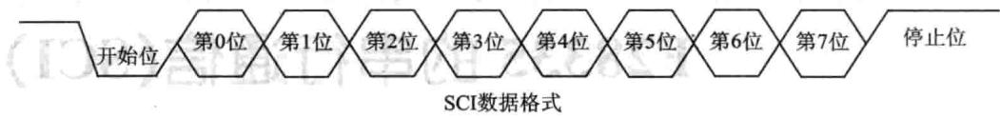

图12.1SCI数据格式

通信的速率单位为波特率（baudrate)，即每秒内传送的位数。通常情况下，波特率的单位可以省略。通常使用的波特率有300、600、900、1200、1800、2400、4800、9600、19200、38400。字符奇偶校验检查（character parity checking)称为垂直冗余检查（Vertical Re-dundancyChecking，VRC)，它是每个字符增加一个额外位使字符中“1”的个数为奇数或偶数。

奇校验：如果字符数据位中“1”的数目是偶数，校验位应为“1”，如果“1”的数目是奇数，校验位应为“0”。

偶校验：如果字符数据位中“1”的数目是偶数，则校验位应为“0”，如果是奇数则为“1”。

### 12.2 F28335的SCI模块

## 1.SCI简介

SCI即SerialCommunication Interface，串行通信接口，接收和发送有各自独立的信号线，但不是同一个时钟，所以是进串异步通信接口，一般可以看作是uart（通用异步接收/发送装置），经常会跟RS232接口连接。通常DSP引脚输/输出使用TTL电平，而TTL电平的“1”和“0”的特征电压分别为2.4V和0.4V，适用于板内数据传输。TTL电平与RS232电平之间要互相转换，这就需要采用串口转换芯，常用的是MAX232。为了使信号传输得更远，美国电子工业协会EIA（Elec-tronicIndustryAssociation)制订了串物理接口标准RS-232C。RS-232C采用

负逻辑，一3～-15V为逻辑“1”,3～15V为逻辑“0”。RS-232C最大的传输距离是30m，通信速率一般低于20Kbit/s。RS-232接口，简称“串口”，它主要用于连接具有同样接口的设备。下面给出了9芯串行接口的排列位置（如图12.2所示），相应引脚含义如表12.1所列。SCI模块框图如图12.3所示。

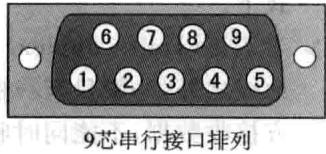

图12.29芯串行接口排列

|引脚号|功.能     2512|引脚号|功能|
|---|---|---|---|
|1|接收线信号检测（载波检测DCD)|6|数据通信设备准备就绪（DSR)|
|2|接收数据线（RXD)|7|请求发送（RTS）|
|3|发送数据线（TXD）|8|WIX   清除发送|
|4|数据终端准备就绪(DTR)|9|振铃指示|
|5|信号地（SG）|||

表12.19芯串行接口引脚含义表

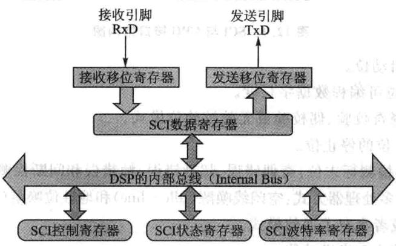

图12.3SCI模块框图

## 2.SCI模块特点

F28335处理器共提供3个SCI接口，相对TI的C240X系列DSP的SCI接口，功能上有很大的改进，在原有功能基础上增加了通信速率自动检测和FIFO缓冲等新功能，为了减小串口通信时CPU的开销，F28335的串口支持16级接收和发送FIFO。也可以不使用FIFO缓冲，SCI的接收器和发送器可以使用双级缓冲传送数据，并且SCI接收器和发送器有各自独的中断和使能位，可以独地操作实现半双通信，或者同时操作实现全双通信。为了保证数据完整，SCI模块对接收到的数据进行间断、极性、超限和帧错误的检测。为了减少软件的负担，SCI采用硬件对通信数据进行极性和数据格式检查。通过对16位的波特率控制寄存器进行编程，可以配置不同的SCI通信速率。SCI与CPU接口如图12.4所示。T

①2个外部引脚：SCITXD为SCI数据发送引脚；SCIRXD为SCI数据接收引脚。两个引脚为多功能复用引脚，如果不使用可以作为通用数字量 

②可编程通信速率，可以设置64K种通信速率。對：当记

③数据格式：如面门或器器业料：用上

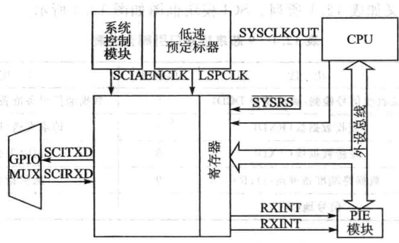

图12.4SCI与CPU接口结构图

一个启动位。

1～8位可编程数据字长度。

➢可选择奇校验、偶校验或无效校验位模式。

1或2位的停止位。

④4种错误检测标志位：奇偶错误、超越错误、帧错误和间断检测。

⑤2种唤醒多处理器方式：空闲线唤醒(Idle-line)和地址位唤醒(AddressBit)。

⑥ 全双或者半双工通信模式。

⑦双缓冲接收和发送功能。

⑧发送和接收可以采用中断和状态查询2种式。

⑨独地发送和接收中断使能控制（BRKDT除外）。

NRZ(非归零)通信格式。

①13个SCI模块控制寄存器，起始地址为7050H。

自动通信速率检测（相对F140x增强的功能）。

③16级发送/接收FIFO(相对F240x增强的功能）。

## 3.SCI模块结构

SCI模块结构框图如图12.5所示。

SCI采用全双工通信模式的通信连接图如图12.6所示，主要功能单元如下。

①一个发送器（TX)及相关寄存器。

SCITXBUF：发送数据缓冲寄存器，存放要发送的数据（由CPU装载）。

TXSHF寄存器：发送移位寄存器，从SCITXBUF寄存器接收数据，并将数据移位到SCITXD引脚上，每次移1位数据。

②一个接收器(RX)及相关寄存器。

RXSHF寄存器：接收移位寄存器，从SCIRXD引脚移数据，每次移1位。

SCIRXBUF：接收数据缓冲寄存器，存放CPU要读取的数据，来自远程处

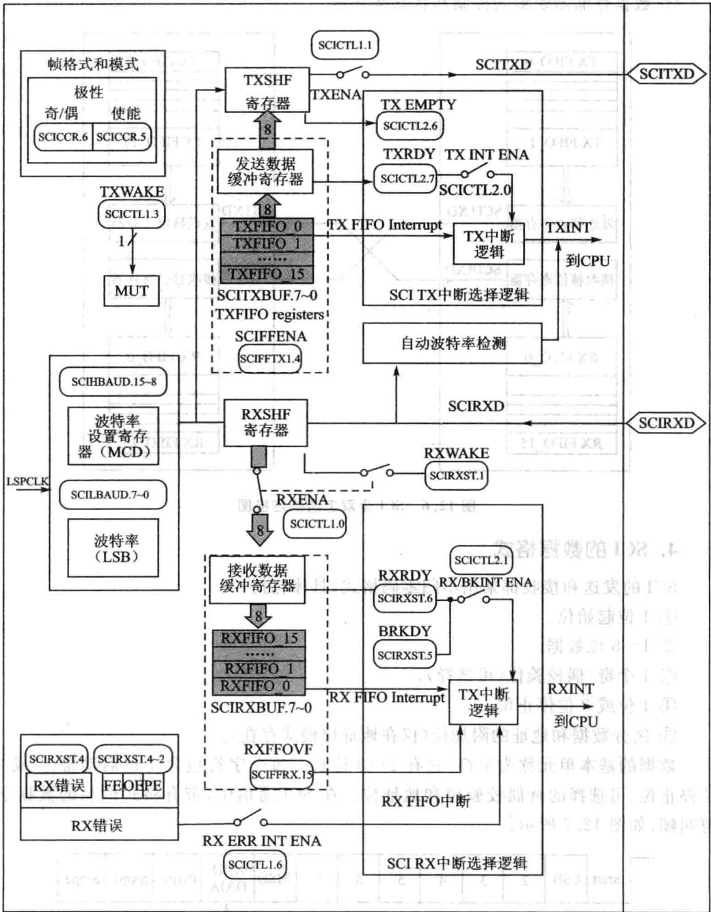

图12.5 SCI通信模块接口框图

理器的数据装寄存器RXSHF，然后又装人接收数据缓冲寄存器SCIR-XBUF和接收仿真缓冲寄存器SCIRXEMU中周③个可编程的波特率产器。

④数据存储器映射的控制和状态寄存器。

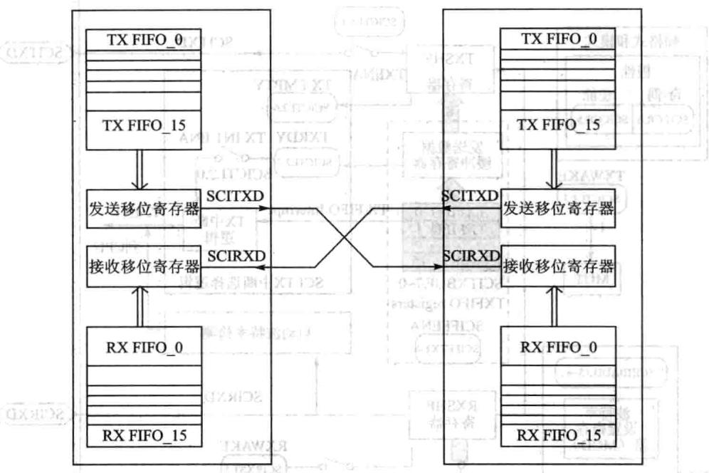

图12.6-SCI全双工通信连接图

## 4.SCI的数据格式

SCI的发送和接收都采用不归零码格式，具体包括：

①1位起始位。

②1~8位数据。

③1个奇/偶校验位（可选择）。

④1位或2位停止位。

⑤区分数据和地址的附加位（仅在地址位模式存在）。

数据的基本单元称为字符，它有1～8位长。每个字符包含1位启动位、1或2位停止位、可选择的奇偶校验位和地址位。在SCI通信中，带有格式信息的数据字符叫帧，如图12.7所。

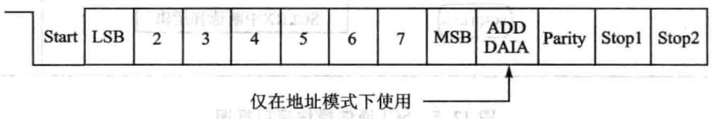

图12.7典型SCI数据帧格式

可以使用SCI通信控制寄存器（SCICCR)配置SCI通信采用的数据格式。

SCI异步通信可采用半双工通信方式，每个数据位占用8个SCICLK时钟周期，如图12.8所示。

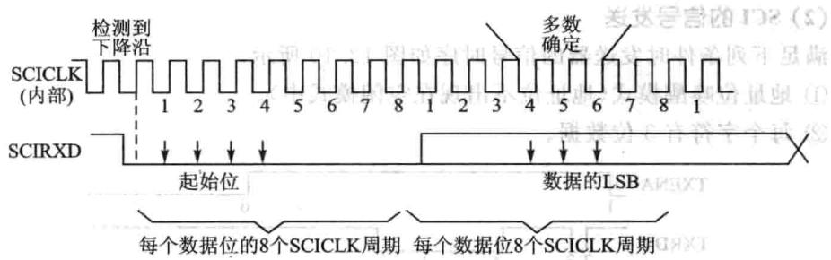

图12.8 SCI异步通信格式

接收器在收到一个起始位后开始工作，4个连续SCICLK周期的低电平表示有效的起始位，如图12.8所示。如果没有连续4个SCICLK周期的低电平，则处理器重新寻找另一个起始位。对于SCI数据帧的起始位后面的位，处理器在每位的中间进3次采样，确定位的值。3次采样点分别在第4、第5和第6个SCICLK周期，3次采样中2次相同的值即为最终接收位的值。

由于接收器使用帧同步，外部发送和接收器不需要使用串行同步时钟，时钟由器件本身提供。

## (1)SCI的信号接收

满足下列条件时，接收器的信号时序如图12.9所示。

①地址位唤醒模式（地址位不出现在空闲模式中）。

②每个字符有6位数据。

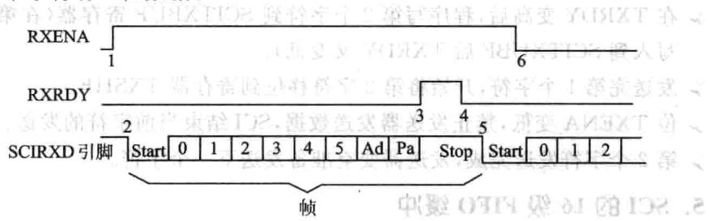

图12.9串行通信模式中的SCIRX信号

SCI接收信号的几点说明：

标志位RXENA(SCICTL1，位O)变高，使能接收器接收数据。

数据达到SCIRXD引脚后，检测起始位。

数据从RXSHF寄存器移位到接收缓冲器（SCIRXBUF），产生一个中断申请，标志位RXRDY(SCIRXST，位6）变高表示已接收一个新字符。态）

程序读SCIRXBUF寄存器，标志位RXRDY自动被清除。

数据的下个字节达到SCIRXD引脚时，检测启动位，然后清除。

位RXENA变为低，禁止接收器接收数据。继续向RXSHF转载数据，但不移入到接收缓冲寄存器。

## (2)SCI的信号发送

满足下列条件时发送器的信号时序如图12.10所示。

①地址位唤醒模式（地址位不出现在空闲模式中）。

②每个字符有3位数据。

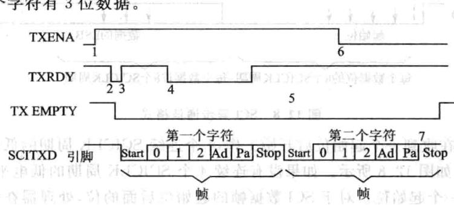

图12.10通信模式中的SCITX信号

SCI发送信号的几点说明：

位TXENA(SCICTL1，位1)变高，使能发送器发送数据。

写数据到SCITXBUF寄存器，从而发送器不再为空，TXRDY变低。

SCI发送数据到移位寄存器（TXSHF）。发送器准备传送第2个字符（TXRDY变高），并发出中断请求（使能中断，位TXINTENA，SCICTL2中的第0位置1)。

》在TXRDY变高后，程序写第2个字符到SCITXBUF寄存器（在第2个字节AVEXS写到SCITXUBF后TXRDY又变低）。

发送完第1个字符，开始将第2字符移位到寄存器TXSHF。

位TXENA变低，禁止发送器发送数据，SCI结束当前字符的发送。

第2个字符发送完成，发送器变空准备发送下一个字符。

## 5.SCI的16级FIFO缓冲

下面介绍FIFO特征和使用FIFO时SCI的编程。

①复位：在上电复位时，SCI工作在标准SCI模式，禁止FIFO功能。FIFO的寄存器SCIFFTX、SCIFFRX和SCIFFCT都被禁止。A

②标准SCI：标准F28335SCI模式，TXINT/RXINT中断作为SCI的中断源。

③FIFO使能：通过SCIFFTX寄存器的SCIFFEN位置1，使能FIFO模式。在任何操作状态下SCIRST都可以复位FIFO模式。 2019790

④寄存器有效：所有SCI寄存器和SCIFIFO寄存器（SCIFFTX，SCIFFRX和SCIFFCT)有效

⑤中断：FIFO模式有两个中断，一个是发送FIFO中断TXINT，另一个是接收FIFO中断RXINT。FIFO接收、接收错误和接收FIFO溢出共用RXINT中断。标准SCI的TXINT将被禁止，该中断将作为SCI发送FIFO中断使用。

⑥缓冲：发送和接收缓冲器增补了2个16级的FIFO，发送FIFO寄存器是8位宽，接收FIFO寄存器是10位宽。标准SCI的一个字的发送缓冲器作为发送FIFO和移位寄存器间的发送缓冲器。只有移位寄存器的最后位被移出后，一个字的发送缓冲才从发送FIFO装载。使能FIFO后，经过一个可选择的延迟（SCIFFCT），TXSHF被直接装载而不再使用TXBUF。 A8YX

⑦延迟发送：FIFO中的数据传送到发送移位寄存器的速率是可编程的，可以通过SCIFFCT寄存器的位FFTXDLY（7～0）设置发送数据间的延迟。FFTXTDLY（7～0）确定延迟的SCI波特率时钟周期数，8位寄存器可以定义从0个波特率时钟周期的最延迟到256个波特率时钟周期的最延迟。当使0延迟时，SCI模块的FIFO数据移出时，数据间没有延时，一位紧接一位地从FIFO移出，实现数据的连续发送。当选择256个波特率时钟的延迟时，SCI模块工作在最大延迟模式，FIFO移出的每个数据字之间有256个波特率时钟的延迟。在慢速SCI/UART的通信时，可编程延迟可以减少CPU对SCI通信的开销。

⑧FIFO状态位：发送和接收FIFO都有状态位TXFFST或RXFFST（位12~0)，这些状态位显示当前FIFO内数据的个数。当状态位为0时，发送FIFO复位位TXFIFO和接收复位位RXFIFO会被设置为1，会将FIFO指针复位为0,FIFO重新开始运。

⑨可编程的中断级：发送和接收FIFO都能产生CPU中断，只要发送FIFO状态位TXFFST（位12~8)与中断触发优先级TXFFIL(位4～0)相匹配，就产个中断触发，从而为SCI的发送和接收提供一个可编程的中断触发逻辑。接收FIFO的默认触发优先级为0x11111，发送FIFO的默认触发优先级0X00000。图12.11和表12.2给出了在FIFO或非FIFO模式下SCI中断的操作和配置。

|FIFO选项|SCI中断源|中断标志|中断使能|FIFO使能SCIFFENA|中断线|
|---|---|---|---|---|---|
|SCI不使用FIFO|接收错误|RXERR|RXERRINTENA|0|RXINT|
||接收中止|BRKDT|RX/BKINTENA|0|RXINT|
||数据接收|RXTDY|RX/BKINTENA|0|RXINT|
||发送空|TXRDY|TXINTENA|0|TXINT|
|SCI使用FIFO|接收错误和接收中止|RXERR|RXERRINTENA|1 1|RXINT|
||FIFO接收|RXFFIL|RXFFIENA|1|RXINT|
||发送空|TXFFIL|TXFFIENA||TXINT|
|自动波特率|自动波特率检测|ABD|无关||TXINT|

表12.2 SCI中断标志位

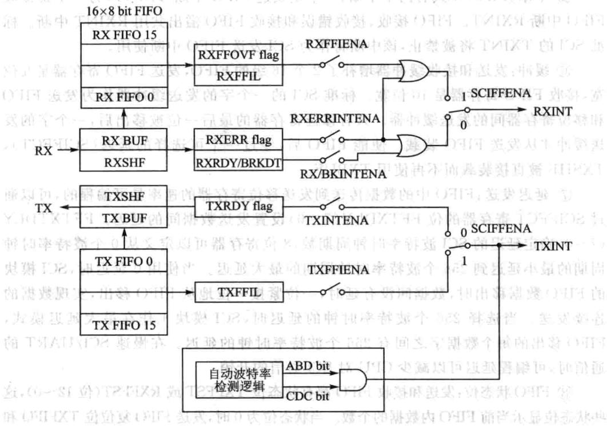

图12.11SCIFIFO中断标志和使能逻辑位

## 6.SCI自动波特率检测

大多数SCI模块硬件不支持自动波特率检测。一般情况下嵌式控制器的SCI时钟由PLL提供，设计的系统工作时会改变PLL复位时的工作状态，这样很难支持自动波特率检测功能。在F28335处理器上，增强功能的SCI模块硬件支持自动波特率检测逻辑。寄存器SCIFFCT的ABD位和CDC位控制动波特率逻辑，使能SCIRST位使自动波特率逻辑工作。增加动波特率检测功能的SCI通信接口除了能够满足正常通信自动检测系统的通信速率外，还支持采用SCI接口上电引导装载程序，这对于通过上位机采用SCI接口实时更新系统软件非常重要。国

当CDD为1时，如果ABD也置位表示自动波特率检测开始工作，就会产生SCI发送FIFO中断(TXINT)。同时在中断服务程序中必须使用软件将CDC位清0，否则如果中断服务程序执完CDC仍然为1，则以后不会产中断。具体操作步骤如下。

①将SCIFFCT中的CDC位（位13）置位，清除ABD位(位15），使能SCI的自动波特率检测模式。

②初始化波特率寄存器为1或限制在500kbps内。

③允许SCI以期望的波特率从一个主机接收字符“A”或字符“a”。如果第一个字符是“A”或“a”，则说明自动波特率检测硬件已经检测到SCI通信的波特率，然后

将ABD位置1。

④自动检测硬件将用检测到的波特率的十六进制值刷新波特率寄存器的值，这个刷新逻辑也会产个CPU中断。

⑤通过向SCIFFCT寄存器的ABDCLR位（位13）写人1清除ABD位，响应中断。写0清除CDC位，禁止自动波特率逻辑。：中源

⑥读到接收缓冲的字符“A”或“a”时，清空缓冲和缓冲状态位。

⑦当CDC为1时，如果ABD也置位表示自动波特率检测开始工作，就会产生SCI发送FIFO中断（TXINT），同时在中断服务程序中必须使用软件将CDC位清0。

## 7.多处理器通信

在同一条串连接线上，多处理器通信模式允许一个处理器向串行线上其他多个处理器发送数据，但是一条串线上，每次只能实现一次数据传送，也就是在一条串线上次只能有个节点发送数据。多处理通信式主要包括唤醒（Idleline)和地址位(AddressBit)两种多处理器通信模式。

①地址字节。发送节点(Talker)发送信息的第一个字节是一个地址字节，所有接收节点(Listener)都读取该地址字节。只有接收数据的地址字节与接收节点的地址字节相符时，才能中断接收节点。如果接收节点的地址和接收的地址不符，接收节点将不会被中断，等待接收下一个地址字节。

② Sleep位。连接到串总线上的所有处理器都将SCI SLEEP位置1(SCICTL1的第2位），这样只有检测到地址字节后才会被中断。

尽管当SLEEP位置1时接收器仍然工作，但它并不能将RXRDY、RXINT或任何接收器错误状态位置1，只有在检测到地址位且接收的帧地址位是1时才能将这些位置1。SCI本身并不能改变SLEEP位，必须由用户软件改变。

③识别地址位。处理器根据所使用的多处理器模式（空闲线模式或地址位模式），采用不同的方式识别地址字节，例如：

》空闲线模式在地址字节预留个静态空间，该模式没有额外的地址/数据位。它在处理包含10个以上字节的数据块传输比地址位模式效率。空闲线模式一般用于非处理器的SCI通信。

地址位模式在每个字节中加人一个附加位（也就是地址位）。由于这种模式数据块之间不需要等待，因此在处理小块数据时比空闲线模式效率更高。

④控制SCITX和RX的特性。用户可以使用软件通过ADDR/IDLEMODE位（SCICCR，位3）选择多处理器模式，两种模式都使用TXWAKE(SCICTL1，位3）、RXWAKE(SCIRXST，位1）和SLEEP标志位（SCICTL1，位2）控制SCI的发送器和接收器的特性中，达，国出器

⑤接收步骤。在两种多处理器模式中，接收步骤如下：

在接收地址块时，SCI端口唤醒并申请中断（必须使能SCICTL2的RX/BK

INTENA位申请中断），读取地址块的第帧，该帧包含的处理器的地址。

➢通过中断检测接收的地址启动软件例程，然后比较内存中存放的器件地址和接收到数据的地址字节。

如果上述地址相吻合表明地址块与DSP的地址相符，则CPU清除SLEEP位并读取块中剩余的数据；否则，退出软件子程序并保持SLEEP置位，直到下一个地址块开始才接收中断。

## （1）地址位多处理器通信

在地址位多处理器协议中（在SCICCR寄存器中的位3ADDR/IDLEMODE位为1），所有帧的最后个数据位后有个附加位，称为地址位，用以区分地址帧和数据帧。数据在发送过程中，将数据块的第个帧的地址位设置为1，其他帧的地址位设置为。因此地址位多处理器模式的数据传输与数据块之间的空闲周期无关，如图12.12所示。

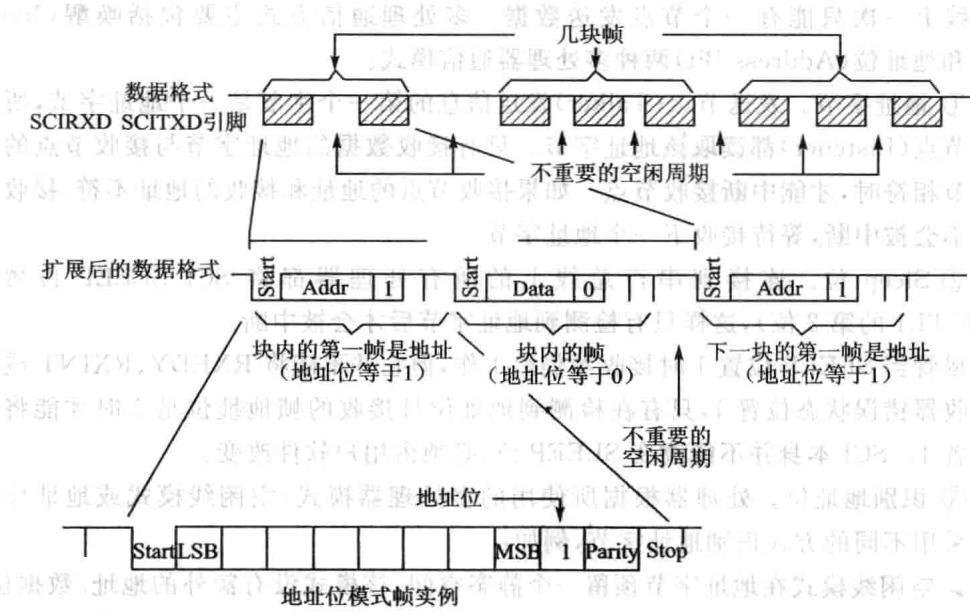

图12.12地址多处理器通信格式

SCI的控制寄存器SCICTL1的发送唤醒方式选择位TXWAKE的值被放置到地址位。在发送期间，当SCITXBUF寄存器和TXWAKE分别转载到TXSHF寄存器和WUT中时，TXWAKE清O，且WUT的值为当前帧的地址位的值。因此，发送一个地址需要完成下列操作。制带样，去客题型动

①TXWAKE位置1，写适合的地址值到SCITXBUF寄存器。当地址值被送到TXSHF寄存器后又被移出时，地址位的值被作为1发送。这样串总线上其他处理器就读取这个地址。

②TXSHF和WUT加载后，向SCITXBUF和TXWAKE写入新值（由于TX-

SHF和WUT是双缓冲的，它们能被即写）。

③TXWAKE位保持O，发送块中无地址的数据帧。

一般情况下，地址位格式应用于11个或更少字节的数据帧传输。这种格式在所有发送的数据字节中增加了一位（1代表地址帧，0代表数据帧）；通常12个或更多字节的数据帧传输使用空闲线格式。

## (2)空闲线多处理器模式

在空闲线多处理器协议中（ADDR/IDLEMODE位为O），数据块被各数据块间的空闲时间分开，该空闲时间比块中数据帧之间的空闲时间要长。一帧后的空闲时间（10个或更多个高电平位)表明新数据块传输的开始，每位的时间可直接由波特率的值（bit/s）计算，空闲线多处理器通信格式如图12.13所示。山

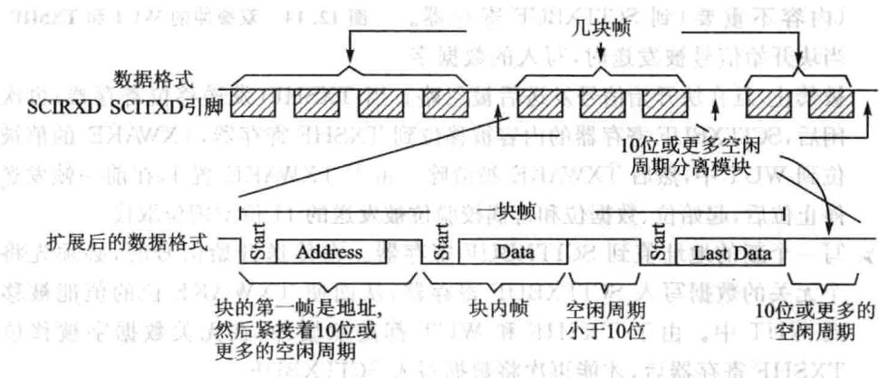

图12.13空闲线多处理器通信格式

## ①空闲线模式操作步骤

接收到块起始信号后，SCI被唤醒。

处理器识别下一个SCI中断。

➢中断服务子程序将收到的地址与接收节点的地址进行比较。

》如果CPU的地址与接收到的地址相符，则中断服务程序清除SLEEP位，并接收块中剩余的数据。 县器102

如果CPU的地址与接收到的地址不符，则SLEEP位仍保持在置位状态，直到检测到下一个数据块的开始，否则CPU都不会被SCI端口中断，继续执主程序。

## ②块起始信号

有两种方法发送块的起始信号。

方法1：特意在前后两个数据块之间增加10位或更多的空闲时间。

方法2：在写SCITXBUF寄存器之前，首先将TXWAKE位（SCICTL1，位3）置1。这样就会动发送11位的空闲时间。在这种模式下，除必要，否则串通信线不会空闲。在设置TXWAKE后发送地址数据前，要向SCITXBUF写一个关的

数据，以保证能够发送空闲时间。

## ③唤醒临时（WUT)标志

与TXWAKE位相关的是唤醒临时（WUT）标志位，这是一个内部标志，与TXWAKE构成双缓冲。当TXSHF从SCITXBUF装载时，WUT从TXWAKE装入，TXWAKE清0,如图12.14所示。

## ④块的开始信号发送

[1在块传送过程中需要采用下列步骤发送块开始信号写1到TXWAKE位。

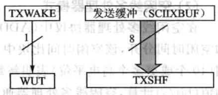

➢为发送一个块开始信号，写一个数据字

（内容不重要）到SCITXBUF寄存器。当块开始信号被发送时，写入的数据字图12.14 双缓冲的WUT和TXSHF

被禁止，且在块开始信号发送后被忽略。当TXSHF（发送移位寄存器）再次空闲后，SCITXBUF寄存器的内容被移位到TXSHF寄存器，TXWAKE的值被移位到WUT中，然后TXWAKE被清除。由于TXWAKE置1，在前帧发送完停位后，起始位、数据位和奇偶校验位被发送的11位空闲位取代。

写一个新的地址值到SCITXBUF寄存器。在传送开始信号时，必须先将一个无关的数据写人SCITXBUF寄存器，从而使TXWAKE位的值能被移位到WUT中。由于TXSHF和WUT都是双缓冲，在无关数据字被移位到TXSHF寄存器后，才能再次将数据写SCITXBUF。

## ⑤接收器操作

接收器的操作和SLEEP位无关，然而在检测到一个地址帧之前，接收器并不对RXRDY位和错误状态位置位，也不申请接收中断。

### 12.3 F28335的SCI相关寄存器

SCI寄存器的地址以及功能描述如表12.3所列。

|地址|寄存器|功能描述|
|---|---|---|
|0x7050|SCICCR|SCI-A通信控制寄存器|
|0x7051|SCICTL1|SCI-A控制寄存器1|
|0x7052|SCIHBAUD|SCI-A波特率设置寄存器高字节|
|0x7053|SCILBAUD|SCI-A波特率设置寄存器低字节|
|0x7054|SCICTL2|SCI-A控制寄存器2|
|0×7055|SCIRXST|SCI-A接收状态寄存器|

表12.3SCIA寄存器

续表12.3

|地址|寄存器|功能描述||
|---|---|---|---|
|0x7056|SCIRXEMU|SCI-A接收仿真缓冲||
|0×7057|SCIRXBUF|SCI-A接收数据缓冲||
|0x7059|SCITXBUF|SCI-A发送数据缓冲||
|0x705A|SCIFFTX|SCI-AFIFO发送寄存器||
|0x705B|SCIFFRX|SCI-AFIFO接收寄存器||
|0x705C|SCIFFCT|SCI-AFIFO控制寄存器||
|0x705F|SCIPRI|SCI-A优先级控制寄存器||

## 1.SCI通信控制寄存器(SCICCR)

SCI通信控制寄存器各位描述如表12.4所列。

|位|名称|描述|位|1名称||描述||
|---|---|---|---|---|---|---|---|
|7|STOP BITS|停止位位数，SCI停止位个数1：两位停止位0：一位停止位|4|9LOOP BACKENABLE||自测模式，自测模式功能1:自测模式使能0:屏蔽自测模式||
|需海3|ADD/IDLEMODE||地址位/空闲线模式位，SCI多机模式控制位1：选择地址位协议0:选择空闲线协议|||||
|6|EVEN/ODD PARITY|奇偶校验位，SCI奇校验/偶校验1:偶校验0:奇校验||||||
|5高2~0嘉|SCICHAE2||SCI数据长度2～0，字符长度控制位000:1位数据001:2位数据…111:8位数据|||||
|5|PARITYENABLE|奇偶校验使能，SCI允许奇偶校验1:允许奇偶校验0：不允许奇偶校验||||||
||||111:8位数据|||||

表12.4 SCI通信控制寄存器SCICCR

## 2.SCI控制寄存器1(SCICTL1)

SCI控制寄存器1的各位描述如表12.5所列。

|位|名称|描述|
|---|---|---|
|7|RESERVED|保留|
|6|2RX ERR INT ENA|SCI接收错误中断使能）号喜管置好率1：接收错误中断使能0：屏蔽接收错误中断|

表12.5 SCI控制寄存器1

续表12.5

|位|名称|描述||
|---|---|---|---|
|5||SCI软件复位（低有效）。向该位写0可以初始化SCI状态寄存器和标志寄存器（SCICTL2和SCIRXST）该位不影响配置寄存器受影响的位如下：位          寄存器位          软件复位值TXRDY     SCICTL2,bit7     1TX EMPTYSCICTL2,bit6     0|SCI软件复位（低有效）。向该位写0可以初始化SCI状态寄存器和标志寄存器（SCICTL2和SCIRXST）该位不影响配置寄存器受影响的位如下：位          寄存器位          软件复位值TXRDY     SCICTL2,bit7     1TX EMPTYSCICTL2,bit6     0RXWAKE   SCIRXST, bit1     0味名奇通PE          SCIRXST,bit2     0OE          SCIRXST,bit3 0FE          SCIRXST,bit4    0BRKDT     SCIRXST, bit5    0|
|SW RESET1||||
|||RXRDY     SCIRXST, bit6    0RXERROR  SCIRXST,bit7    0||
|4|RESERVED|保留||
|3|TXWAKE|SCI发送唤醒方式选择|1：发送模式唤醒，空闲线模式或者地址位模式0:不唤醒，在空闲线模式下，向该位写1然后写数据到SCITXBUF产个11位数据长度的空闲时间|
|||||
|2|SLEEPy|SCI睡眠。在多机通信中该位控制接收进睡眠状态。清除该位可以脱离睡眠状态1:睡眠状态0:非睡眠状态||
|||SCI发送使能。只有在该位被设置的情况下数据才能够通过||
|1|TXENA|SCITXD引脚发送1:发送使能     （L10102）1器容备保会13250:发送屏蔽各资||
|0|RXENA|SCI接收使能1：将接收到的字符复制到SCIRXEMU和SCIRXBUF0：阻止将接收到的字符复制到SCIRXEMU和SCIRXBUF||
|||||

## 3.SCI波特率设置寄存器(SCIHBAUD,SCILBAUD)
> 🔧 **交互式学习**：[SCI波特率计算器](../interactive/components/sci_baudrate.html)

SCI通信速率可以根据系统需求进编程，最多持64K种速率模式。系统内部产的串时钟由低速外设时钟LSPCLK频率和波特率选择寄存器确定。在器

件时钟频率确定的情况下，使16位的波特率选择寄存器设置SCI的波特率，因此SCI可以采用64K种波特率进通信。

SCI波特率有以下公式计算：

注意，上述公式只有在 时成立，如果BRR=0，则：

SCI波特率选择如表12.6所列。

|理想波特率|BRR      7|实际波特率|错误百分比/%|
|---|---|---|---|
|2400|1952（7A0H)|2400|0|
|4800|976（3D0H）|4798福|米0.04  2|
|9600|487（1E7H）|9606|0.06|
|19200|243（F3H）|19211|0.06|
|38400|121（79H）|38422|0.06|

表12.6SCI波特率选择

波特率设置寄存器如表12.7所列。

|位|名称|描述|
|---|---|---|
|15~0|BAUD15~0|SCI16位波特率配置寄存器。SCIHBAUD和SCILBAUD的值以一个16 位的变量值BRR表示 IHX 低速外围时钟（LSPCLK）和两个字节的波特率配置寄存器值BRR决定 SCI的波特率(SCI Asynchronous Baud）|

表12.7 波特率选择寄存器

## 4.SCI控制寄存器2(SCICTL2）

SCI控制寄存器各位信息如表12.8所列。

|位|名称|描述|
|---|---|---|
|7|TXRDY|发送缓冲寄存器就绪标志 1:SCITXBUF准备好接收下一组要发送的数据  $0 { : } \mathrm { S C I T X B U F }$  已满|

表12.8 SCI控制寄存器2

|位|名称|品描述|
|---|---|---|
|6|TX EMPTY|发送空标志1：发送缓冲和发送移位寄存器为空0:发送缓冲或发送移位寄存器有数据未发送完|
|5~2|RESERVED|保留|
|1|RX/BKINT ENA|接收缓冲/抑制中断使能。该位可以置位由RXRDY或BRKDT(SCIRXS寄存器）引起的中断请求。但是不影响相应位的中断标志1:使能RXRDY/BRKDT中断0：屏蔽RXRDY/BRKDT中断|
|0|TXINT ENA|SCITXBUF寄存器中断使能。可以通过置位TXRDY标志位引发中断请求车1：使能TXRDY中断0:屏蔽TXRDY中断|

续表12.8

## 5.SCI接收状态寄存器(SCIRXST)

SCI接收状态寄存器各位信息如表12.9所列。

|位|名称|描述|
|---|---|---|
|7|RXERROR|SCI接收错误标志位# 1景1:错误标志置位|
|||0：错误标志未置位|
|6|思RXRDY置证|SCI接收就绪标志位。当有新的数据可以从SCIRXBUF寄存器读取的时候，该位置位            1:新数据可读个0:没有新数据可以|
|5|BRKDT|SCI间断检测标志位。当一个间断出现时，该位置位，在丢失掉第一个停止位后，如果SCIRXD数据线保持10位以上的低电平，则发生一次间断事件。如果RX/BKINTENA置位，将产生一次中断，即便SLEEP位置位，BRKDT仍能产生中断。系统复位和软件复位可将BRKDT清零，在发送一次间断事件后，为了接收后面的正常字符，应当使用SWRESET对其进|
|||行复位開0:无间断事件1:有间断事件 法科AX|

表12.9 SCI接收状态寄存器

续表12.9

|位|名称|描述|
|---|---|---|
|4|FE|SCI数据帧格式错误。当SCI没有检测到一个预期的停止位时该位置位1：数据帧格式错误0：数据帧格式正确|
|3|OE|SCI数据覆盖错误。在SCIRXEMU和SCIRXBUF收到的数据未被CPU或DMA读取之前接收到新的数据，那之前未读取的数据会被覆盖掉，发|
|生错误，该位将置位1:覆盖错误发生|||
|0:覆盖错误未发生|||
|2|PE|2器容0间文O8SCI奇偶校验错误标志位1：奇偶校验错误资T0:奇偶校验无错误或者无奇偶校验位5|
|1|RXWAKE|接收唤醒位。该位置位表明收到一个唤醒接收功能的信号|
|0|保留|保留|

## 6.数据接收缓冲寄存器(SCIRXEMU,SCIRXBUF)

接收到的数据从RXSHF传送到SCIRXEMU和SCIRXBUF。传送完成以后RXRDY位置位，表明接收的数据已被读取。两个寄存器的数值完全一样，它们有各自独立的地址，但是共用一个物理存储空间。它们唯一的区别就是，读取SCIRXE-MU的数据不会清除RXRDY位，而读取SCIRXBUF会清除RXRDY位。因此一般读取SCI接收的数据都是读取SCIRXBUF寄存器。SCIRXEMU寄存器主要用于仿真时，因为它可以不清除RXRDY标志位而不断读取接收到的数据。在系统复位的时候SCIRXEMU被清空。各位信息如表12.10所列。

|位|名称|中描述|
|---|---|---|
|15|SCIFFFE|SCIFIFO帧格式错误标志位0:接收字符7~0位时，无帧格式错误1:接收字符7～0位时，有帧格式错误|
|14|SCIFFPE|SCIFIFO奇偶校验错误标志位0：接收字符7～0位时，无奇偶校验错误1：接收字符7～0位时，有奇偶校验错误|
|13~8|保留|保留|
|7〜0|RXDT7~RXDT0|接收到的字符|

表12.10数据接收缓冲寄存器位信息

## 7.数据发送缓冲寄存器(SCITXBUF）

需要发送的数据将被写入该寄存器，数据使用右对齐方式。要发送的数据从该寄存器中传送到TXSHF移位发送寄存器后TXRDY置位，表明该寄存器可以写下一个需要发送的数据。若TXINTENA(SCICTL2.0)置位，数据发送可以触发中断。各位信息如表12.11所列。

|位|名称|描述|
|---|---|---|
|7~0|TXDT7~TXDT0|发送的字符|

表12.11数据发送缓冲寄存器位信息

## 8.SCI发送FIFO寄存器(SCIFFTX)

SCI发送FIFO寄存器(SCIFFTX)寄存器各位信息如表12.12所列。

|位|名称|描述||
|---|---|---|---|
|15|SCIRST|0:复位SCI接收与发送通道1:SCLFIFO能继续发送或接收||
|014|SCIFFENA|0:SCIFIFO功能屏蔽1:SCIFIFO功能使能||
|13国|TxFIFO Reset|发送FIFO复位                             新迎，90:复位FIFO指针指向O并保持复位状态   南电1:重新使能发送FIFO遵面||
|要12~8|ME单  議业迎TXFFST4~0|00000：发送FIFO为空  C   100001：发送FIFO有1字节数据（700010：发送FIFO有2字节数据…10000:发送FIFO有16字节数据||
|||TXFFINT|发送FIFO中断0：发送FIFO中断未发生1:有发送FIFO中断发生|
||6|TXFFINT CLR|0：无影响1：清除TXFFINT标志位|
|||TXFFIENA|0:屏蔽TXFIFO中断1：使能TXFIFO中断|
|4~0|4~0|TXFFIL4~0|发送FIFO深度设置。当FIFO状态位（TXFFST4～O）与FIFO深度（TXFFIL4～0)相等（少于或者等于）的时候，发送FIFO将触发中断|

表12.12 SCI发送FIFO寄存器(SCIFFTX)

## 9.SCI接收FIFO寄存器(SCIFFRX)

SCI接收FIFO寄存器各位信息如表12.13所列。

|位|名称|描述|
|---|---|---|
|15|RXFFOVF|接收FIFO溢出0:接收FIFO没有溢出1:接收FIFO发生溢出，FIFO收到了超过16帧的数据，并且收到的第帧数据已经丢失|
|14|RXFFOVF CLR|0：无影响1:清除RXFFOVF标志位|
|13|RXFIFO Reset|接收FIFO复位0:复位FIFO指针指向O并保持复位状态1:重新使能接收FIFO|
|12~8|RXFFST4~0|00000：接收FIFO为空）器奇寄00001:接收FIFO有1字节数据00010:接收FIFO有2字节数据…10000：接收FIFO有16字节数据|
|7|RXFFINT|发送FIFO中断0:接收FIFO中断未发生1：有接收FIFO中断发生|
|6|RXFFINT CLR|0:无影响1:清除RXFFINT标志位品动|
|5|RXFFIENA|0:屏蔽RXFIFO中断1使能RXFIFO中断实心毛毛|
|4~0|RXFFIL4~0|接收FIFO深度设置。当FIFO状态位（RXFFST4～0)与FIFO深度（RXFFIL4～0)相等（大于或者等于)的时候，接收FIFO将触发中断|

表12.13SCI接收FIFO寄存器

## 10.SCIFIFO控制寄存器(SCIFFCT)

SCIFIFO控制寄存器各位信息如表12.14所列。

## 

|位|名称|！店|
|---|---|---|
|15|ABD|波特率自动检测位D2赤0:非自动检测1：自动检测|
||||
|14|ABD CLR|清除ABD0:无影响1:清除ABD位|
|13|CDC|0:禁止波特率自动检测的校准1:允许波特率自动检测的校准  海送|
|12~8|RESERVED|保留|
|7~0|FFTXDLY7~0|FIFO发送延时。该位确定每个FIFO帧数据从FIFO传送到发送移位寄存器的间隔时间。延时时间是波特率时钟的整数倍。从0个波特率时钟的延时到256个波特率时钟的延时|

表12.14SCIFIFO控制寄存器

## 11.优先级控制寄存器(SCIPRI)

SCI优先级控制寄存器各位信息如表12.15所列。

|位|名称|描述||
|---|---|---|---|
|7~5|RESERVED|保留||
|4~3|SOFTand FREE|当一个仿真暂停事件发生时该位决定SCI该做什么工作00：暂停情况下立即停止10:在完成了当前数据的发送/接收后执停命令×1：连续运行，暂停命令无效||
|||||
|2~0|RESERVED|保留||

表12.15 SCI优先级控制寄存器

### 12.4 手把手教你实现SCI数据收发

## 1.实验目的

①掌握SCI数据收发。

②掌握DSP与PC采用串口通信的方法。

## 2.实验主要步骤

①先用短接帽将至尊板JP6（实用板JP4）的2、3脚短接，将至尊板JP7（实用

板JP5)的2、3脚短接，如图12.15所示。

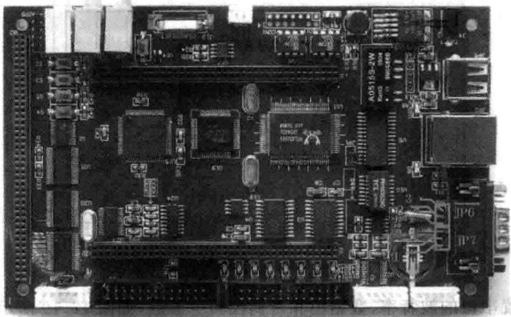

图12.15串口跳帽连接实物图

②232串线连接板与计算机。

③建立超级终端（开始→附件→通信→超级终端），将串口参数设置为COM1，9600，NONE,8，1。如图12.16所示。

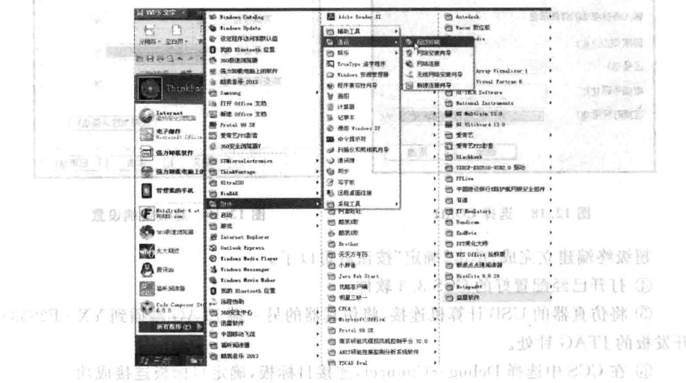

图12.16超级终端设置

然后出现如图12.17所示界面，用户为其命名43，这个名字可以随便命名，然后单击“确定”按钮。

之后根据用户PC机的实际情况选择COM端口，如图12.18所示，之后单击“确定”按钮。 图页出全

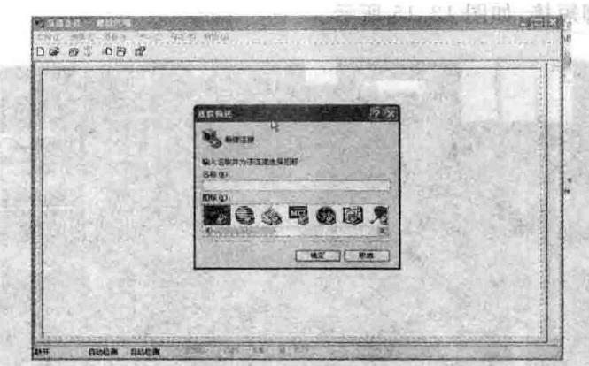

图12.17超级终端命名

然后设置串口的波特率、数据位和奇偶校验等参数，如图12.19所示设置。

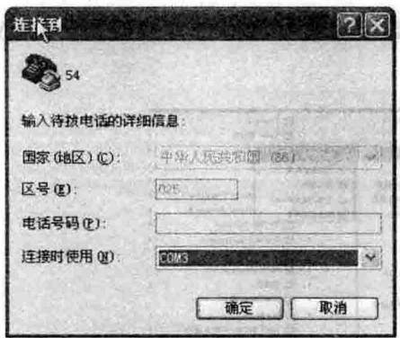

图12.18 选择COM1

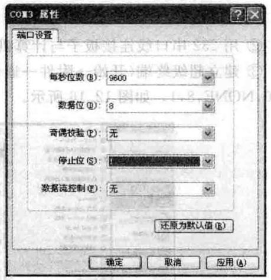

图12.19超级终端设置

超级终端建立完成，单击“确定”按钮就可以了。

④打开已经配置好的CCS3.3软件。

⑤将仿真器的USB计算机连接，将仿真器的另一端JTAG端插到YX-F28335 开发板的JTAG针处。

⑥在CCS中选择Debug→Connect，连接目标板，确定目标板连接成功。

⑦将SCIC目录复制到CCS开发环境中的Myproject目录下。

⑧在CCS中选择project→Open菜单项，加载SCIC目录中的SCI.pjt。

⑨在CCS中选择File→Load Program菜单项，加载Debug目录下的SCI.out。在CCS中选择Debug→Run菜单项异司

会出现如图12.20所示的内容，我们可以在键盘上输字母。

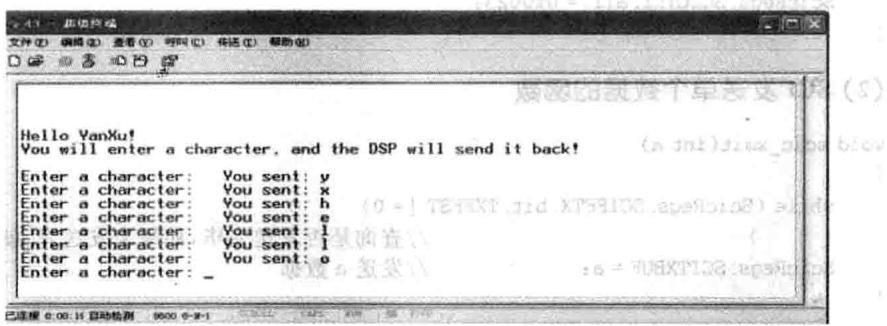

## 的婚102（）

图12.20超级终端显示

## 3.实验原理

F28335上有3个UART，SCIA、SCIB和SCIC。YXDSP-F28335A上有一个DB9接，它通过跳帧共了SCIB和SCIC。户可以根据需要改变跳帧来选择SCIB或SCIC。本程序针对 SCIC。

## (1)SCIC工作方式和参数的设置

## (2)SCI发送单个数据的函数

## (3)SCI发送数组数据的函数

## 4.实验观察与思考

M①如何在PC机上显示“HELLOWORD!”?目2建②如何采用FIFO模式收发数据？立。包卡器齿藝示量中球四1

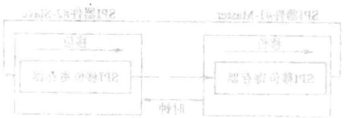
