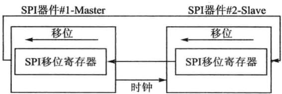
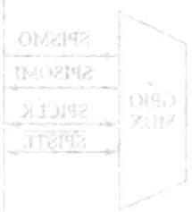
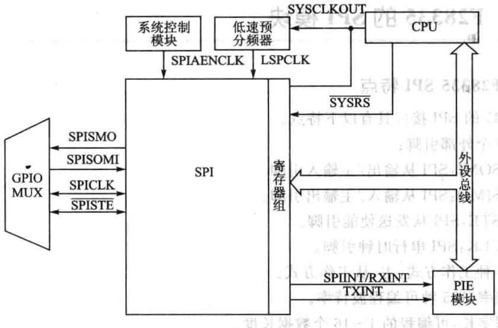
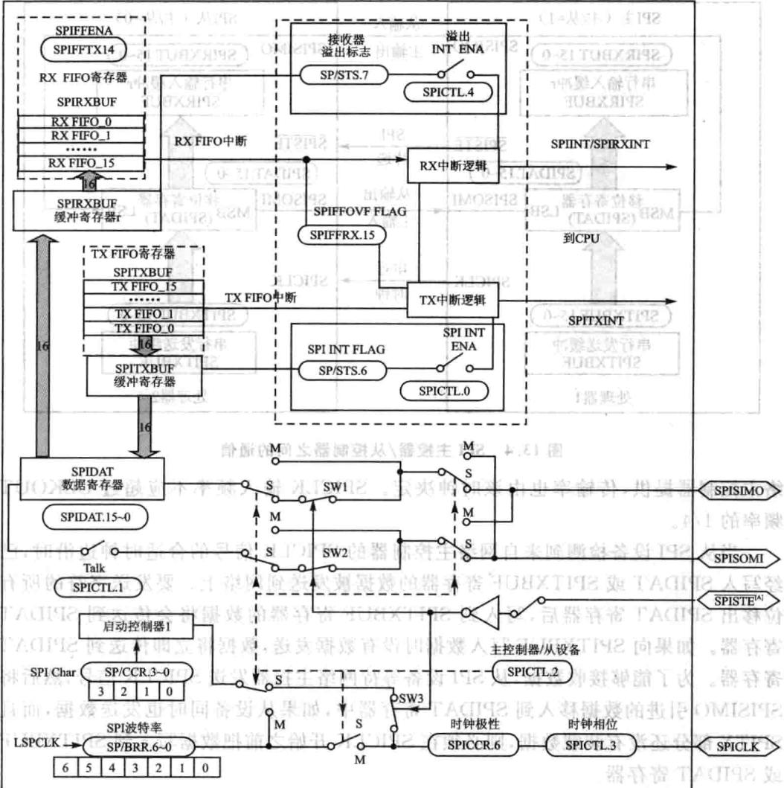
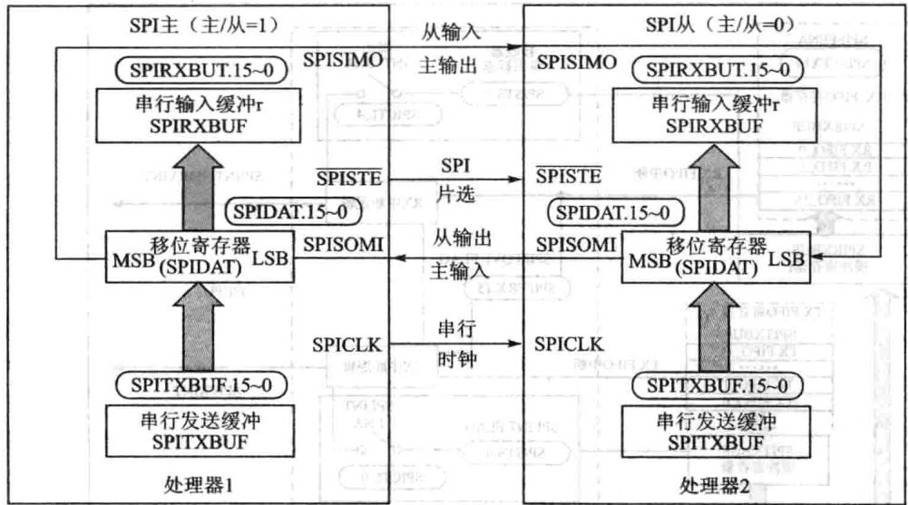
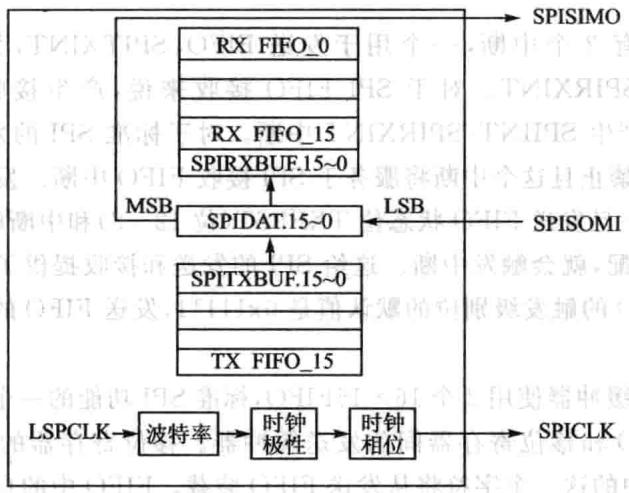
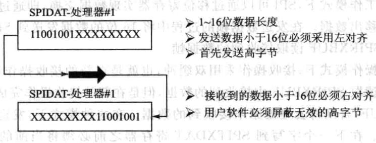

# 第 13 章

## SPI速同步串输入/输出端

### 13.1 SPI概述

SPI即SerialPeripheralInterface是速同步串输/输出端,SPI最早是由Freescale（原属Motorola)公司在其MC68HCxx系列处理器上定义的种高速同步串接口。SPI目前被广泛用于外部移位寄存器、D/A、A/D、串EEPROM、LED显示驱动器等外部芯的扩展。与前介绍的SCI最大的区别是，SPI是同步串接。SPI总线包括1根串同步时钟信号线(SCI不需要）以及2根数据线，实际总线接口般使4根线，即SPI四线制：串时钟线、主机输/从机输出数据线、主机输出/从机输数据线和低电平有效的从机选线。有的SPI接口带有中断信号线，也有SPI接没有主机输出/从机输线。在F28335中使的是上介绍的SPI四线制。

SPI接口的通信原理简单，以主从式进工作。在这种模式中，必须要有一个主设备，可以有多个从设备。通过选信号来控制通信从机，SPI时钟引脚提供串通信同步时钟，数据从从主出引脚输出，从出主引脚输。通过波特率寄存器设置数据速率。SPI向输数据寄存器或发送缓冲器写数据时就启动了从主出引脚上的数据发送，先发送最高位。同时，接收数据通过从出主入引脚移人数据寄存器最低位。选定数量位发送结束，则整个数据发送完毕。收到的数据传送到SPI接收寄存器，右对齐供CPU读取。SPI的通信连接如图13.1所示。

图13.1 SPI器件通信链接示意图

### 13.2 F28335的SPI模块

## 1.F28335SPI特点

28335的SPI接口具有以下特点。

①4个外部引脚：

SPISOMI:SPI从输出/主输引脚。

SPISIMO:SPI从输/主输出引脚。

SPISTE:SPI从发送使能引脚。

SPICLK：SPI串时钟引脚。

②2种工作方式：主、从工作方式。

波特率：125种可编程波特率。

数据字长：可编程的1～16个数据长度。

③4种时钟模式（由时钟极性和时钟相应控制）。
> 🔧 **交互式学习**：[SPI时钟极性与相位](../interactive/components/spi_cpol_cpha.html)

无相位延时的下降沿;SPICLK为高电平有效。在SPICLK信号的下降沿发送数据，在SPICLK信号的上升沿接收数据。当

有相位延时的下降沿：SPICLK为电平有效。在SPICLK信号的下降沿之前的半个周期发送数据，在SPICLK信号的下降沿接收数据。服代器品主

无相位延迟的上升沿：SPICLK为低电平有效。在SPICLK信号的上升沿发送数据，在SPICLK信号的下降沿接收数据。

有相位延迟的上升沿：SPICLK为低电平有效。在SPICLK信号的下降沿之前的半个周期发送数据，而在SPICLK信号的上升沿接收数据。

④接收和发送可同时操作（可以通过软件屏蔽发送功能）。通过中断或查询方式实现发送和接收操作。9个SPI模块控制寄存器。

⑤增强特点：

16级发送/接收FIFO。

延时发送控制。SPICPU模块接口框图如图13.2所。SPI的原理框图如图13.3所示。

## 2.F28335SPI工作模式

典型的两个SPI控制器连接方式如图13.4所示。主控器发送SPICLK信号时，也启动了数据传输。无论是主控制器还是从控制器，数据都是在SPICLK边沿时移出移位寄存器，并且在相反的边沿锁存进移位寄存器。如果CLOCKPHASE(SPICTL.3)位为高电平，则数据在SPICLK跳变之前的半个周期被发送和接收。因此两个控制器的数据的接收与发送是同步的。应用软件决定数据是否有用还是仅仅是占位的无意义的数据。数据传输的时候有3种可能形式：括

图13.2SPICPU模块接口框图

①Master发送数据，Slave发送伪数据。

②Master发送数据,Slave发送数据。

③Master发送伪数据,Slave发送数据。

主控制器因为控制着SPICLK信号，所以可以在任何时候启动数据传输。然而软件决定着当从控制器已经准备好数据传输时主控制器如何检测到。亚

SPI的工作模式通过主/从位(MASTER/SLAVE位SPICTL.2)进行选择

## (1)主控制器模式

MASTER/SLAVE=1时，控制器工作在主控制器模式下，SPI通过主控制器的SPICLK引脚为整个串通信络提供时钟。数据从SPISIMO引脚输出，并锁存SPISOMI引脚上输的数据。可以通过SPIBRR寄存器(SPI波特率寄存器）配置数据传输率，可以配置126种不同的数据传输率。

数据写到SPIDAT(SPI数据寄存器）或SPITXBUF(SPI输出缓冲寄存器）时会启动SPISIMO引脚上的数据发送，首先发送的是最位有效位（MSBmostsignifi-cantbit）。同时，接收的数据通过SPISOMI引脚移SPIDAT的最低有效位。当传输完指定的位数后，接收到的数据被存放到SPIRXBUF寄存器，以备CPU读取。数据在SPIRXBUF寄存器中采用右对齐的方式存储。器个

指定数量的数据位通过SPIDAT移出后，会发生下列事件：

SPIDAT中的内容发送到SPIRXBUF寄存器中。

SPIINTFLAG位（SPISTS.6)置1。

如果在发送缓冲器SPITXBUF中还有有效的数据（SPISTS寄存器中的TX-BUFFULL位用来标志是否在SPITXBUF中存在有效数据），则这个数据被传送到

图13.3SPI原理图

SPIDAT寄存器被发送出去。若所有位从SPIDAT寄存器移出后，SPICLK时钟即AT

如果SPI中断使能位SPIINTENA位（SPICTL.O）为高电平，则产生中断。在典型应用中SPISTE引脚作为从SPI控制器的片选控制信号，在主SPI设备同从SPI设备之间传送信息的过程中，被置成低电平；当数据传送完毕后，该引脚为高电平 1

## (2）从控制器模式

在从控制器模式中（MASTER/SLAVE=O），SPISOMI引脚为数据输出引脚，SPISIMO引脚为数据输引脚。SPICLK引脚为串移位时钟的输，该时钟由络主控制器提供，传输率也由该时钟决定。SPICLK输频率不应超过CLKOUT频率的1/4。

图13.4SPI主控器/从控制器之间的通信

当从SPI设备检测到来网络主控制器的SPICLK信号的合适时钟边沿时，已经写SPIDAT或SPITXBUF寄存器的数据被发送到网络上。要发送字符的所有位移出SPIDAT寄存器后，写到SPITXBUF寄存器的数据将会传送到SPIDAT寄存器。如果向SPITXBUF写数据时没有数据发送，数据将即传送到SPIDAT寄存器。为了能够接收数据，从SPI设备等待网络主控器发送SPICLK信号，然后将SPISIMO引进的数据移到SPIDAT寄存器中，如果从设备同时也发送数据，而且SPITX部分还没有装载数据，则必须在SPICLK开始之前把数据写到SPITXBUF或SPIDAT寄存器。

当TALK位(SPICTL.1)清零，数据发送被禁，输出引I脚(SPISOMI)处于高阻态。如果在发送数据期间将TALK位(SPICTL.1）清零，即使SPISOMI引脚被强制成高阻状态也要完成当前的字符传输。这样可以保证SPI设备能够正确地接收数据。TALK位允许在络上设有许多个从SPI设备，但在某时刻只能有1个从设备来驱动SPISOMI。

SPISTE引脚用作从器件的选通引脚，当该引脚为低电平时，允许从SPI设备向串行总线发送数据；当该引脚为高电平时，从SPI串行移位寄存器停止工作，串行输出引脚被置成阻状态。在同络上可以连接多个从SPI设备，但同时刻只能有1个从设备起作。 器

## 3.SPI的数据传输

SPI接口数据传输时一共有3种模式：简单模式、基本模式、增强模式。下面依

次介绍这3种模式。

在简单工作模式下，SPI可以通过移位寄存器实现数据交换，即通过SPIDAT寄存器移入或移出数据。在发送数据帧的过程中将16位的数据发送到SPITXBUF缓冲，直接从SPIRXBUF读取接收到的数据帧。

在基本操作模式下，接收操作采用双缓冲，也就是在新的接收操作启动时，CPU可以暂时不读取SPIRXBUF中接收到的数据，但是在新的接收操作完成之前必须读取SPIRXBUF，否则将会覆盖原来接收到的数据。在这种模式下，发送操作不支持双缓冲操作。在下个字写到SPITXDAT寄存器之前必须将当前的数据发送出去，否则会导致当前的数据损坏。由于主设备控制SPICLK时钟信号，它可以在任何时候配置数据传输。 2L.41 i.

在增强的FIFO缓冲模式下，用户可以建16级深度的发送和接收缓冲，而对于程序操作仍然使用SPITXBUF和SPIRXBUF寄存器。这样可以使SPI具有接收或发送16次数据的能。此种模式下还可以根据两个FIFO的数据装载状态确定其中断级别。SPI接口的内部功能如图13.5所示。992T国192器事

28335主控制器模式图13.5串行外设接口内部功能图

28335的SPI主要为后2种操作模式：基本操作模式和增强的FIFO缓冲模式。

SPI主设备负责产生系统时钟，并决定整个SPI网络的通信速率。所有的SPI设备都采用相同的接口式，可以通过调整处理器内部寄存器改变时钟的极性和相位。由于SPI器件并不一定遵循同一标准，例如EEPROM、DAC、ADC、实时时钟及温度传感器等器件的SPI接口的时序都有所不同，为了能够满足不同的接口需要，采用时钟的极性和相位可配置就能够调整SPI的通信时序。

SPI设备传输数据过程中总是先发送或接收高字节数据，每个时钟周期接收器或收发器左移1位数据。对于小于16位的数据发送之前必须左对齐，如果接收的数据于16位则采用软件将效的数位屏蔽，如图13.6所。

图13.6SPI通信数据格式

## 4.FIFO操作

下面通过具体步骤来说明FIFO的特点，在使用SPIFIFO功能时，这些步骤有助于编程。系统在上电复位时，SPI工作在标准SPI模式，禁止FIFO功能。FIFO的寄存器SPIFFTX、SPIFFRX和SPIFFCT不起作用。通过将SPIFFTX寄存器中的SPIFFEN的位置为1，使能FIFO模式。SPIRST能在操作的任一阶段复位FIFO模式。

FIFO模式有2个中断，个用于发送FIFO、SPITXINT，另一个用于接收FIFO、SPIINT/SPIRXINT。对于SPIFIFO接收来说，产接收错误或者接收FIFO溢出都会产生SPIINT/SPIRXINT中断。对于标准SPI的发送和接收，唯一的SPIINT将被禁且这个中断将服务于SPI接收FIFO中断。发送和接收都能产生CPU中断。一旦发送FIFO状态位TXFFST（位12～8)和中断触发级别位TXF-FIL(位4～0)匹配，就会触发中断。这给SPI的发送和接收提供了可编程的中断触发器。接收FIFO的触发级别位的默认值是0x11111，发送FIFO的触发级别位的默认值是0x00000。 2OXT

发送和接收缓冲器使用2个16X16FIFO，标准SPI功能的一个字的发送缓冲器作为在发送FIFO和移位寄存器间的发送缓冲器。移位寄存器的最后一位被移出后，发送缓冲器中的这一个字符将从发送FIFO装载。FIFO中的自发送到发送移位寄存器的速率是可编程的。SPIFFCT寄存器位FFTXDLY7～FFTXDLYO定义了在两个字发送间的延时，这个延时以SPI串时钟周期的数量来定义。该8位寄存器可以定义最小0个串时钟周期的延时和最256个串行时钟周期的延时。0时钟周期延时的SPI模块能将FIFO字一位紧接一位地移位，连续发送数据。256个时钟周期延时的SPI模块能在最大延迟模式下发送数据，每个FIFO字的移位间隔256个SPI时钟周期的延时。可编程延时的特点，使得SPI接口可以便地同许多速率较慢的SPI外设如EEPROM、ADC、DAC等直接连接周通中

发送和接收FIFO都有状态位TXFFST或RXFFST（位12一0），状态位定义在任何时刻在FIFO中可获得的字的数量。当发送FIFO复位位TXFIFO和接收复位位RXFIFO被设置为1时，FIFO指针指向0。旦这两个复位位被清除为0，则FIFO将重新开始操作。

### 13.3 SPI寄存器

SPI接口寄存器的地址及功能如表13.1所列。

|地址|寄存器|功能描述强|地址|寄存器|功能描述|
|---|---|---|---|---|---|
|0x007040|SPICCR|SPI-A配置控制寄存器|0x007048|SPITXBUF|SPI-A发送缓冲寄存器|
|0x007041|SPICTL|SPI-A操作控制寄存器|0x007049|SPIDAT|SPI-A串行数据寄存器|
|0x007042|SPISTS|SPI-A状态寄存器|0x00704A|SPIFFTX|SPI-AFIFO发送寄存器|
|0x007044|SPIBRR|SPI-A波特率寄存器|0x00704B|SPIFFRX|SPI-AFIFO接收寄存器|
|0x007046|SPIEMU|SPI-A仿真缓冲寄存器|0x00704C|SPIEECT|SPI-AFIFO控制寄存器|
|0x007047|SPIRXBUF|SPI-A串行接收缓冲寄存器||的号0||

表13.1 SPI接口寄存器

## 1.SPI配置控制寄存器(SPICCR)

SPI配置控制寄存器的各位分配情况（地址7040h)如表13.2所列。

|位|名称|功能描述|||
|---|---|---|---|---|
|||SPI软件复位位 当改变配置时，用户在改变配置前应把该位清除，并在恢复操作前设置|||
|人的|该位 0：初始化SPI操作标志位到复位条件。特别地，接收器超时位（SPISTS.||||
|SPI SW RESET|7),SPI中断标志位（SPISTS.6）和TXBUFFULL标志位（SPISTS.5）被清 除，SPI配置保持不变。如果该模块作为主控制器使用，用SPICLK信号输||||
||上|出返回其无效级别 1:SPI准备发送或接收下一个字符。当SPISWRESET位是0时，写人发 送器的字符在该位被设置时将不会被移出。新的字符必须写入申行数据 寄存器中 东|（）||

表13.2 SPI配置控制寄存器功能定义

续表13.2

|位|名称|功能描述|
|---|---|---|
|||移位时钟极性位改位控制SPICLK信号的极性。CLOCKPOLARITY和CLOCKPHASE(SPICTI.3)控制在SPICLK引脚上的4种时钟控制式0:数据在上升沿输出且在下降沿输。当SPI数据发送时，SPI处于低电平。数据输和输出边缘依靠的时钟相位位（SPICTL.3)的值如下所示：CLOCKPHASE=O:数据在SPICLK信号的上升沿输出；输数据锁存在SPICLK信号的下降沿LOCKPHASE=1：数据在SPICLK信号的一个上升沿前的半个周期和随后的下降沿输出；输信号锁存在SPICLK信号的上升沿1:数据在下降沿输出且在上升沿输入。当没有SPI信号发送时，SPICLK处于高阻状态。输入和输出数据所依靠的时钟相位位（SPICTL.3)的值如下所示：|
||||
|6|CLOCKPOLARITY||
||||
|||下所示：CLOCKPHASE=O：据在SPICLK信号的下降沿输出；输入信号被锁存在SPICLK信号的上升沿责》CLOCKPHASE=1:数据在SPICLK信号第个下降沿的前的半个周期和后来的SPICLK信号的上升沿输出；输入信号被锁存在SPICLK信号的下降沿|
||||
|5|保留|保留|
|4|SPILBK|SPI自测试模式测试模式在芯测试期间允许模块的确认。这种模式只有在SPI的主控制方式中有效室                寿|
|||O:SPI自测试模式禁止，为复位后的默认值1:SPI测试模式使能，SIMO/SOMI线路被内部连接在一起。用于模块自测|
|3~0HOH|SPI CHAR3~0|字符长度控制位3~0这4位决定了在一个位移排序期间作为单字符的移入或移除的位的数量0000~0 .1111~15|

## 2.SPI操作控制寄存器(SPICTL)

SPICTL控制数据发送、SPI产生中断、SPICLK相位和操作模式（主或从模式）SPI操作控制寄存器的各位分配情况如表13.3所列。

|位|名称|功能描述|
|---|---|---|
|15~5|保留|保留|

表13.3 SPI操作控制寄存器功能定义

（a）器管态表13.3

|位|名称|功能描述|
|---|---|---|
||家|超时中断使能当接收溢出标志位（SPISTS.7）被硬件设置时，设置位引起一个中断产。由接收溢出标志位和SPI中断标志位产的中断共享同一中断向量0:禁止接收溢出标志位(SPISTS.7)中断1：使能接收溢出标志位（SPISTS.7）中断|
|4|OVERRUN INT ENA||
||||
||CLOCK PHASE沙|SPI时钟相位选择,控制SPI信号的相位，时钟相位和时钟极性位（SPICCK.6）屏蔽4种可能不同的时钟控制方式。当时钟相位高电平时，在SPICLK信号的第个边沿以前SPIDAT寄存器被写数据后,SPI（主动或从动)获得可得到数据的第一位，除非SPI模式正在使用中0:正常的SPI时钟方式，依靠位CLOCKPOLARITY（SPICR.6）1:SPICLK信号延迟半个周期；极性由CLOCKOLAITY位决定|
||MASTER/SLAVE|SPI网络模式控制改位决定SPI是网络主动还是从动。在复位初始化期间，SPI自动地配置为网络从动模式0:SPI配置为从动模式1:SPI配置为主动模式|
|||主动/从动发送使能该TALK位能通过放置串数据输出在高阻状态以禁止数据发送(主动或从动)。如果该位在一个发送期间是禁止的，则发送移位寄存器继续运作直到先前的字符被移出。当TALK位禁止时，SPI仍能接收字符且更新状态位。TALK由系统复位清除（禁止）|
||TALK|0:禁止发送：》模式操作：如果不事先配置为通用I/O引脚，SPISOMI引脚将会被配置于高阻状态》主动模式操作：如果不事先配置通用1/O引脚，SPISIMO引脚将会被置于高阻状态1：使能发送：对于4引脚选项，保证使能接收器的SPISTE引脚|
||SPIINTENA|SPI中断使能位该位控制SPI产生发送/接收中断的能力。SPI中断标志位(SPISTS.6）不受该位影响0:禁止中断1：使能中断|

## 3.SPI状态寄存器(SPISTS)

SPI状态寄存器的各位分配情况如表13.4所列。

|位|名称||功能描述MU1S1370||
|---|---|---|---|---|
|15~8|保留|保留|||
||212142|SPI接收溢出标志位该位为只读/只清除标志位。在前个字符从缓冲器读出之前又完成一个接收或发送操作，则SPI硬件将设置该位。该位显示最后接收到的字符已被覆盖写入，并因此而丢失（在先前的字符被户应用读出之前，SPIRXBUF被SPI模块覆盖写时)。如果这个溢出中断使能位(SPICTL.4）被置为高，则该位每次被设置时SPI就发生一次中断请求。该位由下列从操作之一清除：写1到该位 写0到SPI SWRESET位》复位系统|||
|天费51-7|盟TAO箱，五一YDT：RECEIVER||||
|-7192|OVERRUN FLAG发|如果OVERRUNINTENA位（SPICTL.4）被设置，则SPI仅仅第一次RECEIVEROVERRUNFLAG置位时产生个中断。如果该位已被设置，则后来的溢出将不会请求另外的中断。这意味着为了允许新的溢出中断请求，在每次溢出事件发生时用户必须通过写1到SPISTS.7位清除该位。也就是说，如果RE-CEIVEROVERRUNFLAG位有中断服务子程序保留设置（未被清除），则当中断服务子程序退出时，另一个溢出中断将不会立即产生。无论如何，在中断服务子程序期间应清除RECEIV-EROVERRUN FLAG位，因为RECEIVER OVERRUN FLAG位和SPIINTFLAG位（SPISTS.6)共用同样的中断向量。在接收下一个数据时这将减少任何可能的疑问|||
|海要号￥贷眼，01进产系|装量通调         分新部宁20古||||
|明=1406125|2920SPIINTFLAG中|SPI中断标志       呢SPI中断标志位是一个只读标志位。SPI硬件设置该位时为了显示它以完成发送和接收最后位且准备下一步操作。在该位被设置的同时，已接收的数据被放入接收器缓冲器中。如果SPI中断使能位 $( \mathrm { S P I C T L } , 0 )$ 被设置，这个标志位会引起一个中断请求。该位由下列3种方法之一清除：读SPIRXBUF寄存器中的数据；写0到SPISWRESET位（SPICCR.7);复位系统|||
|5|CTX BUF FULL FALG|发送缓冲器满标志位当数据写入SPI发送缓冲器满标志位SPITXBUF时，该只读被设置为1。在数据被自动地装入SPIDAT中且先前的数据移出完成时，该位会被清除。该位复位时被清除|||
|4~0|保留|保留|||

表13.4SPI状态寄存器功能定义

## 4.SPI波特率设置寄存器(SPIBRR）

SPI模块持125种不同的波特率和4种不同时钟式。当SPI作在主模式时，SPICLK引脚为通信网络提供的时钟；当SPI工作在从模式时，SPICLK引脚接收外部时钟信号。

在从模式下，SPI时钟的SPICLK引脚使用外部时钟源，而且要求该时钟信号的频率不能大于CPU时钟的1/4;在主模式下,SPICLK引脚向络输出时钟，且该时钟频率不能大于LSPCLK频率的1/4。

下面给出SPI波特率的计算方法：

其中：LSPCLK为DSP的低速外设时钟频率;SPIBRR为主动SPI模块SPIBRR的值。

要确定SPIBRR需要设置的值，用户必须知道DSP的系统时钟（LSPCLK）频率和用户希望使用的通信波特率。表13.5描述了SPI波特率设置寄存器的各位分配情况及各位的功能定义。

|位|名称|功能描述 息.1021219|
|---|---|---|
|15~7|保留|保留|
|部 6~0 M|， SPI BIT RATE|SPI波特率控制位 必 如果SPI处于网络主动模式，则这些位决定了位发送率。共有 125种数据发送率可供选择（对于CPU时钟LSPCLK的每一 功能）。在每一SPICLK周期一个数据位被移位（SPICLK是在 SPICLK引脚的波特率时钟输出）。如果SPI处于网络从动模|
|||此，这些位对SPICLK信号无影响。来自从动器的输入时钟的 频率不应超过SPI模块的SPICLK信号的1/4。在主动模式 下，SPI时钟有SPI产生且在SPICLK引脚上输出T|

表13.5 SPI波特率选择控制寄存器功能定义

## 5.SPI仿真缓冲寄存器(SPIRXEMU）

SPIRXEMU包含接收到的数据。读SPIRXEMU寄存器不会清除SPIINTFLAG位（SPISTS.6）。这不是一个真正的寄存器而是来自SPIRXBUF寄存器的内容且在没有清除SPIINTFLAG位的情况下能被仿真器读的位地址，位信息如表13.6所列。

|位|名称|功能描述|
|---|---|---|
|曲||仿真缓冲器接收数据位。除了读SPIRXEMU时不清除SPI INTFLAG位（SPISTS.6）之外，SPIRXEMU寄存器功能几乎 等同于SPIRXBUF寄存器的功能。一旦SPIDAT收到完整的 数据，这个数据就被发送到SPIRXEMU寄存器和SPIRXBUF|
|中 15~0|ERXB15~ERXB0|寄存器，在这两个地方数据能读出。与此同时，SPIINTFLAG 位被设置。这个镜子寄存器被创造以支持仿真。读SPIRX- BUF寄存器清除SPIINTFLAG位（SPISTS.6)。在仿真器的|
|||正常操作下，读控制寄存器不断地更新在显示屏上这些寄存器 的内容。创造SPIRXEMU以使仿真器能读这些寄存器且更新 在显示屏幕上的内容。读SPIRXEMU不会清除SPIINT|
|||FLAG位，但是读SPIRXBUF会清除该位。换句话说，SPIRX- EMU使能仿真器更准确地仿真SPI的正确操作。用户在正常 的仿真运行下观察SPIRXEMU是推荐方式|

表13.6 SPI仿真缓冲寄存器功能定义

## 6.SPI串行接收缓冲寄存器(SPIRXBUF)

SPIRXBUF包含接收到的数据，读SPIRXBUF会清除SPI INTFLAG位(SPISTS.6），各位信息如表13.7所列（地址：7074H）。

|位|名称|功能描述|
|---|---|---|
|2415~0|福RXB15~RXB0|接收数据位。旦SPIDAT接收到完整的数据，数据就被发送到SPIRXBUF寄存器，在这个寄存器中数据可被读出。与此同时，SPIINTFLAG位（SPISTS.6）被设置。因为数据首选被移人SPI模块的最有效的位，在寄存器中它被右对齐存储|

表13.7 SPI接收缓冲寄存器功能定义

## 7：SPI串行发送缓冲寄存器(SPITXBUF）

SPITXBUF存储下一个数据是为了发送，向该寄存器写数据会设置TXBUFFULLFLAG位（SPISTS.5）。当目前的数据发送结束时，寄存器的内容会自动地装SPIDAT中且TXBUFFULLFLAG位被清除。如果当前没有发送，写到该位的数据将会传送到SPIDAT寄存器中且TXBUFFULL标志位不被设置。

在主动模式下，如果当前发送没有被激活，则向该位写入数据将启动发送，同时数据被写到SPIDAT寄存器中。各位信息如表13.8所列（地址：7048H）。

|位|名称|功能描述|
|---|---|---|
|15~0|TXV15~TXV0|发送数据缓冲位。在这里存储有准备发送的下一个数据。当目前的数据发送完成后，如果TXBUFFULL标志位被设置，则该寄存器的内容自动地被发送到SPIDAT寄存器中，且TXBUFFULL标志位被设置。向SPITXBUF中写数据必须是左对齐的|

表13.8 SPI发送缓冲寄存器功能定义

## 8.SPI串行数据寄存器(SPIDAT)

SPIDAT是发送/接收移位寄存器。写SPIDAT寄存器的数据在后续的SPI-CLK周期中（最高有效位)次被移出。对于移出SPI的每位(最高有效位），有位移入到移位寄存器的最低位LSB。各位信息如表13.9所列（地址：7049H）。

|位|名称|功能描述||
|---|---|---|---|
|||串行数据位。写人SPIDAT的操作执行以下2个功能： 如果TALK位（SPICTL.1）被设置，则该寄存器提供将被输出 到串行输出引脚的数据||
|15~0|SDAT15~SDAT0|当SPI处于主动工作方式，数据发送开始。在开始一个发送 时，参看在SPI配置控制寄存器中的CLOCKPOLARITY位 (SPICCR.6)描述 在主动模式下，将伪数据写人到SPIDAT中用以启动接收器的 排序。因为硬件不支持少于16位的数据进行对齐处理，所以||
|||要发送的数据必须先进行左对齐，而接收到的数据则用右对齐 方式读出||

表13.9SPI数据寄存器功能定义

## 9.SPIFIFO发送寄存器SPIFFTX

SPIFFTX寄存器的各位分配如表13.10所列。

|位|名称|复位值|功能描述|
|---|---|---|---|
|15|SPIRsT|1|0:写O复位SPI发送和接收通道，SPIFIFO寄存器配置位将被保留1：SPIFIFO能重新开始发送或接收。这不影响SPI的寄存器位|
|14|SPIFFENA|0|0：SPIFIFO增强禁止，且FIFO处于复位状态；1:SPIFIFO增强使能|
|13|TXFIFORESET|0|0：写0复位FIFO指针为O，且保持在复位状态；1:重新使能发送FIFO操作|

表13.10SPIFFTX寄存器功能定义

续表13.10

|位|名称|复位值|功能描述||
|---|---|---|---|---|
|8~12易险|TXFFST4~0|备普育152T0000|00000发送FIFO是空的；00011发送FIFO有3个字节；00001发送FIFO有1个字节；Oxxxx发送FIFO有x个字节；00010发送FIFO有2个字节；10000发送FIFO有16个字节||
||||||
|742|TXFFINT|0|0：TXFIFO是未发生的中断，识读位串9281：TXFIFO是已发生的中断，只读位||
|6|TXFFINT百CLR|0|0：写0对TXFFINT标志位无影响，且位的读归01:写1清除TXFFINT标志的第7位||
|5|TXFFIENA|0|0:基于TXFFIVL匹配（少于或等于）的TXFIFO中断禁止1:基于TXFFIVL匹配（少于或等于）的TXFIFO中断使能||
|4~0单|TFFL4～0知量品合馆|E器0000|TXFFIL4～0发送FIFO中断级别位。当FIFO状态位（TXFFST4O)和FIFO级别位（TXFFIL4～O）匹配时（少于或等于），位发送FIFO将产生中断。默认值为0x00000||

## 10.SPIFIFO接收寄存器SPIFFRX

SPIFFRX寄存器的各位分配如表13.11所列。

|位|名称|复位值|功能描述|
|---|---|---|---|
|15|RXFFOVF|0|0：接收FIFO未溢出，只读位1：接收FIFO已溢出，只读位。大于16位的数据接收到FIFO，且先接收到的数据丢失|
|14|RXFFOVFCLR|0|0：写0对RDFFOVF标志位无影响，位读归01：写1对RXFFOVF标志的第15位|
|13|RXFIFORESET|1|0：写O复位FIFO指针为O，且保持在复位状态1:重新使能发送FIFO操作|
|销8~12|RXFFST4~0|00000|00000接收FIFO是空的；00001接收FIFO有1个字；00010接收FIFO有2个字；00011接收FIFO有3个字；0xxxx接收FIFO有x个字；注：10000接收FIFO有16个字|

表13.11SPIFFRX寄存器功能定义

续表13.11

|位|名称|复位值|功能描述|
|---|---|---|---|
||RXFFINT|0|0:RXFIFO是未产生的中断，只读位1：RXFIFO是已场上的中断，只读位|
|6|RXFFINTCLR|0|0：写O对RXFIFIN标志位无影响，位读归01:写1清除RXFFINT标志的第7位|
|5|RXFFIENA|0|0:基于RXFFIVL匹配的RXFIFO中断将被禁1:基于RXFFIVL匹配的RXFIFO中断将被使能|
|4~0|RXFFIL4~0|11111|接收FIFO中断级别位。当FIFO状态位（RXFFSTR～O）和FIFO（RXFFL4～O)级别位匹配（大于或等于）时，接收FIFO将产生中断。这将避免频繁的中断，复位后，作为接收FIFO大多数时间是空的|

## 11.SPI FIFO控制寄存器SPIFFCT

SPIFFCT寄存器的各位分配如表13.12所列。

|位|名称|复位值|功能描述||
|---|---|---|---|---|
|8~15|Reserved|0|保留 同时||
|0~7|FFTXDLY7 ~0|邓自然 0x00000000|FIFO发送延迟位 这些位决定了每→个从FIFO发送缓冲器到发送移位寄存器 间的延迟。这个延迟决定于SPI串行时钟周期的数量。该9 位寄存器可以定义一个最小0串时钟周期的延迟和一个最 大256串行时钟周期的延迟 国实 在FIFO模式下，仅仅在移位寄存器完成了最后一位的移位 后，移位寄存器和FIFO之间的缓冲器（TXBUF）应该被加载。 这要求在发送器和数据流之间传递延迟。在FIFO模式下， TXBUF不应作为一个附加级别的缓冲器来对待||

表13.12SPIFFCT寄存器功能定义

## 12.SPI优先级控制寄存器(SPIPRI)

SPI优先级控制寄存器的各位分配（地址：704FH)如表13.13所列。

|位|名称|，功能描述中|
|---|---|---|
|6~7|Reserved  眼|保|

表13.13优先级控制寄存器的功能

人

续表13.13

|位|名称|功能描述|
|---|---|---|
|5~4 1y|SPISUSP SOFT SPI SUSPFREE|这两位决定了仿真挂起时（例如，当调试器遇到断点）的SPI操 作。无论外设正处于什么状态（自由运行模式），都能继续运 行。如果处于停止模式，也能立即停止或在完成当前操作（当 前的接收/发送序列）时停止 位5位4 Soft Free 0 0当TSPEND被设置时，发送将中途停止。一旦 TSUSPEND被撤销，在DDATBUF中剩余的位值将被移位。 例如：如果SPIDAT中的8位数据已经移出3位，通信将停止 在该处。然而，如果TSUSPEND信号撤销而没有复位SPI， SPI将从它停的地方开始发送（此例中是从第4位开始）。|
|||SCI模块的操作将与此不同 1 0如果仿真器挂起发生在一次传送的开始前，传送将 不会发生。如果仿真器挂起发生在一次发送的开始后，数据将 会被移出。合适启动发送依赖于使用得波特率。在标准SPI|
|||模式下，发送完移位寄存器和缓冲中数据后停止。在FIFO模 式下，移位寄存器和缓冲器发送数据后停止|
|3~0|保留|X 1 自由运行，SPI操作 保留|

### 13.4 手把手教你实现SPI数据自发自收

## 1.实验目的

掌握SPI数据自发自收编程。

## 2.实验步骤

①打开已经配置好的CCS3.3软件。

②接着连接仿真器的USB计算机，将仿真器的另一端JTAG端插到YX-F28335开发板的JTAG针处。

③ 在CCS中选择Debug→Connect菜单项，连接目标板，确定目标板连接成功。

.④将SCIC目录复制到CCS开发环境中的My project目录下。

⑤在CCS中选择project→Open菜单项，加载SPI目录中的SPI.pjt。

⑥在CCS中选择File→Load Program菜单项，加载Debug录下的SPI.out。

⑦在CCS中选择Debug→Run菜单项，如果程序能正常运，证明测成功。

⑧在WatchWindows中输rdata查看其值，它是时刻改变的。

## 3.实验原理

YXDSP-F28335底板上的SPI接口与INT0-3复，用户可以通过软件设置来区分它们。本例中主要对SPI进行自测，即自发自收。

## 

## 4.实验思考

①SPI与SCI有什么差异，能不能SPI来实现SCI功能？

②如何与外部SPI设备进通信?
