## F28335的IC串行通信

### 14.1 IC总线概述

I²C(Inter-IntegratedCircuit)是种串行通信总线，使用多主从架构，由飞利浦公司在1980年为了让主板、嵌式系统或手机用以连接低速周边装置开发的。 的正确读法为“I-squared-C”，国内多以“I方 称之。它是同步通信的种特殊形式，具有接口线少，控制方式简单，器件封装形式小，通信速率较高等优点。目前常见的应用诸如为了保存使用者的设定而存取NVRAM芯片、存取低速的数模转换数据（DAC）、存取低速的模数转换数据（ADC）、改变监视器的对比度、色调及色彩平衡设定（视讯资料通道）、改变音量大小、取得硬件监视及诊断资料，例如中央处理器的温度及风扇转速读取实时的时钟、在系统设备中用来开启或关闭电源供应。如图14.1所为多个I²C模块连接在总线上实现多个器件之间的双路数据传输。

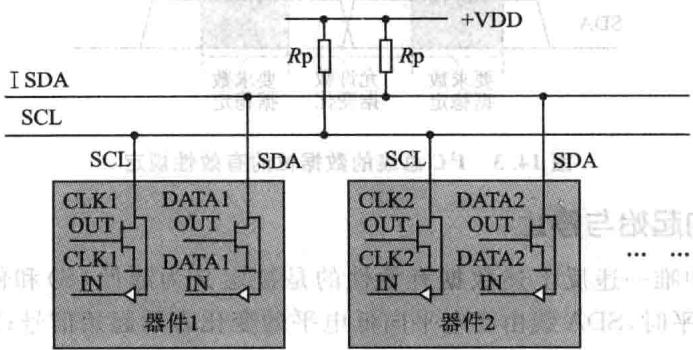

图14.1多个²C总线模块连接图

I²C总线通过上拉电阻接正电源。当总线空闲时，两根线均为高电平。连到总线上的任器件输出的低电平，都将使总线的信号变低，即各器件的SDA及SCL都是线“与”关系。 AC

## 1. 总线的主机与从机

每个接到 总线上的器件都有唯的地址。主机与其他器件间的数据传送可以是由主机发送数据到其他器件，这时主机即为发送器。由总线上接收数据的器件则为接收器。主机不一定是发送器，主机的主要特征是初始化发送、产生时钟信号和终止发送的器件，它可以是发送器也可以是接收器，通常微处理器在系统中作为主机。被主机寻址的器件即为从机，同样它也可以是发送器或接收器。在多主机系统中，可能同时有个主机企图启动总线传送数据。为了避免混乱。I²C总线要通过总线仲裁，以决定由哪一台主机控制总线，如图14.2所示。

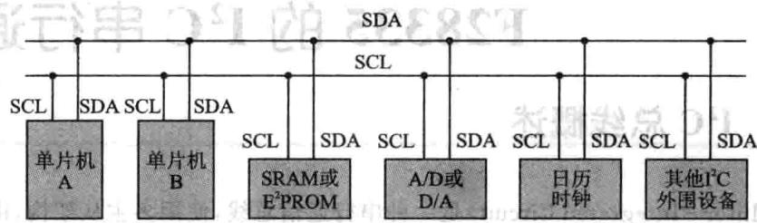

图14.2PC总线的主要应用

## 2. 数据位的有效性规定

I²C总线进行数据传送时，时钟信号为高电平时，数据线上的数据必须保持稳定，只有在时钟线上的信号为低电平时，数据线上的高电平或低电平状态才允许变化，如图143所示。义照建建，大首委体资期）宝

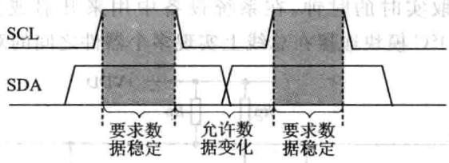

图14.3PC总线的数据位的有效性规定

## 3. 的起始与停止

I²C总线中唯一违反上述数据有效性的是被定义为起始(S)和停(P)条件。SCL线为电平时，SDA线由高电平向低电平的变化表示起始信号;SCL线为电平期间，SDA线由低电平向高电平的变化表示终止信号，如图14.4所示。

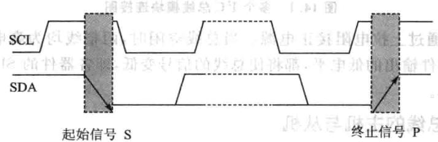

图14.4P^C总线的起始信号与终止信号

起始和终止信号都是由主机发出的；在起始信号产生后，总线就处于被占用的状态；在终止信号产生后，总线就处于空闲状态。

连接到 总线上的器件，若具有 总线的硬件接口，则很容易检测到起始和终信号。对于不具备I²C总线硬件接口的有些单机来说，为了检测起始和终止信号，必须保证在每个时钟周期内对数据线SDA采样两次。达从

## 4.P²C的数据传送

接收器件收到一个完整的数据字节后，有可能需要完成一些其他工作，如处理内部中断服务等，可能无法刻接收下个字节，这时接收器件可以将SCL线拉成低电平，从而使主机处于等待状态。直到接收器件准备好接收下个字节时，再释放SCL线使之为高电平，从而使数据传送可以继续进行。 ，

## 5.数据传送格式

## (1)字节传送与应答

每个字节必须保证是8位长度。数据传送时，先传送最位（MSB），每个被传送的字节后都必须跟随位应答位(即帧共有9位），如图14.5所。

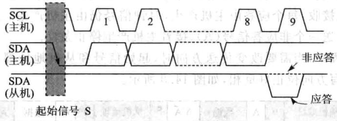

图14.5I²C总线的字节传送与应答

由于某种原因从机不对主机寻址信号应答时（如从机正在进实时性处理作而无法接收总线上的数据），它必须将数据线置于高电平，而由主机产生一个终信号以结束总线的数据传送。 ：宝司总

如果从机对主机进了应答，但在数据传送段时间后无法继续接收更多的数据时，从机可以通过对无法接收的第一个数据字节的“非应答”通知主机，主机则应发出终止信号以结束数据的继续传送。

当主机接收数据时，它收到最后一个数据字节后，必须向从机发出一个结束传送的信号。这个信号是由对从机的“应答”来实现的。然后，从机释放SDA线，以允许主机产生终信号。

## (2)数据帧格式

I²C总线上传送的数据信号是广义的，既包括地址信号，又包括真正的数据信号。在起始信号后必须传送一个从机的地址（7位）；第8位是数据的传送方向位（R/W)：用“0”表示主机发送数据（T）;用“1”表示主机接收数据（R）。

每次数据传送总是由主机产生的终止信号结束。但是，若主机希望继续占用总线进行新的数据传送，则可以不产生终止信号，马上再次发出起始信号对另一从机进行寻址。

在总线的一次数据传送过程中，可以有以下几种组合方式：

主机向从机发送数据，数据传送方向在整个传送过程中不变，如图14.6所示。

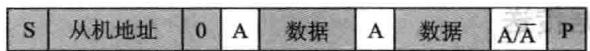

图14.6主机发送数据

有阴影部分表示数据由主机向从机传送，无阴影部分则表示数据由从机向主机传送。A表示应答，A表示非应答（高电平)。S表示起始信号，P表示终止信号。

主机在第一个字节(寻址字节)后，立即由从机读数据，如图14.7所示。

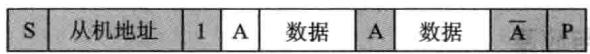

图14.7主机寻址后从机读数据

在从机产生响应时，主机从发送变成接收，从机从接收变成发送。之后，数据由从机发送，主机接收，每个应答由主机产生，时钟信号仍由主机产生。若主机要终止本次传输，则发送一个非应答信号（A），接着主机产生停止条件。

在传送过程中，当需要改变传送方向时，起始信号和从机地址都被重复产生一次，但两次读/写方向位正好反相，如图14.8所示。

|S|从机地址0A数据|0|A|数据|A/A||从机地址||A|数据||P|
|---|---|---|---|---|---|---|---|---|---|---|---|---|

图14.8改变传送方向

## 6.总线的寻址

I²C总线协议有明确的规定:采7位寻址字节（寻址字节是起始信号后的第个字节）寻址字节的位定义如图149所示国容期主导果

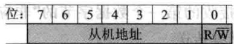

图14.9寻址字节的位定义

D7～D1位组成从机的地址。D0位是数据传送方向位，为 时表示主机向从机写数据，为“1”时表主机由从机读数据。

主机发送地址时，总线上的每个从机都将这7位地址码与已的地址进较，如果相同，则认为正被主机寻址，根据R/W位将已确定为发送器或接收器。

从机的地址由固定部分和可编程部分组成。在一个系统中可能希望接入多个相同的从机，从机地址中可编程部分决定了可接人总线该类器件的最大数目。如一个从机的7位寻址位有4位是固定位，3位是可编程位，这时仅能寻址8个同样的器件，即可以有8个同样的器件接入到该I²C总线系统中。

寻址字节中的特殊地址如表14.1所列。固定地址编号0000和1111已被保留作为特殊用途。

|地址位   X|R/W$|意义|
|---|---|---|
|0  0   0  0|0  0   0|0|
|0  0  0  0|0  0  0|1|
|0  0  0 105|0  0   1|×|
|0  0  0  0|0  1  0|×|
|0   0  0  0|0   1   1|×|
|0010 0福|国1x1×|×|
|1牌151 1|1|×|
|1  11  1|0××|×|

表14.1寻址字节中的特殊地址

起始信号后的第一字节的8位为 时，称为通用呼叫地址。通用呼叫地址的用意在第二字节中加以说明。格式如图14.10所示。

|第一字节（通用呼叫地址）||第二字节LSB||
|---|---|---|---|
||00000|A||

图14.10寻址格式

第二字节为06H时，所有能响应通用呼叫地址的从机器件复位，并由硬件装入从机地址的可编程部分。能响应命令的从机器件复位时不拉低SDA和SCL线，以免堵塞总线中要，交中安中工

第字节为04H时，所有能响应通呼叫地址并通过硬件来定义其可编程地址的从机器件将锁定地址中的可编程位，但不进行复位。长种息

如果第字节的向位为“1”，则这两个字节命令称为硬件通用呼叫命令。

平在这第二字节的高7位说明自己的地址。接在总线上的智能器件，如单机或其他微处理器能识别这个地址，并与之传送数据。硬件主器件作为从机使用时，也用这个地址作为从机地址。格式如图14.11所示。

|S|00000000|A|主机地址||A|数据|A|数据|A|B|
|---|---|---|---|---|---|---|---|---|---|---|

图14.11主机作为从机使用时寻址格式

在系统中另种选择可能是系统复位时硬件主机器件作在从机接收器式，这时由系统中的主机先告诉硬件主机器件数据应送往的从机器件地址，当硬件主机器件要发送数据时就可以直接向指定从机器件发送数据了。IC总线寻址公式如图14.12所示。 宝上

起始字节是提供给没有I²C总线接口的单片机查询IC总线时使用的特殊字节。不具备 总线接口的单片机，则必须通过软件不断地检测总线，以便及时地响应总线的请求。单机的速度与硬件接口器件的速度就出现了较大的差别，为此，总线上的数据传送要由一个较长的起始过程加以引导。

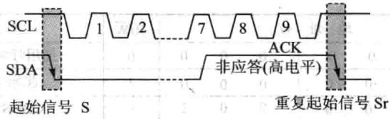

图14.12F²C总线寻址

引导过程由起始信号、起始字节、应答位、重复起始信号（Sr）组成。请求访问总线的主机发出起始信号后，发送起始字节（00000001），另一个单片机可以用一个比较低的速率采样SDA线，直到检测到起始字节中的7个“0”中的一个为止。在检测到SDA线上的高电平后，单片机就可以用较高的采样速率，以便寻找作为同步信号使用的第二个起始信号Srg面i R1

在起始信号后的应答时钟脉冲仅仅是为了和总线所使用的格式一致，并不要求器件在这个脉冲期间作应答。

## 7.I²C总线上的仲裁

在多主的通信系统中。总线上有多个节点，它们都有自已的寻址地址，可以作为从节点被别的节点访问，同时它们都可以作为主节点向其他的节点发送控制字节和传送数据。但是如果有两个或两个以上的节点都向总线上发送启动信号并开始传送数据，这样就形成了冲突。要解决这种冲突，就要进仲裁的判决，这就是I²C总线上的仲裁有义来司和，日

I²C总线上的仲裁分两部分：SCL线的同步和SDA线的仲裁。

## (1)SCL线的同步(时钟同步)

SCL同步是由于总线具有线“与”的逻辑功能，即只要有一个节点发送低电平时，总线上就表现为低电平。当所有的节点都发送高电平时，总线才能表现为高电平，如图14.13所示。

由于线“与”逻辑功能的原理，当多个节点同时发送时钟信号时，在总线上表现的是统一的时钟信号，这就是SCL的同步原理。

## (2)SDA线的仲裁

仲裁过程如图14.14所示。

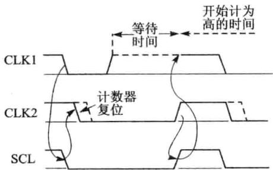

图14.13 I²C总线仲裁SCL同步

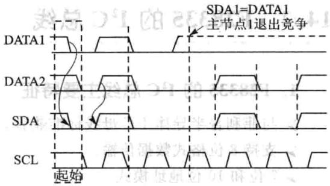

图14.141²C总线仲裁过程

DATA1和DATA2分别是主节点向总线所发送的数据信号；SDA为总线上所呈现的数据信号，SCL是总线上所呈现的时钟信号。SDA线的仲裁也是建立在总线具有线“与”逻辑功能的原理上的。

节点在发送1位数据后，比较总线上所呈现的数据与自已发送的是否一致。是则继续发送；否则，退出竞争。（司解卦个单如个

SDA线的仲裁可以保证I²C总线系统在多个主节点同时企图控制总线时通信正常进并且数据不丢失。总线系统通过仲裁只允许一个主节点可以继续占据总线。 从

第2个时钟周期，2个主节点都发送低电平信号，在总线上呈现的信号为低电平，仍继续发送数据。这样主节点2就赢得了总线，而且数据没有丢失，即总线的数据与主节点2所发送的数据一样，而主节点1在转为从节点后继续接收数据，同样也没有丢掉SDA线上的数据。因此在仲裁过程中数据没有丢失。

当主节点1、2同时发送起始信号时，两个主节点都发送了高电平信号。这时总线上呈现的信号为高电平，两个主节点都检测到总线上的信号与自己发送的信号相同，继续发送数据。

SDA仲裁和SCL时钟同步处理过程没有先后关系，而是同时进行的。

I²C总线主要特征总结如下：

①只要求两条总线线路：一条串行数据线SDA，条串行时钟线SCL。

②每个连接到总线的器件都可以通过唯一的地址和一直存在的简单的主机/从机关系软件设定地址，主机可以作为主机发送器或主机接收器。

③它是一个真正的多主机总线，如果两个或更多主机同时初始化，数据传输可以通过冲突检测和仲裁防止数据被破坏。

④串的8位双向数据传输位速率在标准模式下可达100kbps，快速模式下可达400kbps，高速模式下可达3.4Mbps。

⑤连接到相同总线的IC数量只受到总线的最大电容400pF限制。

### 14.2F28335的 总线

## 1.F28335的 总线主要特征

与菲利普半导体 母线标准兼容。

➢支持8位格式数据传输。

7位和10位地址模式。

》通用播叫功能。

START字节模式。

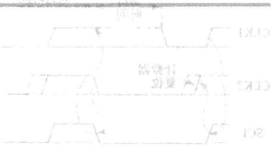

支持多个主发送器和从接收器。

息支持多个从发送器和主接收器。

➢具有主发送/接收和接收/发送模式。

数据传输速率从 kbps。

➢个16位接收FIFO和个16位传输FIFO。

CPU具有个专用中断，该中断可以由以下条件产生：发送数据准备好，接收数据准备好，寄存器访问准备好，没有响应接收，仲裁丢失，检测到停止条件，作为从设备询址。

当工作在FIFO模式， 可以使用另二个附加中断。将国个车

可以使能/禁止 模式。

自由数据格式模式。

## 2.F28335的 总线不支持的功能

高速模式(HS模式)。

CBUS兼容模式。

## 3.F28335的 总线功能概述

每个连接到 总线的器件（包括与 模块一同连接到总线的DSP)都有一个唯的识别地址。根据器件功能的不同，每个器件都可以实现发送或接收功能。当进行数据传输时，连接到 总线的器件都可以作为主设备或从设备。主设备初始化总线上的数据传输并产生时钟信号。在传输过程中，任何由该主设备寻址的设备都可以看作是从设备。 总线支持多个主设备模式，在这种模式下，能够控制 总线的一个或多个设备都可以连接到同一条总线上。

在实现数据传输时， 总线模块有一个数据引脚（SDA）和一个时钟引脚(SCL)，如图14.15所示。这两个引脚在 总线的F28335设备和其他设备的数据之间传输信息。SDA和SCL引脚都可以双向传输信号，在使用时都必须通过个上拉电阻给其加正电压。当总线空闲时，两引脚均为电平。这两个引脚都采漏

极开路配置以实现线与操作。

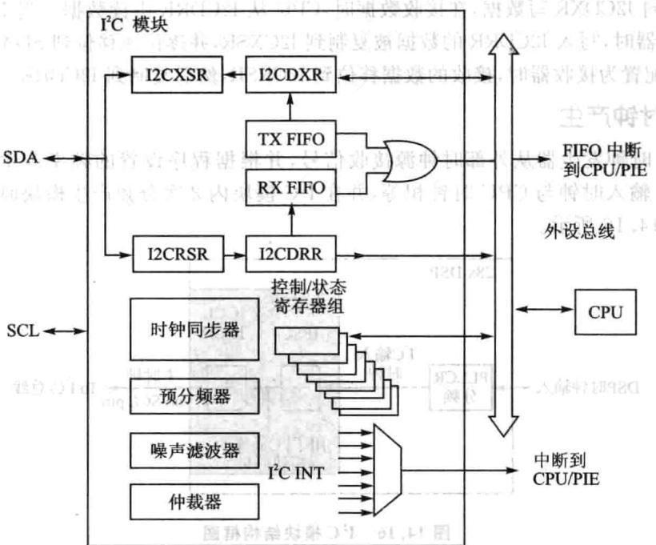

图14.15PC模块结构框图

## (1)F28335的 总线有两个主要的传输式

标准模式：发送n个数据，n指的是 模块寄存器设置的传输数据个数。

重复模式：一直发送数据直到软件强制产生一个停止（STOP）信号或者一个新的启动（START）信号

## (2) 总线的主要模块

①个串接：个数据引脚(SDA)和个时钟引脚(SCL)。

②数据寄存器和 ：用以暂时保存SDA引脚和CPU之间接收或发送的传输数据。啊山南

③控制和状态寄存器。

④外设总线接口：用以使 访问 模块寄存器和 

⑤时钟同步器：以完成来DSP时钟发器的 输入时钟和SCL引脚的时钟同步，在不同时钟频率下实现与主设备的同步数据传输。

⑥分频预定标：将输时钟分频产 模块时钟。

⑦噪声滤波器：对SDA和SCL引脚上的信号进行滤波出解人解

⑧仲裁模块：用于完成 模块（作为主模块)与其他模块之间的仲裁处理。

⑨中断产生逻辑：用以向CPU发送中断信号。

①FIFO中断产逻辑：可以使FIFO访问与IC模块的数据接收和数据传输同步。

图14.15给出了在非FIFO模式下用于传输和接收的4个寄存器。在数据发送时，CPU向I2CDXR写数据，在接收数据时， 从I2CDRR中读数据。当I²C模块配置为发送器时，写I2CDRR的数据被复制到I2CXSR，并逐位地移位到SDA引脚。当I²C模块配置为接收器时，接收的数据移位到I2CRSR，然后复制到I2CDRR。

## 4.时钟产生

DSP时钟发器从外部时钟源接收信号，并根据程序设置的频率产 输入时钟 输时钟与CPU时钟相等，并在 模块内2次分频产模块时钟和主时钟，如图14.16所示。

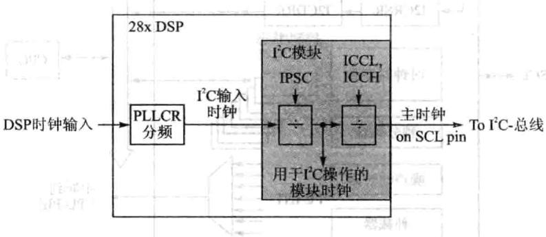

图14.16^{C模块结构框图

模块时钟决定了 模块运行的频率。 模块内的一个可编程预定标将 的输入时钟分频以产生模块时钟，为了确定分频值，可以初始化预定标寄存器的IS-PC区域值，运算方法如下： 要主个商育更总（）

模块时钟频率 

注意：为符合所有I²C模块的事件标准，模块时钟必须配置在7～12MHz范围内。

只有当 模块处于复位状态 时才能初始化预定标。而只有当IRS由0变1时，预定标产生的频率才起作用。当 预定标频率无效时才能改变IPSC的值。

当 模块配置为主机时，SCL引脚输出时钟信号，该时钟即为同步通信时钟，控制 主机和从机之间通信的时序，如图14.16所。输模块的时钟经过再分频作为主机时钟信号，经过I2CCLKL的ICCL值对模块时钟信号的低位部分进分频，采用I2CCLKH的ICCH值对模块的时钟信号的高位部分进行分频。卡

### 14.3F28335的 总线操作

## 1.输入和输出电平

主设备为每一个数据传输产生一个时钟脉冲。由于不同设备采用的技术标准不同，连接的 总线上的器件逻辑0（低电平）和逻辑1（高电平）是不固定的，由设备的VDD值决定，具体要查看相应的技术手册。

## 2.数据位有效状态

跟I²C总线规定是一致的。在时钟信号为高电平的过程中，SDA数据必须保持稳定。只有在SCL的时钟信号为低电平时才能够改变SDA数据信号的高/低电平状态。图14.17为 总线的数据传输状态。

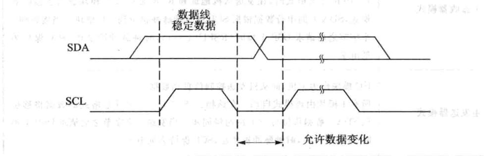

图14.17 FC总线的数据传输状态

## $3.I²C模块的主从操作模式

T²C模块持4种数据传输模式，如表14.2所列。如果I²C模块作在主机模式时，它首先会作为一个主发送器，发送一串地址，给指定的从机。当需要发送数据给从机时，I²C仍保持在主发送器模式，当主机接收数据时，主机模块需变成主接收器模式。

同理，如果I²C模块工作在从机模式时，它首先作为一个从接收器，从主模块发出的地址信号中识别出为它的从地址时，发送响应信号。如果接下来，主机需要通过I2C向该机发送数据，该从机就保持从接收器模式。如果主机请求 从机发送数据，该从机必须变成从发送器模式。 模块的主要工作模式如表14.2所列。

|操作模式|功能描述|
|---|---|
|从接收器模式|I2C模块作为从机模块，接收主机发出的数据所有的从机均从该模式启动，在该模式下，SDA上接收的串行数据根据主模块产生的时钟脉冲进行移位。作为从机，I²C模块不产生时钟信号，但当接收到1个字节之后请求DSP干预时(RSFULL=1)，它可以将SCL置低|
|从发送器模式|3I2C模块作为从机，向主机发送数据该模式只能由从接收器模式进人，I2C模块必须首先从主模块接收命令。当使用7位/10位地址格式时，如果从地址字节与其本身地址（I2COAR）相同时，且主机已发送R/W，I2C模块进人从发送器模式。作为从发送器，I²2C模块根据主模块产生的时钟脉冲将串行数据移位输出到SDA。作为从机，I2C模块不产生时钟信号，当发送一个字节之后，若请求DSP干预时（XSMT=0)，它可将SCL置低|

表14.2{²C模块主要工作模式

|操作模式|功能描述|
|---|---|
|主接收器模式|I²2C模块作为主机，接收从机发出的数据该模式只能从主发送器模式进 $_ { \circ } \ I ^ { 2 } \mathbf { C }$ 必须首先向从机发送命令。当使用7位/10位寻址格式时，在发送从机地址和R/W之后，I2C模块进入主接收器模式，SDA上的串行数据根据 $\scriptstyle \mathrm { S C L }$ 的时钟脉冲移位到 $\mathrm { } \mathrm { I } ^ { 2 } \mathrm { C }$ 模块。当接收到1个字节之后请求DSP于预时（RSFULL=1），时钟脉冲被禁止，SCL保持为低电平|
|主发送器模式|I2C模块作为主机，向从机发送控制信息和数据所有主模块由该模式启动。在该模式下，7位/10位寻址格式的数据将移位到SDA。数据移位与SCL的时钟同步。当发送一个字节之后请求DSP干预时(XSMT=0)，时钟脉冲被禁止，SCL保持为低电平|

续表14.2

## 4. 模块的启动与停止条件

当模块配置为 总线的主机时，将由主机模块产生启动（START）与停止（STOP）信号，如图14.18所示。

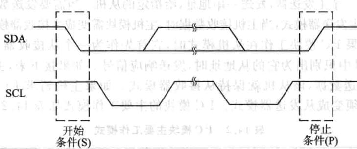

图14.18^{C模块的启动与停止

启动（START）条件：当SCL为高电平时，SDA信号由高电平转为低电平。主机输出START信号，表示数据传输开始。[

》停止(STOP)条件：当SCL为高电平时，SDA信号由低电平转为高电平。主机输出STOP信号，表示数据传输结束。业

在START信号之后，STOP信号之前 总线处于繁忙状态，I2CSTR总线繁忙标志位（BB)为1。在STOP信号之后和下个START信号来临之前， 总线处于空闲状态，BB为0。

当发出START信号I²C模块开始数据传输时，I2CMDR中的主模式位(MST）和START条件位（STT)必须置1。当发出STOP信号 模块结束数据传输时，STOP条件位(STP)必须置1。当BB位和SST位都设置为1时，产生重复START操作。

## 5.串行数据格式

I²C模块支持1～8位数据值。数据线SDA上的每一位与SCL上的一个脉冲相对应，且发送过程总是先发送最高有效位（MSB）。传输或接收的数据个数没有限制。图14.19中所的串数据格式为7位地址格式。

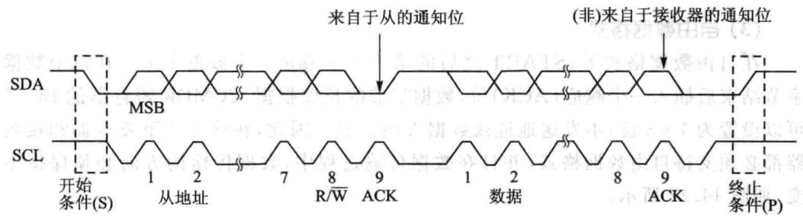

图14.19C模块的串行数据格式

## (1)7位地址格式

在7位地址格式下，START信号之后的第个字节包括7位从机地址和1位R/W位。R/W位确定数据传输的方向，如图14.20所示。

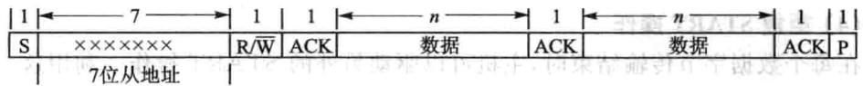

图14.20{C模块的7位地址格式

：主机写数据入从机。

：主机读从机发出数据。

在每个字节传输完成之后，插个响应信号(ACK)专的额外时钟周期。主机发送完第个字节，从机发出响应信号后，根据R/W位的状态，在响应信号之后主机或从机就会发送n位数据，n的值介于1～8之间，由寄存器I2CMDR的BC区确定。数据发送完成之后，接收器会插入一个响应位。

如果要选择7位地址格式，向I2CMDR寄存器的扩展写人0以使能XA位，并确认自由数据格式模式处于关闭状态（FDF=0，I2CMDR寄存器）。

## (2)10位地址格式

10位地址格式与7位地址格式类似，但不同的是主机发送从机地址采两个分离的字节传输。第个字节由1110B、10位从机地址的两个MSBs和R/W组成。第个字节是10位从地址的剩余8位地址。从模块在每两字节传输完成之后必须发送个响应信号。主模块将第个字节的地址写到从机时，主机可以写数据或者使用START信号重复操作改变数据传输向，如图14.21所示。

如果要选择10位寻址格式，向I2CMDR寄存器的XA位写1，并确认由数

据格式模式处于关闭状态（FDF=0，I2CMDR寄存器）。

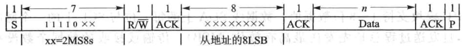

图14.21{²C模块的10位地址格式

## (3)自由数据格式

在自由数据格式下，START之后的第一个字节是一个数据字节。在每个数据字节结束后插一个响应（ACK）位，数据字节的长度根据I2CMDR寄存器的BC区可以设置为1～8位，不发送地址或数据方向信息。因此，在该方式下发送器和接收器都必须支持由数据格式，并且在数据传输过程中，数据传输的向必须保持不变，如图14.22所示。

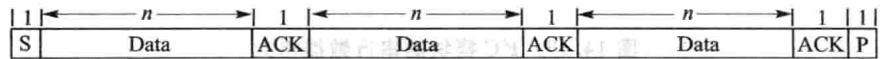

图14.22{²C模块的自由数据格式

如果要选择自由数据格式，向I2CMDR寄存器的自由数据格式（FDB)位写1。在LOOP-back循环测试模式下时，不持由数据格式。

## (4)重复START操作

在每个数据字节传输结束时，主机可以驱动另外的START操作。利用这一点，主机可以与多个从机通信不需要通过STOP操作放弃总线控制权。数据字节的长度可以设置为1～8位，由I2CMDR寄存器BC区选择。重复START操作可以使7位地址格式，10位地址格式和由数据格式。图14.20给出了个7位地址格式的重复START操作。

## 6.不响应信号（NACK）方式

当I2C模块作为主/从接收器时，可以响应或忽略发送器发送的位。为了忽略任何总线上发送的信号，I²C模块必须在总线响应过程中发送一个不响应信号(NACK）。表14.3总结了可以产生(NACK)的各种方式。

|12C模块操作|NACK信号产生选择|
|---|---|
|从接收器模式|允许产生过载（RSFULL=1）复位模块(IRS=0)在需要接收最后一个数据的上升沿之前置位NACK-MOD位|
|主接收器模式与重复模式(RM=1)|产生STOP信号(STP=1）复位模块（IRS=0)在需要接收最后一个数据的上升沿之前置位NACK-MOD位|

表14.3产生NACK的方式

续表14.3

|I2C模块操作|NACK信号产生选择|
|---|---|
|主接收器模式与不重复 模式(RM=1)|如果STR=1，允许内部数据计数器到O，并因此强制产生STOP信号 如果STR=0，使STR一1产生一个STOP信号 复位模块IRS=0,STP=1产生STOP信号 在需要接收最后一个数据的上升沿之前置位NACK-MOD位|

## 7.时钟同步

在通常情况下，只有个主设备产时钟信号SCL，而在仲裁程序中可以有2个或多个主设备。为了使输出数据具有比较性，时钟必须保持同步。图14.23给出了时钟同步时序图。SCL的线与意味着旦有个设备在SCL产低电平信号，则其他设备也被强制为低电平，即在这个由高电平到低电平的过程中，其他设备产生的时钟强制置低电平，并且只要有设备的时钟信号为低则SCL直保持低电平。只有总线SCL的低电平状态结束，其他设备时钟的低电平状态才可以结束。在变换为电平状态之前，先获得个SCL的同步信号。该同步信号低电平状态的长度由最慢的设备时钟信号决定，电平状态的长度由最快的设备时钟信号决定。

如果有设备需要将时钟信号强制拉低并保持个较长的时间，那么其他时钟发生器都进等待状态。在这种作状态下，从设备将主设备的作时钟变慢，并为存储接收的字节或发送字节创造了够的时间。

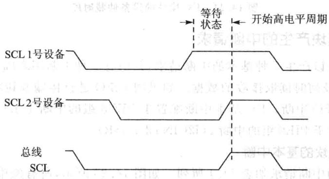

图14.23I²C模块的时钟同步时序

## 8.仲裁

如果两个或更多个主发送器要同时向同个总线发送数据，就需要启动仲裁程序。通过仲裁决定如何选取串数据总线上的数据。图14.24给出了两设备的仲裁过程。一个主发送器将SDA置高电平，被另个将SDA置低电平的主发送器控制。也就是说，传输最低进制串数据流的设备具有优先权。如果两个或多个设备发送的数据首字节相等，则仲裁结果将继续选取随后的数据字节。

如果 模块丢失主机模式，它就转变为从接收器模式，发送仲裁丢失标志（AL），并产生一个仲裁丢失中断请求。

如果在串行传输过程中，向SDA发送重复START或STOP操作指令时一个仲裁程序也正在运行，其主发送器必须在同一位置以固定格式发送重复START或STOP操作指令，不能在以下数据信号之间产生仲裁。

①重复START信号与一个数据位之间。

②STOP信号与个数据位之间。

③重复START信号与STOP信号之间。

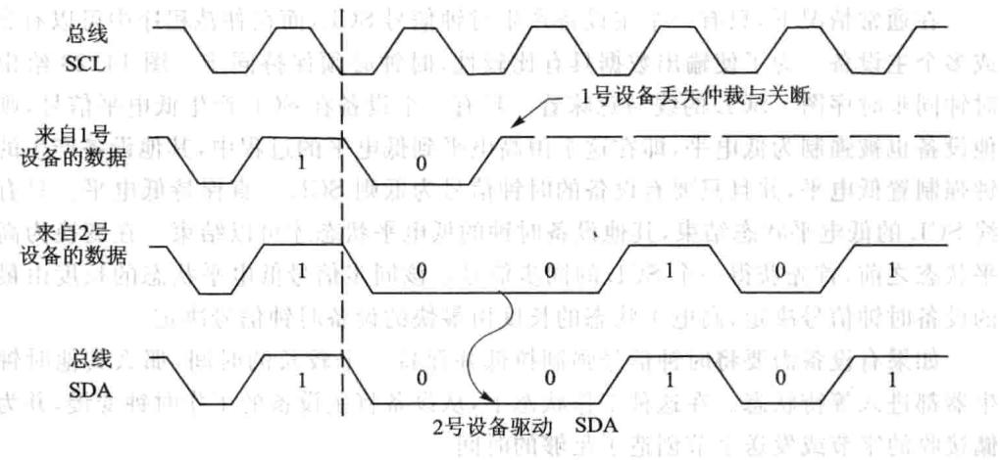

图14.24I²{C模块的设备仲裁时序

## 9.I{C模块产生的中断请求

I²C模块可以产7种基本的中断请求，其中有2种中断来确定CPU何时写传输数据以及何时读取接收的数据。如果用FIFO进传输和接收数据的操作，也可以调用FIFO中断。I²C基本中断配置于PIE8组的中断1（I2CINT1A_ISR），FIFO中断配置于PIE8组的中断2（I2CINT2A_ISR）。

## (1)I²C模块的基本中断

I²C模块的中断请求如表14.4所列。如图14.25所示，所有的中断请求都汇集到仲裁器，通过仲裁判断之后再向CPU发出一个IC中断请求。在状态寄存器(I2CSTR)中给每个中断请求都分配了个标志位，在中断使能寄存器I2CIER中给每个中断分配了个使能位。当产个中断请求时，其标志位就置位，如果此时相应的使能位为0，则不响应中断请求。如果使能位为1，则该请求作为一个²C中断发送到CPU。

I²C中断是CPU的可屏蔽中断之。与其他可屏蔽中断一样，如果CPU能够响应该中断，便执行响应的中断服务程序I2CINT1A_ISR，I2C中断的I2CINT1A_ISR通过读取中断源寄存器I2CISRC中的相应信息来确定中断源，然后执行中断服

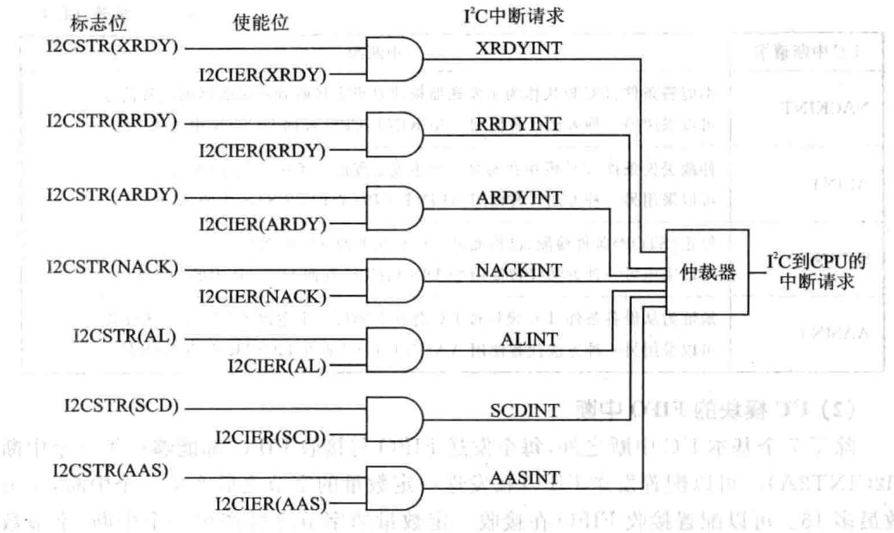

图14.25P²C模块的中断

务子程序。

CPU读取中断源寄存器I2CISRC之后，将进以下步骤。

①清除I2CSTR寄存器中相应的中断源标志位，但I2CSTR中的ARDY、RRDY、XRDY位不清除。当需要清除时，向该位写1。

②通过仲裁确定剩下的其他中断请求中哪个具有最高优先级，在寄存器I2CISRC中做出标记，并将该中断请求发送给CPU。

|$12C中断请求|中断源|
|---|---|
|XRDYINT|发送准备好条件，当前一个数据从数据发送寄存器I2CDXR复制到发送移位寄存器12CXSR后，I2CDXR便准备好接收数据可以采用另一种方法代替使用XRDYINT，CPU查询I2CSTR状态寄存器的XRDY位。XRDY—INT不适用于FIFO模式，而采用FIFO中断|
|RRDYINT|接收准备好条件：当数据已经从接收移位寄存器I2CRSR复制到数据接收寄存器12CDRR之后，I2CDRR便为读取做好准备可以采用另一种方法代替使用RRDYINT，CPU查询I2CSTR状态寄存器的PRDY位，RRDY-INT不适用于FIFO模式，而采用FIFO中断|
|ARDYINT|寄存器访问准备好条件：当之前的可编程地址、数据和指令值已使用之后，I2C模块寄存器便为访问做好准备发生ARDYINT的事件与设置I2CSTR寄存器中的ARDY位等效。可以采用另一种方法代替使用ARDYINT：CPU查询I2CSTR中的ARDY位|

表14.41²C模块中的中断请求

|12C中断请求|中断源|
|---|---|
|NACKINT|不应答条件 $\textstyle ! ^ { 1 ^ { 2 } } \mathrm { C }$ 模块作为主发送器模块且没有接收到从接收器的应答信号可以采用另一种方法代替使用 ${ \mathrm { N A C K I N T } } : { \mathrm { C P U } }$ 查询I2CSTR中的AL位|
|ALINT|仲裁丢失条件 $\operatorname { J } ^ { 2 } \mathbf { C }$ 模块在与另个主发送器的竞争中丢失了仲裁权可以采用另一种方法代替使用 $\Lambda \mathrm { L I N T } : \mathrm { C P U }$ 查询I2CSTR中的AL位|
|SCDINT|停止（STOP)条件检测；已检测到I2C总线上的STOP条件可以采用另一种方法代替使用 $\operatorname { S C D I N T } : \operatorname { C P U }$ 查询I2CSTR中的SCD位|
|AASINT|地址为从设备条件： $\mathrm { I ^ { 2 } C }$ 模块被I²C总线上的另个主设备地址作为从设备可以采用另一种方法代替使用AASINT：CPU查询I2CSTR中的AAS位|

续表14.4

## (2) 模块的FIFO中断

除了7个基本 中断之外，每个发送 与接收FIFO都能够产生一个中断(I2CINT2A）。可以配置发送FIFO在发送一定数量的字节之后产生一个中断，字节数最多16。可以配置接收FIFO在接收定数量的字节之后产个中断，字节数最多16。这两个中断经“或”操作到个可屏蔽CPU中断。中断服务程序通过读取FIFO中断标志位来确定该中断属于哪个中断源。

## 10. 模块复位/禁止

可以通过以下两种式复位/禁 模块：

①将I²C模式寄存器I2CMDR的 复位位IRS置0。I2CSTR中的所有状态均被强制恢复到其默认值， 模块保持禁止状态直到IRS位变为1。SDA和SCL引脚均为阻抗状态。

②通过将XRS引脚拉低初始化DSP。该操作复位整个DSP并使DSP保持复位状态直到引脚位被拉高。当释放XRS引脚时，所有 模块寄存器复位到其默认值，IRS位被强制置O从而复位 模块。I²C模块保持复位状态直至IRS位置1。

在配置或重新配置 模块时IRS必须保持为0。将IRS强制置0可以节省电能或清除错误状态。

### 14.4 F28335的 寄存器

## 1. 模式寄存器(I2CMDR)

这个16位的寄存器主要包含了I²C模块的作模式控制部分，如表14.5所列。

A

|位|名称|描述|
|---|---|---|
|15|NACKMOD|无应答信号模式位0：从机接收模式：I2C模块在每个应答时钟周期向发送发送个应答位。如果设置了NACKMOD位I2C模块只发送个应答位(NACK）主机接收模式：I2C模块在每个应答时钟周期向发送方发送一个应答位，但如果内部数据计数器自减到0的时候，I2C模块发送一个无应答位（NACK)给发送方，因此初始化时设置了NACKMOD位1:从机接收或者主机接收模式：2C模块在下一个应答时钟周期向发送发送一个无应答位。一旦无应答位发送，NACKMOD位就会被清除注意：为了I2C模块能在下一个应答时钟周期向发送方发送一个无应答位，在最后一位数据位的上升沿到来之前必须置位NACKMOD|
|14中|FREE|如果遇到一个调试断点，该位将通过I²C模块控制总线状态0:当I²C模块为主机：如果在断点发生时SCL为低电平，I2C模块立即停作并保持SCL为低电平，无论此时I2C模块是发送还是接收状态；如果在断点发生时SCL为高电平，I2C模块将等待SCL变为低电平然后再停止工作当I2C模块为从机：在当前数据发送或者接收结束后断点将会强制I2C模块停止工作1:I²C模块无条件运行，也就是说，就算遇到了一个断点，I²2C还是照常运行|
|13|STT|开始位(START)(仅限于I²C模块为主机）。RM、STT和STP共同决定I2C模块数据的开始(START)和停止(STOP)格式。STT和STP可以用于终止循环发送模式，当IRS=0时此位不可写0:在总线上接收到开始位（START）后STT将自动清除1:此位置1会在总线上发送一个起始信号|
|12|保留|保留|
|11|STP|停止位(STOP)(仅限于I2C模块为主机）。RM、STT和STP共同决定1²C模块数据的开始（START）和停止（STOP)格式。STT和STP可以用于终止循环发送模式，当IRS=0时此位不可写0:在总线上接收到停止位（STOP）后STP会自动清除1:在I²C内部数据计数器自减到0时STP会被DSP置位从而在总线上发送一个停止信号|
|10|MST|主从模式位。当I²C主机发送个停位时MST将自动从1变为00：从机模式1：主机模式|

表14.5 I²C.模式寄存器(I2CMDR)

续表14.5

|位|名称|描述|
|---|---|---|
|9|TRX|发送/接收模式位0：接收模式1:发送模式|
|8|XA|扩充地址使能位0：7位地址模式（通常的地址模式）。I2C模块发送7位从地址（I2CSAR的位6～位0），并且拥有自己的7位从地址（I2COAR的位6～位0）1:10位地址模式(扩充地址模式）。12C模块发送10位从地址（I2CSAR的位9～位0)，并且拥有自己的10位从地址（I2COAR的位9～位0）|
||RM|循环模式位（仅限于I²C模式为主机发送状态）。RM、STT和STP共同决定I2C模块数据的开始（START）和停止（STOP）格式0:非循环模式。数据长度寄存器（I2CCNT)的数值决定了有多少字节数据通过1²C模块发送/接收1:循环模式|
|6|DLB|自测模式0：屏蔽自测模式。此模式下MST必须为11:使能测模式。由I2CDXR发送的数据被I2CDRR接收。发送时钟也是接收时钟|
|5|IRS|1²C模块复位0:I²2C模块处于复位/禁用状态1:12C模块使能|
|4|STB|起始字节模式位（仅限于1²C模块为主机模式）。如果从机需要一定的时间才能检测到总线上的起始信号，那么起始字节模式位可以将起始信号延长。如果I2C模块为从机，此位将不起作用0:I²C模块起始信号无需延长    It1:I²C模块起始信号需要延长。如果设置了起始信号位（STT），I2C模块将开始发送多个起始信号循环起始信号包括以下信息：➢一个起始信号》一个起始字节（00000001B）一个虚拟的应答时钟脉冲一个循环起始信号然后，通常情况下I2C模块将发送存放于I2CSAR中的从机地址|

续表14.5

|位|名称|描述|
|---|---|---|
|3|FDF|全数据格式0：屏蔽全数据格式。通过XA位选择发送的地址是7位还是10位1：使能全数据格式。发送全数据格式（没有地址数据）全数据格式不支持自测模式(DLB=1)|
||||
|2~0|BC|数据位数。这3位决定了I2C收发数据位数（1～8位）。BC设置的是几位数据必须与实际的通信数据位数吻合。BC的设置不影响地址位数，地址总是8位的另外，如果BC的数据位数设置少于8位，那么接收到的数据在I2CDRR中为右对齐，其他位为未定义状态。同样，写到I2CDXR中要发送的数据也是右对齐000:8位数据001:1位数据010:2位数据011:3位数据100:4位数据101:5位数据110:6位数据111:7位数据|

I²C模块作为主机时，I2CMDR中位RM、STT和STP不同值导致在总线上发送/接收数据的格式和总线状态有所不同。如表14.6所列。

||RM|STT|STP|总线状态||解释||
|---|---|---|---|---|---|---|---|
||0|0|0|None|客     总线没有动作|||
||0|0|1|P||总线有停止信号|1|
||0|1|0|S-A-D…(n)...D|起始信号-从机地址-n个数据字节（n=I2CCNT）|||
||0|1|1|1S-A-D…(n)...D-P|起始信号-从机地址-n个数据字节-停止信号（n=I2CCNT）|||
|1|0|0|None|无动作||||
|1|0|1|P|2OsD总线有停止信号花||||
|||0|益S-A-D-D-D|循环发送模式：起始信号-从机地址-连续不断的数据发送，直到有停止信号发生或者下一个起始信号发生||||
|1|1|1|None|保留（无动作）||||

表14.6总线状态

## 2. 中断使能寄存器（I2CIER）

I2CIER包括 中断的使能与屏蔽位，如表14.7所列。

|位|名称|描述|
|---|---|---|
|15~7|保留|保留|
|6|AAS|从机地址中断使能位0:中断使能1:屏蔽中断|
|5|SCD|停止信号中断使能位0：中断使能1：屏蔽中断|
|4|XRDY|数据发送就绪中断使能位。当使用FIFO时此位无需设置0：中断使能1：屏蔽中断|
|3|RRDY|数据接收就绪中断使能位0：中断使能|
|||1：屏蔽中断|
|2|ARDY|寄存器准备就绪中断使能位0：中断使能1：屏蔽中断|
|1|NACK|无应答信号中断使能位0:中断使能1：屏蔽中断|
|0|AL|总线仲裁失败中断使能位0：中断使能1:屏蔽中断|

表14.7 中断使能寄存器(I2CIER）

## 3. 状态寄存器（I2CSTR)

I²C状态寄存器包括中断标志状态和读状态信息，如表14.8所列。

|位|名称|描述|
|---|---|---|
|15|保留|保留|

表14.81²C状态寄存器(I2CSTR）

续表14.8

|位|名称|開                 描述|
|---|---|---|
|14|SDIR|从器件方向位0：作为从机接收的12C不寻址。下列情况该位会被清除：》手动清除，向该位写1》自测模式使能》总线发生一个起始信号或者一个停信号1:作为从机接收的{2C寻址，I2C模块接收数据|
|13|NACKSNT|发送无应答信号位（仅限于I²C模块为接收方）0：没有无应答信号被发送。下列情况该位会被清除：》手动清除，向该位写1I2C模块复位1:应答信号被发送：个应答信号在应答信号时钟周期被发送|
|12|BB|总线忙位。向此位写1将清除此位0：总线空闲。下面任何一种情况都将清除BB位：》I²C模块发送或者接收到停信号(总线空闲情况下)》BB被动清除，向BB位写1》I²C模块复位1：总线忙。I²C模块在总线上发送或者接收到起始信号|
|11|RSFULL|接收移位寄存器满位。当移位寄存器接收到一个新的数据而之前的数据还没有从接收寄存器（I2CDRR）读走时，接收寄存器拒绝从移位寄存器中读取新的数据位，除非之前的数据被CPU读0:未拒绝。下面任何一种情况都将清除此位：19》I2CDRR被CPU读取。仿真读不影响此位12C模块复位1:拒绝读取移位寄存器|
|10|XSMT|发送移位寄存器空位。XSMT=0表明发送下溢。要发送的数据从I2CDXR中转移到I2CXSR中后，直到发送移位寄存器（I2CXSR)值全部发送完毕，此时，如果没有后续的数据从I2CDXR转移到I2CXSR，那么发送移位寄存器将发生下溢。除非有新的数据送到I2CDXR中，I2CDXR才会将新的数据转移到I2CXSR。如果新的数据没有及时的转移，那么之前发送过的数据有可能会被再次发送门机0:下溢（I2CXSR为空）1：未下溢（I2CXSR不为空）。下面任何一种情况都将清除此位：》数据被写到I2CDXR中1²C模块复位|

续表14.8

|位|名称|描述          5|
|---|---|---|
|9|AAS|从机地址位0：在7位地址模式下，当I2C接收到一个无应答信号，一个停止信号或者个循环起始信号时AAS位会被清除；在10位地址模式下，当1²2C接收到一个无应答信号，个停信号或者一个与I²C本身外围设置的地址不符的从机地址时AAS位会被清除1:I2C模块确认收到的地址为它的从机地址或者是一个全零的广播地址。如果在全数据格式下(I2CMDR的FDF=1)收到了第个字节数据AAS位也将被置位|
|8|ADO|全0地址位0：ADO位可以被起始信号或者停信号清除1：接收到一个全零地址（广播地址）|
|7~6|保留|保留|
|5|scD|停信号位。当I²C发送或者接收到个停信号时SCD将被置位0：没有检测到停止信号。下面任何一种情况都将清除此位：》当I2CISRC的值为110B(检测到停止信号)CPU读取I2CISRC，仿真读不影响此位》手动清除，向该位写11²2C模块复位1:在总线上检测到停止信号|
|4|XRDY|数据发送就绪中断标志位。如果不处于FIFO模式下，XRDY表明数据发送寄存器（I2CDXR）已经准备好接收新的数据，因为之前的数据已经从I2CDXR中复制到了移位发送寄存器（I2CXSR）中。CPU可以查询XRDY或者响应XRDY触发的中断请求；如果使用的是FIFO模式，那么使用的是与此位作用相似的TXFFINT位0:I2CDXR未做好准备。当数据写到I2CDXR时该位被清除1:I2CDXR准备就绪：数据已经从I2CDXR中复制到了I2CXSR中。I2C复位该位也会被置1|
||||
|3|RRDY|数据接收就绪中断标志位。如果不处于FIFO模式下，RRDY表明数据接收寄存器（I2CDRR)已经准备好被读取数据，因为数据已经从移位接收寄存器(I2CRSR)中复制到了I2CDRR中。CPU可以查询RRDY或者响应RRDY触发的中断请求；如果使用的是FIFO模式，那么使用的是与此位作用相似的RXFFINT位0：I2CDRR未做好准备。此位将会被以下任何一种情况清除：》I2CDRR被CPU读取，仿真读不影响此位手动清除，写11²C复位1:I2CDXR准备就绪：数据已经从I2CDXR中复制到了I2CXSR中。I2C复位该位也会被置1|

续表14.8

|位|名称|描述|
|---|---|---|
|||寄存器读写准备就绪中断标志位(仅限于I2C模块为主机）。该位表明12C模块已经准备好了存取操作，因为之前的程序地址、数据和命令已经|
|2|ARDY|被使用过了。CPU可以查询ARDY或者响应ARDY触发的中断请求0：寄存器未做好被存取的准备。此位将会被以下任何一种情况清除：》T²C模块开始使用当前寄存器内容手动清除，写11²C复位1:寄存器已经做好被存取的准备在非循环模式下（I2CMDR.RM=0)：如果STP=0，在内部数据计数器被减到0时该位被置位；如果STP=1,ARDY没有影响（此种模式下在内部数据计数器被减到0的时候I²C模块将产生一个停止信号）在循环模式下（I2CMDR.RM=I）：在I2CDXR中每发送完一个字节ARDY都会被置位|
|美的效||无应答信号中断标志位（仅限于I2C模块为发送方，无论是做主机还是从机）。NACK表明I²C模块从数据接收方接收到的是应答信号还是无应答信号0：收到应答信号（未收到无应答信号）。此位将会被以下任何种情况清除：               （5）器》收到接收方发来的应答信号手动清除，写1》CPU读取中断源寄存器（I2CISRC）并且该寄存器有无应答信号中断12C复位1：收到无应答信号。由硬件检测是否收到无应答信号注意：在I²C模块处于广播地址数据交换的模式下，即使收到一个或者更多的应答信号，NACK始终为1|
|1|NACK||
||AL|仲裁失败中断标志位(仅限于I2C模块作为主机发送模式）。如果I²C模块与另外个主机争夺总线控制权而发生冲突，由总线仲裁决定控制权给谁，AL表明了在冲突的情况下总线仲裁结果是否将总线控制权给BC模块0：获得总线控制权。此位将会被以下任何一种情况清除：手动清除，写1CPU读取中断源寄存器（I2CISRC)并且该寄存器有AL中断1²C复位1：未获得总线控制权。此位将会被一下任何一种情况置位：》1C模块判断出在多个主机争夺总线控制权中总线仲裁没有将控制权分配给自已➢I²C模块在总线忙期间（BB=1)尝试启动一个起始信号|
|0|||
||||

## 4. 中断源寄存器（I2CISRC）

中断源寄存器（I2CISRC)位信息如表14.9所列。

|位|名称|描述|
|---|---|---|
|$1 5 { \sim } 3$|保留||
|||011:寄存器存取准备就绪|

表14.9FC中断源寄存器(I2CISRC)

## 5. 预分频寄存器(I2CPSC)

该16位寄存器于对 输时钟频率进分频以获得所需要的 模块工作频率。需要注意的是所获得的工作频率应该在 所允许的频率范围内。在 模块复位的时候IPSC必须要初始化（I2CCMR.IRS=0)，只有当IRS=1时分频频率才会起作用，此时无法修改IPSC的值。其各位信息如表14.10所列。

|位|名称|描述|
|---|---|---|
|15~8|保留|保留|
|7~0|IPSC|$12C分频系数IPSC确定供给 $\mathrm { { } _ { I ^ { 2 } C } }$ 模块的工作频率是I²C模块输入频率的分频值I2C模块工作频率=12C输人时钟频率/(IPSC+1）)注意：在I²C模块复位的时候IPSC必须要初始化（I2CCMR.IRS=0)|

表14.10P^C预分频寄存器(I2CPSC)

## 6. 时钟细分寄存器组（I2CCLKL和I2CCLKH)

当 模块作为主机时，模块时钟频率经过分频以后将作为主机频率作在SCL引脚上。以下两个数值决定了模块时钟频率特性，如图14.26所。

中的ICCL。ICCL决定了时钟信号的低电平时间。位信息如表14.11所列。

I2CCLKH中的 决定了时钟信号的电平时间。位信息如表14.12所列。

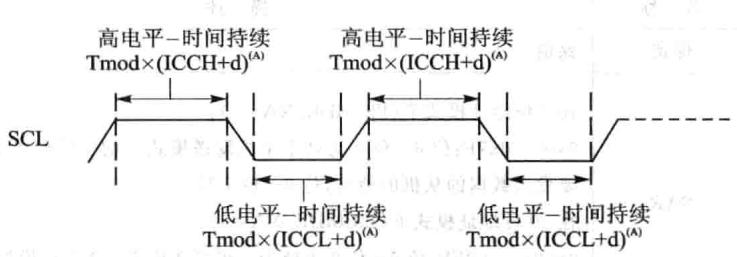

图14.26²{C时钟高低电平时间

|位|名称|描述|
|---|---|---|
|15~0|ICCL|时钟低电平时间值。模块时钟乘以（ICCL+d)确定主机时钟低电平宽度，d可以是5、6或者7，详见表14.13|

表14.11 ICCL信息

|位|名称|描述|
|---|---|---|
|15~0|ICCH|时钟电平时间值。模块时钟乘以(ICCL+d)确定主机时钟高电平宽度，d可以是5、6或者7，详见表14.13|

表14.12ICCH信息

主机时钟电平宽度 计算公式如下：

其中， 为模块时钟电平宽度；d的数值由IPSC决定，如表14.13所列。

|IPSC|$^ { d }$||6|
|---|---|---|---|
|0|7|大于1|5|

表14.13IPSC与d的值

## 7. 从地址寄存器（I2CSAR）

当 模块作为主机时，它用来存储下一次要发送的地址值。它包含了一个7位或者10位从机地址空间，当 工作在非全数据模式时(I2CMDR.FDF=0），寄存器中的地址是传输的帧数据。如果寄存器中地址值全零，那该地址对应个指定的从机；如果寄存器中的地址为全零，地址就为广播地址，呼叫所有挂在总线上的从机。如果选择7位地址模式(I2CMDR.XA=0)，只有位6～位0是可的，位9~位7写0。详细位信息如表14.14所列。

|位|名称|描述|
|---|---|---|
|15~10|保留|保留|
|9~0|SAR|在7位地址模式下(I2CMDR.XA=0)： 0x00～0x7F：位6～位0为处于主机发送模式下的I²C模块提供7位将 要发送数据的从机的地址，位9～位7写0 在10位地址模式下（I2CMDR.XA=1）： 0x00～0x03FF：位9～位0为处于主机发送模式下的1²C模块提供10位 将要发送数据的从机的地址|

表14.14 从地址寄存器(I2CSAR)

## 8.I²C自身地址寄存器(I2COAR)

I²C模块使该寄存器从所有挂在总线上的从机中找出属于的从机。如果选择7位地址模式（I2CMDR.XA=0），只有位6～位0是可用的，位9～位7写0。位信息如表14.15所列。

|位|名称|描述|
|---|---|---|
|15～10|保留|保留|
|||在7位地址模式下（I2CMDR.XA=0）：|
|9~0|OAR|0x00～0x7F：位6～位0提供7位从机地址，位9～位7写0 在10位地址模式下（I2CMDR.XA=1）： 0x00～0x03FF：位9～位0提供10位从机地址|

表14.15 C自身地址寄存器(I2COAR)

## 9. 数据计数寄存器（I2CCNT）

它是一个来表示有多少字节的数据将会被发送（DSP作为发送）或者接收(DSP作为主机接收方）；工作在循环模式下（RM=1），I2CCNT不起作用。

向I2CCNT里写值以后， 模块将自动复制I2CCNT里的值到个内部数据计数器中，只要有一个字节被发送数据计数器里的数值将会减1（I2CCNT里的值不改变）。在主机模式下如果有STOP停止信号请求（I2CMDR.STP=1）， 模块的数据计数器在的值变为0时（最后个字节被发送出去）响应停请求终发送。位信息如表14.16所列。

|位|名称|描述|
|---|---|---|
|15~0|ICDC|数据计数值。ICDC表明有多少个字节的数据要发送或者接收。当I2CMDR.RM=1时I2CCNT的值不起作用|
|0x0000：装载到内部数据计数器中的初始值为655360x0001~0xFFFF：装载到内部数据计数器中的初始值为1~65536|||

表14.16PC数据计数寄存器（I2CCNT）关

## 10. 数据接收寄存器(I2CDRR)

I²C模块能接收1～8位的数据字节。在I2CMDR中的BC位可以选择个数据字节的位数。每次从SDA引脚上读取到的数据被复制到移位接收寄存器（I2CRSR）中，当一个设置的字节数据接收完以后， 模块将I2CSRS中的数据复制到I2CDRR中。CPU不能对I2CSRS直接存取。

如果在I2CDRR中的数据字节少于8位，那I2CDRR中的数据右对齐，其他位状态不作定义。例如，如果BC=011（3位数据长度），接收到的数据就存放在I2CDRR的位2～位0，位7～位3状态未定义。

如果接收使FIFO模式，I2CDRR充当接收FIFO寄存器缓存的。各位信息如表14.17所列。

|位|名称|描述||
|---|---|---|---|
|15~8|保留|保留||
|7~0|DATA|接收到的数据||

表14.17PC数据接收寄存器（I2CDRR）

## 11. 数据发送寄存器（I2CDXR）

CPU将要发送的数据写I2CDXR中，这个16位的寄存器能够写1位～8位的数据字节。在将数据写I2CDXR之前，必须要写一个适当的数值到I2CMDR的BC位，用以说明一个数据字节有多少位数据。如果要写的数据少于8位，则必须要确保写I2CMDR中的数据是右对齐的。

在个数据字节写I2CDXR后，I²C模块将I2CDXR中的数据复制到移位发送寄存器(I2CXSR)中。CPU不能对I2CXSR直接存取。I²C模块每次移一位数据到SDA引脚上。如果发送使FIFO模式，I2CDXR充当发送FIFO寄存器缓存的角。位信息如表14.18所列。

|位|名称|描述星器|
|---|---|---|
|15~8|保留|保留|
|7~0|DATA|要发送的数据|

表14.18P²C数据发送寄存器（I2CDXR）

## 12.I²C发送FIFO寄存器(I2CFFTX)

I²C发送FIFO寄存器（I2CFFTX)的位信息如表14.19所列。

|位|名称|描述|
|---|---|---|
|15|保留|保留|
|14|12CFFEN|I2CFIFO模块使能位。使能发送FIFO和接收FIFO0屏蔽FIFO模块S器答1:使能FIFO模块|
|13|TXFFRST|2C发送FIFO复位位0：复位发送FIFO使其指针指向OxOO，保持发送FIFO处于复位状态1：使能发送FIFO|
|12~8|TXFFST4~0|FIFO发送数据状态：10000:发送FIFO为16字节0xxxx:发送FIFO为xxxx字节00000：发送FIFO为空|
|7|TXFFINT|发送FIFO中断标志位。当CPU向TXFFINTCLR写1时该位会被清除；如果TXFFIEA使能，该位的置位将引发一个中断信号0:发送FIFO没有中断发生1:发送FIFO有中断发生|
|6|TXFFINTCLR|发送FIFO中断标志清除位0:写0无任何作用1:写1清除TXFFINT中断标志|
|5|TXFFIENA|发送FIFO中断使能位0：屏蔽。TXFFINT中断标志位不触发中断1：使能。TXFFINT中断标志位触发中断|
|4~0|TXFFIL4～0|发送FIFO中断深度位当TXFFST4～0里的值等于或者小于TXFFIL4~0的设定数值时，TXFFINT将被置位。如果TXFFIEA位被使能的话就会触发一个中断信号|

表14.19FC发送FIFO寄存器(I2CFFTX)

## 13. 接收FIFO寄存器(I2CFFRX）

这个16位的寄存器包含了I²C模块的FIFO控制和状态位。各位信息如表14.20所列。

|位|名称|描述|
|---|---|---|
|15~14|保留|保留|
|13|RXFFRST|I2C接收FIFO复位位0：复位接收FIFO使其指针指向OxOO，保持接收FIFO处于复位状态1：使能接收FIFO|
|12~8|RXFFST4~0|FIFO接收数据状态：10000：接收FIFO为16字节0xxxx:接收FIFO为xxxx字节00000:接收FIFO为空|
||RXFFINT|接收FIFO中断标志位。当CPU向RXFFINTCIR写1时该位会被清除；如果RXFFIEA使能，该位的置位将引发一个中断信号0:接受FIFO没有中断发生1:接受FIFO有中断发生                                       正|
|6|RXFFINTCLR|接收FIFO中断标志清除位0:写0无任何作用1:写1清除TXFFINT中断标志|
|5|RXFFIENA|接收FIFO中断使能位0：屏蔽。RXFFINT中断标志位不触发中断  0.051101：使能。RXFFINT中断标志位触发中断TMIC|
|4~0|RXFFIL4~0|Y1x.e19.1enl接收FIFO中断深度位当RXFFST4～0里的值等于或者大于RXFFILA～0的设定数值时，RXFFINT将被置位。如果RXFFIEA位被使能的话就会触发一个中断信号注意：如果接收FIFO操作使能而且I²C已经脱离了复位状态，那么接收FIFO中断标志位将会被置位，如果接收FIFO中断使能的话将会引起一个中断信号。为了避免这种情况，在置位RXFFRST之前应该修改这些位|

表14.20 接收FIFO寄存器(I2CFFRX)

### 14.5手把手教你实现 数据传送

## 1.实验目的

①掌握采用 进数据传送。

②掌握实时时钟应用。

## 2.实验步骤

①先打开已经配置好的CCS3.3软件。

②将仿真器的USB与计算机连接，将仿真器的另一端JTAG端插到YX-F28335开发板的JTAG针处。

③在CCS中选择Debug→Connect菜单项，连接目标板，确定标板连接成功。

④将i2c_rtc录复制到CCS开发环境中的Myproject录下。

⑤在CCS中选择project→Open菜单项，加载i2c_rtc目录中的i2c_rtc.pjt。

⑥在CCS中选择File→Load Program菜单项，加载 Debug目录下的i2c.rtc.out。

⑦在CCS中选择DebugRun菜单项。

⑧在WatchWindows输SECOND,不断刷新变量值，会发现SECOND的值是递增的，这说明X1226作正常。

## 3.实验原理

在YXDSP-F28335底板上有个X1226实时时钟芯，系统可以通过它来记录实时时间。当系统上电时，该芯由电源供电。当系统掉电时，该芯由电池供电，达到记录准确时间的的。其测试思路为，先向X1226内部写当前时间，然后不断地读出它所记录的时间，通过查看SECOND变量来判断它是否作正常。

## 学婚M03008内

五
