# 第 15 章

## F28335BOOTROM引I导模式和程序

在系统设计时会碰到这样一个普遍的问题，F28335的CPU时钟高达150MHz，而大部分存储设备的访问速度都不高，尤其是掉电不丢失数据的串行存储设备，其访问时间最快的也要几十ns，通常程序运行时，CPU需要从掉电后不丢失数据的存储器中读取指令然后运，这样地频繁访问ROM，会花费CPU量的读/写等待时间，从而影响效率，无法满足复杂且实时性较高的系统需要，所以目前在实时性要求较高、程序规模不是非常大的系统中，常常使用BOOT引导方式。此时，将程序存放在掉电不丢失数据的ROM存储器中，如内的FLASH、外SPI-EEPROM或SPI-FLASH等，CPU复位后首先进引导加载程序，将ROM中程序加载到内部访问速度相对比较快的SARAM中，然后根据引导加载程序指定的程序口地址，在内SARAM中运相应的程序。这个过程主要涉及到系统的启动引导（Boot-loader）。Bootloader一般涉及引导模式的设定、程序搬移、程序运行首地址的设定等个主要步骤。F28335有多种引导模式，在些特定的启动模式中，可以利TI集成在上的Bootloader程序。这个Bootloader程序与中断向量表、浮点计算数学表都存放在一个8KX16小的BOOTROM中。

### 15.1 BOOT ROM简介

F28335中的BOOTROM是一块8KX16的只读存储器，位于地址空间0x3FE000～0x3FFFFF。内BOOTROM在出厂时固化了引导加载程序以及定点和浮点数学表。上BOOTROM的存储映射如图15.1所。

## 1.内BOOTROM数学表

在BOOTROM中保留了4KX16位空间，用以存放浮点和IQ数学公式表，这些数学公式表有助于改善性能和节省SARAM空间。主要包括：

①Sin/Cosine函数表：单精度浮点型，函数大小为1282字，Q格式为Q30，对5/4周期正弦波的32位浮点采样。这个函数有助于产精确的正弦波和进32位的FFT分析。

②规格化转置函数：单精度浮点型，函数大小为528字，Q格式为Q29，对规格化转置的32位采样并有饱和限制。这个函数有助于初步计算牛顿拉夫逊一转置矩阵，除了精确地计算外，收敛快，转换速度也快。

③平方根函数：单精度浮点型，函数大小为274字，Q格式为Q30，内容为平方根的32位采样。这个函数有助于采用顿拉夫逊平方根算法初步计算平方根，运算精确，收敛快，从而转换速度快。

④标准的反正弦函数：单精度浮点型，函数大小为452字，Q格式为Q30，内容为2阶线性度的反正弦函数表。这个函数有助于采用迭代法计算反正弦的初值。运算精确，转换快，收敛快。

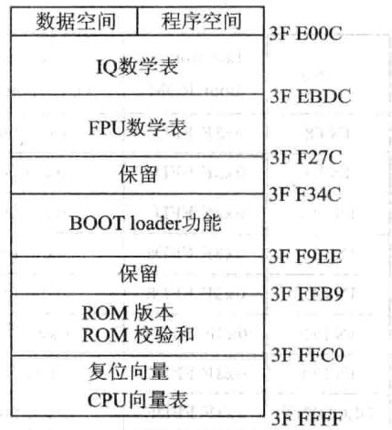

图15.1F28335片上BOOTROM存储映射

⑤标准圆函数：大小为360字Q格式为Q30，制圆函数。

⑥最小化/最大化函数：大小为120字，Q格式为Q1～Q30，内容为对不同的Q值有32位最化/最化值。

## 2.CPU向量表

CPU向量表位于ROM存储器0x3FE000～0x3FFFFF段内，如表15.1所列。复位后，当VMAP=1,ENPIE=0(PIE向量表禁)时，该向量表激活。

①VMAP位位于状态寄存器ST1中，VMAP在复位后总是1，它能够在软件复位后发生变化，在正常操作模式下保持VMAP=1。

②ENPIE位位于PIECTRL寄存器。该位在复位的情况下默认状态是0，这将禁止外设中断扩展模块(PIE)。

|Vector|Location inBoot ROM|Contents(i.e. ,points to)|Vector|Location inBoot ROM|Contents(i.e. ,points to)|
|---|---|---|---|---|---|
|RESET|0x3FFFC0|InitBoot（Ox3FFB50)|RTOSINT|0x3FFFE0|0x000060|
|INT1|0x3FFFC2|0x000042|Reserved|0x3FFFE2|0x000062|
|INT2|0x3FFFC4|0x00 0044|NMI|0x3FFFE4|0x000064|
|INT3|0x3FFFC6|0x000046|ILLEGAL|0x3FFFE6|ITRAPlsr|
|INT4|0x3FFFC8|0x000048|USER1|0x3FFFE8|0x000068|
|INT5|0x3FFFCA|0x00004A|USER2|0x3FFFEA|0xQ0006A|
|INT6|0x3FFFCC|0x00004C|USER3|0x3FFFEC|0x00006C|
|INT7|0x3FFFCE|0x00004E|USER4|0x3FFFEE|0x00006E|

表15.1F28335-BOOTROMCPU向量表

续表15.1

|Vector1月-1|Location inBoot ROM|Contents(i.e.,points to)|Vector|Location inBoot ROM|Contents(i. e.,points to)|
|---|---|---|---|---|---|
|INT8|0x3FFFD0|0x000050|USER5|0x3FFFF0|0×000070|
|INT9|0x3FFFD2|0x000052|USER6|0x3FFFF2|0x000072|
|INT10|0x3FFFD4|0x000054|USER7|0x3FFFF4|0×00 0074|
|INT11|0x3FFFD6|0x000056|USER8|0x3FFFF6|0x00 0076|
|INT12|0x3FFFD8|0×000058|USER9|0x3FFFF8|0×00 0078|
|INT13|0x3FFFDA|1y10x00005A|USER10|0x3FFFFA|0x00007A|
|INT14|0x3FFFDC|0x00005C|USER11|0x3FFFFC|0x00007C|
|DLOGINT|0x3FFFDE|0x00005E|USER12|0x3FFFFE|0×00 007E|

在内部BOOTROM引导区中能够调的唯向量就是位于0x3FFFC0的复位向量。复位向量在出厂时被烧录为直接指向存储在BOOTROM空间中的InitBoot函数，该函数用于开启引导过程。通过I/O(GPIO)引脚上的检验判断，决定具体引导模式。引导模式与控制引脚间关系如表15.2所列。新章

在BOOTROM中些其他向量在正常操作模式下并不使用，当启动引导过程完成后，应该初始化PIE向量表并且使能PIE模块。旦PIE向量表复位后，所有的向量除了复位向量外都从PIE模块中获取并不会从CPU向量表中获取。

|GPIO87/XA15|GPIO86/XA14|GPIO85/XA13|GPIO84/XA12|大身头部引导模式|
|---|---|---|---|---|
|1a|1|||跳转到FLASH(BOOT toFLAS)|
|1|1|1|0|SCI-A引导|
|1|1|0|1|SCI-B引导|
|1|1|0|0|$12C引导|
|1|0|1|1|Ecan-A引导|
|1||0|1|0|
|1|0|0|1|跳转到XINTFx16|
|1|0|0|0|跳转到XINTFx32|
|0|1|1|1|跳转到OTP|
|0|1|1|0|并GPIO/O引导|
|0|1|0|1|并行XINTF引导|
|0|1|0|0|跳转到SARAM|
|0|0|1|1|检测引导模式分支|
|0|0|1|0|跳转到FLASH，忽略ADC校准|
|0|0|0|1|跳转到SARAM，忽略ADC校准|
|0|0|0|0|SCI-A引导，忽略ADC校准|

表15.2引导模式与控制引脚间的关系

## 3.Bootloader简介

Bootloader位于片内BootROM，是一种在复位后执行的引导程序，用于在上电复位后，将程序代码从外部源转移到内部存储器。这允许代码暂时存储在掉电不丢失数据的外部存储器内，然后被转移到高速存储器中执。

Bootloader提供了多种下载代码的式，可以适应不同的系统需求。具体引导方式由GPIO引脚信号决定，如表15.2所列。

在执设备初始化后，Bootloader将会检查GPIO引脚的状态以决定用户所希望执行的

引导模式。选项包括：跳转到FLASH，跳转到OTP，跳转到SARAM，跳转到XINTF,或者调

个上引导加载程序。

在选择完启动模式之后，如果所需的引导加载完成，处理器执行地址由所选引导模式决定。如果Bootloader被调，那么由外设加载的输决定这地址。反之，若用户选择直接引导到FLASH、OTP、XINTF或者SARAM，这些存储器块的地址在系统内是被预先定义好的。

### 15.2 DSP的引I导过程

## 1.DSP启动与引导过程

DSP芯片上电之后，首先处于复位状态，在上电过程中，28335的上电顺序要求与2812不一样，没有2812的要求严苛格，28335上电要求内核先于I/O，这样做的好处是I/O引脚将不会产生不稳定的未知状态，若I/O模块先于内核上电时，由于此时内核不工作，I/O输出缓冲器中的晶体管有可能打开，从而在输出引脚上产生不确定状态，对整个系统造成影响。为了避免这种情况的发生，VDD引脚上电应早于VD-DIO引脚上电，或与之同时，以确保VDD引脚在VDDIO引脚达到0.7V之前先达到0.7V。

当复位引脚变高时，器件退出复位状态，器件首先从复位向量处开始运行，即0x3FFFCO地址处。该地址存放着Boot-ROM中的第个汇编初始引导程序Init-Boot程序的口地址，InitBoot程序出厂前已固化到BootROM上，此时，程序跳转到0x3FFC00执InitBoot程序。该程序主要初始化F28335器件工作的目标模式。然后读取安全保护模块的密码，如果CSM密码被擦除（全部等于OxFFFF）则自动解锁，否则CSM仍被锁定。

对CSM密码读取完成后，初始化例程调用模式选择功能函数（SelectBoot-Mode)，该函数根据GPIO引脚84、85、86、87的状态确定处理器引导方式，引导方式与控制引脚间的关系如表15.2所列。上电复位后，默认使能这4个GPIO引脚的内部上拉功能，如果选择BoottoFlash引导方式，则不需为这4个引脚外接控制电路。上电复位过程结束后，系统启动引导加载程序，此时必须设定好相应控制引脚的电平状态，在引导加载程序中将会对相应的引脚电平进行采样，之后决定进人何种引导方式。SCI、SPI、并行引导等几个启动模式还需要进一步调用BootLoader搬移程序，而其他启动模式是直接跳转到相应指定的地址，这就要求相应的指定地址处存放有用户程序的地址。旦完成SelectBootMode将会把地址返回给初始化引导函数（InitBoot）。然后初始化引导函数调用恢复CPU寄存器的退出例程（ExitBoot）并退出到由引导模式确定的程序口地址，如图15.2所示。

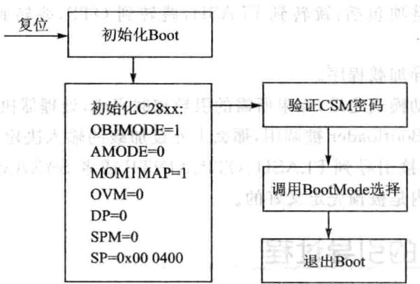

图15.2 初始化引导函数功能框图

至此，硬件引导过程完成，接下来是用户程序引导过程。在用户应用程序中会有rts2800.lib或rts2800_ml.lib，这个库里面包含引导程序进入用户编写的Main函数的引导函数_c_initO（）函数。该函数是C程序的人口函数，正常程序编译完成后，该函数的地址会动存在相应的人口地址处，如0x3F800、0x3F7FF6等，与选择的启动模式有关。这样，程序完成硬件引导后，就会到库中运行_c_initO（）函数，完成C语言程序的环境建立，退出后，自动调用Main主函数，程序真正进入用户编写的函数。整个引导过程时间定要短，要保证看门狗不复位，否则程序未完成引导就进复位而重新进引导，这样就陷死循环，永远完成不了程序引导，因此，如果是SCI、SPI、并启动引导模式，会动关闭看门狗，在软件上般在启动过程中关闭看门狗，以防止这种情况发生。

## 2.Boot loader模式

在上电过程中对于F28335处理器有16种不同的启动模式，可以通过处理器的GPIO84～874个端控制，如表15.2所列，模式的选择流程如图15.3所。论用户选择哪种引导方式，程序最终只能从FLASH、OTP和HO-SARAM存储空间执行。

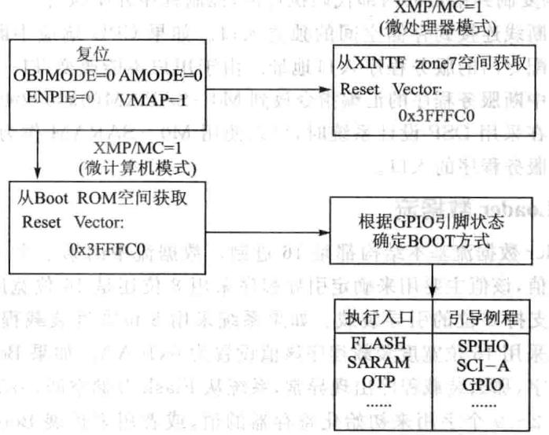

图15.3 处理器复位操作及模式选择

处理器具体引导流程如图15.4所示。

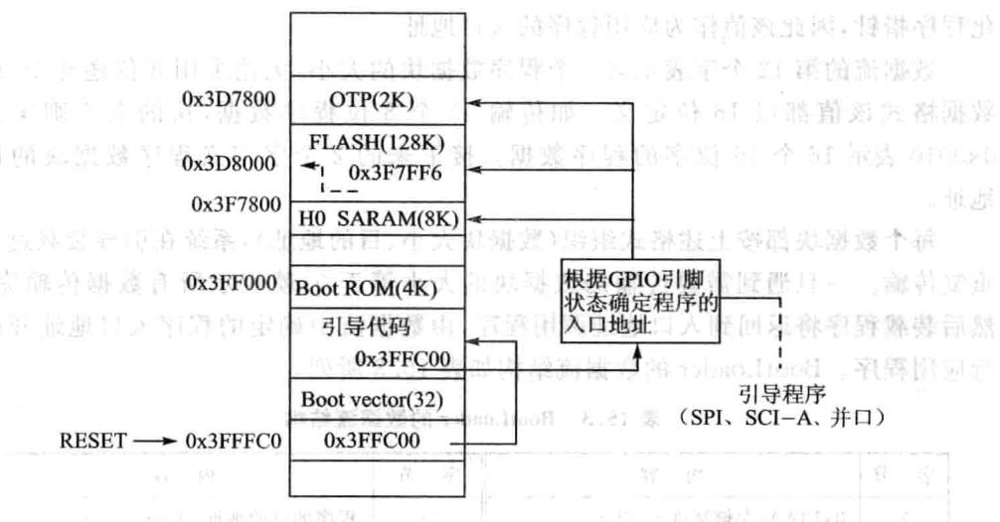

图15.4处理器引导过程

①系统复位后总是跳到地址Ox3FFFCO处，此处为DSP内部的BOOT-ROM。

②BOOT-ROM执跳转指令跳转到0x3FFC00（引导代码），该段代码主要完成基本的初始化任务和boot模式的选择。

③仍然执代码，根据GPIO的引脚状态确定执程序的入口。

④如果选择了SCI、SPI或者端B其中种引导模式，引导代码将同相应的接口建立标准的通信连接。

⑤将代码复制到指定的内部代码执区，控制程序开始执。

每一个中断线连接到存储空间的独立入口。如果CPU响应中断，处理器内核将会为中断分配专门的服务程序人口地址。由于用户不能改变TI-ROM的内容，必须将跳转到中断服务程序的汇编指令放到M0-SARAM（0x000040~0x00007F）固定的位置。在采DSP设计系统时，可以使用MO-SARAM作为中断向量表重新定位各中断服务程序的口。

## 3.BootLoader数据流

BootLoader数据流基本结构都是16进制。数据流中的第一个16位字作为引导程序的关键值，该值主要用来确定引导程序采用8位还是16位宽度的数据，对于SPI引导只能持8位的引导装载。如果系统采8位宽度装载程序该值设置为0x08AA，如果采用16位宽度装载程序该值设置为0x10AA。如果BootLoader接收到效的关键字，那么装载程序出现异常，系统从Flash存储空间（0x337FF6)执。

接下来第2～9个字用来初始化寄存器的值，或者用来扩展BootLoader操作。如果不使用这些值则作为保留字，引导程序读到这些字后直接将其丢弃，目前只有在使SPI模式、I²C、并XINTF引导时才会使用这些字初始化寄存器。

第10～11个字构成22位地址，在引导程序加载程序完成后使该值初始化程序指针，因此该值作为应用程序的入口地址。

数据流的第12个字表示第个程序数据块的，论采8位还是16位的数据格式该值都以16位定义。如传输32个8位程序数据，块的则定义为0x0010表16个16位字的程序数据。接下来的2个字定义程序数据块的的地址。

每个数据块都按上述格式组织（数据块大小、目的地址），系统在引导装载过程中重复传输。一旦遇到需要传输的数据块的大小等于0，就表示所有数据传输完毕。然后装载程序将返回到入口地址调用程序，由数据流中确定的程序入口地址开始执行应用程序。BootLoader的数据流结构如表15.3所列。

|字节|内容|字节|内容|
|---|---|---|---|
|1|0x10AA：存储宽度=16bit|14|程序的目的地址：Addr[15~0]|
|2~9|保留|15|程序的第一个字|
|M10|人口地址PC[22～16]||….|
|11|入口地址PC[15~0]|N|程序的最后一个字|
|12|程序数据块大小（字）；如果等于0，传输结束|N+1|程序数据块大小（Word）|
|N+2|程序的目的地址：Addr[31~16]|||
|13|程序的目的地址：Addr[31~16]|N+3|程序的目的地址：Addr[15～0]|

表15.3 BootLoader的数据流结构

下面是一个引导数据流的实例，装载2个数据块到C28xx不同的地址空间。第一个数据块的5个字（1、2、3、4、5)装载到地址0x3F9010，第二个数据块的2个字装载到地址0x3F8000。

|10AA|;16位数据宽度 ;8位预留字|
|---|---|
|0000 0000||
|0000||
|0000||
|0000||
|0000||
|0000||
|0000||
|003F|;PC 装载完成后程序的起始地址为0x3F8000|
|8000||
|0005|；数据块1中包含5个字|
|003F|；第一个数据块装载到地址0x3F9010|
|9010|；第一个数据字|
|0001||
|0002||
|0003||
|0004||
|0005|；随后一个数据字|
|0002|;第二个程序数据块包含2个字|
|003F|；第二个数据块装载到0x3F8000|
|8000||
|7700|;第一个数据字|
|7625|;最后一个数据字|
|0000|；下一个数据块的长度为0，则传输结束|
||在加载完成后，以下的存储器值将会进行如表15.4所列的初始化。程序指针|
|xF8000处开始执。||

## 4.BootLoader传输流程

处理器的Bootloader传输流程在处理器退出复位并根据GPIO状态确定了引导模式后执行，如图15.5所示。

|地址|值|地址|值|
|---|---|---|---|
|0x3F9010|0x0001|0x3F9014|0x0005|
|0x3F9011|0x0002|0x3F8000|0x7700|
|0x3F9012|0x0003|0x3F8001|0x7625|
|0x3F9013|0x0004|||

表15.4加载过程中初始化的存储器的值

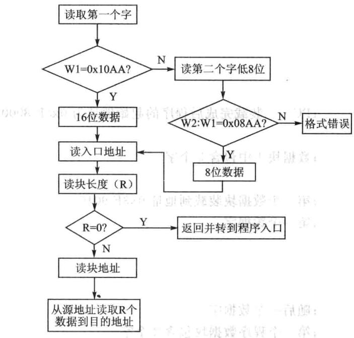

图15.5处理器的引导装载过程

引导程序读取第个16位值，与0x10AA比较，如果不相等则会读取第个值并和第个共同组成个16位字，然后再同0x08AA比较。如果引导程序发现该特征值同8位或16位的特征值不相符，或者同指定的引导模式不相符，将会动退出引导程序。在这种情况下，系统会从内部FLASH存储器执程序。

## 5.初始引导汇编函数InitBoot

系统复位完成以后，先调用Boot-ROM中的第一个汇编初始引导程序（Init-Boot），流程如图15.6所。该程序先初始化C28xx器件作在标模式，然后读取安全保护模块的密码，如果CSM密码被擦除（全部等于OxFFFF)则动解锁，否则CSM仍被锁定。

对CSM密码读取完成后，初始化例程调模式选择功能函数(SelectBootMode)，该函数根据GPIO引脚的状态确定处理器引导式，旦完成SelectBootMode将会把地址返回给初始化引导函数(InitBoot)。然后初始化引导函数调恢复CPU寄存器的退出例程（ExitBoot)并退出到由引导模式确定的程序口地址。

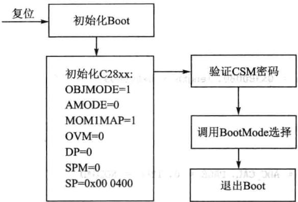

图15.6初始化引导函数功能框图

## 6.模式选择函数

通过将所要选择的引导模式相对应的GPIO引脚拉高或拉低，引导模式被确定。需要注意的是选择引脚的状态不是在复位时被锁定，而是在SelectBootMode函数执行后的几个周期才被锁定。模式选择引脚复位时，内部电阻上拉功能被使能。

SelectBootMode检查PLLSTS寄存器中的丢失时钟检测位（MCLKSTS），以决定PLL是否在limp模式下进操作。如果PLL在limp模式下操作，引导模式选择功能则根据所选的引导模式进行适当的操作。

## 7.ADC_cal汇编程序

ADC_cal程序被固化在TI预留的OTP存储器内，BOOTROM可自动地调用ADC_cal程序，用特定的校准数据初始化ADCREFSEL和ADCOFFTRIM寄存器。正常情况下，这一过程不需要设置而自动地执行。如果在开发过程中，BOOTROM被CCS忽略，那么这两个寄存器需要通过应程序来初始化。

注意：若初始化这两个寄存器失败，将会引起ADC功能不确定。应用程序中调用该程序的步骤如下： 录银采发弹100

①添加ADC_cal汇编函数到工程项目中。源函数由头文件与外设样例组成。如下所示：

②添加.adc_cal段到连接命令文件。如下所示。

③在使用ADC之前调用ADC_cal函数，在进这个调用之前先使能ADC时钟。如下所示：

## 8. CopyData函数

Bootloader中CopyData函数从指定端口复制数据到SARAM中。CopyData函数用个指针指向GetWordData函数。GetWordData函数通过加载器初始化为从端口读取数据。例如当SPI加载器被激活后，GetWordData函数指针被初始化为指向SPI特定的SPI_GetWordData函数，因此CopyData函数执时可以访问到正确的端口。

## 9.SCI引I导装载

SCIboot模式采异步式从SCI-A端将代码引导到F2833x处理器，采这种式持8位数据模式。可以通过串将上位机（如其他处理器构成的系统或PC主机)同F28335处理器连接，实现程序的加载，如图15.7所示。

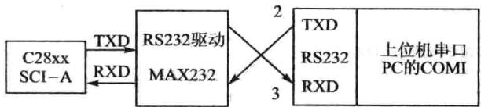

图15.7 SCI-A引导硬件连接关系

F28335通过SCI-A外设同上位机进行通信，其波特率自动检测功能可以用来锁定上位机的通信速率，因此用户可以采用多种波特率实现主机与DSP之间的通信。每次数据传输，DSP都会返回一个从主机接收到的8位字符，通过这种方式，主机可以检验DSP接收到的字符。在高速率通信模式下，校验输入数据位可能会影响接收器与连接器的性能，但是在低速通信时会建立良好的通信连接。SCI-A的引导流程如图15.8所示。

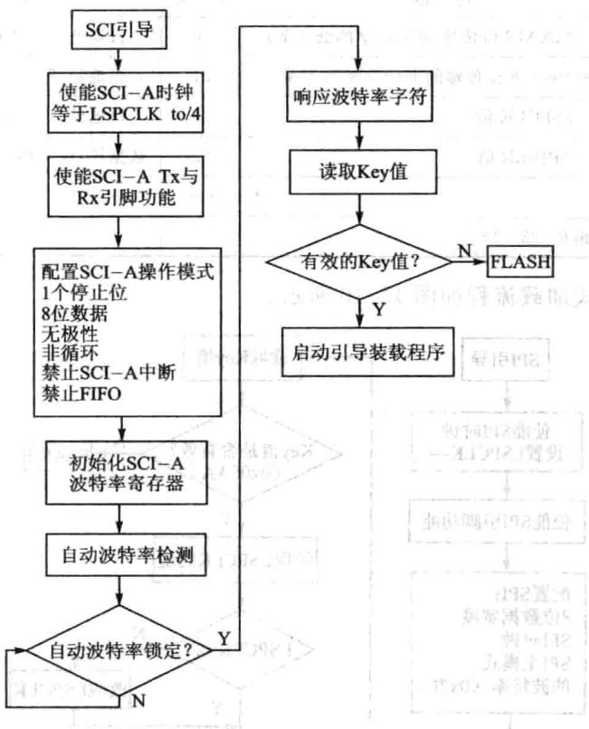

图15.8SCI-A引导流程图

## 10.SPI引I导模式

采用SPI引导模式要求外部扩展8位宽度兼容的EEPROM存储器，不持16位数据引导方式，具体硬件连接方式如图15.9所示。 0000

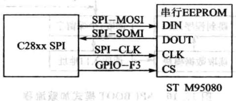

图15.9 SPI引导硬件连接图

SPIBootROM装载程序初始化SPI模块以便能够同SPIEEPROM接口，例如可以选用M95080（1K×8）、X25320（4K×8）和X25256（32KX8）等芯片固化程序。在初始化过程中主要完成SPI配置：FIFO使能、8位数据、内部SPICLK主模式、时钟相位等于0、极性等于0以及最低的通信速率。EEPROM内的数据存放如表15.5所列。

|字节|内容|字节|内容|
|---|---|---|---|
|1|LSB=0xAA(8位传输的Key字的低字节)|20|入口地址[31～24]|
|2|MSB=0x08（8位传输的Key字的高字节）|21|入口地址[7~0]|
|3|LSB=LSPCLK值|22|人口地址[15～8]|
|4|HSB=SPIBRR值|23|数据块：块大小、目的地址、数据|
|5~18|保留|…|…|
|19|人口地址[23～16]|||

表15.5EEPROM内数据存放表

BOOT模式加载流程如图15.10所示。

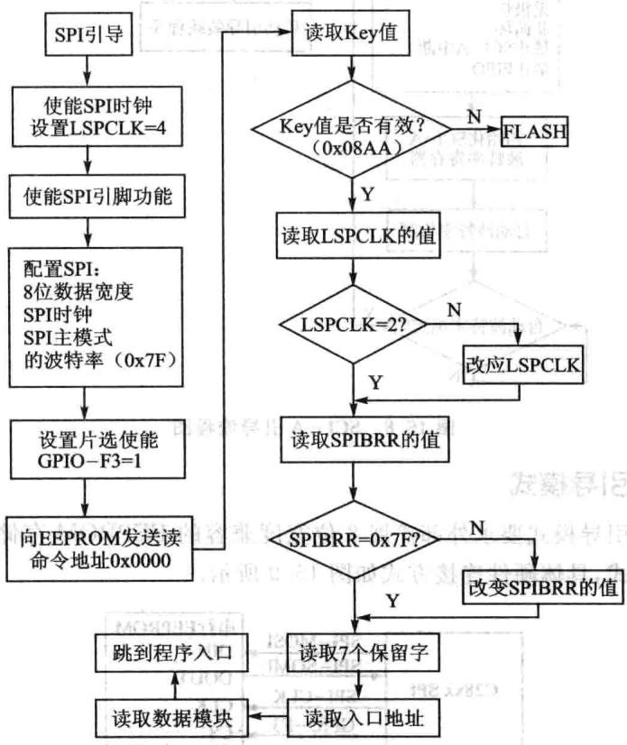

图15.10 SPIBOOT模式加载流程

采SPI引导整个数据传输都采用字节模式，具体操作如下：

①SPI-A端口初始化。

②GPIOF3引脚作为SPIEEPROM的选信号。

③ SPI-A输出读命令到串SPIEEPROM存储器。

④SPI-A向EEPROM的Ox0000地址发送命令，因此要求EEPROM的起始地址0x0000必须有可下载的空间。

⑤紧接的地址空间数据必须满足8位数据流的控制字（0x08AA），先读取高字节再读取低字节组成整个数据，所有SPI的数据传输都如此。如果Key的值不满足要求，则系统会从内部FLASH（0x3F7FF6）执应用程序。

⑥接下来的2个字节可以改变低速外设时钟寄存器(LOSPCP)和SPI波特率设置寄存器(SPIBRR)的值，后面的7个字节作为保留字，SPI引导装载程序读取其内容后直接将其丢弃。

⑦下面2个字组成32位的口地址，引导装载过程完成后该地址作为应用程序的口地址，应用程序从该地址开始执行。

⑧多块代码和数据通过SPI端口从外部SPIEEPROM复制到内部存储器，每块代码和数据都是按前面描述的结构组织。在数据传输过程中若遇到代码和数据块长度为0，则传输结束退出引导程序，系统将从特定的地址执应用程序。

其余的引导模式与以上两种引导模式相近，详情参照TI提供的数据册。

### 15.3 FLASH引导及应用

28x系列DSP上都有FLASH存储器和一次性可编程存储器OTP。OTP能够存放程序或数据，只能编程一次且不能擦除。在F2833xDSP上，包含128KX16位的FLASH存储器，FLASH存储器被分成4个8K×16位单元和6个16KX16位的单元，用户可以单独地擦除、编程和验证每个单元，而不会影响其他FLASH单元。F2833x处理器采专存储器流线操作，保证FLASH存储器能够获得良好的性能。FLASH/OTP存储器可以映射到程序存储空间存放执行的程序，也可以映射到数据空间存储数据信息。

## 1.FLASH存储器特点

2833x的FLASH主要有以下特点：

整个存储器分成多段。

代码安全保护。

》低功耗模式。

》可根据CPU频率调整等待周期。

》FLASH流线模式能够提线性代码的执效率。

## 2.FLASH存储器寻址空间分配

F28335的内部FLASH存储器单元的寻址空间地址分配情况如图15.11所示，在使用FLASH的过程中需要掌握FLASH内部扇区的地址分配情况，以便使用FLASH插件或API函数对整个扇区进操作。

|程序段|程序段起始地址|程序段长度|
|---|---|---|
|FLASHA|origin 0x300000|length = 0x008000|
|FLASHB FLASHC|origin =0x308000 origin =0x310000|length= 0x008000 length =0x008000|
|FLASHD|origin =0x318000|length =0x008000|
|FLASHE|origin =0x320000|length =0x008000|
|FLASHF|origin =0x328000|length=0x008000|
|FLASHH|origin =0x338000|length =0x007F80|
|保护单元|origin =0x33FF80|length =0x000076|
|跳转FLASH|||
||origin =0x33FFF6|length =0x000002|
|安全密码|origin =0x33FFF8|length =0x000008|

图15.11 F28335内部FLASH存储器单元寻址

## 3.F2833xFLASH启动流程

在程序开发调试阶段，通常将编译链接产生的可执行代码装载到内部RAM中。一旦程序调试完成需要系统作为产品独运，就需要将应用程序固化到易失性存储器中（如ROM、FLASH、EEPROM等）。系统每次上电后能够用特定的引导操作自动运行应用程序。F2833x上电后有16种不同的启动模式，主要通过GPIO84、85、86、87的4个引脚上电复位过程中所处的状态确定选择哪一种方式启动。引脚状态同启动式的关系如表15.2所列。

在调试程序时程序主要在内部SRAM存储器中运，如果希望程序从内部的FLASH运就需要在系统上电过程中改变以上4个引脚的状态。FLASH启动流程如下：

①系统复位后跳转到0x3FFFC0地址，该地址是DSP内部的BOOT-ROM起始地址。

②BOOT-ROM执跳转指令跳到0x3FFC00，引导代码主要完成基本的初始化任务和引导模式的选择。

③如果GPIO84、85、86、87全部是高电平时，PC指针直接跳到0x3FFFF6。但是该段仅有2个字长，因此如果使用FLASH固化并执用户程序，需要在这两个地址处增加跳转到应程序的跳转指令。如果采C语编写户程序，需要跳转到c_int00函数。

④c_intOO函数完成C环境和全局变量的初始化，该段必须放在FLASH内。

⑤在c_int00函数执完毕后，调用用户主程序main。

## 4.FLASH初始化

采用任何处理器设计系统都希望能够最大限度地发挥处理器能力。如果采用F2833x处理器的内部FLASH直接执行程序，则需要配置访问FLASH的等待状态。处理器退出复位时默认访问FLASH增加了16个等待状态，一个150MHz的处理器实际只有150/（16+1）MHz的处理能力，在实际应用中是不允许的。为此，在系统设计时需要根据实际选择的处理器的要求配置FLASH等待状态的数量。根据C28x数据册增加了等待状态但并没有最少数量限制。

150MHz的F28x处理器如果增加了5个访问等待，执单周期指令的实际频率为150/(5+1)=25MHz，即处理器的速度为25MIPS，相对于150MHz显然降低很多，但可以采用流线式访问FLASH，如图15.12所示。每(5+1)个周期访问4条指令，则采用内部FLASH执行程序的速度为100MHz。如果使用FLASH流水线获取程序代码，需要将EMPIPE控制位置1。系统上电，FLASH流水线禁止。

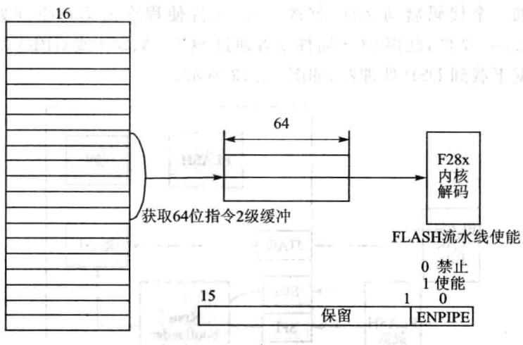

图15.12采用流水线从FLASH中获取指令

## 5.FLASH编程

由于DSP工作在微计算机模式下与工作在微处理器模式下程序的启动地址不同，所以程序的位置需要根据运行模式的不同进调整。在微处理器模式下，将调试好的程序增加个代码启动件，修改.cmd件使程序的运空间处于FLASH段，编译生成.out件，使用CCS插件或者通过SCI-A、SPI或GPIO将FLASH应代码和数据下载到DSP处理器，如图15.13所。

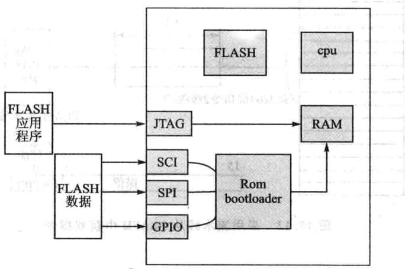

图15.13FLASH程序下载方式

户程序在RAM中调试完毕后，下步就是如何将其转换烧录到FLASH存储器中。先需要在原有调试程序项中增加跳转代码件DSP2833x_Code-StartBranch.asm,在处理器完成引导后跳转到用户应用过程口。然后修改.cmd文件中的代码和数据段的地址映射以及程序的装载起始地址、装载结束地址以及程序运行地址，具体参考以下配置。

## 6.FLASH烧写步骤

步骤1：下载并且安装FLASH插件。

步骤2：运行F28xxFLASH编程工具，如图15.14所示。打开插件后出现如图15.15所示的界面。

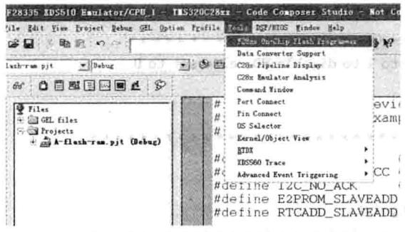

图15.14烧写插件

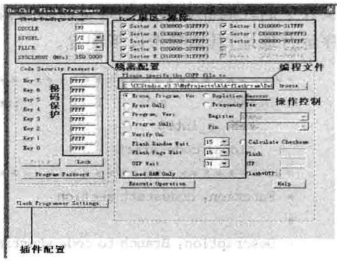

图15.15烧写界面

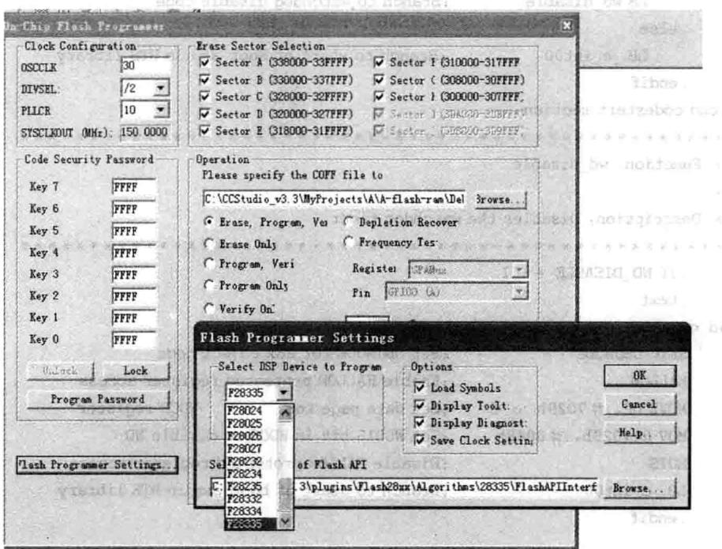

步骤3：选择需要编程的处理器类型，如图15.16所示。图15.16 器件选择界面

## HA.0

步骤4：配置系统时钟，如图15.17所示。

步骤5：测试时钟。

步骤6：选择操作，烧写程序，如图15.18所示。

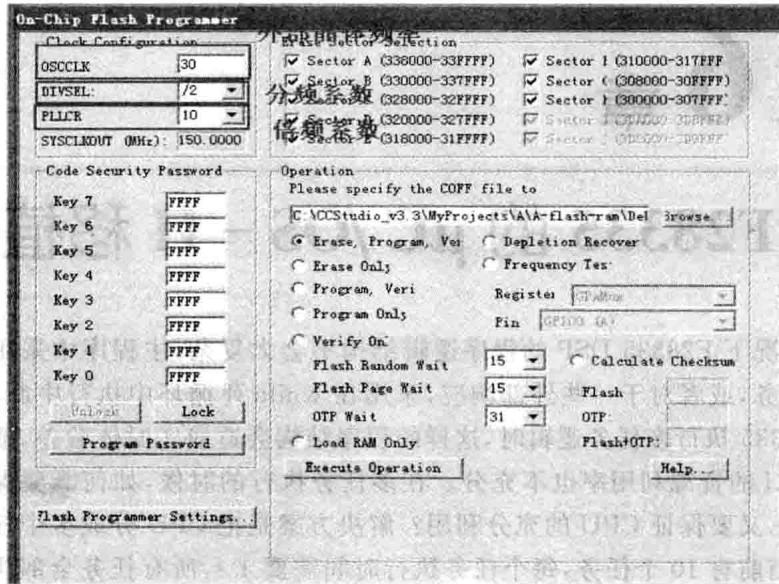

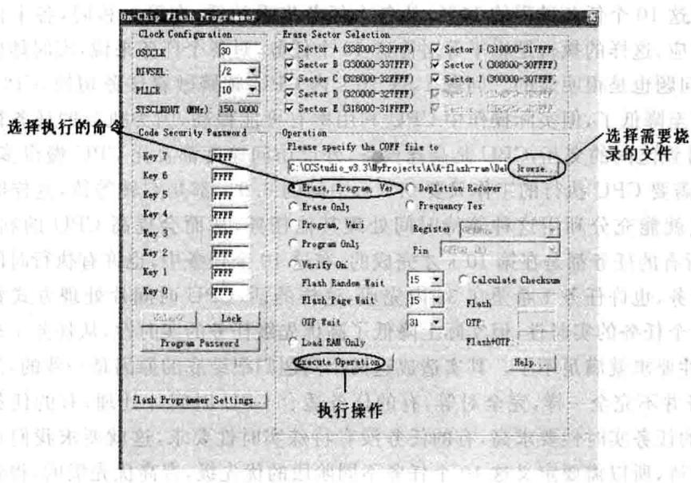

图15.17 系统时钟配置界面图15.18向FLASH中烧写程序
