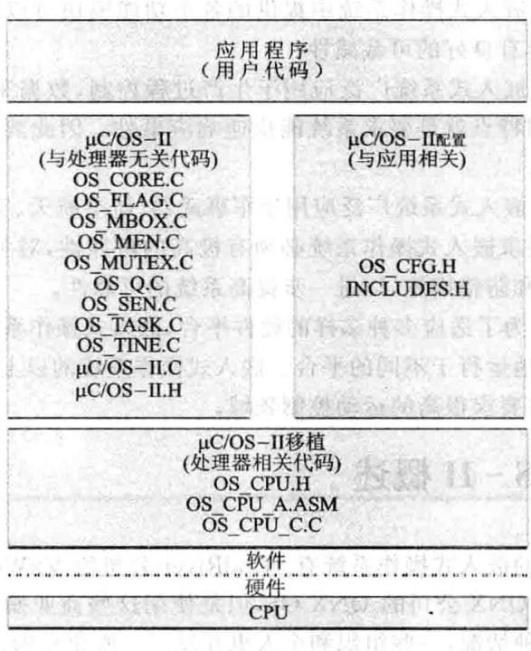
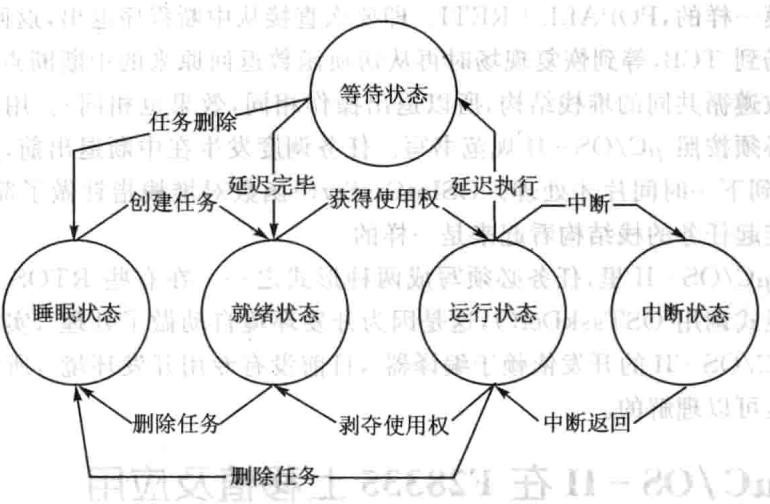
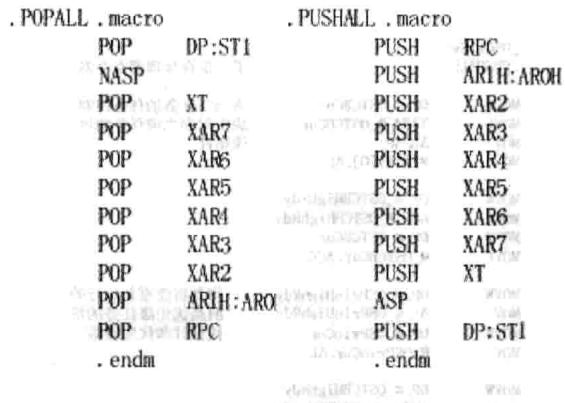
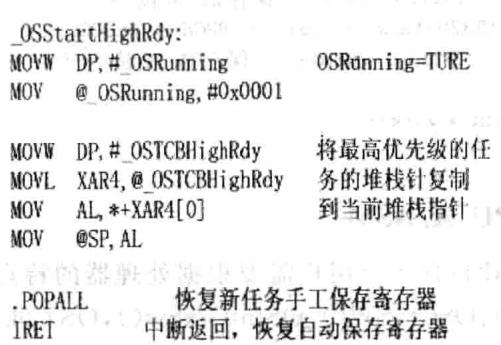
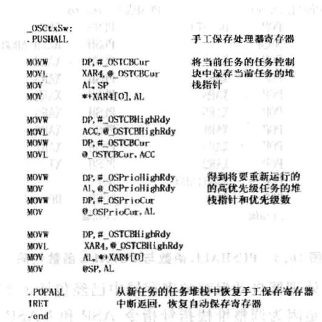
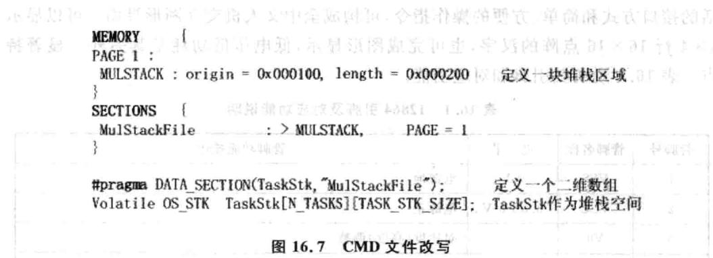
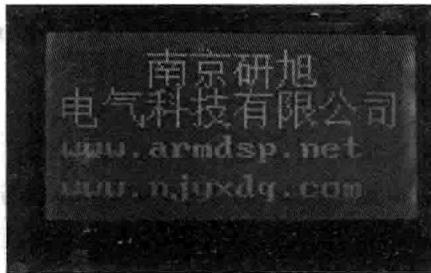

# 第 16 章

## 基于F28335的μC/OS-II移植

一般情况下F28335DSP的程序逻辑结构不会太复杂，主程序中采用顺序执逐一完成任务，或者对于一些外部响应，采用在while死循环中执行中断服务程序，可是若F28335执行多任务逻辑时，这样的程序结构会造成实时体验差，或中断丢失等问题，CPU的资源利用率也不充分。在多任务执的时候，如何既要保证任务处理的实时性，又要保证CPU的充分利？解决案是把CPU分成多个任务时间处理，假设当前有10个任务，每个任务执时间需要1s，所有任务全部执完需要10s，顺序执的话，任务1～任务10，顺序排队，任务10在前9s内都得不到任何响应，从任务10的角度来看，实时体验很差，CPU时间分处理时，在第一秒的时候就分别处理这10个任务进程的10%，从各个任务来看的话，在第一秒时，各个任务都得到了响应，这样的执行逻辑平等对待这10个任务，对各个任务来说，实时体验有所改善，但问题也是很明显的。问题1，这10s内CPU频繁做着任务切换，CPU资源利用率甚至降低了，但实际操作中CPU利用率有可能提高，因为执行的任务很多是CPU与外设之间的交互,CPU是高速设备，外设访问速度都要比CPU慢得多，任务1很可能需要CPU执行的工作只要0.1s，中间的0.9s都是空转等待，这样时间片处理式就能充分利用这种等待时间处理其他任务，从而会提CPU的利率。问题2，所有的任务都是在第10s才完成的，在这10个任务中，也许有执时间严苛格要求的任务，也许任务1希望在3s内完成，这样的话，CPU时间片处理方式看上去提高了各个任务的实时性，但实际上降低了高优先级任务的实时性，从任务1来看的话，实时性要求就满足不了。其实造成这两个问题归根结底的原因是一致的，处理的10个任务并不完全一样，完全对等，有的任务适合CPU时间处理，有的任务并不适合，有的任务实时性要求高，有的任务没有特殊实时性要求，这就要求我们对任务要区分对待，所以需要定义这10个任务不同阶段的优先级，有高优先级的，得到优先执行。在把CPU划分时间的时候，实际上在对CPU资源进行管理，在区分对待10个任务，判断10个任务的优先级别的时候，实际上在对任务进行管理，这种管理在多任务的时候就不简单了，这时候就需要借助于一个实时操作系统（RTOS)来帮助我们完成这些事，uCos就是这样一个操作系统，不仅能帮你完成任务的时间片处理，任务的管理，还能帮你处理各种超时，进行内存管理，完成任务间的通信等，有了它，程序的层次会更加清晰，给系统添加功能也更方便。当然你完全可以自己来设计处理以上的逻辑，如果是这样的话，实际上你已经定制了个适合你的RTOS。

### 16.1 嵌入式实时操作系统的基本概念

操作系统(OperatingSystem,OS)是一种软件系统。它在计算机硬件与计算机应用程序之间，通过提供应用程序接口（ApplicationProgrammingInterface，API），屏蔽了计算机硬件工作的一些细节，从而使应用程序的设计人员得以在一个友好的平台上进应用程序的设计和开发上进行应用程序的设计和开发，大大提高了应用程序的开发效率。

运在嵌式硬件平台上，对整个系统及其所操作的部件、装置等资源进行统一协调、指挥和控制的系统软件就叫做嵌式操作系统。由于嵌式操作系统的硬件特点、应用环境的多样性和开发阶段的特殊性。使它与普通的操作系统有着很大的不同。其主要特点如下：

①系统资源占用小。嵌式系统芯内部存储器的容量一般不会很大（1MB以内)，因此不允许嵌式操作系统占用较多的资源函判则窗帮增

②可裁剪性。嵌式操作系统中提供的各个功能模块可以让用户根据需要选择使用，即要求它具有良好的可裁减性。

③实时性好。嵌式系统广泛应用于生产过程控制、数据采集、传输通信等场合，这些应用的共同特点就是要求系统能快速响应事件。因此要求嵌式操作系统要有较强的实时性。

④高可靠性。嵌入式系统广泛应用于军事武器、航空航天、交通运输、重要的生产设备领域，所以要求嵌式操作系统必须有极高的可靠性，对关键、要害的应用还要提供必要的容错和防错措施，以进一步提高系统的可靠性。

⑤易移植性。为了适应多种多样的硬件平台，嵌式操作系统应可在不做量修改的情况下稳定地运于不同的平台。嵌式操作系统的以上特点常适合应于对实时性、可靠性要求很高的运动控制领域。

### 16.2 μC/OS-I概述

目前比较常见的嵌式操作系统有WindRiver公司的VxWorks、pSOS，微软公司的WindowsCE，QNX公司的QNXOS，但是使用这些商业操作系统是需要高昂的费用的。面对这种情况，一些组织和个也开发了一些免费的、源码开放的操作系统。在互联网发布，比较有名的是 和 。

由Micrium公司提供，是一个可移植、可固化的、可裁剪的、占先式多任务实时内核，它适用于多种微处理器，微控制器和数字处理芯（已经移植到超过100种以上的微处理器应用中）。同时，该系统源代码开放、整洁、一致，注释详尽，适

合系统开发。

的前身是 ，最早出自于1992年美国嵌式系统专家JeanJ.Labrosse在《嵌入式系统编程》杂志的5月和6月刊上刊登的文章连载，并把 的源码发布在该杂志的BBS上。

和 是专门为计算机的嵌入式应用设计的，绝大部分代码是用C语言编写的。CPU硬件相关部分是用汇编语言编写的、总量约200行的汇编语言部分被压缩到最低限度，为的是便于移植到任何一种其他的CPU上。用户只要有标准的ANSI的C交叉编译器，有汇编器、连接器等软件工具，就可以将 嵌入到开发的产品中。 具有执行效率高、占用空间小、实时性能优良和可扩展性强等特点，最小内核可编译至2KB。 已经移植到了几乎所有知名的 。严苛格地说 只是一个实时操作系统内核，它仅仅包含了任务调度、任务管理、时间管理、内存管理和任务间的通信和同步等基本功能。没有提供输输出管理、件系统、网络等额外的服务。但由于 良好的可扩展性和源码开放，这些非必须的功能完全可以由用户自已根据需要分别实现。 II的结构以及与硬件的关系如图16.1所示。

图16.1μC/OS-II的硬件/软件体系结构

是一个抢先式实时多任务操作系统，不支持时间片轮转调度，其内核包括任务管理、时间管理、内部通信管理和内存管理4大部分。 可以管理多达64个任务，其中4个最优先级和最低优先级的任务保留给系统，用户可使用的有54个。系统把任务的优先级数作为任务的标识符，优先级值越小，优先级越高。每个任务都是无限的循环，系统内核会根据任务的优先级和通信标志位的情况安排其处于以下5种状态之一：

①睡眠状态：任务只是以代码的形式驻留在程序空间（ROM或RAM），还没有交给操作系统管理时的情况叫做睡眠状态。

②就绪状态：如果系统为任务配备了任务控制块且在任务就绪表中进了就绪登记，则任务进人了就绪状态。 会2

③运状态：处于就绪状态的任务如果经调度器判断获得了CPU的使用权，则任务就进入运行状态。

④等待状态：正在运行的任务，需要等待一段时间或需要等待一个事件发生再运行时，该任务就会把CPU的使用权让给其他任务而进人等待状态。入。对1

⑤中断状态：一个正在运行的任务一旦响应中断申请就会中止运行而去执行中断服务程序，这时该任务就进入了中断状态。

在系统的管理下，一个任务可以在5种不同的状态之间发生转换，这些转换是分别通过系统内部提供的同步通信机制（信号量、消息信箱、消息队列）、中断、延时等实现的。转换关系如图16.2所示。 是一个可剥夺型内核，工作时总是让就绪态的高优先级的任务先运行。内核的作者JeanJ.Labrosse通过精心设计任务间、任务与中断间调度函数，使任务级系统响应时间得到了最优化，且是可预知的，这对实时系统很重要。

图16.2μC/OS-II的任务状态极其转换

工作核心原理是：近似地让最高优先级的就绪任务处于运行状态。操作系统将在下面情况中进行任务调度：调用API函数（用户主动调用），中断（系统占用的时间片中断OsTimeTick（），用户使用的中断）。

①在调用API函数时，有可能引起阻塞，如果系统API函数察觉到运条件不满足，需要切换就调用OSSched（）调度函数，这个过程是系统自动完成的，用户没有参与。OSSched（)判断是否切换，如果需要切换，则此函数调用OS_TASK_SW（）。这个函数模拟一次中断，好象程序被中断打断了，其实是OS故意制造的假象，目的是为了任务切换。既然是中断，那么返回地址（即紧邻OS_TASK_SW（）的下一条汇编指令的PC地址）就被自动压入堆栈，接着在中断程序里保存CPU寄存器(PUSHALL)…。堆栈结构不是任意的，而是严苛格按照 规范处理的。OS每次切换都会保存和恢复全部现场信息（POPALL），然后RETI回到任务断点继续执行。这个断点就是OSSched()函数里的紧邻OS_TASK_SW（)的下一条汇编指令的PC地址。切换的整个过程就是，户任务程序调用系统API函数，API调用OSSched（），OSSched（)调用软中断OS_TASK_SW（）即OSCtxSw，返回地址（PC值）压栈，进人OSCtxSw中断处理子程序内部。反之，切换程序调用RETI返回紧邻OS_TASK_SW()的下一条汇编指令的PC地址，进而返回OSSched()下一句，再返回API下一句，即用户程序断点。因此，如果任务从运行到就绪再到运行，它是从调度前的断点处运行。基

②中断会引发条件变化，在退出前必须进行任务调度。 要求中断的堆栈结构符合规范，以便正确协调中断退出和任务切换。前面已经说到任务切换实际是模拟一次中断事件，而在真正的中断里省去了模拟。只要规定中断堆栈结构和模拟的堆栈结构一样，就能保证在中断里进行正确切换。任务切换发生在中断退出前，此时还没有返回中断断点。仔细观察中断程序和切换程序最后两句，它们是一模一样的，POPALL十RETI。即要么直接从中断程序退出，返回断点；要么先保存现场到TCB，等到恢复现场时再从切换函数返回原来的中断断点（由于中断和切换函数遵循共同的堆栈结构，所以退出操作相同，效果也相同)。户编写的中断子程序必须按照 规范书写。任务调度发在中断退出前，是非常及时的，不会等到下一时间才处理。OSIntCtxSw（)函数对堆栈指针做了简单调整，以保证所有挂起任务的栈结构看起来是样的。

③在 里，任务必须写成两种形式之一。在有些RTOS开发环境没有要求显式调用OSTaskDel（，这是因为开发环境自动做了处理，实际原理都是一样的。 的开发依赖于编译器，目前没有专用开发环境，所以出现这些不便之处是可以理解的。

### 16.3 μC/OS-II在F28335上移植及应用

## 

在设计时，充分考虑到可移植性，大部分代码是用C语言编写的，可以直接移植，只有与处理器相关的代码需要根据处理器的特点重新编写。

另外，要使 正常运行，处理器必须符合以下要求：

①处理器的C编译器能产生可重人型代码。

②处理器支持中断，并且能产生定时中断（通常为10～100Hz）。

③用C语言就可以开关中断。

④处理器能持一定数量的数据存储硬件堆栈（可能是几千字节）。

⑤处理器有将堆栈指针以及其他CPU存储器的内容读出并存储到堆栈或内存中去的指令。

F28335和其编译器符合移植的要求，移植的作主要集中在与处理器相关的4个文件的编写上：分别是OS_CPU.H，OS_CPU.C，OS_CPU_AASM,OS_CFG.H和处理器本身的CMD文件。

## 1.改写文件OS_CPU.H

OS_CPU.H包括了内核定义的、与处理器相关的常数、宏以及类型。

①数据类型的定义由于不同的编译器对int、char、long等数据类型位数的定义是不同的，为确保可移植性， 定义了一系列自已的数据类型，这一部分在移植时要根据编译器的特点进行改写。具体如下由恒建弃息，

②与所有实时内核一样， 在访问临界代码时要先开中断，访问后关中断。

而通常每个处理器都会提供定的汇编指令来开/关中断，针对28335的汇编语言，具体如下：

③ 从低优先级任务切换到高优先级任务时需要模拟次中断，在这使TRAP指令来产中断向量表中的第31个中断USER11，然后在系统初始化时定义PieVectTable.USER11=&.OSCtxSw；使USER11中断的人口函数为任务切换函数OSCtxSw（），从而实现模拟中断，再进行任务切换。具体如下：

④F28335没有硬件堆栈，所以要在数据区存储器中开辟堆栈空间，堆栈的增长方向是自上向下，这就要进行两步的工作，一是开辟堆栈空间，这一步在编写CMD文件时会说明，是定义堆栈增长方向。具体如下：卡计宣器金

## 2.改写文件OS_CPU.C

OS_CPU.C.C包含10个C函数，其中9个函数是在应用系统时根据不同的需要添加内容的，移植唯一必要改写的函数是OSTaskStkInit(），它的作用是初始化任务的栈结构。F28335在响应中断时，硬件会按 ST1顺序自动保存相应寄存器的内容，其他的寄存器（RPC、AR1、AR0、XAR2、XAR3、XAR4、XAR5、XAR6、XAR7、XT)需要手工保存，所以在堆栈结构时也是按照上面的顺序（STO、T、AL·…RPC、AR1、ARO….DP、ST1)初始化，可以看出，DP和ST1寄存器重复保存了，后面会说明其中的原因。（其中ST1、IER、DBGSTAT初始值是要根据 使用哪个系统时钟（TIM0、1、2）和以后应用的需要而确定的）。8

在文件OS_CPU.C中主要改写任务堆栈初始化函数，如下所示。

图16.3 PUSHALL函数与POPALL函数代码

这特别要说明，处理器自动保存的寄存器中已经包括了ST1和DP，重复将它们压/弹出堆栈是因为调整堆栈指针指令ASP和NASP会根据ST1寄存器的内容起作用，所以出栈时要先恢复ST1的内容再执NASP指令。

①OSStartHighRdy（)函数的功能是使就绪态任务中优先级最的任务开始运行。 通过调OSStart（)函数把处于就绪态的最优先级的值赋给参数OSPridHighRdy，并让指针OSTCBHighRdy和OSTCBCur指向就绪任务中优先级最高的任务控制块，然后再通过调用OSStartHighRdy()恢复高优先级任务，具体如图16.4所示。

图16.4OSStartHighRdy(）函数

②OSCtxSW()是实现任务级的任务切换函数。 实现任务之间的切换是通过执TRAP指令产生中断，再从中断向量表中找到OSCtxSW（）。具体如图16.5所示。

图16.5OSCtxSW()函数

③ OSIntCtxSw（）是中断级的任务切换函数，它的大部分代码与SCtxSW（）相同，只是前者是在中断过程中执行的，处理器寄存器已经被正确地保存，所以不再需要保存相应的寄存器，也就是不需要调用PUSHALL()函数。

④OSTickISR()是 用于提供周期性时钟源的函数，主要实现时间的延迟和超时功能。这根据28335的特点，系统定时器TIM0作为时钟源，通过初试化TIM0产每秒钟10～100次的中断，中断口指向OSTickISR（），从而产生 的时钟节拍。OSTickISR()的代码如图16.6所示。

图16.6OSTickISR()函数

## 4.改写OS_CFG.H

OS_CFG.H文件包含了 所有条件编译的条件标识符，通过对 CFG.H各个标识符的定义，就可以决定系统功能模块是否参加编译，是否包含到内核中去。通过对这个件的修改实际上就实现了对 的剪裁。.

## 5.CMD的编写

CMD件是TI公司在设计DSP时为了便户来管理、分配处理器所有物理存储器和地址空间的文件。 的每个任务都需要自己的堆栈空间，用于切换任务时保存当前任务的运状态，便以后重新恢复任务。所以要在CMD件中定义相应的堆栈区域，再通过#pragma语句定义一个存储在该区域的二维数组作为任务的堆栈空间，具体如图16.7所示。

### 16.4 手把手教你实现 在F28335上的应用

## 1.实验目的

①掌握 的移植应用。

②了解液晶12864的作原理。

③了解F28335怎样通过总线控制LCD。

## 2.实验步骤

①先LCD12864通过扁平线连接到LCD接口。

②将板子通过仿真器与计算机成功连接。

③将DSP_UCOS_run_in_flash_nonBIOS目录复制到 CCS开发环境中的myproject目录下。

④在CCS中选择 project→Open菜单项，加载 LCD目录中的DSPUCOS. pjt。

⑤编译链接后，按照第15章介绍FLASH烧写的步骤，将编写好的程序烧写到DSP上。可以直接将DSP_UCOS.OUT烧写到DSP中

⑥断开电源后，再重新上电就会出现下面的效果，如图16.8所示。面

图16.8LCD12864显示

## 3.实验原理

12864C-1是一种具有4位/8位并行、2线或3线串行的多种接口方式，内部含有国标一级、二级简体中文字库的点阵图形液晶显示模块；其显示分辨率为128×64,内置8192个16×16点汉字，和128个16×8点ASCII字符集。利用该模块灵活的接口方式和简单、方便的操作指令，可构成全中文人机交互图形界面。可以显示8×416×16点阵的汉字，也可完成图形显，低电压低功耗是其另外显著特点。表16.1说明其引脚和对应功能。 001000

|管脚号|管脚名称|电平|管脚功能描述|
|---|---|---|---|
|1|VSS|0V|电源地|
|2|vcc|3.0+5V|电源正|
|3|V0||对比度（亮度）调整|
|4|RS(CS)|$\scriptstyle { \mathrm { H } } / { \mathrm { L } }$|${ \mathrm { R S } } { = } ^ { \omega } { \mathrm { H } } ^ { \prime \prime }$ ，表示DB7~DB0为显示数据 ${ \mathrm { R S } } = { } ^ {  } { \mathrm { L } } { } ^ { \prime \prime }$ ，表示DB7～DB0为显示指令数据|
|5|R/W(SID)|$\mathrm { H } / \mathrm { L }$|$\mathrm { R / W } { = } ^ { 4 } \mathrm { H } ^ { \prime \prime } , \mathrm { E } { = } ^ { \ast } \mathrm { H } ^ { \prime \prime }$ ，数据被读到DB7~DBOR/W=“L”,E=“H→L”，DB7~DBO的数据被写到IR或DR|
|6|E(SCLK)|$\mathrm { H } / \mathrm { L }$|使能信号                                 金宾|
|7|DB0|H/L|三态数据线|
|8|DB1|H/L|三态数据线|

表16.112864引脚及对应功能说明

续表16.1

|管脚号|管脚名称|电平|管脚功能描述|
|---|---|---|---|
|9|DB2|H/L|三态数据线|
|10|DB3|H/L|三态数据线|
|11|DB4|H/L|三态数据线|
|12|DB5|H/L|三态数据线|
|13|DB6|H/L|三态数据线|
|14|DB7|H/L|三态数据线|
|15|PSB|H/L|H：8位或4位并口方式，L：串口方式（见注释1）|
|16|NC||空脚|
|17|/RESET|H/L|复位端，低电平有效（见注释2）|
|18|VOUT||LCD驱动电压输出端|
|19|A|VDD|背光源正端(十5V)(见注释3)|
|20|K|VSS|背光源负端（见注释3）|

由上表可以看出，12864工作模式的配置主要是由RS、R/W和E这3个信号来决定的。12864工作模式的配置如表16.2所列。

|RS|R/W|功能说明|
|---|---|---|
|L|L|MPU写指令到指令暂存器（IR)|
|$_ \mathrm { L }$|H|读出忙标志（BF）及地址记数器（AC）的状态|
|H|L|MPU写入数据到数据暂存器（DR)|
|H|H|MPU从数据暂存器（DR）中读出数据|

表16.2RS,R/W的配合选择决定控制界面的4种模式

|E状态|执行动作|结果|
|---|---|---|
|高→低|I/O缓冲→DR|配合/W进写数据或指令|
|高|DR→I/O缓冲|配合R进读数据或指令|
|低/低→高|无动作||

表16.3E信号

由表16.13可知，可以采DSP的3个GPIO来控制这3个信号。除此之外用户还需要注意的是DSP控制LCD的时钟一定要选择合适，否则LCD的配置由于时钟太不能反应，在此实验中把DSP的系统时钟设置为2MHz。

基于 多任务调度系统的基本思想是通过将标系统所要完成的所有任务根据相互关系间的紧密程度进行任务的划分，并根据重要性分配优先级，然后将任务交给操作系统的内核统管理。

在本例中标系统就是LCD12864的液晶显示控制，任务相对简单，主要任务为LDC驱动。

操作系统应用的说明如下：

对需要到的宏定义要写在程序的开始;如对LCD控制的引脚宏定义有：

对LCD液晶命令控制的宏定义有：

②在此函数voidTask1(voiddata)中填写相应的模块驱动程序，LCD显示控制具体驱动见本书附带的例程件。

## 4.实验思考

如何采μC/OS-II完成更复杂的任务？
