# 第 17 章

## 基于F28335的无刷直流电机控制应用

### 17.1无刷直流电机及其控制器概述

自1831年法拉第发现电磁感应现象、1834年雅克比发明旋转电磁铁芯直流电动机后，电动机作为能量转换装置，其应用范围逐渐遍及工业生产和日常生活的各个方面。在电动机发展过程中，直流电动机最先被发明以及广为应用，直流电动机有电压、电流关系简单、运效率高、调速特性好等优点，但直流电动机结构复杂、成本较高，尤其是直流电动机电刷和机械换向器环节所引起的机械结构磨损、高频的噪声、火花、无线电干扰以及寿命短、难维护等致命问题限制了其应用范围，在交流电动机被发明后，在多个应用领域逐渐被交流电动机取代。

针对传统直流电动机的弊病，在20世纪30年代，人们开始研制以电子换相来代替电刷机械换相的直流无刷电动机（BrushlessDirectCurrentMotor，BLDCM），并取得一定成果。1955年，美国D.哈利森等首次申请了应用晶体管换相代替电动机机械换相器换相的专利，这就是现代直流无刷电动机的雏形。随着电力电子工业的飞速发展，许多新型的高性能半导体器件，如GTR、MOSFET、IGBT等相继出现，如以霍尔效应为基础的霍尔传感器，以及高性能永磁材料，如钴、钕铁硼等的问世，均为无刷电动机的泛应用奠定了坚实的基础。20世纪80年代，人们发现了钕铁硼材料，简称稀土永磁材料，使用它可以明显地减轻电机的重量和减小电机的外型尺寸，还可以获得高的节能效果和提高电机的性能。采用稀土高性能永磁材料做转子的稀土永磁无刷直流电机，具有体积小、重量轻、电磁转矩脉动小、出力大、结构简单、工作可靠、调速性能好、免维护等优点，非常适用于数控设备中的伺服驱动。

目前无刷直流电动机主要的应用领域为以下几类：

## (1）定速驱动机械

一般工业场合不需要调速的领域往往大多数采用三相或单相交流异步和同步电机。随着电力电子技术的进一步，在功率不大于10kW且连续运行的情况下，为了减小体积，节省材料，提高效率和降低损耗，越来越多的电机正被无刷直流电机所取代，这类应用有：自动门、电梯、水泵、风机等。而在功率较大的场合，由于一次成本和投资较大，除了永磁电机以外还需要增加驱动器等设备，因此目前较少应用无刷电机。

## （2）可调速驱动机械

速度需要任意设定和调节，但控制精度要求不高的调速系统。这类系统分为两种：一种是开环调速系统，另一种是闭环调速系统（此时的速度反馈器件多采用低分辨率的脉冲编码器或交、直流测速等）。通常使用的电机主要有3种：直流有刷电机、异步电机和直流无刷电机。这在包装机械、食品机械、印刷机械、物料输送机械、纺织机械和交通车辆中有大量应用吉干

可调速系统应用领域最初用的最多的是直流电机，随着交流调速技术特别是电力电子技术和控制器的发展，交流变频技术获得了广泛的应用，变频器和交流电机渗透到原来直流调速系统应用的绝大多数领域。近几年来，由于无刷直流电机体积小、重量轻和高效节能等优点的益突出，中功率交流变频系统正逐渐被刷直流调速系统所取代，特别是在纺织机械、印刷机械等原来变频系统应用较多的领域。而在一些直接由蓄电池供电的应用领域，现在更多地使用直流无刷电动机。

## (3)精密控制

伺服电动机在工业自动化领域的高精度控制中一直扮演着十分重要的色，应用场合不同，对伺服电动机的控制性能要求也不尽相同，在实际的应用中，伺服电动机有各种不同的控制形式：转矩控制、电流控制、速度控制、位置控制。无刷直流电动机由于良好的控制性能，在高速、高精度定位系统中可逐步取代直流电机和步进电机，成为现代伺服系统首选的电机之一。目前，扫描仪、摄影机、CD光驱驱动、医疗诊断CT、计算机硬盘驱动和数控车床驱动中等都广泛采用了无刷直流电机伺服系统用于精密控制。

## （4）其他应用

家用电器如自动洗衣机、CD唱机等；军事应用如潜艇、军舰；还有大型同步电机的启动等。

对于无刷直流电动机的控制器，当前主要有专用集成电路（ASIC）控制器、微处理器（MCU）和数字信号处理器（DSP）3种。

专用集成电路（ApplicationSpecific Integrated Circuit,ASIC），当今几乎所有先进半导体厂商都进行设计和生产，如Motorlora的MC33035、MicroLinear的ML4425/4426、TI的UC1/2/3625等。电动机专用芯片不具有用户可编程的特点，而且实现的控制作用非常简单（受芯内部结构决定），难以做到将来的升级，这就为整个电动机控制系统的控制灵活性和升级带来不便。 限家（）

从20世纪70年代以来，通用单片机开始在电动机控制系统中广泛应用，如89C51和PIC18FXX31单机等。在单机控制系统中，单机作为系统的硬件核心，主要用来完成一些控制算法，同时还要处理一些输入/输出、显示任务等，单片机的使用使电动机控制系统的性能得到了很大提高。然而，受单片机本身结构的限制，以此为核心所组成的单机控制系统仍然需要较多的元器件，例如：需要外部扩展存储器、外接模拟/数字(A/D)转换器等来实现模拟信号输和控制等。系统中元器件的增加使得系统的可靠性，可维护性降低，增加了印制电路板的尺寸，同时也增加了系统的成本；单片机的处理速度都比较慢，因此，对于一些可以提高系统性能的复杂控制算法，如Kalman滤波、模糊控制、鲁棒控制等，很难做到实时执行。此外，现代电动机广泛采用PWM控制方法，而在一般单机中都没有可产生PWM脉冲的硬件设备，为了产生PWM波，在单片机中都是通过软件编程来实现，这从一个侧面限制了该类系统性能的提高。

因此，基于单机的电动机控制系统主要适用于那些控制精度，性能要求不高的场合。

电子技术、半导体技术最近的进一步，导致控制技术的大变革，特别是微处理器(Microprocessor）和数字信号处理器（DigitalSignalProcessor,DSP）的出现，使得伺服系统计算机化，控制装置的功能由软件所决定，即所谓soft-ware形式。

为了使电动机控制系统既可以适用于一般的应用场合，文可以满足一些高精度，性能的控制要求。TI公司推出了面向运动控制，电动机控制的C2000系列DSP控制器，F28335是该系列产品中佼佼者，在电机控制中大有可为。

### 17.2无刷直流电机控制基本原理

## 器变

直流无刷电动机控制的原理如图17：1所示。

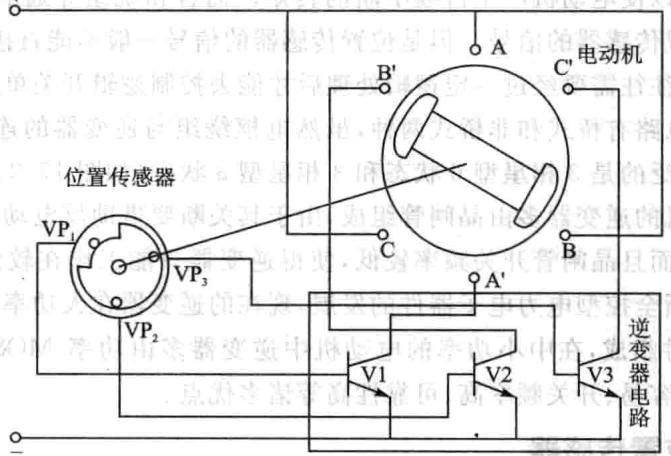

## 

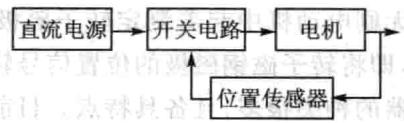

图17.1BLDC控制原理框图

无刷电机控制系统主要由电动机本体、位置传感器和逆变器电路3部分组成。

无刷电机的转子一般为含有稀土的永磁体，当定子一相绕组通电，该相绕组产生的磁场与定子磁场产生力作用，驱动定子转动。由转子位置传感器把转子的位置信号反馈给控制器或电子开关线路，控制器或开关线路控制定子绕组按照一定次序导通，产生旋转的磁场驱动转子连续旋转。由于电子开关线路的导通次序和转子转角是同步的，所以电子开关线路就起到了与机械换相器类似的控制作用。

## 1.无刷直流电动机的结构

无刷电动机本体在结构上与永磁同步电动机相似，但没有鼠笼型绕组和其他启动装置。其定子绕组一般制成多相(3相、4相、5相不等），转子由永久磁钢按照一定的极对数（2p=2，4等）组成。电动机转子的永久磁钢与永磁有刷电动机中所使用的永久磁钢的作用相似，均是在电动机的气隙中建立足够的磁场，其不同之处在于无刷电动机中永久磁钢装在转子上，而有刷直流电机的磁钢装在定子上。无刷电机定子各相轮流通电使电机转子旋转，其转速取决于逆变电路分配给定子各相通电的时间。

## 2.逆变器

直流无刷电动机的逆变器用来控制电动机定子上各相绕组通电的顺序和时间，主要由功率逻辑开关单元和位置传感器信号处理单元两部分组成。功率逻辑开关单元是控制电路的核心，其功能是将电源的功率以一定的逻辑关系分配给电动机定子上的各相绕组，以使电动机产生持续不断的转矩。而各相绕组导通顺序和时间主要取决于来自位置传感器的信号。但是位置传感器的信号一般不能直接用来控制功率逻辑开关单元，往往需要经过一定逻辑处理后才能去控制逻辑开关单元。

逆变器主电路有桥式和桥式两种，虽然电枢绕组与逆变器的连接形式多种多样，但应用最广泛的是3相星型6状态和3相星型3状态（如图17.2所示）。早期的直流无刷电动机的逆变器多由晶闸管组成，由于其关断要借助反电动势或电流过零，造成换流困难，而且晶闸管开关频率较低，使得逆变器只能作在较低频率范围内。随着新型可关断全控型电力电子器件的发展，现在的逆变器在大功率、低频率时多由GTO、GTR器件组成，在中小功率的电动机中逆变器多由功率MOSFET或IGBT构成，具有控制容易、开关频率高、可靠性高等诸多优点。

## 3.转子位置传感器

转位置传感器在直流无刷电动机中起着测定转子磁极位置的作用，为逻辑开关电路提供正确的换相信息，即将转子磁钢磁极的位置信号转换为电信号，然后去控制定绕组换相。位置传感器的种类很多，且各具特点。前，在直流刷电动机中常用的位置传感器有以下几种类型：

## (1)电磁式位置传感器

电磁式位置传感器是利用电磁效应来实现其位置测量作用的，主要有开口变压器、铁磁谐振电路、接近开关等多种类型，在直流无刷电动机中，用得最多的是开口变压器。电磁式位置传感器具有输出信号大、工作可靠、寿命长、使用环境要求不高、结构简单和紧凑等优点。但是这种传感器的信噪比比较低，体积较，同时输出信号为交流，一般需要整流、滤波以后才能使用。

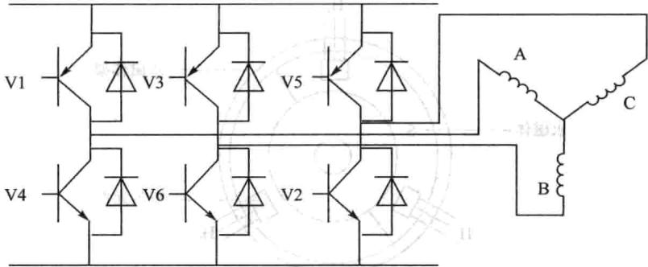

图17.2三相星型全桥驱动电路

## (2）光电式位置传感器

这种传感器利用光电效应制成，由跟随电动机转子一起旋转的遮光板和固定不动的光源及光电管等部件组成。光电式位置传感器的性能较稳定，但存在光源灯泡寿命短、使用要求较高等缺陷，若采用新型光电元件，可克服这些不足之处。

## (3)磁敏式位置传感器

磁敏式位置传感器是指它的某些电参数按照定规律随周围磁场变化的半导体敏感元件，其基本原理为霍尔效应和磁阻效应。前，常见的磁敏传感器有霍尔元件或霍尔集成电路、磁敏电阻器及磁敏极管等多种。前霍尔集成电路的磁敏式位置传感器应最为泛。霍尔元件做转位置传感器通常有两种式：第种式是将霍尔元件粘贴于电机端盖内表，靠近霍尔元件并与之有间隙处，安装着与电机轴同轴的永磁体，如图17.3所。对于两相导通星形3相6状态直流刷电机，3个霍尔元件在空间彼此相隔120电角度，永磁体极弧宽度为180电角度。这样，当电机转旋转时，3个霍尔元件便交替输出3个宽度为180电度、相位互差120电度的矩形波信号。第种式是直接将霍尔元件敷贴在定电枢铁隙表面或绕组端部紧靠铁心处，利用电机转子上的永磁体主极作为传感器的永磁体，根据霍尔元件的输出信号即可判断转磁极位置，将信号放大处理后便可驱动逆变器工作。

除了上述3类位置传感器外，还有正余弦旋转变压器和编码器等多种位置传感器。但是，这些元件成本较高，体积较大，而且所配电路复杂，因而在一般的直流无刷电动机中很少采用。

## 4.无刷直流电机工作基本原理

下以图17.2为例说明直流刷电机的运原理和特点。此处主要说明图的3相全控桥两两导通原理。所谓两两导通方式是指每一瞬间有两个功率管导通，每个 周期 电角度)换相一次，每次换相一个功率管，每一个功率管导通 电角度。各功率管的导通顺序是V1V6，V6V3,V3V2,V2V5，V5V4,V4V1

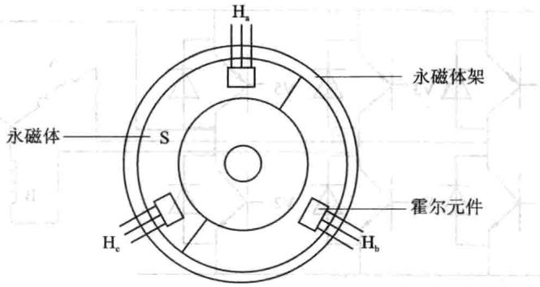

图17.3霍尔元件式位置传感器结构

当功率管V1V6导通时，电流从V1管流人A相绕组，再从C相绕组流出，经V6管回到电源。设 为3相绕组产生的力矩矢量，当电流从A相流入 相流出时，它们合成的转矩如图17.4（a）所示，其大小为 ,方向在 和一T。的角平分线上。当电动机转过 之后，由V1V6通电换成V3V6通电。这时，电流从VF3流B相绕组再从C相绕组流出，经V6管回到电源，此时合成转矩如图17.4（b）所示，其大小同样为 但合成转矩T的方向转过了 电度。而后每次换相一个功率管，合成转矩矢量方向就随着转过60°电角度，但大小始终保持不变。 

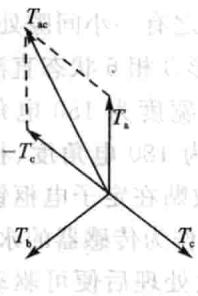

(a)

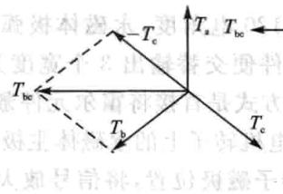

(b)

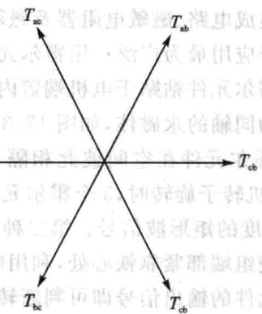

(c)图17.4两两通电时合成转矩矢量图

所以同样一台直流无刷电动机，每相绕组通过与 相半控电路同样的电流时，采用3相Y连接全控电路，在两两换向的情况下，其合成转矩增加了 倍。每隔 电角度换相次，每个功率管通电120，每个绕组通电240，其中正向通电和反向通电各

120。当然为了增电机的转矩，可以采用三三通电的控制式，分析法与上面类似。

## 4.有位置传感器的无刷电机的控制法

在大多数直流无刷电机的应用场合，电机常常带有霍尔位置传感器。位置传感器为转子位置提供了最直接有效的检测方法。霍尔位置传感器是以霍尔效应做理论基础、以霍尔元件为核心部件的磁敏传感器。在直流无刷电机的内部嵌有3个霍尔位置传感器，它们在空间上相差120°。由于电机的转子是永磁体，当它在转动的时候，它所产的磁场也随之转动，每个霍尔传感器都会产180°脉宽的输出信号，如图17.5所示，并且，3个霍尔传感器输出的信号互差120°

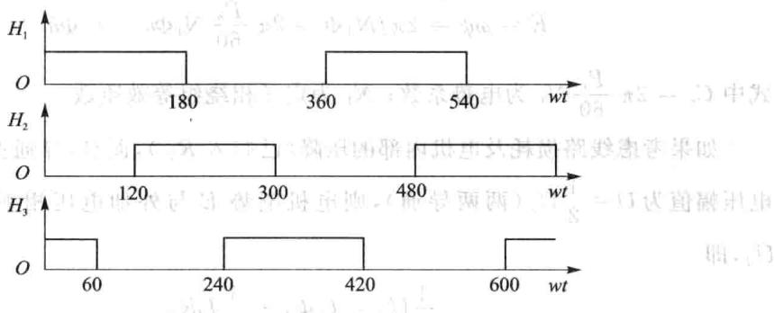

图17.5霍尔传感器输出波形相位关系

对于单极对数的刷电机，在每个机械转中共有6个上升或者下降沿，正好对应着6个换相时刻，因此根据这6个换相时刻便可以对电机进换相，并且可以进速度计算。

## 5.无位置传感器的无刷电机的控制方法

位置传感器为电机增加了体积，需要多条信号线，更增加了电动机制造的工艺要求和成本。如果3个传感器安装得不对称，很容易出现换相时刻不准的问题。在有些场合，如油压系统和风机，由于受条件的限制，往往需要无位置传感器的无刷电机控制。不过由于无传感器的无刷电机启动力矩不足，因此其应用条件很有限。

对无位置传感器的无刷电机的控制，感应电动势法是最常见和应用最广泛的一种方法。

对于单极对数的3相直流无刷电机，每转60°就需要换相一次，每转一转需要换相6次，因此需要6个换相信号。如图17.6所示，每相的感应电动势都有2个过零点，这样3相就有6个过零点。因此只需测量或者计算出这6个过零点，再将其延迟30°就可以获得6个换相信号。

## 6.无刷直流电机的调速法

直流无刷电动机定子相绕组的电势幅值由下面的公式确定的：

式中 为电势系数； 为定子相绕组等效匝数。

如果考虑线路损耗及电机内部的压降（已归 ，而且，导通型逆变器的输出电压幅值为 （两两导通），则电机电势E与外加电压相平衡， ,即

可以得到：

式中 为回路等效电阻，包括电机两相绕组的电阻和开关管压降等效电阻。上式表明，无刷直流电机的转速表达式和直流电动机的转速表达式十分相似。而且，当无刷电机内部气隙分布为方波，电机绕组为整距集中时，无刷直流电机的转速公式和有刷直流电机是完全相同的。这样就可以有刷直流电机的调速法推出刷直流电机的调速方法，可以改变电源母线电压，就可以调节电机转速。通常，直流无刷电机转速的调节式有脉冲幅值调制PAM（PulseAmplitudeModulation）和脉宽调制PWM(PulseWidthModulation)两种。在PAM中，直流母线电压可调，逆变器中的功率开关部件只负责电机的换相控制，通过调节直流母线电压的大小调节电机转速。在PWM式中，直流母线电压不变，逆变器功率开关器件不但负责直流电机的换相控制，而且通过斩波调节电机输电压的平均值，从而达到调节转速的的。另外，逆变器还可以采用SPWM(SinusoidalPulseWidthModulation)技术或滞环控制技术等调制出脉宽按正弦规律变化的电压并与电机反电势保持适当的相位关系，产生有效的电磁转矩。

当直流母线电压只有几伏或十伏时，多采用PAM调节方式，如医疗器械中的电钻、空调室内风机用的无刷电机。当直流母线电压为上百伏时，多采用PWM调节方式，如电动汽车、洗衣机、空调室外压缩机等使用的直流无刷电机。但是这也不是绝对的，主要是看控制系统的需要。

## 7.无刷直流电机的闭环调速

理想的直流无刷电机的感应电动势和电磁转矩的公式如下：

式中 为通电导体数，B为永磁体产生的气隙磁通密度，I为转子铁心长度，r为转子半径，ω为转子的机械速度，i为定子电流。

由以上两个公式可见，感应电动势与转子转速成正比，电磁转矩与定子电流成正比，因此，直流无刷电机与有刷直流电机样具有很好的控制性能。

任何电机的调速系统都以转速为给定量，并使电机的转速跟随给定值进行控制。为使系统具有很好的调速性能，通常要构建一个闭环系统。

一般来说，电机的闭环调速系统可以是单闭环系统（速度闭环），也可以是双闭环系统（速度外环和电流内环）。速度调节器的作用是对给定速度与反馈速度之差按一定规律进行运算，并通过运算结果对电机进行调速控制，最终使速度稳定下来，缺点是需要的时间较长。电流调节器的作用主要有两个：一个是在启动和大范围加减速时起电流调节和限幅作用，另一个是使系统的抗电源扰动和负载扰动的能力增强。不过对于大多数场合来说，速度闭环就能达到很好的效果，相反双闭环往往增加系统的复杂性和参数选择的难度，如果电流环处理不好，往往给调速带来不利影响。本书介绍的实用程序主要利用的是速度闭环调速。

## 8.基于PID调节的无刷直流电机的调速

在电机调速系统中，有不少调节方法，如PID调节和模糊控制等。由于PID调节简单实用，在实际应用中90%采用这种方法。PID控制系统原理图如图17.7所示。

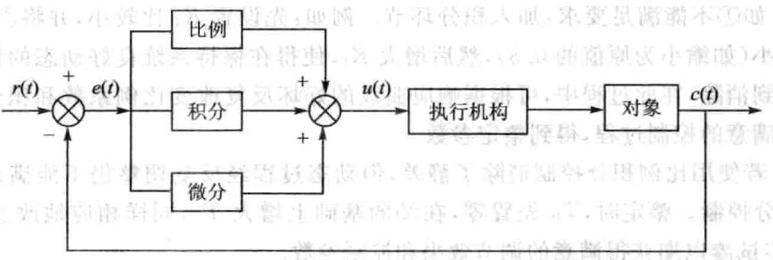

图17.7PID控制系统原理图

如图17.7所示，为PID控制系统原理图。r(t)是系统给定值，c(t)是系统的实

际输出值，给定值与实际输出值构成控制偏差 作为PID调节器的输人，u（t)作为PID调节器的输出和被控对象的输入。模拟PID控制器的控制规律为：

PID调节器的传输函数为：

PID三个参数例系数 、积分系数 、微分系数 在应用时通常起到不同的作用。

增大比例系数 将加快系统的响应，它的作用在于输出值较快，但不能很好稳定在一个理想的数值，不良的结果是虽较能有效地克服扰动的影响，但有余差出现，过大的比例系数会使系统有比较大的超调，并产生振荡，使稳定性变坏。积分能在比例的基础上消除余差，它能对稳定后有累积误差的系统进行误差修整，减小稳态误差。微分具有超前作用，对于具有容量滞后的控制通道，引入微分参与控制，在微分项设置得当的情况下，对于提高系统的动态性能指标，有着显著效果，它可以使系统超调量减小，稳定性增加，动态误差减小。

综上所述，P为比例控制系统的响应快速性，快速作用于输出；I为积分控制系统的准确性，消除过去的累积误差；D为微分控制系统的稳定性，具有超前控制作用。当然，这3个参数的作用不是绝对的，对于一个系统，在进行调节的时候，就是在系统结构允许的情况下，在这3个参数之间权衡调整，达到最佳控制效果，实现稳快准的控制特点。

在系统调节时，可参考以上参数对控制过程的响应趋势，对参数实行先比例、后积分、再微分的整定步骤。

## 具体做法如下：

①整定比例部分，将比例系数由小变大，并观察相应的系统响应，直至得到反应快、超调小的响应曲线。

②如①不能满足要求，加入积分环节。例如：先设置 比较小，并将①中比例系数缩小（如缩小为原值的0.8），然后增大 ,使得在保持系统良好动态的情况下，静差得到消除，在此过程中，可根据响应曲线的好坏反复改变比例系数和积分时间，而得到满意的控制过程，得到整定参数。

③若使用比例积分控制消除了静差，但动态过程经反复调整仍不能满意，则可加微分控制。整定时， 先置零，在②的基础上增大 ,同样相应地改变 和，逐步试凑以期获得满意的调节效果和控制参数。

以上是PID参数选择的一种方法，实际中应根据不同的系统进选择。在本书中，主要采用的是PI调节。控制器的输出量还要受一些物理量的极限限制，如电源额定电压、额定电流、占空比最大值和最小值等，因此对输出量还需要检验是否超出

极限范围。

### 17.3无刷直流电机驱动电路设计

## 1.驱动器控制电路总体设计

电机驱动器主要包括驱动功率电路与控制电路，控制电路主要包括数字信号处理器核心电路、外围设备电路、通信电路、CAN接口、UART接口、JTAG接口等电路，如图17.8所示。主要用F28335的PWM模块产生功率电路的PWM驱动信号，用F28335的A/D模块采集电机的电压、电流信号，用F28335的CAP模块采集电机的速度信号以及位置信号，并且通过键盘电路与LCD电路进行人机界面的显示，通过UART或CAN与外围控制器或上位机进通信。

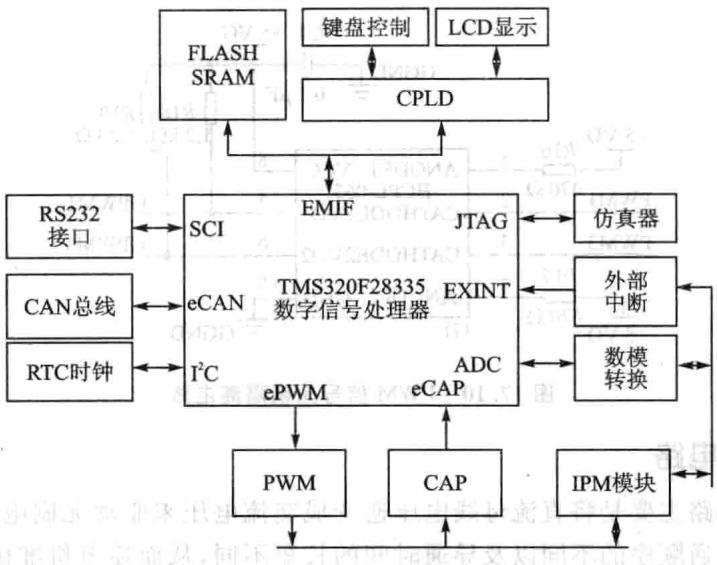

图17.8驱动器控制电路

在本书介绍中采用YXDSP-F28335作为驱动器的控制电路，YX-BLDC作为驱动器的功率电路。 y

## 2.PWM的产生

F28335的ePWM模块有6个ePWM子模块，分别是ePWMx,每个通道由两个PWM输出组成：ePWMxA和 。控制电路中的电流桥有6个功率开关，而且每个桥臂上的两个功率开关的控制信号是相关的，所以只需要用到前3个ePWM子模块ePWM1、ePWM2和ePWM3，控制信号分别为ePWM1A和ePWM1B、eP-WM2A和ePWM2B、ePWM3A和ePWM3B。由处理器芯管脚输出的控制信号的负载能力是有限的，所以输出的脉冲信号要先经过功率放大器件提升负载能力，这里

选用芯片74HC245，具体电路如图17.9所示，图中 ePWM1A对应PWM1,ePWM1B对应PWM2，经过功率放大后依次对应XPWM1和XPWM2，其余信号如此类推，在YX-DSP-F28335开发板底板上实现。为了防止电机运行时产生的噪声信号对处理器及其电路产生影响，经过功率放大的脉冲信号还需要进行隔

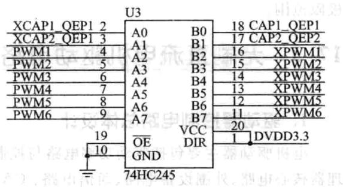

图17.9PWM缓冲电路

离处理，这里选用的是光电耦合门电路芯片HCPL-0631，其电路如图17.10所示，图中只列出其中的两路转换，其余类似。XPWM1～XPWM6信号经过光耦隔离后的信号对应为GPWM1～GPWM6。光耦隔离电路在YX-BLDC中实现。

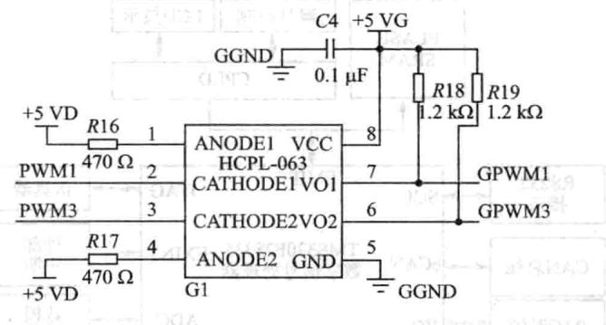

图17.10PWM信号光耦隔离电路

## 3.功率电路

开关主电路主要是将直流母线电压逆变成交流电压来驱动无刷电机，由于上下桥臂功率管导通顺序的不同以及导通时间的长短不同，从而使电机准确换相并且进行调速。其开关主电路设计如图17.11所示。

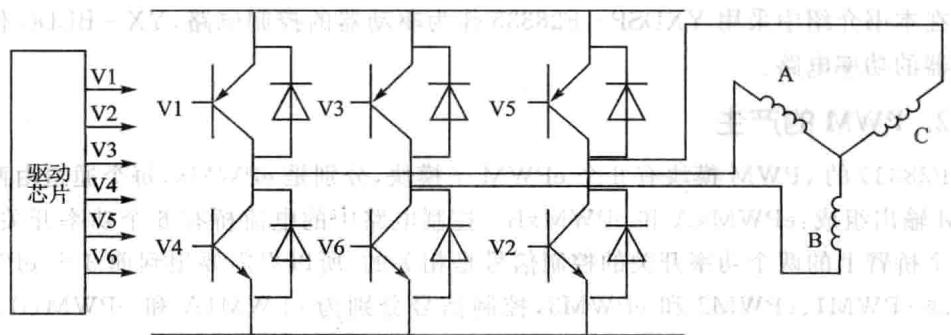

图17.11开关主电路设计

逆变电路由功率开关管V1～V6等组成，可以为功率晶体管GTR、功率场效应管MOSFET、绝缘栅极管IGBT、可关断晶闸管GTO等功率电器件。晶闸管适于较大功率电机，晶体管适用于中功率电动机。前常用的开关主电路有以下几种：

①采驱动芯IGBT的形式，适于功率电机。

②采用智能功率模块（IPM)，本身具有过压、欠压、过流和温度过的保护功能，但体积较大，价钱较高。

③采用驱动芯十MOSFET的形式，适用于中小电机。

YX-BLDC中选用驱动芯片十MOSFET的形式，DSP输出的PWM经过光电隔离后送驱动芯，由驱动芯驱动MOSFET。

驱动芯选用InternationalRectifier公司的IR2136，此芯为3相逆变器驱动器集成电路，适用于变速电机驱动器系列，如直流无刷、永磁同步和交流异步电机等。其主要特点为：

①60OV集成电路能兼容CMOS输出或LSTTL输出。

②门极驱动电源10~20V。

③所有通道的欠压锁定。

④内置过电流比较器。

⑤隔离的高/低端输。

⑥故障逻辑锁定。

⑦可编程故障清除延迟。

⑧软开通驱动器。

IR2136的功能框图如图17.12所示。IR2136的输/输出时序图如图17.13所示。其中HIN1,2,3为上桥臂的3个输入端，LIN1,2,3为下桥臂的3个输入端；HO1,2,3和LO1,2,3分别为上桥臂和下桥臂的3个输出端。其中HIN1,2，3和LIN1，2,3都为反向输出。FAULT表示故障输出，低电平有效。

IR2136的连接图如图17.14所示。图17.14电路中，二极管D1、D2、D3分别与电容CT4、CT3、CT2组成自举电路（升压电路），其中二极管是防止电流倒灌，电容是存储电压，当脉冲频率较高时，自举电路的电压就是电路输电压加上电容上的电压，起到了升压的作用。自举电路的目的是通过提高驱动电压使芯能更可靠地驱动压侧的功率器件。GPWM1~GPWM6信号经过IR2163对应输出信号分别为H01、L01、H02、L02、H03、L03，该输出信号分别输出到控制逆变器电桥上的场效应管Q1、Q2、Q3、Q4、Q5、Q6的栅极，如图17.11所示。其中Q1与Q2桥臂控制A相绕阻导通与否；Q3与Q4桥臂控制B相绕阻导通与否;Q5与Q6桥臂控制C相绕阻导通与否。

## 4.定子电流与电压的检测

实际应用中需要对定子电流检测，如过流的检测、输出转矩控制等，可以采用两

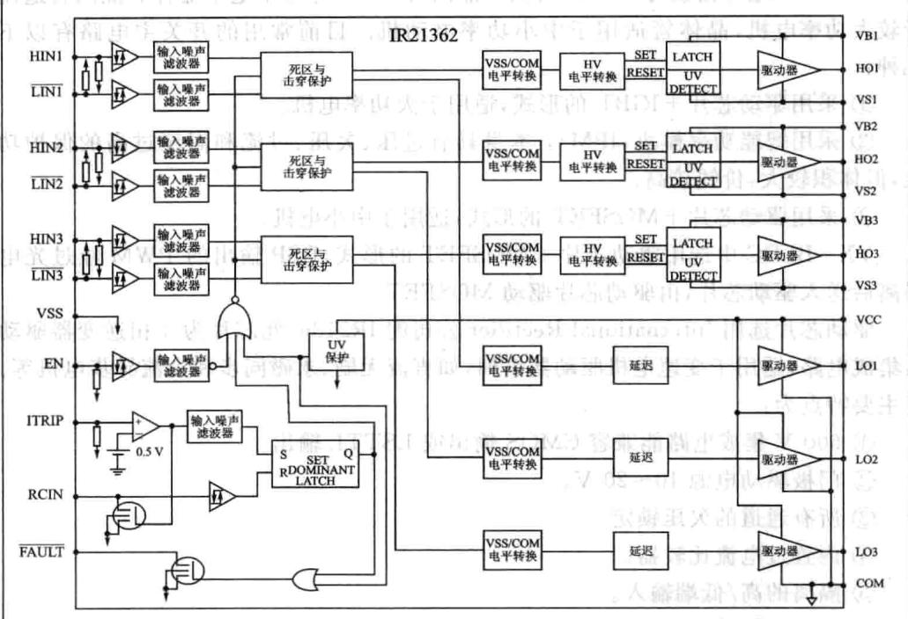

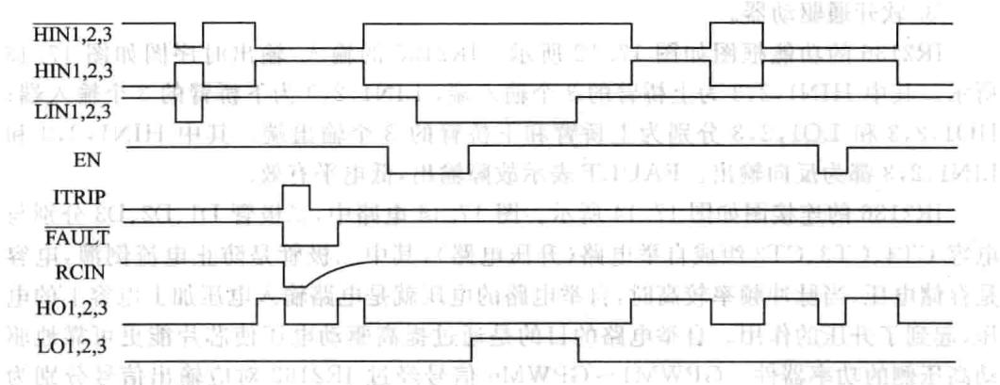

17.12 IR2136功能框图图17.13IR2136输入输出波形

①通过检测电流的霍尔传感器，如LEM模块。

②通过主回路中串采样电阻的方法。

本系统的电流比较小，选用串采样电阻的方法。采样电阻两端的电压经过有源滤波，放大然后经过隔离后送人模数转换器A/D，通过A/D采样来获得电流的大

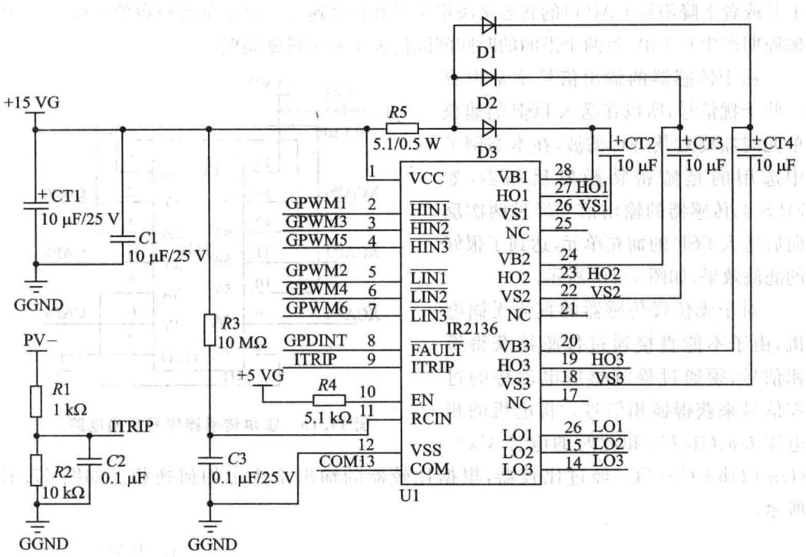

图17.14IR2136连接电路

小。这里选用线性隔离放大器HCNR200，具有很好的线性度，信号带宽达到1MHz，其应用电路如图17.15所示。

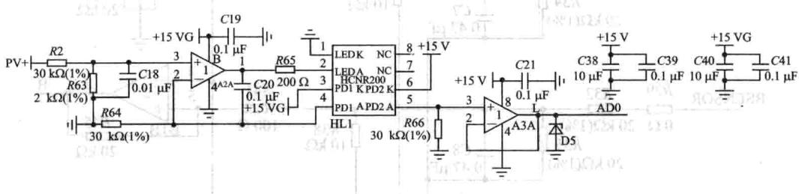

图17.15HCNR200应用电路图

直流母线电压通过电阻分压，然后经过初级运放进行信号放大与去除噪声，再输入线性光耦HCNR200，实现信号隔离，最后经过末级运放后输入到28335的A/D模块中，通过A/D采样就能知道此时母线电压的大小，可以用来进行过压或者欠压的检测等。

## 5.速度信号（或位置信号）的检测

对于有位置传感器的直流无刷电机，电机上集成霍尔元件，即转子位置传感器上带有霍尔元件。传感器输出为3路高速脉冲信号H1、H2、H3用于检测转子的位置。根据转子位置信号改变电动机驱动电路中功率管的导通顺序，实现对电动机转速和转动方向的控制。设计中，需将传感器的输出信号经过光耦隔离后送DSP的CAP单元，根据每个上升或者下降沿后CAP的状态来决定位置和计算速度。对于单极对数的电机，每个机械周期产6个沿，每两个沿间的时间间隔代表1/6个机械周期。

由于传感器的输出信号常常带有一些干扰信号，所以在送入DSP的捕获单元时需要对其进行滤波，在本书例子中选用的是施密特触发反相器，如74LS14，传感器的输出信号经过两次反向后送入DSP的捕获单元，达到了很好的滤波效果，如图17.16所示。

对于无位置传感器的直流无刷电机，由于不能直接通过传感器获得换相信号，须通过检测感应电动势的过零信号来获得换相信号。将电机的相电压 和此时的电势 

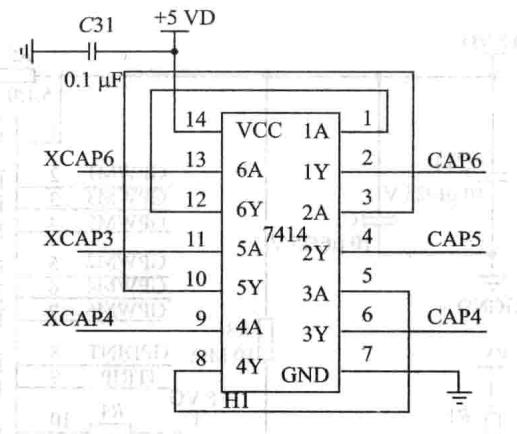

图17.16 霍尔传感器信号反相电路

。经过比较器，根据比较器的输出来决定如何换相。如图17.17所示。

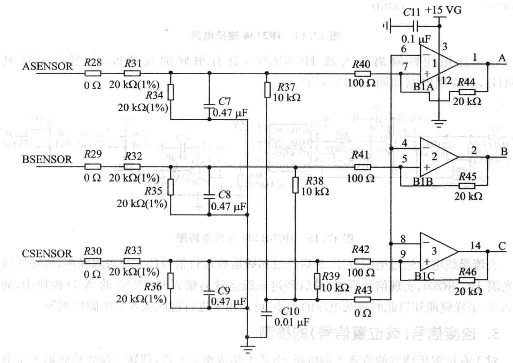

图17.17无位置传感器的BLDC过零点检测图

由于无位置传感器的无刷电机启动力矩不足，并且由于经过电容滤波后延时，所

以实际应用场合比较受限。

## 6.电源设计

对于电机的驱动控制，由于驱动部分常常给控制部分带来干扰，这里采用隔离的方式，将这两部分完全隔离，因此需要获得各种电源。十5VG与十15G、一15G采用的独的隔离电源模块。无刷直流电机供电采用外部接口供电，采用DC-24V。

### 17.4程序演示

## 1.有位置传感器无刷电机的开环控制

操作步骤如下：

①将YX-BLDC的P3和3相无刷电机的U、V、W连接;将电机的霍尔传感器输出与YX-BLDC的P4相连。

②将YX-BLDC的P1与+24V的外接电源相连。

③将YX-BLDC的P2的第21脚（或者22、23、24脚)接人电源十5V，第17脚（或者18、19、20脚)接入电源地。

④将YX-BLDC的P2的第1～6脚分别连接到开发板的PWM1～PWM6，第25和26脚连接到开发板的ADCIN0～ADCIN1，第11、12、13脚依次连接到开发板的GPIO27、GPIO52和GPIO53脚。

⑤分别把CAP_HALL座子的2、3、4与开发板的CAP4、CAP5、CAP6依次相连，勿接反。

⑥上电观察E4和E5指示灯是否点亮，否则断电检查系统。

⑦将sensor-openloop目录复制到CCS集成开发环境下的myprojects目录下。

⑧打开CCS，在CCS中选择Project→Open菜单项，加载sensor-openloop目录下的sensor-openloop. pjt。

⑨在CCS中选择File→Load GEL菜单项，加载sensor-openloop录下的F28335.gel。

在CCS中选择File→Load Program 菜单项，加载 sensor-openloop 目录下的sensor-openloop.out。

①在CCS中选择Debug→Go Main菜单项执行到C的main()函数处。

按F5运行，电机便以一定的速度旋转起来，通过观察数组speed的值，可以知道过去一段时间内速度的值。

③程序运过程中，灯E1闪烁，表示程序在运；如果灯E2点亮，表明有过压现象出现；如果灯E3点亮，表明有过流现象出现。

## 2.有位置传感器无刷电机的闭环控制

操作步骤如下：

①如无位置传感器的硬件连接一样，按照1中的①～⑤步进行。

②将sensor-closeloop目录复制到CCS集成开发环境下的myprojects目录下。

③打开CCS，在CCS中选择Project→Open菜单项，加载sensor-closeloop目录下的sensor-closeloop.pjt。

④在CCS中选择File→LoadProgram菜单项，加载sensor-closeloop录下 的sensor-closeloop. out。

⑤在CCS中选择Debug→GoMain菜单项执行到C的main()函数处。

⑥按图17.18所示设定断点，按F5运行，电机便旋转起来，通过观察数组speed的值，可以知道过去一段时间内速度的值。

⑦在CCS中选择View→Graph→Time/Frequency菜单项，按图17.18所示进设置，单击OK按钮后即可观察到电机从启动到旋转2000转的过程中速度的变化曲线，如图17.19所示。

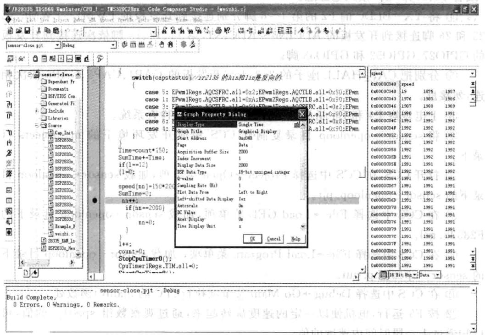

图17.18程序断点设置与参数设置

⑧在weizhisudupid.c文件中通过改变参数kp、ki、kd的值，重新编译下载运行

后，按上一步重新观察图形，便可以得到不同参数下速度的变化曲线。

⑨程序运行过程中，灯E1闪烁，表示程序在运行；如果灯E2点亮，表明有过压现象出现；如果灯E3点亮，表明有过流现象出现。

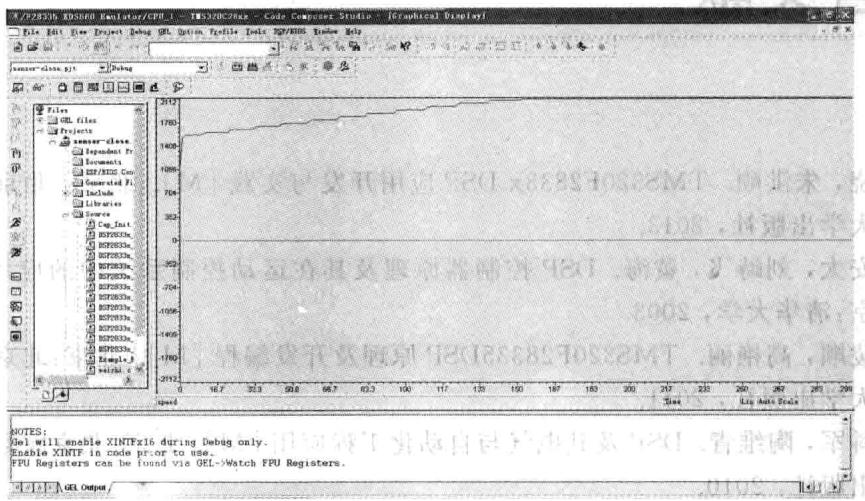

图17.19电机转速曲线

## 3.无位置传感器无刷电机的开环控制

YX-BLDC模板也持位置传感器刷电机的开环控制。操作步骤如下

①与位置传感器的硬件连接样，按照1中的①～⑤步进。

②将sensorloss目录复制到CCS集成开发环境下的myprojects目录下。

③打开CCS，在CCS中选择Project→Open菜单项，加载sensorloss目录下的sensorloss. pjt.

④在CCS中选择File→Load Program菜单项，加载sensorloss目录下的sen-sorloss.out。

⑤在CCS中选择Debug→GoMain菜单项执行到C的main()函数处。

⑥按F5运行，电机便以一定的速度旋转起来，通过观察变量Speed的值，可以知道此时速度的值；通过观察数组test的值，可以知道过去一段时间内速度的值。

## 参考文献
