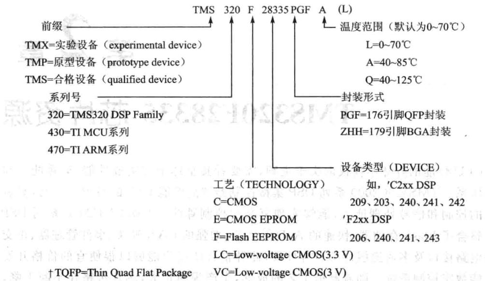
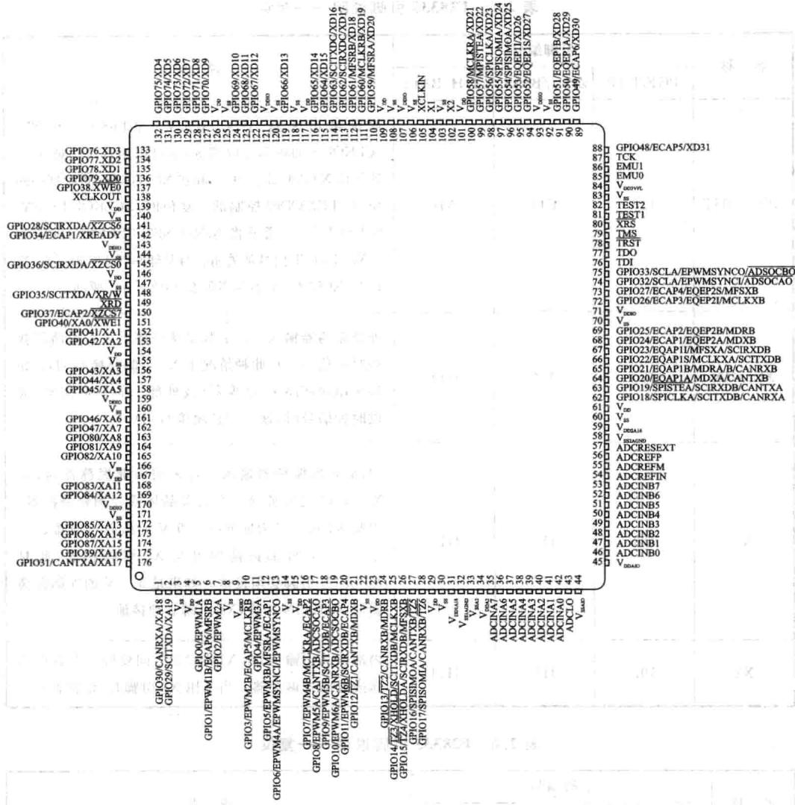

# 第 2 章

## TMS320F28335芯资源

CPU性能的好坏不仅仅取决于主频，需要看其整体架构集成性能、运算能力与指令体系。TMS320C2000系列DSP集微控制器和性能DSP的特点于一身，具有强大的控制和信号处理能力，能够实现复杂的控制算法。TMS320C2000系列DSP片上整合了Flash存储器、快速的A/D转换器、增强的CAN模块、事件管理器、正交编码电路接口及多通道缓冲串口等外设，此种整合使用户能够以很便宜的价格开发高性能数字控制系统。随着制造工艺的成熟，生产规模扩大，芯片价格在不断下降，目前该系列DSP市场占有率非常高，在工业自动化控制、电力电子技术应用、智能化仪器仪表、电机伺服控制方面均有着泛的应用。F283X系列DSP更是在原来F28系列定点DSP的基础上增加了浮点运算内核，保持原有DSP芯片优点的同时，能够更高效地执行复杂的浮点运算，在处理速度、处理精度方面要求较高的领域，比原F28系列DSP有着更的性价比。本章将详细介绍F28335的结构、资源以及性能。

### 2.1F28335的封装信息

F28335芯型号表示如图2.1所，根据芯上的字母能够识别器件的型号、封装、版本等信息，版本信息如表2.1所列。主8

|版本号|版本信息|版本ID(0x0833）|备注|版本号|版本信息|版本ID（0x0833）|备注|
|---|---|---|---|---|---|---|---|
|空白|0|0x0000|TMX|D|D|0x0004|内部|
|A|A|0x0001|TMX|E|E|0x0005|TMS|
|B|B|0x0002|内部|F|F|0x0006|内部|
|C|C|0x0003|TMS/TMP/TMX|G|G|0x0007 高|TMS|

表2.1版本信息

在器件型号后边还有串版本信息，通过版本前两位可以进一步判断所的芯是合格设备还是实验设备。后边为厂地以及芯具体批次。不

另外，该系列除了上述标准产品外，还有特殊产品，分别为：

①SM320F28335-EP(enhancedproduct)：增强产品，产品生产过程控制更加严苛

具有Flash的DSP，在DEVICE之后若有A符号，表示对Flash内容可加密，如TMS320LC2406A

图2.1F28335芯片标识信息

格，工作温度一55～125℃，适合国防、航空及医疗等领域应用。

②SM320F28335-HT（high-tempreture)：高温产品，陶瓷封装，工作温度一55～220℃，适合严苛酷环境应用。

③SMJ320F28335：真正军品产品，通过美军标，陶瓷封装，适合军事、国防应用。

更具体的信息以及芯片参考价格可以在TI主页www.ti.com搜索，但网站上搜不到军品，更搜不到军品数据手册。

### 2.2F28335内核主要特点

## 

F28335DSP集成了DSP和微控制器的长处，如DSP的主要特征、单周期乘法运算，F28335能够在一个周期内完成32×32位的乘法累加运算，或两个16×16位乘法累加运算，而同样32位的普通单机则需要4个周期以上才能完成；拥有完成64位的数据处理能力，从而使该处理器能够实现更高精度的处理任务。快速的中断响应使F28335能够保护关键的寄存器以及快速（更的中断延时)地响应外部异步事件。F28335有8级带有流线存储器访问的流线保护机制，因此，F28335运算时不需要容量的快速存储器。专门的分跳转（Branch-Iook-ahead)硬件减少了条件指令执的反应时间，条件存储操作更进一步提了F28335的性能。

F28335控制器还具有许多独特的功能，如可在任何内存位置进单周期读、修改、写操作，不仅提供了性能和代码效编程，还提供了许多其他原始指令，一般普通MCU则需要2个以上周期。F28335系列控制器在一个闪存节点上可以提供

150MIPS的性能，普通单片机与MCU均在30MIPS以下。

F28335处理器可采用C/C++编写软件，效率非常高。因此，用户不仅可以应用高级语言编写系统程序，也能够采用C/C++开发高效的数学算法，甚至可以与MATLAB、LabVIEW等高级语系统接口。F28335系列DSP完成数学算法和系统控制等任务都具有相当高的性能。F2833x浮点控制器设计，让设计人员可以轻松地开发浮点算法，并在符合成本效益的情况下与定点机器无缝结合。与同主频的定点DSPF2812比较，浮点算法速度是其5~8倍。

下面为TMS320F28335型号的处理器主要资源：

①32位浮点DSP，主频是150MHz，方便电机控制、电力设备控制及工业控制等。

②片上存储器：FLASH：256K×16位；SRAM：34K×16位；BOOTROM：8K×16位;OPTROM:2KX16位。其中FLASH、OPTROM受口令保护，可以保护用户程序。

③片上外设：PWM：18路；HRPWM:6路;CAP：6路;QEP:2通道；ADC：2×8通道，12位，80ns转换时间,0~3V输入量程;SCI:3通道；MCBPS:2通道;CAN：2通道;SPI：一通道； 一通道；外部存储器扩展接口：XINTF；通用输人/输出I/O：88；看门狗电路。

## 主要特点如下：

①F28335的CPU时钟电路可以有两种提供方式，一种是在XCLKIN引脚提供一定频率的时钟信号；另一种是在X1和X2两个引脚间连接一个晶体，配合内部的振荡电路，产生时钟源。此时钟源可以经过内部的PLL锁相环电路进倍频以及分频后，提供给28335的CPU核。CPU核接受的时钟最高频率可以达到150MHz。CPU内核指令周期为6.67ns;内核电压为1.9V，I/O引脚电压为3.3V。

②F28335为哈佛结构的DSP，在逻辑上有4MX16位的程序空间和4MX16位的数据空间，物理上将程序空间和数据空间统一成一个4MX16位的空间。F28335片内共有34KX16位单周期单次访问随机存储器SARAM，分成10个块，分别为M0、M1、L0～L7。M0和M1块SARAM的大小均为1KX16位，当复位后，堆栈指针指向M1块的起始地址，堆栈指针向上生长。M0和M1段都可以映射到程序区和数据区。L0～L7块SARAM的大小均为4KX16位，既可映射到程序空间，也可映射到数据空间，其中L0～L3可映射到两块不同的地址空间并且受片上FLASH中的密码保护，以免存在上面的程序或数据，被他人非法复制。F28335片上有256KX16位嵌式FLASH存储器和1KX16位次可编程EEPROM存储器，均受上Flash中的密码保护。FLASH存储器由8个32KX16位扇区组成，用户可以对其中任何个扇区进擦除、编程和校验，而其他扇区不变。但是，不能在其中一个扇区上执程序来擦除和编程其他的扇区。

③F28335中有6组互补对称的脉宽调制PWM，每组中包含两路PWM，分别为

PWMxA和PWMxB。每一组中都有7个单元：时基模块TB、计数比较模块CC、动作模块AQ、死区产生模块DB、PWM斩波模块PC、错误联防模块TZ、事件触发模块ET。为了PWM精度考虑，TI还设计了HRPWM，即每一组的PWMxA都可以配置为高精度PWM。

④F28335中有6组增强型捕获单元CAP，CAP模块应用定时器实现事件捕获功能，主要应用在速度测量、脉冲序列周期等方面。并且每一路CAP单元还可以通过软件配置为APWM，由于CAP单元的时基计数器为32位，所以APWM的时基计数器也是32位，这样APWM可以产生更低频率的PWM。

⑤F28335中有2组增强型正交编码单元QEP。正交编码脉冲是两个频率变化且正交(即相位相差90°）的脉冲，当它由电机轴上的光电编码器产时，电机的旋转方向可通过检测两个脉冲序列中的哪一列先到达来确定，角位置和转速可由脉冲频率（即齿脉冲或圈脉冲）来决定。

⑥F28335上有个12位A/D转换器，其前端为2个8选多路切换器和2路同时采样/保持器，构成16个模拟输入通道，模拟通道的切换由硬件自动控制，并将各模拟通道的转换结果顺序存入16个结果寄存器中。

⑦F28335中有3组SCI异步串口，也就是通常所说的UART。SCI模块支持在CPU和其他异步外设之间的数字通信。SCI的串口接收和发送均为双缓冲，接收和发送都有独的使能和中断位。在全双工模式下，两者可以独立或同步运。为了确保数据的完整性，SCI模块检查接收数据的断点、校验位和帧错误。

SCI特点：

外部引脚：2个SCI发送引脚：SCITXDSCI接收引脚：SCIRXD。

波特率可编程：有64K种设置当 时：波特率=LSRCLK÷（（BRR+1)×8);当BRR=0时波特率=LSPCLK÷16。

数据格式：一个开始位，1～8个数据位，奇校验/偶检验/无校验可选，一或两个停止位。

4个错误检测标志：校验，溢出，帧和断点检测。

全双工和半双工模式双缓冲接收和发送。

串口数据发送和接收过程可以通过中断方式或查寻方式。

⑧F28335上有两个多通道缓冲型同步串口McBSP。McBSP是MultichannelBufferedSerialPort的缩写，即多通道缓冲型串行接口，是一种多功能的同步串行接口，具有很强的可编程能力，可以配置为多种同步串口标准，直接与各种器件高速

T1/E1标准：通信器件。

MVIP和ST-BUS标准：通信器件。

标准：ISDN器件。

AC97标准：PCAudio Codec器件。

IIS标准：Codec器件。

》SPI：串行A/D、D/A，串行存储器等器件。

F28335上有两个增强型CAN总线控制器，符合CAN2.0B协议。CAN是一种多主总线，通信介质可以是双绞线、同轴电缆或光导纤维。通信速率可达1Mbps。CAN总线通信接口中集成了CAN协议的物理层和数据链路层功能，可完成对通信数据的成帧处理，包括位填充、数据块编码、循环冗余检验、优先级判别等项工作。

CAN特点如下：

a.符合CAN2.0 协议。

b.数据传输率高达1Mbps。

c.32个邮箱，每个支持以下特点：

可配置成接收和发送。

》可配置成标准或扩展的标识。

》可编程接收屏蔽。

》支持数据和远帧。

》数据长度08字节。

在接收或发送信息时，使用32位的时间标志。

新信息的接收保护。

》发送信息的动态优先级。

》带有两级中断的中断配置。

发送和接收操作时，可发出超时警报。

d.低功耗模式。

e.可编程设定的总线激活。

f.远方请求信息的自动答复。

g.无裁决或错误时，数据帧自动重新发送。

h.32位的本地网络时间计数器同步于指定的信息。

i，支持自测模式。

F28335有一通道的SPI接口。SPI是一个高速同步的串行输入/输出口，通信速率和通信数据长度都是可以编程的，DSP可以采用SPI接口同外设或其他处理器实现通信。串行外设接口主要应用于系统扩展显示驱动器、ADC以及日历时钟等器件，也可以采用主/从模式实现多处理器间的数据交换。

F2833x的SPI有如下特点：

a.4个外部引脚：SPISOMI：SPI从输出/主输引脚。SPISIMO：SPI从输入/主输出引脚。SPISTE:SPI从发送使能引脚。SPICLK：SPI串时钟引脚。

b.2种工作方式：主和从工作方式。

c.波特率：125种可编程波特率。

d.数据字长：可编程的1～16个数据长度。

e.4种时钟模式(由时钟极性和时钟相应控制）。

f.无相位延时的下降沿;SPICLK为高电平有效。在SPICLK信号的下降沿发送数据，在SPICLK信号的上升沿接收数据。

g.有相位延时的下降沿：SPICLK为高电平有效。在SPICLK信号的下降沿之前的半个周期发送数据，在SPICLK信号的下降沿接收数据。

h．相位延迟的上升沿：SPICLK为低电平有效。在SPICLK信号的上升沿发送数据，在SPICLK信号的下降沿接收数据。

i．有相位延迟的上升沿：SPICLK为低电平有效。在SPICLK信号的下降沿之前的半个周期发送数据，而在SPICLK信号的上升沿接收数据。

j．接收和发送可同时操作（可以通过软件屏蔽发送功能）。

k.通过中断或查询式实现发送和接收操作。

1.9个SPI模块控制寄存器。

m，增强特点：16级发送/接收FIFO。延时发送控制。

①F28335上有一个I²C同步串口。I²C(Inter-IntegratedCircuit)总线是一种由NXP公司开发的两线式串总线，用于连接微控制器及其外围设备。它是由数据线SDA和时钟SCL构成的串总线，可发送和接收数据。F28335包含一个I²C主从兼容的串行接口模块。I²C特点如下：兼容Philips I²CSpecificationRevision2.1(2000年1月）；最大传输速率可达400kbps；噪声滤波，可以滤除50ns的噪声；7位和10位地址模式；一个16bit接收FIFO和一个16bit发送FIFO;主从功能I²C引脚描述： 时钟SDA：I²C数据。

F28335的外部存储器接口包括：20位地址线，16（最大32）位数据线，3个片选控制线及读/写控制线。这3个选线映射到3个存储区域，Zone0、Zone6和Zone7。这3个存储器可分别设置不同的等待周期。

③F28335一共有88个通用输/输出接口，也就是常说的 此88个GPIO都可以通过软件配置为特殊功能或者通输输出接。而且GPIO0～GPIO63可以通过外部中断寄存器配置为外部中断功能，即当某一个GPIO外部中断使能的时候，外部电平发生变化时，此引脚可以触发中断。

F28335有6通道的DMA处理器，大大改进了大规模数据传输的效率。

### 2.3 与DSP2812的性能对比

当前C2000系列DSP以2812与28335应最，两者主要性能对如表2.2所列。

|性能|F28335|F2812|
|---|---|---|
|CpU|32位定点+单精度浮点单元FPU|32位定点CPU|
|系统频率|150MHz|150MHz|
|片内FLASH|256KX16位|128K×16位|
|Boot ROM|8KX16位|8K×16位|
|OTP|1K×16位|1K×16位|
|32位CPU定时器|3个|3个|
|SRAM|34KX16位|18K×16位|
|128位密码保护|有|有|
|系统外部接口（XNTF）|有|有|
|通用1/O口(GPIO)|88个（可配置4种工作模式）|56个（可配置2种工作模式）|
|ADC|12位、16通道、12.5MSPS|12位、16通道、12.5MSPS|
|电机控制外设|ePWM（最多18路，包括6路HRPWM）6路32位eCAP输入（可配置为PWM)2个32位eQEP|EVAEVB|
|SPI|1个|1个|
|SCI|3个|2个|
|Ecan|2个|1个|
|$1²c$|1个|无|
|」    McBSP/SPI|2个|1个|
|外部中断|8个|3个|
|PIE|支持58个外设中断|持45个外设中断|
|DMA|6个|无|

表2.2 F28335与F2812的性能对比

### 2.4F28335的引脚分布及其引脚功能

F28335包含多种封装，176引脚PGF/PTP薄型四扁平封装（LQFP)的顶视图如图2.2所。引脚信号说明如表2.3~表2.9所列。

|名称|引脚编号|说明|
|---|---|---|
|PGF/PTP|ZHH/BALL|ZHH/BALL|
|TRST|78|M10|
||TCK|87|
||TMs|79|
||TDI|76|
||TDO|77|
|EMUO|85|L11|
|EMU1|86|P12|

表2.3F28335引脚说明—JTAG

图2.2 F28335的176引I脚PGF/PTP薄型四方扁平封装(LQFP)的顶视图

|名称|引脚编号|说明|
|---|---|---|
|PGF/PTP|ZHH/BALL|ZHH/BALL|
|VDD3VFL|84|M11|
|TEST1|81|K10|
|TEST2|82|P11|

表2.4F28335引脚说明——FLASH

|名称|引脚编号|说明|
|---|---|---|
|PGF/PTP|ZHH/BALL|ZHH/BALL|
|XCLKOUT|138|C11|
|XCLKIN|105|J14|
|X1|104|J13|
|X2|102|J11|

表2.5F28335引脚说明——时钟

|名称|引脚编号|说明|
|---|---|---|
|PGF/PTP|ZHH/BALL|ZHH/BALL|
|XRS|||
|80|L10|M13|

表2.6F28335引脚说明-复位

|名称|引脚编号|说明|
|---|---|---|
|PGF/PTP|ZHH/BALL|ZHH/BALL|
|ADCINA7|35|K4|
|ADCINA6|36|J5|
|ADCINA5|37|L1|
|ADCINA4|38|1.2|
|器A的8通道|模拟输入(1)||
|ADCINA3|39|L3|
||||
|ADCINA2|40|M1|
||||
|ADCINA1|41|N1|
|ADCINAO|42|M3|
|ADCINB7|53|K5|
|ADCINB6|52|P4|
|ADCINB5|51|N4|
||||
|ADCINB4|50|M4|
|ADCINB3|49|L4|
|ADCINB2|48|P3|
|ADCINB1|47|N3|
|ADCINBO|46|$P2$|
|ADCLO|43|M2|
|ADCRESEXT|57|M5|
|ADCREFIN|54|L5|
|ADCREFP|56|P5 m°|
|ADCREFM|53|15N5|

表2.7F28335引脚说明——ADC信号

|名称|引脚编号|说明|
|---|---|---|
|PGF/PTP|ZHH/BALL|ZHH/BALL|
|VDDA2|34|K2|
|VSSA2|33|K3|
|VDDAIO|45|N2|

表2.8 F28335引脚说明——CPU和输入/输出电源引脚

|名称|引脚编号||说明|
|---|---|---|---|
|PGF/PTP|ZHH/BALL|ZHH/BALL||
|VSSAIO|44|P1|N1|
|VDD2A18|31|J4|K3|
|VSS1AGND|32|K1|L4|
|VDD2A18|59|M6|L6|
|VSS2AGND|58|K6|P2|
|VDD|4|B1|D4|
|VDD|15|B5|D5|
|||||
|VDD|23|B11|D8|
|||||
|VDD|29|C8|D9|
|||||
|VDD|61|D13|E11|
|VDD|101|E9|F4|
||CPU和数字电源引脚|||
|VDD|109|F3|F11|
|VDD|117|F13|H4|
|||||
|VDD|126|H1|J4|
|||||
|VDD|139|H12|J11|
|||||
|VDD|146|J2|K11|
|||||
|VDD|154|K14|L8|
|VDD|167|N6||
|VDDIO|9|A4|A13|
|VDDIO|71位|B10|B1|
|||||
|VDDIO|93|E7|[)D7|
|VDDIO|107|E12|D11|
|VDDIO|121|F5|E4|
|VDDIO|143|L8|G4|
|VDDIO|159|H11|G11|
|||||
|VDDIO|170|N14|L10|
|VDDIO|||N14|
|VSS|3|A5|A1|
|VSS|8|A10|A2$|
|VSS|14|A11|A14|
|VSS|22|B4|B14|
|||||
|VSS|30|C3|F6|

续表2.8

|名称|引脚编号|说明|
|---|---|---|
|PGF/PTP|ZHH/BALL|ZHH/BALL|
|VSS|60|C7|
|VSS|70|C9|
|VSS|83|D1|
|VSS|92|D6|
|VSS|103|D14|
|VSS|106|E8|
|VSS|108|E14|
|VSS|118|F4|
|VSS|120|F12|
|VSS|125|G1|
|VSS|140|H10|
|VSs|144|H13|
|VSS|147|J3|
|VSS|155|J10|
|VSS|160|J12|
|VSS|166|M12|
|VSS|171|N10M|
|VSS|明|N11|
|VSS||P6|
|VSS||P8|

|名称|引脚编号||说明||
|---|---|---|---|---|
|PGF/PTP|ZHH/BALL|ZHH/BALL|||
|GPIO0EPWM1A|5|C1|D1|通用1/O引脚0(1/O/Z）增强型PWM1输出A通道和HRPWM通道(O)|
|GPIO1EPWM1BeCAP6MFSRB|6|D321|D2|通用1/0引脚1(1/O/Z)增强型PWM1输出B通道(O)增强型捕获1/O口6(1/O)多通道缓冲串口B(MCBSP-B)的接收帧同步(I/O)|
|GPIO2EPWM2A|7|D2|D3|通用I/O引脚2(I/O/Z）增强型PWM2输出A通道和HRPWM通道（O)|

表2.9F28335引脚说明—GPIOA和外设信号

续表2.9

|名称|引脚编号|说明|
|---|---|---|
|PGF/PTP|ZHH/BALL|ZHH/BALL|
|GPIO3EPWM2BeCAP5MCLKRB|10|E4|
|GPIO4EPWM3A|11|E2|
|GPIO5EPWM3BeCAP1MFSRA|12|E3|
|GPIO6EPWM4AMSYNCLEPWMSYNCO|13|E1|
|GPIO7EPWM4BMCLKRAEcap2|16|F2|
|GPIO8|17||
|EPWM5ACANTXB|||
|ADCSOCA|||
|GPIO9EPWM5BSCITXDBEcap3|18|G5|
|GPIO10EPWM6ACANRXB|119|G4|

续表2.9

|名称|引脚编号|说明|
|---|---|---|
|PGF/PTP|ZHH/BALL|ZHH/BALL|
|GPIO11EPWM6BSCIRXDBEcap4|20|G2|
|GPIO12TZ1CANTXBMDXB|21|G3|
|GPIO13TZ2CANRXBmdrB|24|H3|
|GPIO14TZ3/XHOLDSCITXDBMCLKXB|25|H2|
|GPIO15TZ4/XHOLDASCIRXDBMCLKXB|26|H4|
|GPIO16SPISIMOACANTXB5(1)|27|H5|
|GPIO17SPISOMIACANRXB6(I)|28|J1|

续表2.9

|名称|引脚编号|说明||
|---|---|---|---|
|PGF/PTP|ZHH/BALL|ZHH/BALL||
|GPIO18SPICLKASCITXDBCANRXA|62|L6|N8|
|GPIO19SPISTEASCIRXDBCANTXA|63|K7|M8|
|GPIO20EQEP1AMDXACANTXB|64|L7|P9|
|GPIO21EQEP1BMDRACANRXB|65|P7|N9|
|GP1O22EQEP1SMCLKXASCITXDB|66|N7|M9|
|GPIO23EQEP1IMFSXASCIRXDB|67|M7|P10|
|GPIO24ECAP1EQEP2AMDXB|681|M8|N10|
|GPIO25ECAP2EQEP2BMDRB|69|N8|M10|

续表2.9

|名称|引脚编号|说明         中|
|---|---|---|
|PGF/PTP|ZHH/BALL|ZHH/BALL|
|GPIO26ECAP3EQEP2IMCLKXB|72|然K86|
|GPIO27ECAP4EQEP2SMFSXB|73|L9|
|GPIO28SCIRXDAXZCS6|141|E10|
|GPIO29SCITXDAXA19|2|C2|
|GPIO30CANRXAXA18|1|B2|
|1K01|||
|GPIO31CANTXAXA17|176|A2|
|GPIO32SDAAEPWMSYNCIADCSOCAO|74|期！|
|N9|M11国国|I²C的数据时钟开漏双向口(I/OD)增强型PWM外部同步脉冲输入(O)ADC启动转换A(I/O)|
|M1|||
|GPIO33SCLAEPWMSYNCOADCSOCBO|75|0P9|
|44|||
|ADC启动转换B(I/O)|||
|GPIO34ECAP1XREADY|142|D10|

续表2.9

|名称|引脚编号|说明|
|---|---|---|
|PGF/PTP|ZHH/BALL|ZHH/BALL|
|GPIO35SCITXDAXR/W|148|A9|
|GPIO36SCIRXDAXZCS0|145|C10件加|
|GPIO37ECAP2XZCS7|150|D9|
|GPIO38XWEO|137|D11|
|GPIO39XA16|175|B3|
|GPIO40XA0/XWE1|151|D8|
|GPIO41XA1|152|A8|
|GPIO42XA2|153|B8|
|GPIO43XA3|156|B7品|
|GPIO44XA4|1157人|A7|
|GPIO45XA5|158|D7|
|GPIO46XA6|161|B6|
|GPIO47XA7|162|A6|
|GPIO48ECAP5XD31|88|P13|

续表2.9

|名称|引脚编号|说明|章  3|
|---|---|---|---|
|PGF/PTP|ZHH/BALL|ZHH/BALL||
|GPIO49ECAP6XD30|89|N13点|U:L13|
|GPIO50EQEP1AXD29|90|P14|L12|
|GPIO51EQEP1BXD28|91|M132|K14|
|GPIO52EQEP1SXD27|94|M14|K13|
|GPIO53EQEP1IXD26|95|L12|K12|
|GPIO54SPISIMOAXD25|96|L13|11J14|
|GPIO55SPISOMIAXD24|97|L14民|J13味鼎|
|GPIO56SPICLKAXD23|98|K11|J1210|
|GPIO57SPISTEAXD22|99|K13|i=1H13a1:|
|GPIO58MCLKRAXD21|100|K12lua,L|H12国临|
|GPIO59MFSRAXD20|110|H14|H11|

续表2.9

|名称|引脚编号|说明|
|---|---|---|
|PGF/PTP|ZHH/BALL|ZHH/BALL|
|GPIO60MCLKRBXD19|111|G14|
|GPIO61MFSRBXD18|112|G1225|
|GPIO62SCIRXDCXD17|113|G13|
|GPIO63SCITXDCXD16|114|G11|
|GPIO64XD15|115|G10|
|GPIO65XD14|116|F14|
|GPIO66XD13|119|69F11|
|GPIO67XD12|122|E13|
|GPIO68XD11|123|E111|
|GPIO69XD10|124|F10|
|GPIO70XD9|127|D12中满财|
|GPIO71XD8|128a|C14|
|GPIO72XD7|129|器B14|
|GPIO73XD6|130|C12|

续表2.9

|名称|引脚编号||说 明|
|---|---|---|---|
|PGF/PTP|ZHH/BALL|ZHH/BALL||
|GPIO74XD5|131|C13|B12|
|GPIO75XD4|132|A14|C12|
|GPIO76XD3|133|B13|A11|
|GPIO77XD2|134|A13|B11|
|GPIO78XD1|135|B12|C11|
|GPIO79XDO|136|A12|B10|
|GPIO80XA8|163|C6||
|GPIO81XA9|164|E6|B5|
|GPIO82XA10|165||C5|
|GPIO83XA11|168|D5|A4|
|GPIO84XA12|T0X169.1|E5|B4OJV|
|GPIO85XA13|172|C4|C4|
|GPIO86XA14|173|D4|A3|
|GPIO87XA15|174|A3|B3|
|XRD|149|B9|A8|
