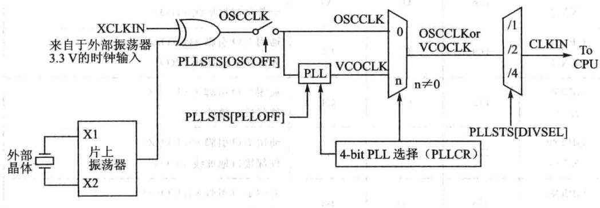
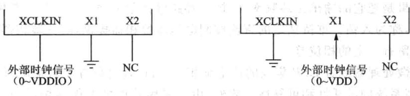
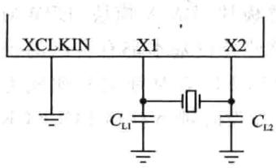
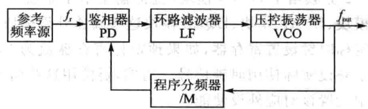
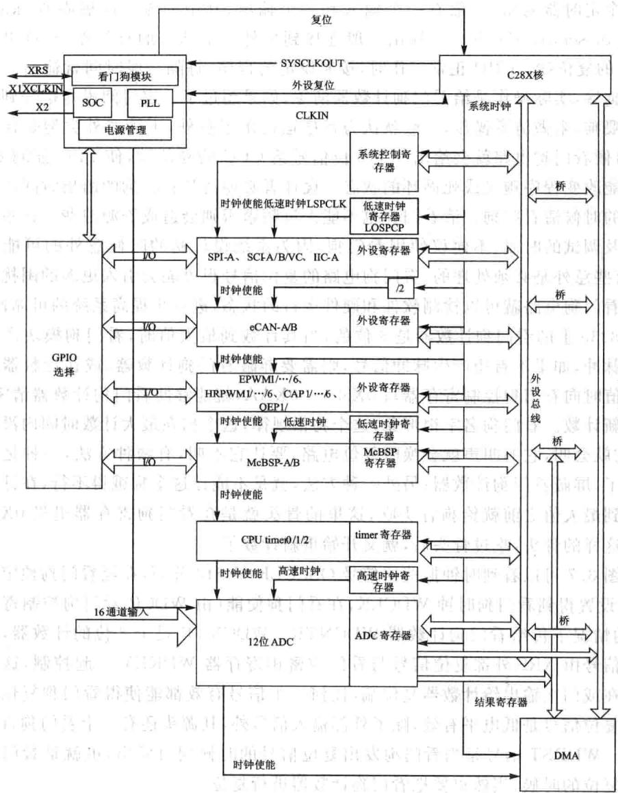
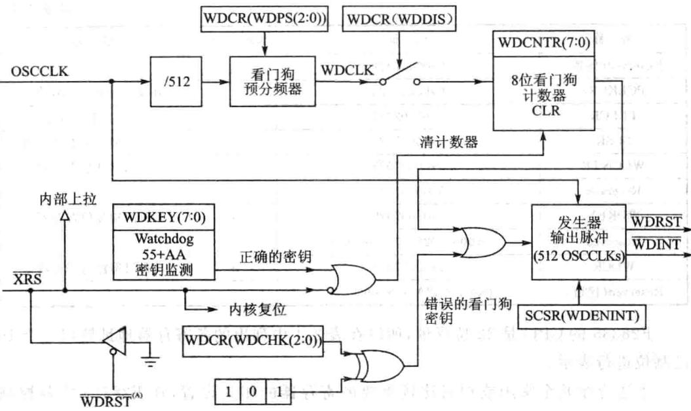

# 第 3 章

## F28335的时钟电路及系统控制

CPU控制器的主频是CPU的个极其重要的性能指标，决定着CPU处理一条基本指令花费的时间。主频由时钟信号产，时钟信号是所有运算与处理的源头。

### 3.1F28335的时钟源与锁相环电路

> 🔧 **交互式学习**：[PLL锁相环时钟配置组件](../interactive/components/pll_clock.html)

时钟信号然是由时钟信号的源头（简称时钟源）产，从28335内部的电路原理图中（如图3.1所示）可以看到，F28335的时钟源有两种：

①采用外部振荡器作为时钟源头（简称外部时钟），是在XCLKIN引脚提供一定频率的时钟信号，也可以通过复用的X1引脚接入，即由其他数字系统或外部振荡器引入。

②采F28335内部振荡器作为时钟源(简称内部时钟），在X1与X2之间连接一个晶体，就可以产生时钟源。

F28335的最高频率为150MHz，内部本身集成了振荡器，所以般不采用外部振荡器方式，直接采用内部振荡器的方式更多一些。

图3.1时钟与锁相环控制电路原理图

外部时钟源信号接入的方法有两种，分别针对的是电压为3.3V的外部时钟和1.9V的外部时钟。

外部时钟源接法1：如图3.2所，3.3V外部时钟源信号直接接XCLKIN引脚，X1引脚接地，X2引脚悬空不接，系统内高电平不能超过VDDIO，即

### 3.3V。

外部时钟源信号接方法2：如图3.3所示，1.9V的外部时钟源信号直接接X1引脚，XCLKIN引脚接地，X2引脚悬空不接，系统内高电平不超过VDD，即1.9V。

图3.2采用3.3V外部时钟源信号图3.3采用1.9V外部时钟源信号

内部时钟源信号接法是更常用的接法，如图3.4所示，XCLKIN引脚置地，X1、X2引脚之间直接接晶振。

晶体振荡器分为有源与无源晶振两类，功能上没有本质差别。无源晶振通常是晶体，现在常用石英晶体作晶振；有源晶振是由一个完整的谐振电路构成，F28335内部集成晶振就是有源晶振的谐振电路，但没有晶体，所以在X1与X2之间要接人一个晶体。源晶振当然本不会产振荡信号，需要借助于时钟电路才能产振荡信号，典型接法是在X1与X2之间接30MHz晶振。F28335作的最主频为150MHz，我们希望它能够工作在最的主频上，内部锁相环倍频最能做到10倍倍频。选择30MHz晶振是因为若直接采用更高频晶振，不仅价格会上升，而且晶振电路需要做EMI处理，需要设计特殊晶振电路，而30MHz晶振目前比较容易获取。

从图3.1可以看到，内部信号时钟源与外部信号时钟源通过异或门选择接后成为OSCLK即振荡器时钟信号，该信号受到寄存器PLLSTS（OSCOFF）位控制，该位置1，即图中开关合上，振荡器信号允许通过，通过后“兵分两路”，一路直接过去，一路进锁相环模块。一般不能直接采用OSCCLK这个信号，因为该信号的频率是由石英晶体产生得还不够高，需要进入锁相环分频和倍频后使用，所以要使能锁相环，设置寄存器PLLSTS（PLLOFF）。

锁相环路是一种反馈电路，锁相环的英全称是PhaseLockedLoop，简称PLL，可以控制晶振使其相对于参考信号保持恒定相位的电路，使用比较广泛。在数字通信系统中通常用来进行信号调制、在频率合成电路中，产生特定频率的信号、数据采集电路中用来进信号的同步。其基本工作原理如图3.5所示。

图3.4内部时钟源信号

图3.5锁相环电路原理

锁相环由鉴相器、环路滤波器和压控振荡器组成。鉴相器用来鉴别输入信号 与输出信号 之间的相位差，并输出误差电压 。 中的噪声和干扰成分被低通性质的环路滤波器滤除，形成压控振荡器（VCO）的控制电压 作用于压控振荡器的结果是把它的输出振荡频率 拉向环路输入信号频率 ，当二者相等时，环路被锁定，称为人锁。维持锁定的直流控制电压由鉴相器提供，因此鉴相器的两个输信号间留有定的相位差。

前微处理器或者DSP集成的上锁相环，可以通过软件实时地配置上外设时钟，提高系统的灵活性和可靠性。此外，由于采用软件可编程锁相环，所设计的系统处理器外部允许较低的作频率，而内经过锁相环微处理器提供较的系统时钟。这种设计可以有效地降低系统对外部时钟的依赖和电磁干扰，提高系统启动和运行的可靠性，降低系统对硬件的设计要求。

30MHz的OSCCLK信号经锁相环倍频后，倍频倍数通过寄存器PLLCR进设置，设置为10，为300MHz的VCOCLK时钟信号，F28335的时钟频率为150MHz，所以给CPU核的时候，还要进行一次二分频，分频通过PLLSTS进行设置。至此产生了F28335的150MHz的时钟信号。

### 3.2F28335的系统控制及外设时钟

锁相环模块除了为C28X内核提供时钟外，还通过系统时钟输出提供快速和慢速2种外设时钟。如果使能内部PLL电路，那么可以通过控制寄存器PLLCR软件设置系统的工作频率。但是要注意，在通过软件改变工作频率时，必须等待系统时钟稳定后才可以继续完成其他操作。此外，还可以通过外设时钟控制寄存器使能外部时钟。在具体应用中，为了降低系统功耗，不使用的外设最好将其外设时钟禁止。外设时钟包括快速外设和慢速外设两种，分别通过HISPCP和LOSPCP寄存器进设置。

通过图3.6中可以看到，C28X内核时钟输出通过LOSPCP低速时钟寄存器设置预分频，可设置成低速时钟信号LSPCLK，SPI、 MCBSP这些串口通信协议都使用低速时钟信号。通过HISPCP高速时钟寄存器设置预分频，可设置成高速时钟信号HSPCLK，A/D模块采用的是高速时钟信号，方便灵活设置A/D采样率。通过1/2分频给了eCAN模块，直接输出给了系统控制寄存器模块、DMA模块、EPWM模块、ECAP模块、EQEP模块这些高速外设模块。当然这些外设基本都有自己的预定标时钟设置寄存器，如果预定标寄存器值为O，那么LSPCLK等时钟信号就成为了外设实际使时钟信号。当然，要使这些信号需要在外设时钟寄存器PCLKCR中设置该对应外设使能。

在图3.6中也可以看出，DSP除了提供基本的锁相环电路外，还可以根据处理器内部外设单元的作要求配置需要的时钟信号。处理器还将集成的外设分成速和低速两组，可以方便地设置不同模块的工作频率，从而提高处理器的灵活性和可靠性。所以DSP设置与应用都是相当灵活的。

图3.6系统控制及外设时钟

### 3.3 看门狗电路

> 🔧 **交互式学习**：[喂狗与复位倒计时模拟器](../interactive/components/watchdog.html)

意外难免会发生，部分意外发生的时候，系统程序跑飞或进死循环，系统需要有定恢复的功能，这就需要看门狗。意外有很多，如强电类控制电路来说，最让人头疼的就是琢磨不透，抓不着的EMI干扰以及电源设计，对于软件而言有内存泄漏、程序健壮性等问题。看门狗，如图3.7所示，又叫watchdogtimer，从本质上来说就是个定时器电路，般有个输和个输出，其中的输叫做喂狗（kickingthedogorservicethedog)。输出一般连接到另外一个部分的复位端，在这里就是F28335的复位端。CPU正常工作时，按照设定的程序，每隔一段时间就输出一个信号到喂狗端，实际操作是给看门狗计数器清零，如果超过了一定时间没有信号到喂狗端进行喂狗，来做清零操作，一般就认为程序运出了意外，不管意外类型是什么样的，这时候看门狗电路就会给出个复位信号给CPU的复位端，使CPU强制复位，从可能改变程序跑飞或死循环的状态。设计者必须清楚看门狗的溢出时间以决定在合适的时候清看门狗。清看门狗也不能太过频繁否则会造成资源浪费。在系统设计初以及调试的时候，不建议使用看门狗，因为系统设计初的时候意外的可能性太多，且有些意外是必须处理的，看门狗电路的复位信号很可能会引更多的困扰。合理利用看门狗电路就可以检测软件和硬件运的状态，进一步提高系统的可靠性。

F28335上的看门狗计数器是8位的，当其计数到最大值时，看门狗模块产生一个输出脉冲，如果不希望产生脉冲信号，则需要屏蔽看门狗计数器，或在计数器未计到最值时向看门狗控制寄存器写0X55十0XAA，就能够使看门狗计数器清零，又开始重新计数。看门狗名字很形象，这个狗很规律，这个狗在最计数时间内没吃到骨头，它就会叫，它的叫声就会唤醒复位电路，要让它不叫，有两种方法，一种是把这条狗杀了，屏蔽看门狗计数器；另外一种方法，就是不能让这个狗饿得不，在计数器的值涨到最大值之前就给狗骨头吃，这里的骨头就是在看门狗寄存器扔0X55十0XAA这样的骨头，吃过骨头后，就又开始重新计数了。

从图3.7可以看到时钟振荡器信号OSCCLK经512分频，在经看门狗预定标器WDCR设置得到看狗时钟WDCLK，在看门狗使能（由WDCR看门狗控制寄存器控制）的情况下传给看门狗计数器WDCNTR。WDCNTR是个8位的计数器，其复位端的信号由XRS外部复位信号与看门狗密钥寄存器WDKEY起控制，这两个信号接在或门上输出给计数器复位端，任何个信号有效都能使得看门狗复位。其中外部复位信号是低电平有效，除了外部输信号外，其源头还有个看门狗动复位信号。WDRST信号是当看门狗发出复位信号的时候同时发出，也就是看门狗进强制复位的时候，当然也要把看门狗计数器进复位。

触发复位信号有两个信号源，也是通过或门输出，一个就是计数器的输出，还一个是逻辑校验部分，这是看门狗的又个安全机制，所有访问看门狗控制寄存器（WDCR）的写操作中，响应的校验位WDCHK必须是“101”，否则将会拒绝访问发出复位信号。复位信号发生器发出复位信号的同时，也发出了复位中断WDINT，WDINT信号使看门狗能在CPU处在IDLE(空闲模式）/STANDBY（备模式）下唤醒定时器。在STANDBY模式下，所有外设都将被关闭，只有看门狗电路还在工作。因为看门狗的时钟信号不受内核锁相环模块控制，是独运的。WDINT信号发送到LPM（低功耗)模块，因此可以将器件从STANDBY模式唤醒。在IDLE模式下，WDINT信号能够产生CPU中断，通过中断服务程序，从而使CPU脱离IDLE工作模式。然而CPU作在HALT模式下时，PLL和OSC单元均被关闭，因此看门狗电路也失效了，因此不能实现上述唤醒功能。

图3.7看门狗电路

### 3.4时钟单元相关寄存器

跟时钟单元有关的如振荡器、锁相环、看门狗以及处理器工作模式选择等控制电路的配置寄存器如表3.1所列。

|名称|地址|大小（×16）|描述|
|---|---|---|---|
|PLLSTS|0x00007011|1|PLL锁相环状态寄存器|
|Reserved(保留)|0x00007012~0x00007018|7||
|HISPCP|0x0000701A|1|高速外设时钟预分频寄存器|
|LOSPCP|0x0000701B|1|低速外设时钟预分频寄存器|
|PCLKCRO|0x0000701C|1|外设时钟控制寄存器0|
|PCLKCR1|0x0000701D|1|外设时钟控制寄存器1|
|LPMCR0|0x0000701E|1|低功耗模式控制寄存器0|

表3.1时钟单元相关寄存器表

续表3.1

|名称  7|地址|大小（×16）|描述|
|---|---|---|---|
|Reserved(保留)|0x0000701F  CN||1|
|PCLKCR3|0x00007020||1|
|PLLCR   引|0x00007021|1|PLL控制寄存器|
|SCSR|0x00007022|1|系统控制和状态寄存器|
|WDCNTR|0x00007023|1|看门狗计数寄存器|
|Reserved|0x00007024|1||
|WDKEY|0x00007025|1|看门狗复位寄存器|
|TvagReserved出窗|0x00007026~0×00007028|3||
|WDCR|0x00007029|1||
|Reserved(保留）|0x0000702A~0x0000702F|6||

F28335的CPU是32位寻址，所以在表3.1中列出的各寄存器地址皆以8个16进制位进行表示。

下边介绍个常或相对比较重要的寄存器的相关设置，在F28335中各控制寄存器基本都以16位为主。

## 1.外设时钟控制寄存器PCLCCR0、1、3

外设时钟控制寄存器PCLKCRO、1、3控制上各种外设时钟的工作状态，使能或者禁止。各位功能定义如表3.2表3，4所列。出

|位|名称|描述|位C|名称|描述|
|---|---|---|---|---|---|
|15|ECANBENCLK|ECAN-B时钟使能0:禁止;1：使能|8|SPIAENCLK|SPI-A时钟使能0:禁止;1：使能|
|14|ECANAENCLK|ECAN-A时钟使能0:禁止;1：使能|7~6|保留|保留|
|13|MBENCLK|McBSP-B时钟使能|市5|果SCICENCLK|SCI-C时钟使能|
|||0:禁止;1：使能||业|0:禁止;1：使能|
|12|MAENCLK|McBSP-A时钟使能0:禁止;1：使能|4|I2CAENCLK|I²C时钟使能2.J.410:禁止;1：使能|
|11|SCIBENCLK|SCI-B时钟使能0:禁止;1：使能|3|ADCENCLK|ADC时钟使能0:禁止;1：使能|
|10|SCIAENCLK|SCI-A时钟使能0:禁止；1：使能|2|TBCLKSYNCENCLK|PWM模块时基时钟同步使能0：禁止；1：使能|
|9|保留|保留|1~0|保留|保留|

表3.2 外设时钟控制寄存器PCLCCR0各位定义

|位|名称|描述|位|名称|小描述|
|---|---|---|---|---|---|
|15|EQEP2ENCLK|EQEP-2时钟使能0：禁止;1：使能|7~6|保留代医        际|保留|
|14|EQEP1ENCLK|EQEP-1时钟使能0:禁止;1：使能|5|EPWM6ENCLK|EPWM-6时钟使能0：禁止；1：使能|
|13|ECAP6ENCLK|ECAP-6时钟使能0:禁止；1：使能|4|EPWM5ENCLK|EPWM-5时钟使能0:禁止；1：使能|
|12|ECAP5ENCLK|ECAP-5时钟使能0:禁止;1：使能|3|EPWM4ENCLK|EPWM-4时钟使能0：禁止；1.使能|
|11|ECAP4ENCALK|ECAP-4时钟使能0:禁止；1：使能|2|EPWM3ENCLK|EPWM-3时钟使能0：禁止；1：使能|
|10|ECAP3ENCLK|ECAP-3时钟使能0:禁止；1：使能||EPWM2ENCLK2|EPWM-2时钟使能0:禁止；1：使能|
|9|ECAP2ENCLK|ECAP-2时钟使能0:禁止;1：使能|0|EPWM1ENCLK票|EPWM-1时钟使能|
|0:禁止：1：使能||||||
|8|ECAP1ENCLK|ECAP-1时钟使能0:禁止；1：使能||||

表3.3外设时钟控制寄存器PCLCCR1各位定义

|位|名称|描述|位|名称|描述|
|---|---|---|---|---|---|
|15|保留|保留|210|CPUTIMER2ENCLK|定时器2时钟使能|
|0：禁止；1：使能||||||
|14|保留|保留11|9|CPUTIMER1ENCLK|定时器1时钟使能0：禁止;1：使能|
|13|GPIOINENCLK|GPIO时钟使能0：禁止；1：使能|8|CPUTIMEROENCLK|定时器0时钟使能0:禁止；1：使能|
|12|XINTFENCLK|外扩接口时钟使能0:禁止;1：使能|7~0|保留|保留尚利|
|11|DMAENCALK|DMA时钟使能0:禁止;1：使能||||

表3.4外设时钟控制寄存器PCLCCR3各位定义

根据所使用到的外设，合理使能与禁止。设置语句如下：

SysCtrlRegs.PCLKCR0.bit.I2CAENCLK=1；//I²C时钟使能

SysCtr1Regs.PCLKCRO.bit.SCIAENCLK= 1;// SCI-A时钟使能

SysCtrlRegs.PCLKCRO.bit.SCIBENCLK= 1； //SCI–B时钟使能

## 2.高/低速外设时钟预分频寄存器HISPCP/LOSPCP

HISPCP和LOSPCP控制寄存器分别控制/低速的外设时钟，具体功能如表3.5和表3.6所列。

|位|名称|描述|
|---|---|---|
|15~3|保留|保留|
|2 2~0 道|HSPCLK|位2～O配置高速外设时钟相当于SYSCLKOUT的倍频倍数： 如果HISPCP不等于0,HSPCLK=SYSCLKOUT/（HISPCP×2）； 如果HISPCP等于O。HSPCLK=SYSCLKOUT; 000：高速时钟=SYSCLKOUT/1;001：高速时钟=SYSCLKOUT/2（系统默认）； 010：高速时钟=SYSCLKOUT/4;011：高速时钟=SYSCLKOUT/6； 100：高速时钟=SYSCLKOUT/8;101：高速时钟=SYSCLKOUT/10；|

表3.5高速外设时钟预分频寄存器位分配

|位型|名称|描述|
|---|---|---|
|15~3|责：保留|保留|
|2~0|LSPCLK|位2～0配置高速外设时钟相当于SYSCLKOUT的倍频倍数： 如果LOSPCP不等于0，LSPCLK=SYSCLKOUT/（LSSPCP×2)； 如果LOSPCP等于0。  $\scriptstyle { \mathrm { L S P C L K } } = { \mathrm { S Y S C L K O U T } } ;$  000：低速时钟=SYSCLKOUT/1；001：低速时钟=SYSCLKOUT/2（系统默认）； 010:低速时钟=SYSCLKOUT/4;011：低速时钟=SYSCLKOUT/6；|

表3.6低速外设时钟预分频寄存器位分配

## 3.锁相环状态寄存器(PLLSTS)

锁相环状态寄存器的位分配如表3.7所列。

|位|名称|描述|
|---|---|---|
|15~9|保留|保留|
|8~7|DIVSEL|时钟分频选择0001:4分频：10:2分频；11：1分频|
|6|MCLKOFF|丢失时钟检测关闭位0：默认设置，主振荡器时钟丢失检测使能1：主振荡器时钟丢失检测禁止，使用该模式不能发出慢行模式时钟，代码不允许受监测时钟电路影响，一旦失去了外部时钟信号后，代码不会受到影响|

表3.7锁相环状态寄存器位分配

续表3.7

|位|名称|路育脂描述|
|---|---|---|
|5|OSCOFF|振荡器时钟关闭位0:默认模式来自于X1、X1\X2或者XCLKIN振荡器时钟信号馈锁相器模块1:来自于X1、X1\X2或者XCLKIN振荡器时钟信号并不进锁相器模块。这没有关闭内部振荡器。振荡器时钟关闭位用来检测时钟丢失逻辑，当该位被设置后，不要进人HALT或者STANDBY模式或者写PLLCR值，这会导致不可预料的错误当该位被设置后，会影响到看门狗的操作，这时候看门狗的操作取决于时钟的输人端X1、X1\X2：看门狗不起作用XCLKIN：看门狗起作用，若要禁止需在设置OSCOFF之前操作|
|4|MCLKCLR|丢失时钟清除位0：若该位写0，无效。该位通常读数为0等答空善1:强制丢失时钟信号检测电路清除和复位。如果振荡器时钟丢失，检测电路会产生个系统复位，置位时钟丢失MCLKSTS，CPU被置于锁相器产生的无序时钟模式控制|
|3|MCLKSTS|丢失时钟信号状态位。系统复位后或需要检测时钟信号就要查看该位。正常情况下该位为O，对该位写操作无效，写MCLKCLR或者强制外部复位该位被清除0：正常模式，时钟信号没有丢失1:时钟信号丢失，CPU工作在无序频率模式|
||||
||||
|2|PLLOFF|锁相器关闭位。测试系统噪声的时候，该设置有用。该模式仅被用在锁相环控制寄存器位0时0：默认模式，锁相器开；1：锁相器关闭|
|1|Reserved|保留|
|0|PLLLOCKS|锁相器锁状态位0:表示锁相环控制寄存器的值被写入，锁相环在锁，在锁状态的时候，CPU的频率为振荡器时钟频率的一半，直到锁相环完全锁住1：说明锁相环已结束在锁状态，并且已经稳定|

## 4.锁相环控制寄存器(PLLCR)

锁相环控制寄存器于控制芯PLL的倍数，在向PLL控制寄存器进写操作之前，需要具备以下两个条件。

①在PLL完全锁住后，即PLLSTS[PLLLOCKS]1。

② 芯不能作在LIMP模式，即PLLSTSMCLKSTS]=0。

锁相环控制寄存器的具体功能参见表3.8所列：其中分频数是除以2还是除以4，由锁相环状态寄存器的DIVSEL位控制，表3.8为DIVSEL位为10情况，DI-

VSEL位为0或者1的时候进4分频，当DIVSEL位为11时，不分频。

|位|名称|描述|
|---|---|---|
|15~4|保留|保留|
|3~0|DIV|DIV选择PLL是否为旁路，如果不是旁路则设置相应的时钟倍频倍数  $0 0 0 0 : \mathrm { C L K I N } = \mathrm { O S C L K } / 2 ( \mathrm { P L L } \not { y } | \not { \mathcal { F } } _ { \not { \ F } } ^ { * } \not { \mathbb { H } } ) : 0 0 0 1 : \mathrm { C L K I N } = ( \mathrm { O S C C L K } \times 1 , 0 ) / 2$   $0 0 1 0 _ { \colon } \mathrm { C L K I N } = ( \mathrm { O S C C L K X } \times 2 . 0 ) / 2 _ { \ ! } 0 0 1 1 _ { \colon } \mathrm { C L K I N } = ( \mathrm { O S C C L K } \times 3 . 0 ) / 2$   $0 1 0 0 : { \mathrm { C L K I N } } = ( { \mathrm { O S C C L K } } \times 4 . 0 ) / 2 ; 0 1 0 1 : { \mathrm { C L K I N } } = ( { \mathrm { O S C C L K } } \times 5 . 0 ) / 2$   $0 1 1 0 , \mathrm { { C L K I N } = ( O S C C L K \times 6 . ~ 0 ) / 2 , 0 1 1 1 , C L K I N = ( O S C C L K \times 7 . ~ 0 ) / 2 }$|

表3.8锁相环控制寄存器位分配

## 5.看狗控制寄存器WDCR

看门狗控制器WDCR各位信息如表3.9所列。

|位|名称|值|描述|
|---|---|---|---|
|15~8|保留|||
|7|WDFLAG|01|看门狗复位状态标志位看门狗没有满足复位条件看门狗满足了复位条件|
|6|WDDIS|01|看门狗禁止使能看门狗功能禁止看门狗模块|
|5~3|WDCHKA||看门狗逻辑校验位WDCHK(2～0)必须写101，写其他值都会引起器件内核复位|
||||看门狗预定标设置位WDPS(2~0)配置看门狗计数时钟（WDCLK)相当于OSCCLK/512的倍率：|
|2~0|WDPS|000001010011100101110111|WDCLK = OSCCLK/512/1WDCLK=OSCCLK/512/1）器密宝和造WDCLK=OSCCLK/512/2WDCLK=OSCCLK/512/4WDCLK=OSCCLK/512/8WDCLK=OSCCLK/512/16WDCLK=OSCCLK/512/32WDCLK=OSCCLK/512/64|

表3.9看门狗控制寄存器WDCR位分配

## 6.系统控制和状态寄存器SCSR

系统控制和状态寄存器SCSR包含看门狗溢出位和看门狗中断屏蔽/使能位，具体参见如表3.10所列。

表3.10系统控制和状态寄存器SCSR

|位|名称|描述|
|---|---|---|
|15~3|保留|保留|
|2|WDINTS|看门狗中断状态位，反映看门狗模块的WDINT信号状态。如果使用看门狗中断信号将器件从IDLE或STANDBY状态唤醒，则再次进到IDLE或STANDBY状态之前必须WDINTS信号无效|
||WDENINT|WDENINT=1:看门狗复位信号WDRST被屏蔽，看门狗中断信号WDINT使能WDENINT=O：看门狗复位信号使能WDRST，看门狗中断信号WDINT屏蔽复位后默认为0|
||WDOVERRIDE|如果WDOVERRIDE位置1，允许用户改变看门狗控制寄存器的看门狗屏蔽位；如果通过向WDOVERRIDE位写1将其清除，则用户不能改变WDDIS位的设置，写0没有影响。如果该位被清除，只有系统复位后才会改变状态。用户可以随时读取该状态位|

## 7.看狗计数寄存器WDCNTR

看门狗计数寄存器WDCNTR各位信息如表3.11所列。

|位|名|描述|
|---|---|---|
|15~8|保留|保留|
|7~0|WDCNTR|位0～7包含看门狗计数器当前的值。8位的计数器将根据看门狗时钟WD-CLK连续计数。如果计数器溢出，看门狗初始化中断。如果WDKEY寄存器写有效的数据组合将使计数器清零|

表3.11看门狗计数寄存器

## 8.看门狗复位密钥寄存器WDKEY

看门狗复位密钥寄存器WDKEY各位信息如表3.12所列。

|位|名称|描述|
|---|---|---|
|15~8|保留|保留|
|7~0|WDKEY|依次写人0x55和0xAA到WDKEY将使看门狗计数器清零。写入其他的任意值都会产生看门狗复位。读该寄存器将返回WDCR寄存器的值|

表3.12看门狗复位密钥寄存器

### 3.5把教你应看狗

## 1.实验目的

①掌握看门狗的设置与使用。

②掌握系统初始化包括系统控制初始化、锁相环、看门狗初始化、外设时钟使能。

③进一步了解CCS编程。

④深理解DSP的时钟管理机制以及看门狗运作机制。

## 2.实验主要步骤

①配置CCS3.3软件并打开。配置方法见本书配套资料。

②连接仿真器的USB与计算机，将仿真器的另一端JTAG端插到YX-F28335开发板的JTAG针处。

③在CCS中选择project→Open菜单项，加载 WATCHDOG目录中的WATCHDOG. pjt.

④在CCS中选择File→Load Program菜单项，加载Debug目录下的WATCH-DOG. out。

⑤打开监视窗口，添加监视变量WakeCount,LoopCount。

⑥在CCS中选择Debug→Run菜单项。

⑦观察WakeCount和LoopCount变量的变化。

⑧修改程序，将main程序for循环中，原来注释掉的ServiceDog（)加入，即加入喂狗程序。

⑨观察WakeCount和LoopCount变量的变化。

## 3.实验原理说明

看门狗基本工作原理为：设本系统程序完整运周期的时间是 ,看门狗的定时周期为 ，在程序正常运行时，定时器不会溢出，若由于干扰等原因使系统不能在 时刻修改定时器的记数值，定时器将在 时刻溢出，引发系统复位，使系统得以重新运，从而起到运状态监控的作用。

由于看门狗是对系统的复位或者中断的操作，所以不需要外围的硬件电路。要实现看门狗的功能，只需要对看门狗的寄存器组进操作。即对看门狗的控制寄存器（WDCR）、看门狗数据寄存器（WDKEY）、看门狗计数寄存器（WDCNTR）操作。

程序主要设计流程如下：

①include相关头件、全局变量等定义。

②主函数中通常先初始化系统控制、初始化GPIO、清理中断，初始化中断向

量表。

③与看门狗相关的中断操作设置。

设置看门狗中断操作，包括全局中断和看门狗中断的使能，看门狗中断向量的定义。对看门狗控制寄存器（WDCR)的设置，包括设置预分频比例因子、分频器的分频值、中断使能和复位使能等。

对看门狗密钥寄存器（WDKEY）和看门狗计数寄存器（WDCNTR)设置。启动看门狗定时器。

主要程序如下：

## 4.实验观察与思考

①看门狗运作机制是怎么样的？

②如何初始化时钟？

③主程序中的主要步骤是如何进行的？

④如何合理应看门狗运作机制?
