## F28335的存储器及其地址分配

时钟越快，处理基本逻辑运算的速度越快，处理过程中处理对象（数据）以及处理方法（指令）这些信息都要合理地存放与读取，存放这些信息的存储器以及存储器架构也是影响控制器速度与性能的重要指标。我们购买计算机的时候，除了关注CPU主频外，往往也非常关注存储器的配置情况，例如内存的大小、硬盘的大小。本章介绍TMS320F28335的存储器具体配置。

### 4.1F28335存储空间的配置

20世纪30年代中期，美国天才科学家冯·诺依曼大胆地提出：抛弃十进制，采用二进制作为数字计算机的数制基础。同时，他还说预先编制计算程序，然后由计算机按照人们事前制定的计算顺序执行数值计算工作。由于指令和数据都是二进制码，指令和操作数的地址又密切相关，因此，当初选择指令与数据存储在一起，经由同一总线传输是很自然的。但是，这种指令和数据共享同一总线的结构，取指令和存取数据要从同一个存储空间存取，经由同一总线传输，因而它们无法重叠执行，只有一个完成后再进下一个，使得信息流的传输成为限制计算机性能的瓶颈，影响了数据处理速度的提高。于是哈佛人提出了指令存储和数据存储分开的存储器结构，这样就可以同时读取指令和数据，大批量处理数据的时候效率显著提高，这就是“哈佛结构”。在哈佛结构的基础上，人们又进一步提出了改进的哈佛结构，其结构特点为：使用两个独立的存储器模块，分别存储指令和数据，每个存储模块都不允许指令和数据并存，以便实现并行处理；具有一条独立的地址总线和一条独立的数据总线，利用公用地址总线访问两个存储模块（程序存储模块和数据存储模块），公用数据总线则被用来完成程序存储模块或数据存储模块与CPU之间的数据传输。同时将指令的基本操作，分解为几个基本元操作，这些元操作可以流水执行，并且对程序进行分支预测，进行多级流水线操作，使得数据处理的效率大大提高。

F28335DSP就是采用多级流水线的增强的哈佛总线结构，能够并访问程序和数据存储空间。在F28335芯内部集成了大量不同的存储介质，F28335上有256KX16位的FLASH,34KX16位的SRAM,8K×16位的BOOTROM,2K×16位的OPTROM，采用统一寻址方式（程序、数据和I/O统一寻址），从而提高了存储空间的利用率，方便程序的开发。除此之外，F28335DSP还提供了外部并扩展接XINTF，可进一步外扩存储空间。

F28335的CPU内核本身并不包含任何存储器，通过总线访问芯内部集成的或者外部扩展的存储器。其总线按照改进哈佛结构，分成32位的数据读、数据写数据总线，地址读、地址写总线，公用数据总线即程序总线，包括22位的程序地址总线，用于传送程序空间的读/写地址，32位读数据程序总线，用于读取程序空间的指令或者数据。改进的哈佛结构其实是综合了冯·诺依曼结构的简洁，哈佛结构的效。F28335应32位数据地址和22位程序地址控制整个存储器以及外设，最可寻址4G字的数据空间和4M字程序空间。通常写的程序所需存放空间4M足够了，若大于4M意味着程序空间不够处理，在实际中采用分页处理的方式，因为实际寻数据空间为4G，通过分页机制可以扩展实际寻址的程序空间。要找到对应程序的空间地址与数据的空间地址，就需要对空间地址进行编码，将空间地址进行逻辑编码，就是映射。F28335处理器的存储器配置及地址映射如图4.1所示。

F28335对数据空间和程序空间进了统编址，图4.1的映射表就像是各个空间的地图样，有些空间既可以作为数据空间也可以作为程序空间，有些空间只能作为数据空间，有些空间是受密码模块保护的，有些空间地址是作为保留的，具体内容就要仔细对照这个地图进行查阅。

图4.1右半部分主要是通过XINTF外扩的存储空间，当内数据存储空间不够的时候，可以外扩存储器。其中的保留区是内存储器所占的地址。

F28335的各存储器地址都是连续编码的，且空间地址是唯一的。图4.1左半部分，首先对M0SARAM从0x000000开始编码一直到0x000400结束，可以计算出这是1KX16的大小。当STE状态寄存器VMAP=0时,0x000000～0x000040作为中断向量的存储空间。M1SARAM从0x000400～0x000800也是1K×16位大小，接着是外设帧0、1、2、3，这4个空间只能是数据空间，不能是程序空间，这些空间存放着F28335外设寄存器，其中外设帧1、2、3空间还标注着Protected，表示这3个空间存放的寄存器不可以随便配置，若要对存放在Protected空间内的寄存器进行配置，要进行EALLOW声明，以EDIS结束声明，起到保护和警示作用。中间插了个PIE向量存储空间。0x002000～0x005000是保留区，这段保留区被用作外部扩展区0，从这里也可以看到保留区的作用，这个外扩区同样也是受保护区，要改写存放在该区域的寄存器值时同样需要EALLOW声明。外扩区还有两个分别为1M的6区与7区。接下来是L0～L7的SARAM区，均为4K大小，下边是256K的FLASH空间，中间0x33FFF8～0x340000共128位用来保存CSM模块密码，保护FLASH、L0～L7、OTP空间内存放的数据，下边是2K的OTP空间，其中1KOTP空间主要是TI来测试的引导程序，接下来是L0～L3SARAM空间，这是个双映射空间，也就是名字是一样的，但空间地址是不样的，这样有利于数据备份，接下来是个8K的BOOTROM空间，用来存放Bootloader程序，系统初始引导程序。

|地址范围 0x000000 0x000040|片上存储器|片外扩展存储器||0x004000 0x005000|
|---|---|---|---|---|
|0x000400 0x000800 0x000D00 0x000E00 0x002000|数据空间 程序空间|购国|||
||M0向量RAM（32×32）||||
||M0 SRAM(1K×16)|大MA 保留|||
|M1 SRAM(1K×16)||话|||
|PFO||成供心大|||
|PIE中断 向量表|保留|国乐火西|||
|0x005000 0x006000 0x007000 0x008000 0x009000 0x00A000 0x00B000 0x00C000 0x00D000 Ox00E000 0x00F000 0x010000 0x300000 0x33FFF8 0x340000 0x380000|PFO||外部区域0扩展4K×16CS0||
|保留 PF3 DMA|||||
|PF1 PF2|保留||||
|L0SRAM(4K×16)|||||
|L1 SRAM(4K×16)||保留|||
|L2SRAM(4K×16)|||||
||L3 SRAM(4K×16)||||
||L4SRAM(4K×16)||||
||||外部区域7扩展1M×16CS7||
||L5 SRAM(4K×16)|外部区域6扩展1M×16CS6|0x100000||
|L7SRAM(4K×16）|L6SRAM(4K×16）||0x200000 0x300000||
|保留|||||
|FLASH(256K×16) 128位密码|||||
|TIOTP(1K×16)|保留||||
|0x380400 0x380800|用户OTP(1K×16)||保留||
||||||
|0x3F8000|保留||||
|0x3F9000|L0SARAM(4K×16)||||
|0x3FA000|L1 SARAM(4K×16)||||
|0x3FB000 0x3FC000|L2SARAM(4K×16)||||
||L3 SARAM(4K×16)||||
|0x3FE000|保留||||
||BootROM(8K×16)||||
|0x3FFFFC|||||
||||||
||BROM向量表-ROM||||
|（32×32)|||||

图4.1F28335处理器存储器配置及地址映射

### 4.2 F28335存储器特点

## 1.片上SARAM

SARAM即为单口随机读/写存储器，有别于双口RAM，双RAM是在一个

SRAM存储器上具有两套完全独立的数据线、地址线和读写控制线，并允许两个独立的系统同时对该存储器进行随机性访问。即共享式多端口存储器。F28335片内共有34KX16位单周期单次访问随机存储器SRAM，被分成10个块，它们分别为M0、M1、L0~L7。

M0和M1块SRAM的大小均为1KX16位，当复位后，堆栈指针指向M1块的起始地址，堆栈指针向上生长。MO和M1段都可以映射到程序区和数据区。

L0～L7块SRAM的大小均为4KX16位，既可映射到程序空间，也可映射到数据空间，其中L0～L3可映射到两块不同的地址空间并且受片上的FLASH中的密码保护，以免存在上面的程序或数据，被他人非法复制。

## 2.BOOT ROM

BOOTROM，可以叫做引导ROM，主要装载了TI的引导装载程序，实现DSP的Bootloader功能。MP/MC=0时，DSP被设置为微计算机模式，CPU在复位后，指令跳转到0x3FFC00～0x3FFFBF区间内，执行Bootloader程序，在后续F28335的引导程序章节中会进一步介绍系统是如何引导的。 e, 1H020

## 3.上FLASH和OTP

F28335片上有256KX16位嵌入式FLASH存储器和2K×16位一次可编程EEPROM存储器，它们均受片上FLASH中的密码保护。FLASH存储器由8个32K×16位扇区组成，用户可以对其中任何一个扇区进行擦除、编程和校验，而其他扇区不变。但是，不能在其中一个扇区上执程序来擦除和编程其他的扇区。其主要有以下特点：

➢整个存储器分成多段。

➢代码安全保护。

》低功耗模式。

》可根据CPU频率调整等待周期。

FLASH流水线模式能够提高线性代码的执效率。

F28335内FLASH存储器的分段情况如表4.1所列。

|地址范围|程序与数据空间|
|---|---|
|0x300000~0x307FFF|分段H（32K字×16）|
|0x308000~0x30FFFF|分段G（32K字×16）|
|0x310000~0x317FFF|分段F（32K字×16）|
|0x318000~0x31FFFF|分段E（32K字×16）|
|0x320000~0x327FFF|分段D（32K字×16）|
|0x328000~0x32FFFF|分段C（32K字×16）|

表4.1F28335片内FLASH分段

续表4.1

|地址范围|程序与数据空间|
|---|---|
|0x330000~0x327FFF|分段B（32K字×16）|
|0x338000~0x33FF7F|分段A（32K字×16）|
|0x33FF80~0x33FFF5|当采用密码保护时，编程为0x0000|
|0x33FFF6~0x33FFF7|FLASH启动入口地址（这里有程序分支指令）|
|0x33FFF8~0x33FFFF|密码（128位）（不要编码成全0）|

28335的OTP存储器也是统一映射到程序和数据存储器空间，即可以为数据存储器也可以为程序存储器，与FLASH存储器不同的是它只能被用户写一次，不能再次被擦除。

FLASH与OTP存储器的功耗模式有以下3个状态：

## (1）重启或睡眠状态

芯复位后，FLASH与OTP处于睡眠状态，CPU在FLASH和OTP存储器映射区域读数据或取代码使得状态改变，从睡眠状态变为备用状态，进一步会变为激活状态，在状态转换过程中，CPU自动延迟等待，一旦状态转换完成，CPU的访问恢复正常。

## (2)备用状态

该状态的功耗要比睡眠状态大，需要较短的时间就转变为激活状态或读状态。在状态转换过程中，CPU动延迟等待，旦状态转换完成，CPU的访问恢复正常。

## (3)激活状态

在激活状态下，CPU在FLASH与OTP的存储器映射空间内读取访问收到FBANKWAIT寄存器与FOTPWAIT寄存器控制。在状态转换时，从低功耗模式转换到了高功耗模式，延时是必要的，通过延时可以使FLASH能够处在稳定的激活状态。在延时期间，CPU都会自动等待直到延时完成为止。睡眠到备用受FSTDB-WAIT控制，备用到激活受FACTICVEWAIT寄存器控制。

对FLASH和OTP存储器来说，CPU读写数据操作主要有以下3种形式：

①32位取指令。

②16位或32位数据空间读操作。

③16位程序空间读操作。

一旦FLASH处于激活状态，那么对存储器映射区的访问可以被分为FLASH访问或OTP访问，OTP存储器小于4M，在22位取址范围内，FLASH则大于4M，所以FLASH访问的时候又分为了存储器的随机访问与存储器的页访问。FLASH存储器是以阵列形式组成，每有2048位。次访问的某称为随机访问，若随后又访问该则被称为页访问，一个随机和页访问的等待状态数可以通过FBANK-

WAIT寄存器编程配置，随机访问的状态数由RANDWAIT位来控制，指定访问的等待状态数由PAGEWAIT位来控制。

OTP存储器的访问速度通常可以通过寄存器FOTPWAIT中的OTPWAIT中位来控制。OTP存储器的访问时间FLASH要长。

FLASH的流水线模式：FLASH存储器数据掉电不丢失，所以通常用来保存应用代码。在代码执期间，除非有中断发生，指令可以从存储器地址中连续获取，连续地址中的部分代码组成了主要的代码，又称为线性代码。为了提高线性代码的执行性能，可以采用FLASH流水线模式。FLASH流水线模式在默认状态下无效，通过设置FOPT寄存器中ENPIPE位使能流线模式，并且FLASH流线模式独于CPU的流水线模式。

每次从FLASH或OTP中读取64位后访问个取指令，当FLASH流线模式被激活，可以从存储在64位缓冲器中读取，然后指令缓冲器中的内容被送到CPU进处理。

2个32位指令或者4个16位指令可以存放在个单独的64位访问区域中，F28335的指令多数是16位，因此从FLASH存储器中每取64位指令就像是在预取缓冲器中有4个指令等待CPU处理，在等待处理指令的过程中，FLASH流线会动开始访问FLASH存储器并预取下个64位指令。通过采这种技术，FLASH或OTP存储器连续代码执效率得到提。FLASH或OTP存储器相关配置寄存器如表4.2所列。

|名称|地址|长度/×16位|寄存器描述|
|---|---|---|---|
|FOPT|0x000A80|1|FLASH选择寄存器|
|Reserved|0x00 0A81|1|保留|
|FPWR|0x000A82||FLASH功耗模式寄存器|
|FSTATUS|0x000A83|1|状态寄存器|
|FSTDBYWAIT|0x000A84||FLASH由睡眠到备用寄存器|
|FACTIVEWAIT|0x000A85|1|FLASH由备用到激活寄存器|
|FBANKWAI|0x000A86|1|FLASH读等待状态数寄存器|
|FOPTWAIT|0x000A87|1|OTP读等待状态寄存器|

表4.2 F28335OTP存储器分段

FLASH与OTP处于激活状态时，户可以通过执程序读取FLASH寄存器的数据，但是在FLASH和OTP存储器内代码正在运或正在访问存储器时，不能对寄存器进行写操作，这些寄存器也都是受保护的，配置的时候需要EALLOW声明，以EIDS结束。FLASH选择寄存器FOPT字段描述如表4.3所列。

|位|名称|功能描述|
|---|---|---|
|15~1|Reserved|保留|
|0|ENPIPE|使能FLASH流水线模式当该位被置1时，流水线模式被激活，该模式通过预取指令方式提高了取指令的效率，在该模式下，FLASH的访问周期（页访问或随机访问)必须大于0，默认状态为0|

表4.3 F28335FLASH选择寄存器FOPT字段描述

FLASH功耗模式寄存器FPWR各位信息如表4.4所列。

|位|名称|功能描述|
|---|---|---|
|15~2|Reserved|保留|
|1~0|PWR|FLASH功耗模式位，向这些位写操作会改变FLASH的BANK和PUMP当前功耗模式00:睡眠模式01:等待状态10：保留11:激活状态使能FLASH模式（高功耗）|

表4.4F28335FLASH功耗模式寄存器器FPWR字段描述

### 4.3代码安全模块CSM

代码安全模块(CSM)是F28335上程序安全性的主要段，它禁未授权的户访问内存储器，禁私有代码的复制或者逆向操作。

## 1.功能说明

安全模块限制CPU去访问内存储器。实际上，对各种存储器的读/写访问都是通过JTAG端口或外设来进的，而CSM模块所谓的代码安全性主要是针对内存储器的访问来定义的，来禁未经授权去复制私代码或数据。

当CPU访问内存储器受到限制的时候，器件即处于保密、“安全”的状态。当处于保密状态时，根据程序计数器当前指针的位置，可能有两种保护类型。如果当前代码正运在受保护的内部安全存储器模块上时，仅仅是JTAG（即仿真器)的访问被阻断，而受安全保护的代码是可以访问受安全保护的数据的，相反，如果代码运在不受保护的非安全区时，所有对受保护的安全区的访问都被阻断。户的代码可以动态地跳进或者跳出受保护的安全区，因此允许程序从不受保护的安全区域调用函数，类似地，中断服务程序放在了安全受保护区域，而主程序运在不受保护的非安全区域。因为程序中总是有部分受到保护的。通过一个128位的密码（相当于:8个16位的字)来对安全区来进加密或解密。这段密码保存在FLASH的最后8个字中（0X33FFF8～0X33FFFF），也就是密码区中（PWL），通过密码匹配（PMF），可以解锁器件。

如果密码保护区中的128位数都是同个数，这个器件不受保护，全是同个数有两种可能，一种全为O，另一种全为1，一个新的FLASH或FLASH被擦除后，就变为全1了，这样只要读一下密码区，就能破解，还一种情况，就是全为0，这时候器件是被加密了，但是不管密钥寄存器的内容是什么，器件都处在加密状态，即该器件无法解锁，这时候芯就被完全锁住了。因此不要用全0作为密码。如果在擦除FLASH的期间，芯片复位了，那这个芯片的密码就不确定了，也不能解锁。A

芯不能解锁（用全零作为密码、FLASH擦除期间复位、忘记密码），这时候芯就完全锁住了，只能用来调试，而无法重新烧写程序。

用户用来解锁的寄存器为密钥寄存器，在存储空间映射地址为0x00000AE0～0x00000AE7，该区域受EALLOW保护。当这个128位的密钥为全1时，密钥寄存器不需要与之匹配。当开始调试FLASH区加密的芯时，仿真器取得CPU的控制权需要一定的时间，在此期间，CPU正在开始运行，并且会执行保护加密区的操作，这个操作会引起仿真器断开连接，有两个方法可以解决这个问题。

①采Wait-in-Reset仿真模式，这种法是让芯保持在复位状态直到仿真器得到控制，这种方法要求仿真器要能支持这种模式。

②采Branch tocheckbootmode引导。这个法会持续不停地让引导模式选择引脚。可以选择这种引导模式；一旦仿真器通过重新映射PC到另外的地址或者改变引导模式选择引脚以进引导进连接。

## 2.CSM对片内资源的影响

CSM影响到的片内资源如表4.5所列。CSM对下述片内资源无影响，如表4.6所列。

|地址|存储器|地址|存储器|
|---|---|---|---|
|0x000A80~0x000A87|FLASH配置寄存器|0x380000~0x3803FF|TI（OTP)存储器（1K×16）|
|0x008000~0x008FFF|LOSARAM(4K×16)|0x380400~0x3807FF|用户（OTP）存储器（1K×16)|
|0x009000~0x009FFF|L1SARAM(4K×16）|0x3F8000~0x3F8FFF|L0SARAM(4K×I6)镜像|
|0x00A000~0x00AFFF|L2 SARAM(4K×16)|0x3F9000~0x3F9FFF|L1 SARAM(4K×16）镜像|
|0x00B000~0x00BFFF|L3 SARAM(4K×16)|0x3FA000~0x3FAFFF|L2SARAM(4K×16)镜像|
|0x300000~0x33FFFF|FLASH(64K×16,32×16,或者16×16)|0x3FB000~0x3FBFFF|L3SARAM(4K×16）镜像|

表4.5受CSM影响的片内资源

①未指定加密的SARAM。无论芯有没有加密，这块存储器都能够自由访问和在其内部运行程序。

②引导ROM。ROM内容的可见性不受CSM影响。

③内外设寄存器。论芯有没有被加密，内外设寄存器都可以通过内外运的代码来进初始化。

④中断向量表。无论芯有没有被加密，中断向量表都可以被读/写。

|地址|存储器|地址|存储器|
|---|---|---|---|
|0x000000~0x0003FF|MO SARAM(1K×16）|0x00C000~0x00CFFF|L4SARAM(4K×16)|
|0x000400~0x0007FF|M1 SARAM(1K×16）|0x00D000~0×00DFFF|L5SARAM(4K×16)|
|0x008000~0x000CFF|外设帧0（2K×16）|0x00E000~0x00EFFF|L6SARAM(4K×16）|
|0x000D00~0x000FFF|PIE中断向量表RAM（256X16）|0x00F000~0x00FFFF|L7 SARAM(4K×16）|
|0x006000~0x006FFF|外设帧1（4K×16）|0x3FF000~0x3FFFFF|引导ROM(4K×16）|
|0x007000~0x007FFF|外设帧2（4K×16）|||

表4.6不受CSM影响的片内资源

无论芯有没有被加密，都可以通过JTAG将代码装上表不受CSM影响的存储器内运行，调试代码，并初始化外设寄存器。

## 3.密码匹配流程

对芯片解密的过程被称为密码匹配流程（PMF）。图4.2描述了该操作流程。PMF本质上讲就是个从PWL中进8次哑读并对KEY寄存器进8次写的过程。PMF在进解除DSP的安全性操作时可能遇到两种情况：

情况1：如果DSP在PWL处有密码，需进如下步骤来解除安全保护：

①从PWL处进8次哑读。

②写密码到KEY寄存器。

③如果密码正确，DSP就解锁了，否则DSP仍被锁着。

情况2：如果DSP没有密码保护，那么在PWL处应该是全1，需进如下步骤：

①从PWL处进哑读。

②上面的操作完成后，DSP立马就解锁了，可以随意对存储器进行操作。

如果要解密芯，在对存储器读/写或编程前，不管DSP受没受到密码保护，一定要先进哑读操作。什么叫哑读？就是PWL中的内容实际上是不能读出的，执读操作后读出的数据与PWL中真正的内容并不一致（全1和全0除外）。下面举个实例，说明如何使用代码安全模块。

因为在DSP复位后，L0和L1存储器是受安全保护的，所以若要使这两个空间就必须进解密操作，下面是个C语编程的例子，用于说明如何解除DSP对LO和L1的保护。

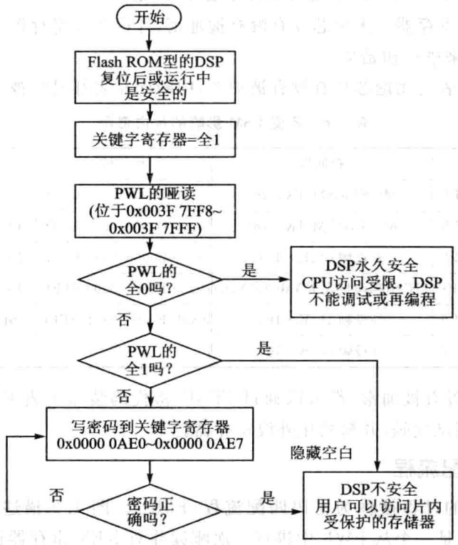

//在调试阶段保持所有的密码字为OxFFFF不变，因此下面向KEYO～KEY7寄存器中//写密码字的语句可以省略。否则就要向KEY寄存器中写密码字

在执了上述程序后，就可以毫无阻碍地对L0和L1存储器进读写了。

### 4.4 外部存储器接XINTF

## 1.外部存储器接XINTF概述

F28335DSP采用增强的哈佛总线结构，能够并行访问程序和数据存储空间。内部集成了量的SRAM、ROM、以及FLASH等存储器，并且采统一寻址式（程序、数据和I/O统寻址），从而提高了存储空间的利用率，方便程序的开发。尽管F28335片内有256KX16位的FLASH，34KX16位的SRAM，8KX16位的BOOTROM，2KX16位的OPTROM，但对于复杂的应而，程序空间与数据空间依然有可能不够，所以需要进一步扩展，外部接XINTF采复异步总线，可用于扩展SRAM、FLASH、ADC、DAC模块等。XINTF接口分别映射到3个固定的存储器映射区域，模块的信号如图4.3所示。

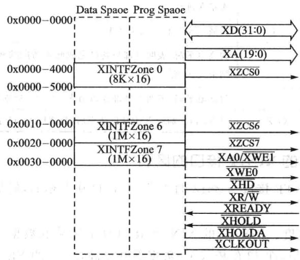

图4.3XINTF模块信号

XINTF每个区域都有个选信号线，当对某个区域进读写访问时，就要将信号线置低，某些器件将两个区域的选信号通过内部的与逻辑连接在一起，从而形成个共用的信号线，在这样的情况下，同存储器可以与两个XINTF区域相连，要区分这两个区域就要与区分这两个区域的逻辑电路相连。

XINTF的存储器的3个区域中的任何一个都可通过编程设定独的等待时间，选通信号建立时间及保持时间，每个区域的读写操作都可以配置成不同的等待时间，另外可以通过XREADY信号线延长等待时间，XINTF接口的这些特性允许其访问不同速率的外部存储器设备。通过XTIMINGx寄存器可配置每个区域的等待时间及选通信号的建于保持时间。XINTF接口的访问时序是以内部时钟XTIMCLK为基准的，XTIMCLK信号频率可配置为系统时钟SYSCLKOUT的频率或其半。

XINTF接口的信号如表4.7所列。

|信号名称|输人输出特性|功能描述|
|---|---|---|
|XD[31:0]|1/0/Z|双向的数据总线，在16位模式下只是用XD[15:0]|
|XA[19:1]|0/Z|地址总线，地址在XCLKOUT的上升沿被锁存到地址总线上，并保持到下一次访问操作|
|XA0/XWE1|0/Z|在16位的数据总线模式下，作为地址线的最低位XA0；在32位数据总线模式下，作为低字节的写操作的选通线XWE1|
|XCLKOUT|0/Z|输出时钟|
|XWE0|0/Z|写操作的选通线，低电平有效|
|XRD|0/Z|读操作的选通线，低电平有效|
|XR/W|0/Z|读/写信号线，高电平时，表明读操作正在进行，低电平时，表明写操作正在进行|
|XZCS0/6/7|0|区域0/6/7的片选信号线|
|XREADY|I|为高电平时，表明外部设备已完成此次访问的相关操作，XINTF可结束此次访问                       00001|
|XHOLD|1|为低电平时，表明有外部设备请求XINTF释放其总线|
|XHOLDA|O/Z|当XINTF响应XHOLD请求后，将XHOLDA置低|

表4.7XINTF接口的信号

## 2.与F2812的XINTF接口的区别

F28335的XINTF接口与2812的XINTF接口基本相似，但是需要注意以下点区别：

①数据总线宽度。F28335的XINTF接每个区域的数据总线宽度可以独配置成16位或32位，在32位模式下，数据吞吐量高，2812的XINTF接口只具有16位的数据总线。

②地址总线宽度。F28335的XINTF地址总线扩展到20位，区域6与区域7的寻址范围为1M×16，2812中，地址范围为512K×16。具。管

③ DMA访问。F28335中XINTF的3个区域都与片上的DMA模块相连，支持DMA读写方式，2812中XINTF的3个区域不支持DMA。个

④XINTF时钟信号使能。F28335中，XINTF时钟信号XTIMCLK默认情况下是被禁的，以节约功耗，通过将PCLKCR3寄存器中的第2位置1，可使能XTIMCLK。在F2812中，XTIMCLK始终处于使能状态。

⑤XINTF引脚复用。F28335中，XINTF的相关引脚是多路复用的，在使用XINTF的功能前，先要通过GPIOMUX寄存器将相应引脚配置为XINTF状态。2812中XINTF有专用的脚。

⑥访问区域及选信号。

⑦F28335中XINTF的存储器缩减为3个：区域0、区域6及区域7，每个区域都有独立的片选信号。在F2812中，一些存储区共用同一个片选信号，如区域0与区域1共用XZCS0AND1，区域6与区域7共用XZCS6AND7。

⑧区域存储映射地址。F28335中，区域0的存储空间为4K×16，起始地址为0x4000，区域6和区域7的存储空间都为1M×16，起始地址分别为0x100000和0x200000。在F2812中，区域0的存储空间为8K×16，起始地址为0x2000，区域6和区域7的存储空间分别为512K×16和512KX16。

⑨EALLOW保护。F28335中，XINTF相关寄存器都使用EALLOW保护，F2812中XINTF寄存器没有使EALLOW保护。

## 3.访问XINTF区域

CPU或CCS通过仿真器直接访问XINTF连接的外部存储器。XINTF的3个区域都有独的选信号线，并且各区域的读/写时序可以单独配置，当相应的选信号线被选中（低电平有效）时，该区域可以被访问。

F28335的地址总线为20位，采用统一寻址，被所有区域共用，总线上的地址由所要访问的具体区域决定：

①区域0使用的外部地址范围为0x0000～0x00FFF，也就是说，如果要对区域0的第一个存储单元进操作，需要将0X0000送到地址线，并将选信号XZCSO（低电平有效）拉低，如果要对区域0的最后个存储单元进操作，则将0X0OFFF送到地址总线，同样区域0的选信号线要选中。

②区域6与区域7的地址范围为0x00000～0xFFFFF，对这两个区域的操作同上，也是需要将相应的选线选中，将相应地址送给地址总线。

## 4.写后读的流水线保护

F28335多级流水线的一次操作中，读操作的相位要超前于写操作的相位，基于此时序写然后跟着读，现实中执的是相反的时序，读后写。

举个例子，假如要实现的功能为先向一个地址单元中写人数据，紧跟着从另一个地址单元中读取数据，但由于CPU的流水线操作，实际执行时，两条指令的顺序将翻转。因为流水线安排的问题，导致了读数据有可能不是实时更新的数据。

在F28335DSP中，外设寄存器所在的存储单元都使用了硬件保护，以防止类似的访问时序翻转。这些单元被称为“写后读”流线保护区域。XINTF的区域0就具有上述功能，区域0的读/写操作将按照程序编写顺序执行。

28X的CPU会自动保护在同个存储器区域进写后读操作，这种保护机制同样也会保护在有保护的存储器的区域的不同存储地址内进写后读操作，CPU会动在原来读的操作指令后边插空的时钟周期以便在读操作前完成写操作。（）

当外设通过XNITF连接映射时，这个执时序就应当引起注意。写一个寄存器也许会更新另外一个寄存器的状态位，这样的话，写入第一个寄存器必须完成后，才能去读后边被更新的那个寄存器，如果读/写操作按照流水线的安排，那么就有可能读到一个错误的状态，因为写发生在读之后。通过XINTF外扩存储器是很正常的，然而这样的执行时序并不常常引起人注意，偶然会采用区域0，就不会有这样执时序的问题，但区域0往往不用来访问存储器，而仅仅来访问些终端设备。那么，如果其他的区域与外设相连，并且需要写后读这样的保护，要采取以下措施：

①在写与读指令之间插3个NOP指令。至少有3个空指令才能保证代码分解后，流线执时，写操作才能完成，然后读才会执。

②在写和读操作之间插其他些超过3个时钟周期的指令，这样就能保证写后读操作。

③如果采编译器的mv优化，那么就会动在读写之间插空指令。要这个选择的时候在当注意，因为这样的时序操作问题只是发在外设映射到XINTF时的存储器访问。

## 5.XINTF的配置

在实际使用XINTF时，需要根据F28335的实际工作频率、XINTF的时序特性以及外部设备或存储器的时序要求来进配置。因为XINTF配置参数的改变会影响相关的访问时序，所以配置代码不能从XINTF扩展的区域执。

## (1)XINTF的配置程序

在XINTF配置或修改时钟寄存器的值期间，不允许程序中访问XINTF相关区域。这包括CPU流线上的指令，XINTF写缓冲区域的写访问，数据的读/写，预取指令操作与DMA访问。为了确定以上这些操作没有发生可遵循以下步骤：

①确认DMA没有访问XINTE。

②按照图4.4修改XTIMING0/6/7、XBANK或XINTCNF2寄存器的值。

## (2)时钟信号

XINTF模块使两路时钟信号，XTIMCLK和XCLOUT，图4.5给出了这两路时钟信号与系统时钟信号SYSCLKOUT的关系。

XINTF区域的所有访问操作都是基于XTIMCLK时钟为基准的，因此配置XINTF时，需要配置XTIMCLK与系统时钟SYSCLKOUT的关系。通过XINTF-CN2寄存器中的XTIMCLK控制位可将XTIMCLK时钟频率设定为与SYSCLK-OUT时钟频率相同或为其半，默认情况为其一半。

所有的XINTF的操作都由XCLKOUT的上升沿开始，通过XINTFCN2寄存器中的CLKMODE控制位可将XCLKOUT的时钟频率设定为与XTMCLK时钟频率相同，或为其一半；默认情况下为其半，即为SYSCLKOUT时钟频率的1/4。为减系统噪声，通过将XINTCN2[CLKOFF]置1可禁XCLKOUT从引脚输出。

## (3)写缓冲器

默认情况下，写访问缓冲器是被禁止的，为提高XINTF的性能，可使能写缓冲

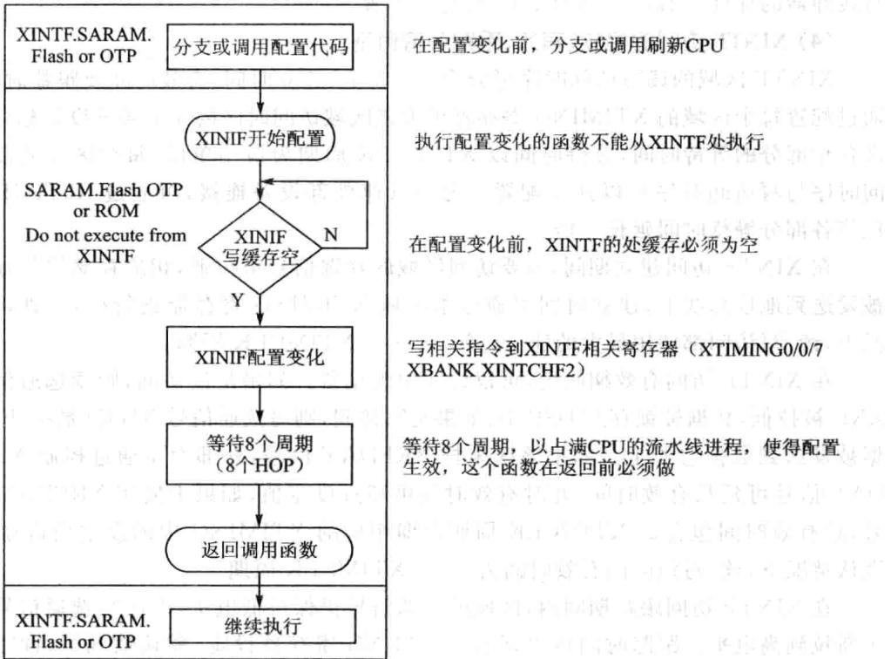

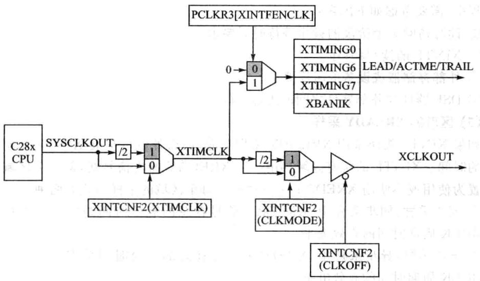

图4.4XINTF配置流程图4.5XINTF时钟信号

器。在没有停止CPU的情况下，最多允许3个数据通过缓冲器写XINTF区域，

写缓冲器的深度可通过XINTCNF2寄存器配置。

## (4）XINTF访问的建、有效、跟踪等待时间

XINTF区域的读写访问时序可分为3个部分：建时间、有效时间及跟踪时间。通过配置每个区域的XTIMING寄存器可为该区域访问时序的3个部分设定相应值即各个部分的等待时间，等待时间以XTIMCLK周期为最单位，每个区域的读访问时序与写访问时序可以独配置。为与低速外部设备连接，可通过X2TIMING位将各部分等待时间延长一倍。

在XINTF访问建立期间，所要访问区域的片选信号被拉低，相应存储器的地址被发送到地址总线上，建时间可通过本区域XTIMING寄存器进配置，默认情况下，读/写访问都使用最大的建立时间，即6个XTIMCLK周期。

在XINTF访问有效期间内，可以访问中断设备。如果是读访问，则读选通信号XRD被拉低，数据被锁存到DSP中;如果是写访问，则写选通信号XWEO被拉低，数据被发送到数据总线上。如果该区采样XREDAY信号，外部设备通过控制XRE-DAY信号可延长有效时间，此时有效时间可超过设定值，如果未使用XREDAY信号，总有效时间包含的XTIMCLK周期数即相应的XTIMING中的设定值再加1。默认情况下，读/写访问的有效时间为14个XTIMCLK周期。

在XINTF访问跟踪期间内，区域的选信号仍保持低电平，但读写选通信号被重新拉到高电平。跟踪时间可以通过XTIMING寄存器设定，默认情况下，读写访问都使最的跟踪时间，即6个TIMCLK周期。

根据系统需要，可配置合适的建立、有效、跟踪时间，以满足不同外设需要。在配置过程中，需要考虑如下因素：

①读写访问3个阶段的最小等待时间要求。

②XINTF的读/写时序。

③ 外部存储器或设备的时序要求。

④DSP器件与外部器件之间的附加延时。

## (5）区域的XREADY采样

如果XINTF模块采用XREADY采样功能，那么外设可扩展XINTF访问有效期间的时间。XINTF的所有区域共个XREDAY输信号线，但每个区域可单独配置为使或不使XREDAY采样功能。每个区域的采样式有两种：

①同步采样：同步采样中，XREDAY信号在总的有效时间结束前将保持个XTIMCLK周期时间的有效电平。

②异步采样：异步采样中，XREDAY信号在总的有效时间结束前将保持3个XTIMCLK周期时间的有效电平。

无论同步还是异步，如果采样到的XREDAY信号为低电平，那么访问阶段的有效时间将增加一个XTIMCLK周期，并且在下一个XTIMCLK周期内将会对XRE-DAY信号重新采样。以上过程将反复进，直到采样到的XREDAY为高电平。

如果一个区域被配置为使用XREDAY采样，这个区域的读访问与写访问都将使用XREDAY采样功能。默认情况下，每一个区域都使用异步采样方式。当使用XREDAY信号时，必须考虑XINTF最小等待时间的要求。同步采样方式与异步采样方式下的最小等待时间是不同的，主要取决于以下几点：

①XINTF固有的时序特性。

②外部设备的时序要求。

③DSP器件与外部器件之间的附加延时。

## (6）带宽

XINTF每个区域的数据总线都可以单独配置成16位或32位，XA0/XWE1引脚的功能在两种总线宽度下不同。当一个区域配置成16位的总线模式时，XA0/XWE1引脚的功能为地址的最后一位XA0，如图4.6所示。当一个区域配置成32位的总线模式时，XA0/XWE1引脚的功能为低字段的选通信号XWE1，如图4.7所示。

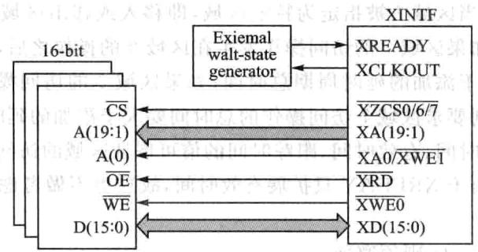

图4.616位数据总线的典型连接方式

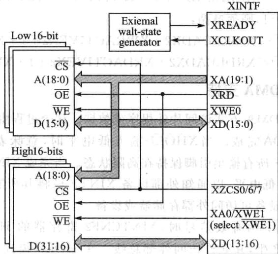

图4.732位数据总线的典型连接方式

## (7)XBANK区域切换配置

当访问操作从一个区域跨越到另一个区域时，为了及时释放总线，并让其他设备获得访问权，低速设备需要额外的几个周期。区域切换允许用户指定一个特定的存储区域，当访问操作移该区域或从该区域移出时，允许添加额外的延时周期。所指定的区域以及相应的额外延时周期可通过XBANK寄存器配置。

额外延时周期的选择要考虑XTIMCLK与XCLKOUT的信号频率，共有3种情况：

1 时额外延时周期配置位XBANK[BCYC]无限制。

② 时，XBANK[BCYC]不能为4或6，其他值均可。

③ 时，当访问操作在两个区域切换时，肯定有个区域发生在延时周期之前，另外一个区域发生在延时周期后。为了能够添加准确的延时周期，要求第一个区域访问的时间要大于添加的延时周期总时间。例如当区域7被指定为特定区域，即移或移出区域7的访问操作都将添加延时周期，如果区域7的访问操作发在区域0的操作之后，则要求区域0访问操作的时间要大于添加的延时周期总时间；如果区域0的访问操作发生在区域7的访问操作之后，则要求区域7访问操作的总时间要大于添加的延时周期总时间。

通过设定建立时间、有效时间、跟踪时间的值可保证区域的访问时间大于添加的延时周期总时间，由于XREDAY只扩展有效时间，故这不做考虑。以下给出具体的配置原则： 4

①X2TIMING=0,则须遵循：

②X2TIMING=1，则须遵循：

## 6.XINTF的DMA支持

XINTF持以DMA式访问外程序或数据。这个过程由输信号XHOLD与输出信号XHOLDA完成。当XHOLD输低电平时，意味着DMA请求访问XINTF，将使XINTF所有输出引脚保持在阻状态。当完成XINTF所有的外部访问后，XHOLDA变为低电平，以通知外部设备XINTF已将其所有的输出口保持在高阻状态，并且其他设备可访问外部存储器或设备。

当检测到XHOLD的有效信号时，XINTCNF2寄存器的HOLD模式位使能XHOLDA信号动产，并允许访问外部总线。在HOLD模式下，CPU仍可正常执连接到存储总线上的内存储空间的程序。当XHOLDA为低电平时，如果CPU访问XINTF，将产未就绪标志，并将处理器挂起。XINTCNF2寄存器中的状态标志位将显示XHOLD与XHOLDA信号的状态。

当XHOLD信号有效时，CPU向XINTF写数据，此时写缓冲器被禁，数据将不会进写缓冲器，CPU将被挂起。XINTCNF2寄存器中HOLD模式位优先于XHOLD信号，从而用户代码可以判断是否有XHOLD请求。在任何操作发前，输信号XHOLD在XINTF输端被同步，同步时钟与XTIMCLK相关。XINTC-NF2寄存器中的HOLDS位反映XHOLD信号的当前同步状态。复位时，HOLD模式被使能，允许利XHOLD信号从外部存储器加载程序。复位期间，如果输信号XHOLD为低电平，则输出信号XHOLDA也为低电平。在上电期间，XHOLD同步锁存器中的不确定值将被忽略，并且在时钟稳定后将会被刷新，因此同步锁存器不需要复位。如果检测到XHOLD信号为低电平，当所有当前被挂起的XINTF操作完成后，XHOLDA才输出低电平。在XHOLDA有效信号输出之前要一直保持XHOLD处于有效电平。在HOLD模式下，XINTF接口的所有输出信号都将保持在高阻状态。

## 7.XINTF的相关寄存器

XINTF所有相关寄存器的列表以及地址映射如表4.8所列。

|寄存器名称|地址单元|大小/×16位|寄存器说明|
|---|---|---|---|
|XTIMINGO|0X00000B20|2|XINTF区域0的时序寄存器|
|XTIMING6|0X00000B2C|2|XINTF区域6的时序寄存器|
|XTIMING7|0X00000B2E|2|XINTF区域7的时序寄存器|
|XINTCNF2|0X00000B34|2|XINTF配置寄存器|
|XBANK|0X0000 0B38|1|XINTF区域切换控制寄存器|
|XREEVISION|0X00000B3A|"    1|XINTF版本修订寄存器|
|XRESET|0X00000B3D|1|XINTF模块复位寄存器|

表4.8XINTF相关寄存器

## (1)时序寄存器

每个区域都有的时序寄存器，通过配置该寄存器可改变本区域的访问时序，时序寄存器的配置代码不能从本区域内执。时序寄存器各位信息以及功能描述和表4.9所列。

|位|字段|取值及功能描述|
|---|---|---|
|31~23|保留|保留|
|22|X2TIMING|该位指定XRDLEAD、XRDACTIVE、XRDTRAIL、XWRLEAD、XWRACTIVE、 XWRTRAIL的实际值与寄存器中的设定值的比值。 0：比值为1:1 1:比值为2:1（上电与复位时的默认值）|

表4.9XTIMING0/6/7功能描述

续表4.9

|位|字段|取值及功能描述|
|---|---|---|
|21~18|保留|保留|
|17~16|XSIZE|数据总线宽度设定位，必须设定为01b或11b，其他设定值无效。00或10：无效设定值，将引起XINTF发生错误01:32位数据总线模式，此时XA0/XWE1引脚工作在XWE1功能11:16位数据总线模式，此时XA0/XWE1引脚工作在XA0功能|
|15|READYMODE|XREADY信号采样方式控制位，仅在USEREADY=1时有效0：同步采样1：异步采样|
|14|USEREADY|区域XREADY信号采样使能位0:当访问该区域时，忽略XREADY信号1.当访问该区域时，对XREADY信号进行采样|
|13~12|XRDLEAD|读访问的建时间中等待周期个数设定位。建时间中所包含的等待周期是以XTIMCLK时钟周期为基本单位的，与X2TIMINGG位一起决定所包含的XTIMCLK周期数，建立时间=XTIMCLK周期数×XTIMCLK的周期00为无效数，01～11表示周期数。默认情况为11b，默认X2TIMING=1，即2倍的11，就是周期数为6|
|11~9|XRDACTIVE|读访问有效时间等待周期个数设定位，有效时间中所包含的等待周期是以XTIMCLK时钟周期为基本单位，与X2TIMING位一起决定所包含的XTIM-CLK周期数。由于有效时间中有个额外的XTIMCLK周期，故总时间=XTIM-CLK周期数×XTIMCLK周期+1，可在000到111之间取值。默认值为111b，即周期数为2×7=14（默认X2TIMING=1）|
|8~7|XRDTRAIL|读访问跟踪时间等待周期个数设定位，跟踪时间中所包含的等待周期是以XTIMCLK时钟周期为基本单位，与X2TIMING位一起决定所包含的XTIM-CLK周期数。跟踪时间=XTIMCLK周期数XXTIMCLK周期可在00到11之间取值。默认值为11b，即周期数为2×3=6(默认X2TIMING=1)|
|出6~5|电送XWRLEAD|写访问的建立时间中等待周期个数设定位。建时间中所包含的等待周期是以XTIMCLK时钟周期为基本单位的，与X2TIMINGG位一起决定所包含的XTIMCLK周期数，建立时间=XTIMCLK周期数×XTIMCLK的周期。可在00到11之间取值。默认情况为11b，默认X2TIMING=1，即2倍的11，就是周期数为6|
|4~2|XWRACTIVE|写访问有效时间等待周期个数设定位，有效时间中所包含的等待周期是以XTIMCLK时钟周期为基本单位，与X2TIMING位一起决定所包含的XTIM-CLK周期数。由于有效时间中有个额外的XTIMCLK周期，故总时间=XTIM-CLK周期数×XTIMCLK周期+1可在000到111之间取值。默认值为111b，即周期数为2×7=14（默认X2TIMING=1)|

7

续表4.9

|位|字段|取值及功能描述|
|---|---|---|
|1~0|XWRTRAIL|写访问跟踪时间等待周期个数设定位，跟踪时间中所包含的等待周期是以 XTIMCLK时钟周期为基本单位，与X2TIMING位一起决定所包含的XTIM- CLK周期数。跟踪时间=XTIMCLK周期数×XTIMCLK周期 可在00到11之间取值。默认值为11b，即周期数为2×3=6（默认X2TIMING=1)|

## （2）XINTF配置寄存器XINTCNF2

XINTCNF2寄存器的各位信息如表4.10所列。

|位|字段|取值及功能描述|
|---|---|---|
|31~19|保留|保留|
|18~16|XTIMCLK|基准时钟XTIMCLK与系统时钟SYSCLKOUT之间的关系，XTIMCLK时钟的配置代码不能存放在XINTG区域中 $0 0 0 : \mathrm { { X T I M C L K } = \mathrm { { S Y S C L K O U T } } }$  $0 0 1 : { \mathrm { X T I M C L K } } = { \mathrm { S Y S C L K O U T } } / 2 ($ 默认）注：XTIMCLK默认情况下是禁止的，在写XINTF相关寄存器之前要通过PCLKR3寄存器位使能|
|15~12|保留|保留|
|11|HOLDAS|此位反映输出信号XHOLDA的当前状态，用户可以通过读取该位判断XINTF接口是否正在进行对外部设备的访问0:XHOLDA为低电平1:XHOLDA为高电平|
|10|HOLDS|此位反映输出信号XHOLD的当前状态，用户可以通过读取该位判断外部设备是否在请求对XINTF总线的访问0:XHOLD为低电平1:XHOLD为高电平|
|9|HOLD|此位允许外部设备驱动XHOLD输信号，并允许XHOLDA输出信号。此位为1时，如果XHOLD与XHOLDA都为低电平（允许访问XINTF），那么在当前周期结束时，XHOLDA信号被强制为高电平，XINTF脱离高阻状态。XRS复位时，此位被置O，复位期间，如果XHOLD为低电平，那么数据总线，地址总线及所有选通信号都将为高阻态，同时XHOLDA被驱动到低电平。如果HOLD模式被使能且XHOLDA为低电平，那么CPU内核仍可继续执行片内存储单元中的代码，如果发生XINTF访问，则产生个未准备好信号并将CPU停，直到XHOLDA信号被删除0：自动允许外部设备的请求，并驱动XHOLD与XHOLDA为低电平（默认）1：不允许外部设备的请求，驱动XHOLD为低电平的同时XHOLDA为高电平|
||||

表4.10XINTCNF2寄存器各位信息

续表4.10

|位|字段|取值及功能描述|
|---|---|---|
|8|保留|保留|
|7~6|WIEVEL|反映写缓冲器中数据的个数00:写缓冲器空01～11（K）：写缓冲器中有K个字符|
|5~4|保留|保留|
|3|CLKOFF|XCLKOUT控制位O:XCLKOUT被使能1:XCLKOUT被禁止|
|2|CLKMODE|XCLKOUT时钟频率控制位，CLKMODE位的配置代码不能存放在XINTF区域0:XCLKOUT=XTIMCLK1:XCLKOUT=XTIMCLK/2（默认）|
|1|WRBUFF|写缓冲器深度控制位00：无写缓冲器（默认）01~11（K）：有K个写缓冲器注：写缓冲器的深度可变，但要求在所有缓冲器都为空的情况下改变，否则将会发生不可预测的结果|

## (3）区域切换控制寄存器XBANK

区域切换控制寄存器XBANK各位信息如表4.11所列。

|位|字段|取值及功能描述|
|---|---|---|
|15~6|保留|保留|
|5~3|BCYC|区域切换时插人的延时时间，延时时间是以XTIMCLK为最小时间单位的。复位时XRS，默认值为7个XTIMCLK周期（14个SYSCLKOUT周期）000:0个XTIMCLK周期001～111（k）:k个XTIMCLK周期BCYC的默认值为111b|
|2~0|BANK|指定使用区域切换功能的XINTF存储区域000:区域0被指定110:区域6被指定111:区域7被指定001～101:保留|

表4.11 XBANK功能描述

## （4）复位寄存器XRESET

复位寄存器XRESET各位信息如表4.12所列。

|位|字段|取值及功能描述|
|---|---|---|
|15~1|保留|保留|
|0|XHARDRESET|硬件复位位。在DMA传送中，如果CPU检测到XREADY信号为低电 平，可使用硬件复位位对XINTF进行复位 0:写0无反应，读始终返回0 1:强制产生一次XINTF硬件复位 XTIMING、XBANK及XINTCNF2寄存器将回到默认值，XINTF的信 号线将回到空闲电平，所有悬挂的访问操作都将被清除（包括写缓冲器 中的数据），DMA产生的停止状态将被释放|

表4.12 XRESET功能描述

### 4.5手把手教你访问F28335外部SRAM

## 1.实验目的

①进一步熟悉CCS编程应用——断点的设置、存储器数据查看。

②掌握TMS320F28335的存储空间。

③掌握TMS320F28335的总线配置过程。

④掌握F28335 SRAM外扩。

## 2.实验主要步骤

①打开已经配置好的CCS3.3软件。

②将仿真器的USB与计算机连接，将仿真器的另一端JTAG端插到YX-F28335开发板的JTAG针处。

③选择CCS中的Debug→Connect菜单项，连接标板，确认目标板连接成功。

④将EXRAM录复制到CCS开发环境中的Myproject录下。

⑤在CCS 中选择 project→Open 菜单项，加载 EXRAM录中的EXRAM. pjt。

⑥在CCS中选择File→Load Program菜单项，加载Debug目录下的EXRAM.out。

⑦在CCS中按照图4.8所示设置断点(在欲设置断点处所在的双击鼠标即可)。

⑧在CCS中选择Debug→Run菜单项，此时户可以发现程序运到第1个断点处，然后选择view→memory查看存储器，在地址栏输中0x100000,memory各个地址的值变为0x5555，如图4.9所示。

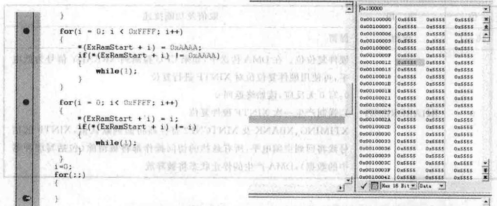

图4.8实验断点设置示意图图4.9 初次写SARAM5555的示意图

⑨在CCS中选择Debug→Run菜单项，此时用户可以发现程序运行到第2个断点，此时memory中各个地址的值变为0XAAAA，如图4.10所示。

①在CCS中选择Debug→Run菜单项，此时程序运行到第3个断点，此时memory各个地址的值又改变了，如图4.11所示。

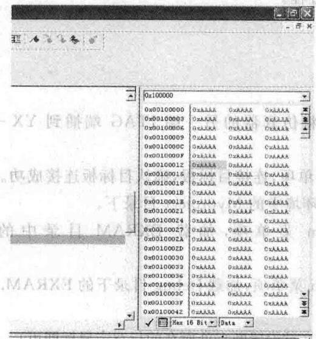

图4.10写SARAMAAAA的示意图

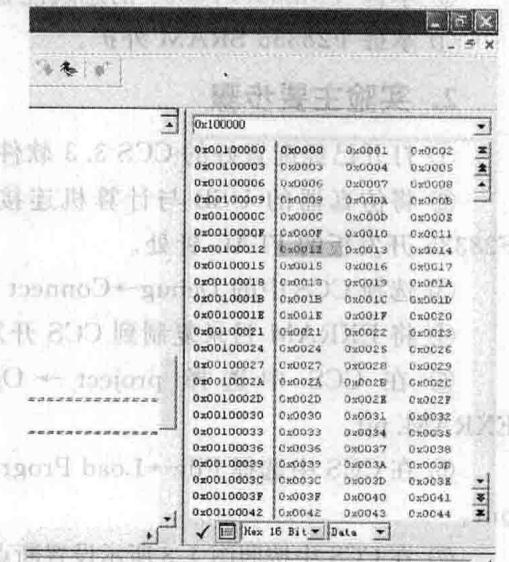

图4.11写SARAM-组顺序值的示意图

m000010大00mw 图0委个

## 3.实验原理说明

## (1）外扩SRAM硬件原理

F28335为哈佛结构的DSP，哈佛结构是一种将程序指令存储和数据存储分开的存储器结构，即程序存储器和数据存储器是两个独立的存储器，每个存储器独立编址、独立访问。其存储空间映射如前文所示。

F28335在逻辑上有4MX16位的程序空间和4MX16位的数据空间，但在物理上已将程序空间和数据空间统成个4MX16位的空间。尽管TMS320F28335上有256KX16位FLASH存储器，34KX16位单周期单次访问随机存储器的SARAM,8KX16位的BOOTROM,1KX16位的OTPROM，但有可能运行程序的开销大于上提供的这些资源，所以需要外扩。

F28335的外部存储器可以映射到3个存储区域，Zone0，Zone6和Zone7。

》Zone0存储区域：0X004000～0X004FFF，4KX16位可编程最少个等待周期。

》Zone6存储区域：0X100000～0X1FFFFF，1MX16位10ns最少个等待周期。

Zone7存储区域：0X200000～0X2FFFFF，1M×16位70ns最少一个等待周期。

YX-F28335将512KX16位的SRAM映射到Zone6的前半部分，实现此逻辑的法是将CS6和地址线19通过74HC32与或相或后送给SRAM选线、将DSP其他地址线和数据线直接和SRAM的地址线和数据线相连、将DSP的读写线与SRAM的读写线相连即可。具体连接如图4.12和图4.13所示。

|XZCS7   1||1A  VCC1B    4BIY    4A|14  DVDD3.3|
|---|---|---|---|
|||||
|2BUF CS7 3|2|2|13|
|IY2A||||
|XZCS6   4|IY|11  BUFCS0||
|XA19    5|2A|2B2YGND|4Y3B3A3Y|
|F_CS     6||||
|DGND    7|2YGND|8   R_CS||
|GND  3YU3   74H32||||

图4.12外扩SRAM的与门连接

## (2)程序说明

TMS320F28335的地址线、数据线、选线以及读写线具有多路复用功能，所以在初始化中一定要对这些总线进配置才能使。其配置程序如下：

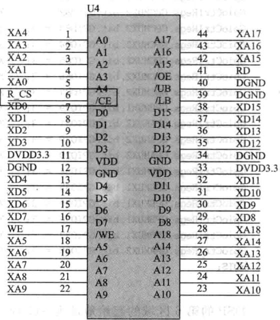

图4.13外扩SRAM的硬件连接

|GpioCtrlRegs.GPCMUX1.bit.GPI064= 3;//XD15 GpioCtrlRegs.GPCMUX1.bit.GPIO65= 3;//|
|---|
|XD14 GpioCtr1Regs.GPCMUx1.bit.GPI066= 3;//XD13|
|GpioCtrIRegs.GPCMUx1.bit.GPI067 =3;//XD12 11 XD11|
|GpioCtr1Regs.GPCMUX1.bit.GPI068 =3;|
|GpioCtr1Regs.GPCMUX1.bit.GPI069 =3;//XD10|
|GpioCtrlRegs.GPCMUx1.bit.GPI070 =3；//XD19|
|GpioCtr1Regs.GPCMUx1.bit.GPI071 = 3;|
|GpioCtr1Regs.GPCMUx1.bit.GPI072 =3;//xD7|
|GpioCtr1Regs.GPCMUX1.bit.GPI073 = 3;//XD6|
|GpioCtr1Regs.GPCMUx1.bit.GPI074 =3;//XD5|
|GpioCtr1Regs.GPCMUx1.bit.GPI075 = 3;//xD4|
|GpioCtr1Regs.GPCMUx1.bit.GPI076 =3；//XD3|
|GpioCtr1Regs.GPCMUX1.bit.GPI077= 3;//xD2|
|GpioCtr1Regs.GPCMUX1.bit.GPI078 =3；//XD1|
|GpioCtr1Regs.GPCMUx1.bit.GPI079 =3；//xD0|
|GpioCtr1Regs.GPBMUx1.bit.GPIO40=3;// xA0/xWE1|
|GpioCtr1Regs. GPBMUx1.bit.GPI041 =3;//XA1|
|GpioCtrlRegs.GPBMUx1.bit.GPI042= 3;//XA2|
|GpioCtr1Regs.GPBMUx1.bit.GPIO43= 3;//xA3|
|GpioCtr1Regs. GPBMUx1. bit.GPI044= 3;//XA4|
|GpioCtr1Regs.GPBMUX1.bit.GPI0453;// xA5|
|GpioCtr1Regs.GPBMUx1.bit.GPI046 = 3;//xA6|
|GpioCtr1Regs.GPBMUx1.bit.GPI047=3;// xA7|
|GpioCtrlRegs.GPCMUX2.bit.GPIO80= 3；//xA8|
|GpioCtr1Regs.GPCMUx2.bit.GPI081 = 3;//xA9|
|GpioCtr1Regs.GPCMUx2.bit.GPI082 = 3;//XA10|
|GpioCtr1Regs.GPCMUx2.bit.GPIO83= 3;//XA11|
|GpioCtrIRegs.GPCMUx2.bit.GPIO84= 3;// XA12|
|GpioCtr1Regs.GPCMUx2.bit.GPIO85= 3;//XA13|
|GpioCtr1Regs.GPCMUx2.bit.GPI086= 3;//XA14|
|GpioCtrIRegs. GPCMUx2.bit.GPIO87 = 3;// XA15|
|GpioCtr1Regs. GPBMUx1.bit. GPIO39= 3;// XA16|
|GpioCtr1Regs. GPAMUx2.bit.GPI031 = 3;//XA17|
|GpioCtr1Regs. GPAMUx2.bit.GPIO30 = 3;// XA18|
|GpioCtr1Regs.GPAMUx2.bit.GPIO29 =3;// xA19|
|GpioCtr1Regs.GPBMUx1.bit.GPIO34= 3;//XREADY|
|GpioCtr1Regs.GPBMUx1.bit.GPIO35= 3;//XRNW|
|GpioCtr1Regs.GPBMUX1.bit.GPI038 =3;//XWE0|
|GpioCtr1Regs.GPBMUX1.bit.GPI036= 3;//XZCS0|
|GpioCtr1Regs.GPBMUx1.bit.GPIO37 = 3;//xZCS7|
|GpioCtr1Regs.GPAMUx2.bit.GPI028 = 3;//XZCS6|
|EDIS; }|

## 

## 

DSP的第6区域的起始地址为0x100000，所以宏定义个SRAM的起始地址，使得程序更直观易懂。如下所：

下面的程序就是对SRAM进读/写操作的过程：

## 4.实验观察与思考

①DSP向RAM最多可写多少次？次数取决于什么？

②如何修改程序，让DSP只在RAM的第10～20单元写0～9？

### 4.6手把手教你访问F28335片外FLASH

## 1.实验目的

①掌握F28335的存储空间的配置。

②掌握F28335总线配置。

③掌握F28335的FLASH外扩。

④掌握外部FLASH的访问。

## 2.实验主要步骤

①先打开已经配置好的CCS3.3软件。

②接着连接仿真器的USB与计算机，将仿真器的另一端JTAG端插到YX-F28335开发板的JTAG针处。

③在CCS中选择Debug→Connect菜单项，连接标板，确定标板连接成功。

④将39VF800目录复制到CCS开发环境中的Myproject目录下。

⑤在 CCS中选择 project→Open菜单项，加载 39VF800目录中的39VF800.pjt。

⑥在CCS中选择File→Load Program菜单项，加载Debug目录下的39VF800.out。

⑦在CCS中按照图4.14所示设置断点(在欲设置断点处所在的双击鼠标即可)。

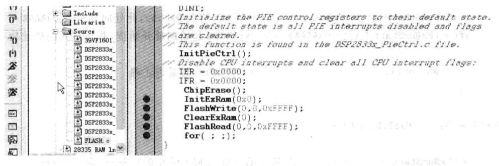

图4.14FLASH例程中设置的断点

⑧在CCS中选择Debug→Run菜单项，此时户可以发现程序运到第1个断点处，然后选择view→memory菜单项，在地址栏输0x180000，memory各个地址的值变为0xFFFF，即擦除FLASH内容，如图4.15所示。

⑨在CCS中选择Debug→Run菜单项，此时程序运到第2个断点，在地址栏输0x100000,memory各个地址的值如图4.16所示。

①在CCS中选择Debug→Run菜单项，此时程序运行到第3个断点，在地址栏输入0x180000，memory各个地址的值变为图4.17所示，即对FLASH进行写操作，把SRAM中的值赋给FLASH各单元。

①在CCS中选择Debug→Run菜单项，此时程序运行到第4个断点，在地址栏输0x100000,memory各个地址的值如图4.18所示，即对SRAM进清零操作。

②在CCS中选择Debug→Run菜单项，此时程序运到第5个断点，在地址栏输0x100000,memory各个地址的值如图4.19所示，即将从FLASH里面读到的值赋给SRAM。

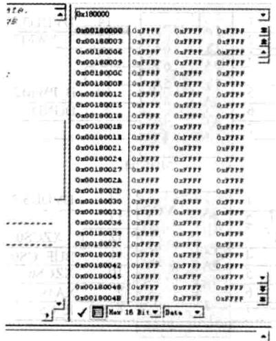

图4.15FLASH擦除状态查看

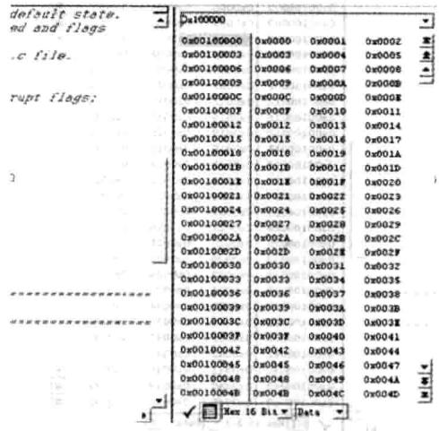

图4.16SRAM的值

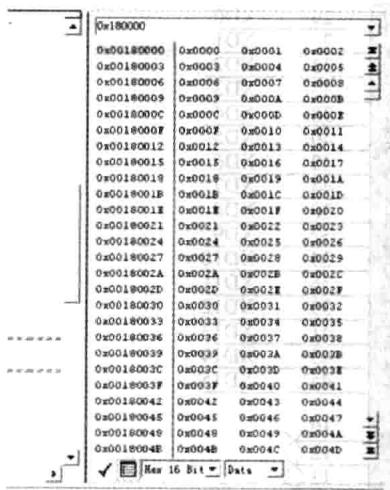

图4.17 FLASH写入SRAM的值

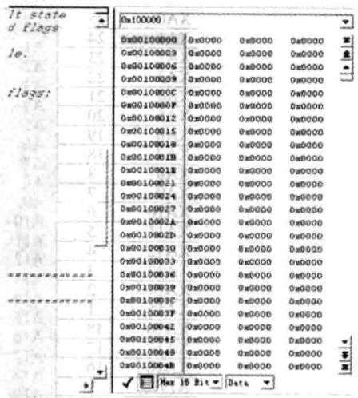

图4.18 FLASH 清零

## 3.实验原理说明

YX-F28335将256KX16位的FLASH映射到Zone6的后半部分，实现此逻辑的法是将地址线19通过74HC04门芯取反后和CS6相或后送给FLASH的选线、将DSP其他地址线和数据线直接和FLASH的地址线和数据线相连、将DSP的读写线与FLASH的读写线相连即可。其接法和SRAM类似，其原理图如图4.20和图4.21所示。

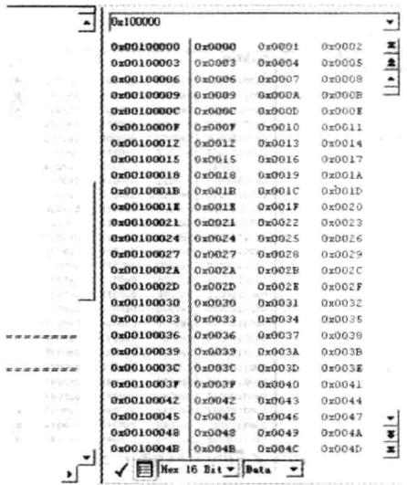

图4.19读FLASH值写入SRAM

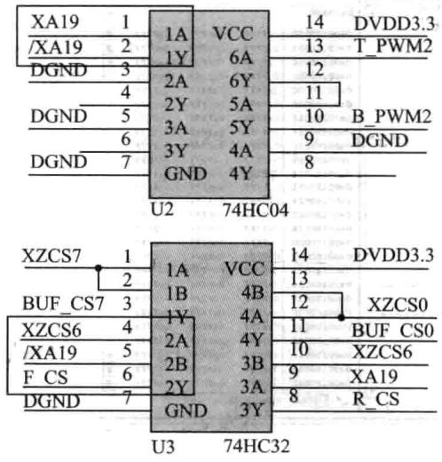

图4.20FLASH外扩片选

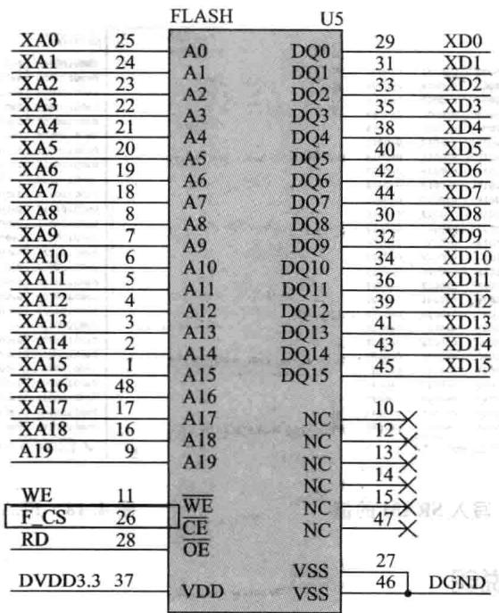

图4.21FLASH引脚接线

同访问SRAM实验样，此实验也需要对DSP的总线进配置，详细配置过程参照SRAM。此实验需要重点了解的是FLASH的擦除、写、读操作。FLASH的操作相对SRAM的操作要复杂些，其操作过程及命令如图4.22所示。

|命令序列|1st BusWrite Cycle|2nd BusWrite Cycle|3rd BusWrite Cycle|4th BusWrite Cycle|5th BusWrite Cycle|6th BusWrite Cycle|
|---|---|---|---|---|---|---|
|Addr|Data|Addr|Data|Addr(|Data|Addr()|
|字一程序|5555H|AAH|2AAAH|55H|5555H|AOH|
|段-擦除|5555H|AAH|2AAAH|55H|5555H|80H|
|块-擦除|5555H|AAH|2AAAH|55H|5555H|80H|
|芯片-擦除|5555H|AAH|2AAAH|55H|5555H|80H|
|软件ID入口|5555H|AAH|2AAAH|55H|5555H|90H|
|CFI查询入口|5555H|AAH|2AAAH|55H|5555H|98H|
|软件D出口/CFI出口|XXH|FDH|||||
|软件D出口/CFI出口|5555H|AAH|2AAAH|55H|5555H|FOH|

注意：(1)A14~A0的16进制地址为格式，A15、A16、A17在命令序列中可以忽略

(2)SA用于块擦除：采用A17~A11地址线 BA用于块擦除：采用A17~A15地址线

(4)软件ID出口与CFI出口地址相等

(5)DQ15~DQ8在命令序列中可以忽略

图4.22FLASH操作过程及命令

下通过程序介绍FLASH的擦除、写、读操作过程（其详细原理需要参照其数据手册）。

## (1)FLASH擦除程序

## 4.实验观察与思考

①RAM和ROM的区别用立発系腦中己8E8理

②怎样通过修改上的程序检测出它们的区别?

平期

## 

中
