# 第 5 章

## F28335中断系统及应用

CPU进正常程序处理的时候，有时会被要求接收更级别的指令或实时性要求更高的任务，不得不中断当前的程序处理，而去响应后者，即进入中断服务程序。当处理完这些任务后，要继续刚才的处理，因此在执中断服务程序的时候，必须保存执现场以确保在完成更级别任务或指令时能够再接着做刚才被打断的任务，整个过程就是CPU的中断响应机制。额外的任务未必是更级的任务，没必要一定要中断当前任务去响应它，当然有时候，过来的任务非即执不可，因此这些中断请求被分类管理。这些中断请求被分为可屏蔽中断和不可屏蔽中断两大类。可屏蔽中断就是根据前处理任务的优先级别来考虑其是否优先处理，或者是即处理，可以根据实际情况来设置优先级别以及决定到底要不要响应此类中断，而不可屏蔽中断，只要接到中断请求，就要做出中断处理。同时多个任务到来，究竟先处理哪个中断请求，这就需要对各个中断进优先级别排序。下边详细介绍F28335的中断机制。

### 5.1F28335中断概述以及中断源

F28335有很多资源，很多外设，这些外设与相关资源都有可能发布新的任务让内核来判断与处理，也就是F28335的可能中断源有很多。F28335的中断源可分为内外设中断源，如PWM、CAP、QEP、定时器等，外中断源，外部中断输引脚XINT1、XINT2引的外部中断源。这些中断源将中断请求信号传递给内核就肯定需要中断线，F28335的中断线是有限的。

F28335内部有16个中断线，其中包括2个不可屏蔽中断（RESET和NMI）与14个可屏蔽中断。可屏蔽中断通过相应的中断使能寄存器使能或者禁产的中断，在这14个可屏蔽中断中，其中定时器1与定时器2产生的中断请求通过INT13、INT14中断线到达CPU，这两个中断已经预留给了实时操作系统，因此剩下12个可屏蔽中断可供外部中断和处理器内部的单元使。F28335的外设中断源远不12个，有58个，如何将这58个外设中断源分配给这12个中断线，这就需要F28335PIE外设中断扩展模块来完成。F28335的中断源以及连接如图5.1和图5.2所示。

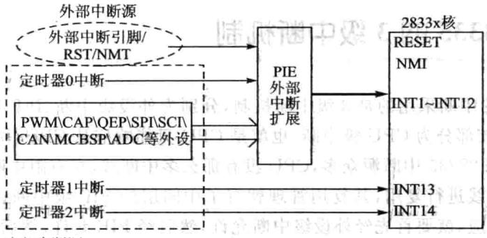

内部中断源

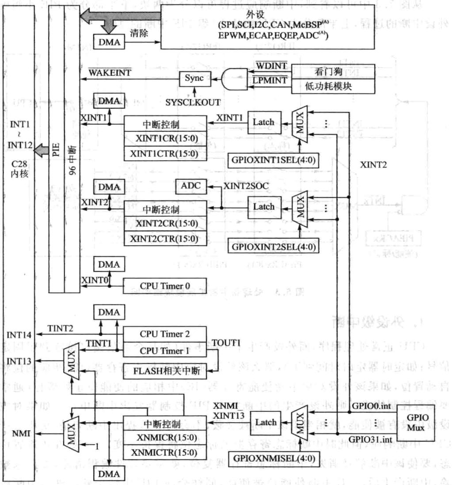

图5.128335处理器中断源以及连接关系图5.2F28335中断源和复用情况

### 5.2 F28335的3级中断机制

> 🔧 **交互式学习**：[PIE中断级联与放行演示器](../interactive/components/pie_interrupt.html)

F28335的中断采用的是3级中断机制，分别为外设级中断、PIE级中断和CPU级中断，最内核部分为CPU级中断，也就是CPU只能响应从CPU中断线上过来的中断请求，但F28335中断源众多，CPU没有那么多中断线，在有限中断线的情况下，只能安排中断线进行复用，其复用管理就有了中间层的PIE级中断，外设要能够成功产生中断响应，就要首先经外设级中断允许，然后经PIE允许，然后经CPU允许，最终CPU做出响应。原理如图5.3所示。

从图5.3中可以看到，中断响应过程可以分为两块，下半部分为PIE小组响应外设中断的过程，上半部分为CPU响应12组PIE中断的过程。

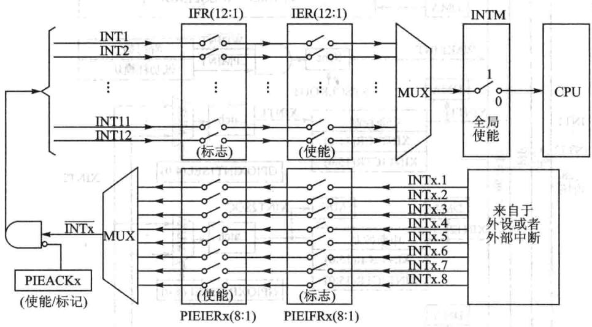

图5.3 处理器中断扩展模块结构图

## 1.外设级中断

CPU正常处理程序，而外设产了中断事件（如某个通信接口接收到了固定的信号；如定时器定时时间到了），那么该外设对应中断标志寄存器（IF）相应的位将被自动置位，如果该外设对应中断使能寄存器（IE）中相应的使能位正好置位（通常需要编程控制使能），则外设产生的中断将向PIE控制器发出中断申请。如果对应外设级中没有被使能，就相当于该中断被屏蔽，不会向PIE提出中断申请，更不会产生CPU中断响应，但此时中断标志寄存器的标志位将保持不变，直处在中断置位状态，要使该中断信号消失，中断标志寄存器复位，就需要软件编程清除，如果未被清除，中断产后，旦中断使能位被使能，同样会向PIE申请中断。进中断服务后，有部分硬件外设会动复位中断标志寄存器，多数外设需要在中断服务中编程复

位中断标志寄存器。

## 2.PIE级中断

F28335处理器内部集成了多种外设，每个外设都会产生一个或者多个外设级中断。由于CPU没有能力处理所有外设级的中断请求，因此F28335的CPU让出了12个中断线交给PIE模块进复用管理。图5.4给出了中断扩展模块的结构图。

PIE将外设中断分成了12个组，分别对应着CPU的12个可屏蔽中断线，每1组由8个外设级中断组成，这8个外设中断分别对应相应外设接口的中断引脚，PIE通过一个8选1的多路选择器将这8个外设中断组成1组。具体连接关系如表5.1所列。实际有效外设中断为58个，其余为保留。PIE第一组中断分别为WAKE信号、TIMER0信号、ADC信号、XINT2、XINT1、第3个中断保留、SEQ2、SEQ1。

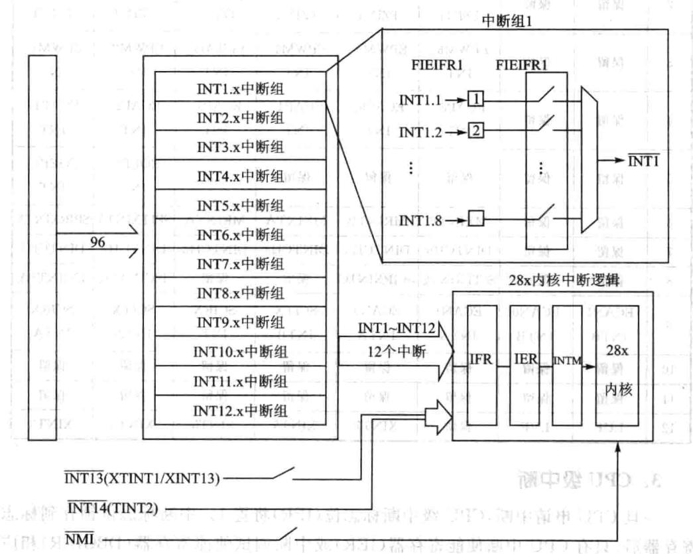

图5.4PIE中断扩展原理

与外设级中断类似，在PIE模块内每组中断有相应的中断标志位（PIEIFRx）和使能位(PIE-IERx.y）。除此之外，每组PIE中断(INT1INT12)有个响应标志位(PIEACK)。图5.5给出了PIEIFR和PIEIER不同设置时的PIE硬件的操作流程。

一旦PIE控制器有中断产生，相应的中断标志位（PIEIFRx.y）将置1。如果相应的PIE中断使能位也置1，则PIE将检查相应的PIEACKx以确定CPU是否准备响应该中断。如果相应的PIEACKx位清零，PIE向CPU申请中断；如果PIEACKx置1，PIE将等待到相应的PIEACKx清零才向CPU申请中断。PIE通过对PIEACKx的位控制来控制每1组中只有1个中断能被响应，一旦响应后，就需要将PIEACKX相应位清零，以让它能够响应该组中后边过来的中断。

|INTX|INTx.8|INTx.7|INTx.6|INTx.5|INTx.4|INTx.3|INTx.2|INTx.1|
|---|---|---|---|---|---|---|---|---|
|1|WAKE|TIMERO|ADC|XINT2|XINT1|保留|SEQ2|SEQ1|
|2|保留|保留|EPWM6_TZINT|EPWM5TZINT|EPWM4TZINT|EPWM3TZINT|EPWM2_TZINT|EPWM1_TZINT|
|3|保留|保留|EPWM6_INT|EPWM5INT|EPWM4_INT|EPWM3_INT|EPWM2_INT|EPWM1INT|
|4|保留|保留|ECAP6_INT|ECAP5_INT|ECAP4_INT|ECAP3_INT|ECAP2_INT|ECAP1INT|
|5|保留|保留|保留|保留|保留|保留|EQEP1_INT|EQEP1_INT|
|6|保留|保留|MXINTB|MRINTB|MXINTA|MRINTA|SPITXINTA|SPIRXINTA|
|7|保留|保留|DINTCH6|DINTCH5|DINTCH4|DINTCH3|DINTCH2|DINTCH1|
|8|保留|保留|SCITXINTC|SCIRXINTC|保留|保留|12CINT2A|I2CINT1A|
|9|ECAN1INTB|ECANO1NTB|ECAN1INTA|ECANOINTA|SCITXINTB|SCIRXINT|SCITXINTA|SCIRX|
|INTA|||||||||
|10|保留|保留|保留|保留|保留|保留|保留 zp|保留|
|11|保留|保留|保留|保留|保留|保留|保留|保留|
|12|LUF|LVF|保留|XINT7|XINT6|XINT5|XINT4|XINT3|

表5.1PIE中断分组

## 3.CPU级中断

一旦CPU申请中断，CPU级中断标志位（IFR）将置1。中断标志位锁存到标志寄存器后，只有CPU中断使能寄存器（IER）或中断调试使能寄存器（DBGIER)相应的使能位和全局中断屏蔽位（INTM)被使能时才会响应中断申请。

CPU级使能可屏蔽中断采CPU中断使能寄存器（IER）还是中断调试使能寄存器（DBGIER)与中断处理方式有关。标准处理模式下，不使用中断调试使能寄存器（DBGIER）。只有当F28335使用实时调试（Real-timeDebug）且CPU被停止（Halt)时，才使用中断调试使能寄存器（DBGIER），此时INTM不起作用。如果F28335使用实时调试而CPU仍然工作运，则采用标准的中断处理。

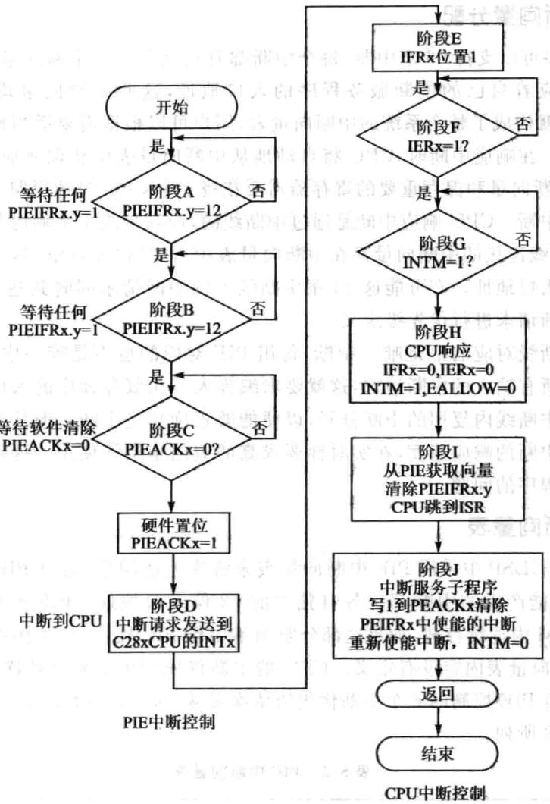

图5.5典型的PIEICPU响应流程图

### 5.3 F28335中断向量

CPU响应中断，就是CPU要去执相应的中断服务程序，其响应过程是CPU将现在执程序的指令地址压人堆栈，跳转到中断服务程序入口地址，中断服务程序的口地址就是中断向量，这个中断向量用2个16位寄存器存放。口地址是22位的，地址的低16位保存在该向量的低16位；地址的高16位则保存在它的高6位，更高的10位保留。

## 1.中断向量分配

PIE最多可以持96个中断，每个中断都有自己对应的中断向量，也就是每个中断源都对应着自己的中断服务程序的口地址，这些中断向量均连续存放在RAM中，这就构成了整个系统的中断向量表，用户可以根据需要适当地对中断向量表进调整。在响应中断时，CPU将自动地从中断向量表中获取相应的中断向量。CPU获取中断向量和保存重要的寄存器需要花费9个CPU时钟周期，因此CPU能够快速响应中断。CPU响应中断是通过中断线的，且只能1次响应其中1条中断线，每条中断线连接的中断向量都在中断向量表中占32位地址空间，用来存放中断服务程序的口地址。有可能这16条中断线上的中断请求同时到达CPU，这时就要对各个中断请求进优先级定义。 .±RE.19

每条中断线对应的不是唯一中断，每组PIE对应的也不是唯一中断，中断服务程序要处理所有输人的中断请求，这就要求编程人员在服务程序的入口处采用软件方法将这些中断线内复用的中断分开，以便能够正确响应中断。但软件分离的方法势必会影响中断的响应速度，在实时性要求高的应用中不能使用。这就涉及如何加快中断服务程序的问题。

## 2.中断向量表

在F28335DSP中采用PIE中断向量表来解决上述问题，通过PIE中断向量表使得96个可能产生的中断都有各自独立的32位口地址。PIE向量表由256×16B的SRAM内连续存放，如果这部分空间不用作PIE模块时，可用作数据RAM。复位时，PIE向量表内容没有定义。CPU的中断优先级由到低依次是从INT1～INT12。每组PIE控制的8个中断优先级依次是从INTx.1～INTx.8。PIE中断向量表如表5.2所列。

|名称|向量ID|地址|长度16位|描述|CPU优先级|PIE组优先级|
|---|---|---|---|---|---|---|
|Reset|0|0x00000D00|2|复位总是从地址位0x3FFFCO的BootROM中获取|1最高||
|INT1|1|0x00000D02|2|未使用，参考PIE组1|5||
|INT2|2|0x00000D04|2|未使用，参考PIE组2|6|,|
|INT3|3|0x00000D06|2|未使用，参考PIE组3|7|州|
|INT4|4|0x00000D08|2|未使用，参考PIE组4|||
|INT5|5|0x00000D0A|2|未使用，参考PIE组5|9||
|INT6|6|0x00000DOC|2|未使用，参考PIE组6|10||
|INT7|7|0x00000D0E|2|未使用，参考PIE组7|11||

表5.2PIE中断向量表

续表5.2

|名称|向量ID|地址|长度/16位|描述|CPU优先级|PIE组优先级|
|---|---|---|---|---|---|---|
|INT8|8|0x00000D10|2|未使用，参考PIE组8|12|M|
|INT9|9|0x00000D12|2|未使用，参考PIE组9|13||
|INT10|10|0x00000D14|2V|未使用，参考PIE组10|14|ITW|
|INT11|11|0x00000D16|2|未使用，参考PIE组11|15||
|INT12|12|0x00000D18|2W|未使用，参考PIE组12|16||
|INT13|13|0x00000D1A|2|XINT13或CPU定时器1||17|
|INT14|14|0x00000D1C|2|CPU定时器2（用于TI/RTOS)|18||
|DATALOG|15|0x0000D1E||CPU数据记录中断°01|19（最低）|低）|
|RTOSINT|16|0x00000D20|2|CPU实时操作系统中断|4||
|EMUINT|17|0x00000D22|2|CPU仿真中断|2||
|NMI|18|0x00000D24|月2|外部不可屏蔽中断|3||
|ILLEGAL|19|0x00000D26|2|非法操作     CI0 004s G|||
|USER1|20|0x00000D28|2|用户定义的软件操作（TRAP)|||
|USER2|21|0x00000D2A|27|用户定义的软件操作（TRAP)|||
|USER3|22|0x00000D2C|2|用户定义的软件操作（TRAP）|||
|USER4|23|0x00000D2E|2|用户定义的软件操作（TRAP)|||
|USER5|24|0x00000D30|2|用户定义的软件操作（TRAP)|2||
|USER6|25|0x00000D32||用户定义的软件操作（TRAP)|||
|USER7|26|0x00000D34|2|用户定义的软件操作（TRAP）|||
|USER8|27|0x00000D36|日2|用户定义的软件操作（TRAP）|||
|USER9|28|0x0000 0D38|2|用户定义的软件操作（TRAP)|||
|USER10|29|0x00000D3A|2|用户定义的软件操作（TRAP)|||
|USER11|30|0x00000D3C|2|用户定义的软件操作(TRAP)|||
|USER12|31|0x00000D3E|2|用户定义的软件操作（TRAP）|||
|||PIE组1向量1复用CPU的INT1中断4|||BT1||
|INT1.1|32|0x00000D40|2|SEQ1INT（ADC)|5||
|INT1.2|33|0x00000D42||SEQ2INT(ADC)|5||
|INT1.3|34|0x00000D44|2|保留|a 5||
|INT1.4|35|0×00000D46|2|XINT1|5||
|INT1.5|36|0x00000D48|2|XINT2           G00x|5||
|INT1.6|37|0x00000D4A|2|ADCINT(ADC)|5||
|INT1.7|38|0x00000D4C|2|TINTO（CPU定时器0）|5||

续表5.2

|名称|向量ID|地址|长度/16位|描述|CPU优先级|PIE组优先级|
|---|---|---|---|---|---|---|
|INT1.8|39|0x00000D4E|2|WAKEINT（LPM/WD)|8 5|8（最低）|
|||PIE组2向量复用CPU的INT2中断|||||
|INT2.1|40|0x00000D50|2|ePWM1_TZINT(ePWM1）|6|1（最高）|
|INT2.2|41|0x00000D52|2|ePWM2_TZINT(ePWM2)|6|2|
|INT2.3|42|0x00000D54|2|ePWM3_TZINT(ePWM3)|6|3|
|INT2.4|43|0x00000D56|2|ePWM4_TZINT(ePWM4)|6|7L4|
|INT2.5|44|0x00000D58|2|ePWM5_TZINT(ePWM5)|6|1.5|
|INT2.6|景45|0x00000D5A|2|ePWM6_TZINT(ePWM6)|6|1.61|
|INT2.7|46|0x00000D5C|12|保留|6||
|INT2.8|47|0x00000D5E|2|保留|6|8（最低）|
|||PIE组3向量一复用CPU的INT3中断|||||
|INT3.1|48|0x00000D60|2|ePWM1_INT(ePWM1)|7|1（最高）|
|INT3.2|49|0x00000D62|2|ePWM2_INT(ePWM2)|7|2|
|INT3.3|50|0x00000D64|-2|ePWM3_INT(ePWM3)|7|3|
|INT3.4|51|0x00000D66|2|ePWM4_INT（ePWM4)|7|4|
|INT3.5|52|0x00000D68|2|ePWM5_INT(ePWM5)|7|5|
|INT3.6|53|0x00000D6A|2|ePWM6_INT(ePWM6）|7|6|
|INT3.7|54|0x00000D6C|2|保留|7|7|
|INT3.8|55|0x00000D6E|2|保留|7|8（最低）|
|||PIE组4向量   复用CPU的INT4中断|||||
|INT4.1|56|0x00000D70|2|eCAP1_INT（eCAP1）|8|1（最高）|
|INT4.2|57|0x00000D72|2|eCAP2_INT(eCAP2)|8|12|
|INT4.3|58|0x00000D74|2|eCAP3_INT（eCAP3）|8||
|INT4.4|59|0x00000D76|2|eCAP4_INT（eCAP4）|8|4|
|INT4.5|60|0x00000D78|2|eCAP5_INT(eCAP5)|8|5|
|INT4.6|61|0x00000D7A|2|eCAP6_INT(eCAP6)|8|6|
|INT4.7|62|0x00000D7C|2|保留|8|7|
|INT4.8|63|0x00000D7E|2|保留|8|8（最低）|
|PIE组5向量  复用CPU的INT5中断|||||||
|INT5.1|64|0x0000 0D80|2|eQEP1_INT(eCAP1)|9|1(最高）|
|INT5.2|65|0x00000D82|2|eQEP2_INT（eQEP2)|9|2|
|INT5.3|66|0x00000D84|2|保留|9|3|

续表5.2

|名称|向量ID|地址|长度/16位|描述|CPU优先级|PIE组优先级|
|---|---|---|---|---|---|---|
|INT5.4|67|0x00000D86|2|保留|9|4|
|INT5.5|68|0x00000D88|2|保留|9|5|
|INT5.6|69|0x00000D8A||保留|9|6|
|INT5.7|70|0x00000D8C|2|保留|9|117|
|INT5.8|71|000000D8E|2|保留|9|8（最低）|
|||PIE组6向量|复用CPU的INT6中断||||
|INT6.1|72|0x00000D90|2|SPIRXINTA(SPI-A)|10|1（最高）|
|INT6.2|73|0×00000D92|2|SPITXINTA(SPI-A)|10|2|
|INT6.3|74|0x00000D94|2|MRINTB(McBSP- B)|10|3|
|INT6.4|75|0x00000D96|2|（McBSP-B)(SPI-B)|10|4|
|INT6.5|76|0x00000D98|2|MRINTA(McBSP-A)|10|5|
|INT6.6|77|0x00000D9A|2|MXINTA(MeBSP-A)|10|6|
|INT6.7|78|0x00000D9C|2|保留|10|7|
|INT6.8|79|0x00000D9E|2|保留|10|8（最低）|
|||PIE组7向量  复用CPU的INT7中断|||||
|INT7.1|80|0x00000DAO|2|DINTCH1 DMA通道1|11|1(最高）|
|INT7.2|81|0x00000DA2|2|DINTCH2DMA通道2|11|2|
|INT7.3|82|0x00000DA4|2|DINTCH3DMA通道3|11|3|
|INT7.4|83|0x00000DA6|2|DINTCH4DMA通道4|11|4|
|INT7.5|84|0x00000DA8|2|DINTCH5DMA通道5|11|15|
|INT7.6|85|0x0000ODAA|2|DINTCH6DMA通道6|11|6|
|INT7.7|86|0x0000ODAC|2|保留|11|7|
|INT7.8|87|0×00000DAE|2|保留|11|8（最低）|
|||PIE组8向量  复用CPU的INT8中断||11k|||
|INT8.1|88|0x00000DB0||I2CINT1A(I2C-A)|12|1（最高）|
|INT8.2|89|0x00000DB2|2|I2CINT2A(I2C-A)|12|2|
|INT8.3|90|0x00000DB4|2|保留|12|3|
|INT8.4|91|0x00000DB6|2|保留|12|4|
|INT8.5|92|0x00000DB8|2|SCIRXINTC(SCI-C)|12|5|
|INT8.6|93|0x00000DBA|2|SCITXINTC(SCI-C)|12|6|
|INT8.7|94|0x00000DBC|2|保留|$12$|7|
|INT8.8|95|0x00000DBE|2|保留|12|8（最低）|

续表5.2

|名称|向量ID|地址|长度/16位|描述|CPU优先级|PIE组优先级|
|---|---|---|---|---|---|---|
|||PIE组9向量  复用CPU的INT9中断                         11|||||
|INT9.1|96|0x00000DCO|2|SCIRXINTA(SCI-A)|13|1（最高)|
|INT9.2|97|0x00000DC2|22|SCITXINTA(SCI-A)|13|2|
|INT9.3|98|0x00000DC4|2|SCIRXINTB(SCI-B)|13|3|
|INT9.4|99|0x00000DC6|2|SCITXINTB(SCI- B)|13|4|
|INT9.5|100|0x00000DC8|2|ECANOINTA(eCAN-A)|13|5|
|INT9.6|101|0x00000DCA|2|ECAN1INTA(eCAN-A)|13|6|
|INT9.7|102|0x00000DCC|2|ECANoINTB(eCAN-B)|13|7|
|INT9.8|103|0x00000DCE|2|ECAN1INTB(eCAN-B)|13|8（最低）|
|||PIE组10向量  复用CPU的INT10中断|||||
|INT10.1|104|0x00000DD0|2|保留|14|1（最高）|
|INT10.2|105|0x00000DD2|21|保留|14|2|
|INT10.3|106|0x00000DD4|2|保留|A14|3|
|INT10.4|107|0x00000DD6|2|保留|14|4|
|INT10.5|108|0x00000DD8|2|保留|14|5|
|INT10,6|109|0x00000DDA|2|保留|14|6|
|INT10.7|110|0x00000DDC|21|保留||14|
|INT10.8|111|0x00000DDE|2|保留||14|
|||PIE组11向量||一复用CPU的INT11中断|||
|INT11.1|112|0×00000DE0|2|保留||15|
|INT11.2|113|0x00000DE2|2|保留||15|
|INT11.3|114|0x00000DE4|2|保留||15|
|INT11.4|115|0x00000DE6|2|保留||15|
|INT11.5|116|0x00000DE8|021|保留|15|5|
|INT11.6|117|0x00000DEA|112|保留||8R15|
|INT11.7|118|0x00000DEC|121|保留||15|
|INT11.8|119|0x00000DEE|2|保留||15|
|||PIE组12向量复用CPU的INT12中断         让|||||
|INT12.1|120|0x00000DF0|121|XINT3||16|
|INT12.2|121|0x00000DF2|2|XINT4||16|
|INT12.3|122|0x00000DF4|2|XINT5||16|
|INT12,4|123|0x00000DF6|2|XINT6||16|

## 续表5.2

|名称|向量ID|地址|长度/16位|描述|营公乐|CPU优先级|PIE组优先级|
|---|---|---|---|---|---|---|---|
|INT12.5|124|0×00000DF8|2|XINT7|3015i|16||
|INT12.6|125|0x00000DFA|2|保留|招|16-||
|INT12.7|126|0x00000DFC|2|LVF FPU|X1AO|16||
|INT12.8|127|0x0000ODFE|2|LUF FPU|3|16||

## 3.中断向量的映射方式

在F28335中，中断向量表可以被映射到4个不同的存储区域，在实际应用中，F28335只使PIE中断向量表映射区域。中断向量表映射主要由以下信号控制。

①VMAP：该位在状态寄存器1(ST1)的第3位，复位后值为1。可以通过改变ST1的值或使用SETC/CLRCVMAP指令改变VMAP的值，正常操作时该位置1。

②M0M1MAP：该位在状态寄存器1(ST1)的第11位，复位后该位置1。可以通过改变ST1的值或使用SETC/CLRCMoM1MAP指令改变MOM1MAP的值，正常操作该位置1。M0M1MAP=0为厂家测试使用。

③ENPIE：该位在PIECTRL寄存器的第0位，复位的默认值为O（PIE被屏蔽）。器件复位后，可以通过调整PIECTRL寄存器(OxO00O0CEO)的值进修改。

依据上述控制位的不同设置，中断向量表有不同的映射式，如表5.3所列。

|向量映射|向量获取位置|HVSM  地址范围|WMAP|M0M1MAP|ENPIE|
|---|---|---|---|---|---|
|M1向量|M1 SARAM|0x000000~0x00003f|0|0|三  X|
|MO向量|MO SARAM|0x000000~0x00003f|70|1|X|
|BROM向量|BOOTROM|0x3fffc0~0x3ffff|1|x|0|
|PIE向量|PIE|0x000d00~0x000dff|1|x|1|

表5.3中断向量表映射配置表

注：M1和MO向量表映射保留，只供TI公司测试使用。MO和M1映射区域可作为SARAM使用，可以随意使用没有任何限制。

复位后器件默认的向量映射如表5.4所列。

|向量映射|向量获取位置|5地址范围|WMAP|MOM1MAP|ENPIE|
|---|---|---|---|---|---|
|BROM向量|BOOT ROM|0x3fffc0~0x3ffff|1|1|0|

表5.4复位操作后的向量表映射

复位程序引导(Boot)完成后，户需要重新初始化PIE中断向量表，应用程序使能PIE中断向量表，并从PIE向量表中获取中断向量。当器件复位时，复位向量

总是从5.3表中获取。复位完成后，PIE向量表将被屏蔽，相应的中断向量分配如图5.6所示。重新分配方法如图5.7所示。

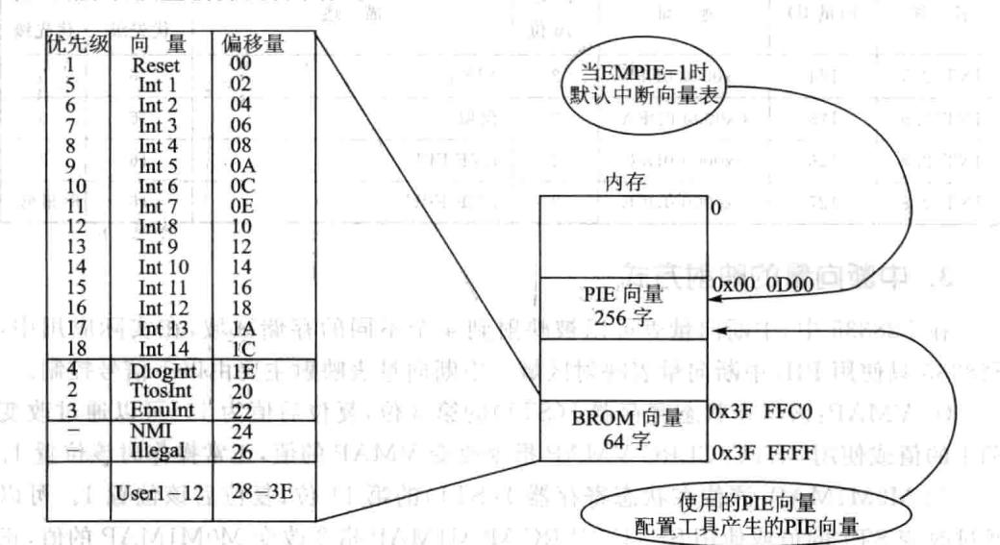

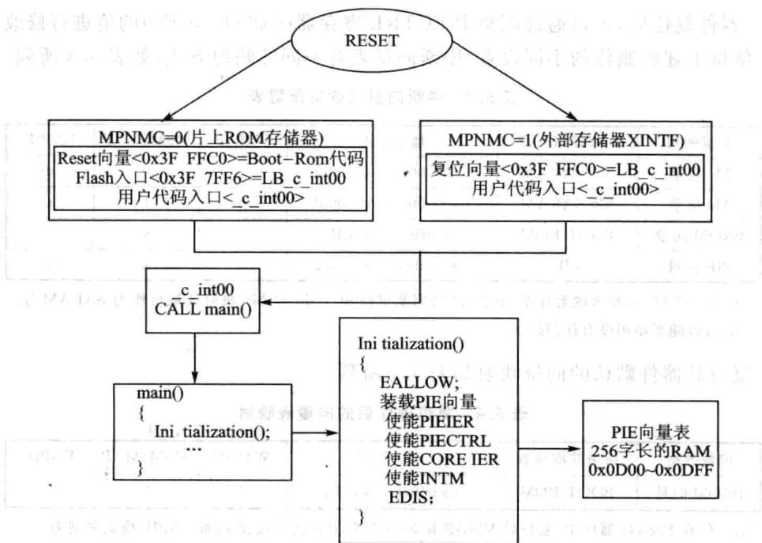

图5.6处理器复位后默认的中断向量分配图5.7 中断向量重新分配方法

### 5.4 F28335中断操作

## 1.复用中断操作过程

PIE模块8个中断分成一组与外部中断一起复用一个CPU中断，总共有12组中断（INT1～INT12）。每组中断有相应的中断标志（PIEIFR）和使能（PIEIER）寄存器，这些寄存器控制PIE向CPU申请中断。同时CPU还根据PIEIFR和PIEIER寄存器确定执哪个中断服务程序。在清除PIEIFR和PIEIER的位时，要遵循以下3个规则。

①不要用软件编程清除PIEIFR的位：清除PIEIFR寄存器的位时，有可能会使产的中断丢失。要清除PIEIFR位时，还未被执的中断必须被执，如果户希望在执行正常的服务程序之前就要清除PIEIFR位时，需要遵循以下步骤：

步骤1：设置EALLOW位为1，允许修改PIE向量表。

步骤2：修改PIE向量表，使外设服务程序指针向量指向一个临时的ISR，这个临时的ISR只执一个中断返回（IRET)操作。

步骤3：使能中断，使中断执行临时中断服务程序。

步骤4：在执完中断服务程序之后，PIEIFR位将被清除。

步骤5：修改PIE向量表，重新映射外设服务程序到正确的中断服务程序。

步骤6：清除EALLOW位。

CPU中断标志寄存器IFR在CPU内部，这样操作将不会影响任何向CPU申请的中断。

②软件设置中断优先级。使用CPUIER寄存器控制全部中断的优先级，PIE-IER寄存器控制每组中断的优先级，只有与被服务的中断在同一组时，修改PIEIER寄存器的值才有意义，当PIEACK位保持来CPU的中断时，修改操作才被最终执。当来自无关本组的中断被执时，禁本组的PIEIER位没有意义。

③使PIEIER禁中断。如果PIEIER寄存器来使能个中断，同样可以禁止该中断，本章具体步骤参见下文。畜中广通中国影积

## 2.使能/禁止复用外设中断的处理

应用外设中断的使能/禁止标志位使能/禁止外设中断，PIEIER和CPUIER寄存器主要是在同组中断内设置中断优先级。如果要修改PIEIER寄存器的设置，有两种方法。第一个方法是保护相应的PIE标志寄存器标志位，防止中断丢失：第个法是清除相应PIE寄存器的标志位。

法1:利PIEIERx寄存器禁中断并保护相应的PIEIFRx相关的标志位，需要采取以下步骤：

步骤1：屏蔽全局中断（INTM=1）。

步骤2：清除PIEIERx.y位，屏蔽给定的外设中断。这样可以屏蔽同一组中断的一个或多个外设中断。

步骤3：等待5个周期，这个延时是为了保证在CPUIFR寄存器中产的任何中断都能向CPU发出申请。

步骤4:清除CPUIFRx内相应外设中断组的标志位，在CPUIFR寄存器上采用这样的操作是比较安全的。

步骤5：清除相应外设中断组的PIEACKx寄存器位。

步骤6：使能全局中断（INTM=0)。

方法2：使用PIEIFRx寄存器屏蔽中断并清除相应的PIEIFRx的标志位。为了完成外设中断的软件复位和清除PIEIFRx和CPUIFR内相应的标志位，需要采取以下的处理步骤：

步骤1：屏蔽全局中断（INTM=1)。

步骤2:设置EALLOW位为1。

步骤3：修改PIE向量表，使外设服务程序指针向量指向一个临时的ISR，这个临时的ISR只执个中断返回（IRET)操作，这种法能够清除单个中断标志位PIEIFRx.y，而且保证不会丢失同一组内其他外设产生的中断。

步骤4：屏蔽外设寄存器中的外设中断。

步骤5：使能全局中断（INTM=0)。

步骤6:等待所有挂起外设中断由空的中断服务程序处理。

步骤7：屏蔽全局中断（INTM=1）。

步骤8:调整PIE向量表，将外设中断向量映射到原来的中断服务程序。

步骤9:清除EALLOW位。

步骤10：屏蔽给定的PIEIER位。

步骤11;清除给定外设中断组的标志位IFR(对CPUIFR寄存器操作比较安全)。

步骤12：清除PIE组的PIEACK位。

步骤13：使能全局中断。

## 3.外设复用中断向CPU申请中断的流程

外设复用中断向CPU申请中断的流程，如图5.8所示

步骤1：任何一个PIE中断组的外设或外部中断产生中断。如果外设模块内的中断被使能，中断请求将被送到PIE模块。

步骤2:PIE模块将识别出PIE中断组x内的y中断(INTx.y)申请，然后相应的PIE中断标志位被锁存：PIEIFRx.y=1。

步骤3：PIE的中断如要送到CPU需满足下面两个条件：

①相应的使能位必须被设置(PIEIERx.y=1)。

②相应的PIEACKx位必须被清除。

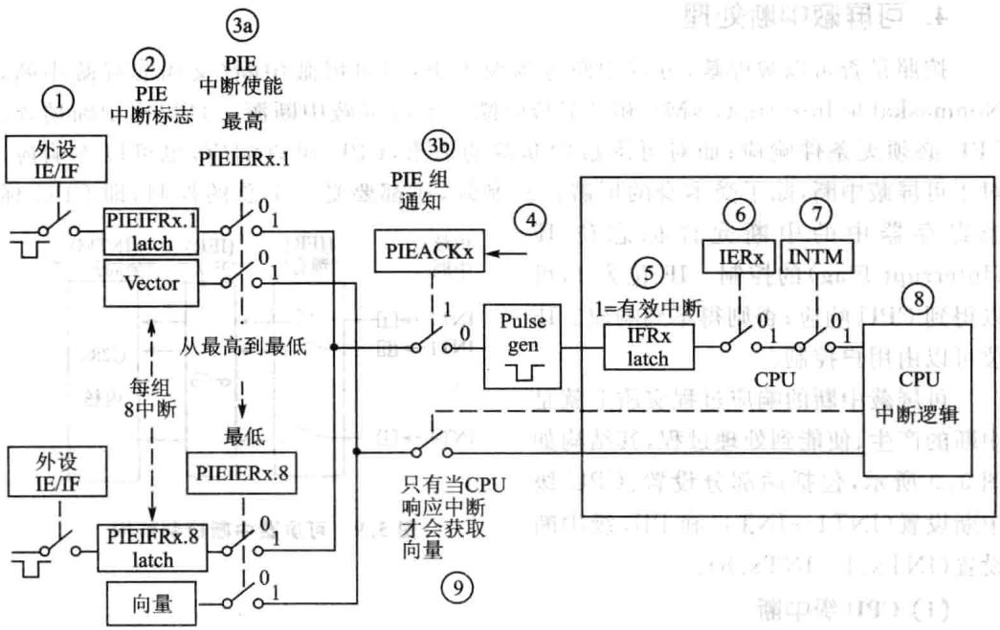

图5.8外设复用中断向CPU申请中断的流程图

步骤4：如果满足步骤3中的两个条件，中断请求将被送到CPU并且相应的响应寄存器位被置1（PIEACKx=1）。PIEACKx位将保持不变，除非为了使本组中的其他中断向CPU发出申请而清除该位。

步骤5：CPU中断标志位被置位(CPUIFRx=1)，表明产生一个CPU级的挂起中断。

步骤6：如果CPU中断被使能（CPUIERx=1，或DBGIERx=1），并且全局中断使能(INTM=0)，CPU将处理中断INTx。

步骤7：CPU识别到中断并自动保存相关的中断信息，清除使能寄存器（IER）位，设置INTM，清除EALLOW。CPU完成这些任务准备执行中断服务程序。

步骤8：CPU从PIE中获取响应的中断向量。

步骤9：对于复用中断，PIE模块用PIEIERx和PIEIFRx寄存器中的值确定响应中断的向量地址。有以下两种情况：

①在步骤4中若有更高优先级的中断产，并使能了PIEIERx寄存器，且PIE-IFRx的相应位处于挂起状态，则首先响应优先级高的中断。

②如果在本组内没有挂起的中断被使能，PIE将响应组内优先级最高的中断，调转地址使INTx.1。这种操作相当于处理器的TRAP或INT指令。

CPU进入中断服务程序后，将清除PIEIFRx.y位。需要说明的是，PIEIERx寄存器来确定中断向量，在清除PIEIERx寄存器时必须注意。

## 4.可屏蔽中断处理

按照是否可以被屏蔽，可将中断分为两大类：不可屏蔽中断（又叫非屏蔽中断，NonmaskableInterrupt，NMI)和可屏蔽中断。不可屏蔽中断源一旦提出中断请求，CPU必须条件响应；而对可屏蔽中断源的请求，CPU可以响应，也可以不响应。对于可屏蔽中断，除了受本身的屏蔽位控制外，还都要受一个总的控制，即CPU标

志寄存器中的中断允许标志位IF（InterruptFlag）的控制。IF位为1，可以得到CPU响应；否则得不到响应。IF位可以由用户控制。

可屏蔽中断的响应过程实质上就是中断的产生、使能到处理过程，其结构如图5.9所示，包括两部分设置：CPU级中断设置（INT1~INT4）和PIE级中断设置(INTx.1~INTx.8)。

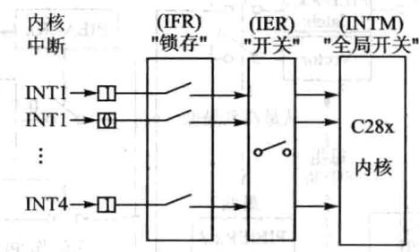

图5.9可屏蔽中断控制结构

## (1)CPU级中断

①CPU级中断标志设置。除了系统初始化，般不建议改变标志寄存器的状态，否则可能清除某些有的中断信息或者产意外中断。但有时也可能希望通过软件式使某些中断标志位置位或者清零，在这种情况下可以通过以下2条指令完成。

如果在清除中断标志寄存器中的某些状态位时刚好有中断产，则此时中断有更高的优先级，相应的标志位仍为1。在系统复位和CPU相应中断后，中断标志位将自动清零。

②CPU级中断使能。CPU级中断使能寄存器的16位分别控制每个中断的使能状态。当相应的位置1时，使能中断，写0禁止中断。在C语中可采用下面代码实现中断的控制，系统复位禁止所有中断。

③全局中断使能。状态寄存器ST1的位O(INTM)为全局中断使能控制位，当该位等于0时全局中断使能，当该位等于1时禁止所有中断。CPU要实现中断处理必须在产生中断的前提下，相应的IER寄存器位使能并且需要全局使能位使能。可采用下列代码实现全局中断使能控制。

## (2)PIE级中断

当系统有中断请求到PIE模块时，相应的PIE中断标志寄存器（PIEIFRx.y）置1,如果相应的PIE中断使能寄存器（PIEIERx.y)也已经置1，则PIE开始检查相应的中断响应寄存器(PIEACKx)来决定CPU是否准备响应该组的中断。如果该组的PIEACKx已经清零，PIE送该中断请求到CPU级，否则PIE等待，直到PIEACKx已经清零，才送中断请求到CPU级。

## 5.不可屏蔽中断处理

）客血中

不可屏蔽中断设置简单得多，以XNMI_XINT13引脚外部中断设置为例，只要配置好相应的引脚配置寄存器就可以，因为NMI优先级最高，CPU必须响应，须配置CPU。

### 5.5 F28335中断相关寄存器

## 1.PIE控制寄存器(PIECTRL)

PIE控制寄存器(PIECTRL)各位信息如表5.5所列。

|位|字段|功能描述|
|---|---|---|
|15~1|PIEVECT|PIE中断向量。这些位确定了PIE提供的中断向量在PIE中断向量表中的 地址。地址最低位忽略，所以只给出1～15位的地址，用户可以通过读向量 值来确定哪个中断产生|

表5.5PIE控制寄存器

续表5.5

|位|字段|功能描述|
|---|---|---|
||ENPIE|PIE向量表使能位。从PIE向量表中获取中断向量的使能位 0：禁止PIE模块，中断向量从bootROM中或中断向量表中获取。此时，当 禁止PIE单元时，所有的PIE模块寄存器（PIEACK，PIEIFR，PIEIER）均可 被访问 1：除复位之外的所有中断向量取自PIE向量表，复位向量始终取自 bootROM|

## 2.PIE中断应答寄存器(PIEACK)

PIE中断应答寄存器各位信息如表5.6所列。

|位|字段|功能描述                          )他|
|---|---|---|
|15~12|Reserved|保留|
|11~0|PIEACK|PIE中断响应标志位X=0：说明PIE可以从相应的中断组向CPU发送中断，写0无效X=1:说明来自中断组的中断向量已经向CPU发送了中断请求，该中断组的其他中断目前被锁存；向相应的中断位写1，可以让该位清零，并且让PIE模块产生一个脉冲给CPU中断，以使得CPU可以响应该组中尚未被响应的中断|

表5.6PIE中断应答寄存器

## 3.PIE中断标志寄存器(PIEIFRx)

PIE 中断标志寄存器PIEIFRx(x=1一12)各位信息如表5.7所列。1

|位|字段|H功能描述器喜者|
|---|---|---|
|15~8|Reserved|保留|
|7|INTx.8|装等商|
|6|INTx.7||
|5|INTx.6|表示相应的中断是否被激活。与CPU中断标志寄存器位的功能相似，当一个中断被激活时，相应的寄存器位被置1；当中断响应后或向这些寄存器写0时，对应的寄存器位被清零，可以通过读取该值来确定哪个中断有效或被挂起，访问该寄存器时，硬件比CPU有更高的优先级|
|日法|INTx5||
||INTx.4||
|2|INTx.3||
|1|INTx.2||
|0|INTx.1||

表5.7 PIE中断标志寄存器PIEIFRx

## 4.PIE中断使能寄存器(PIEIERx)

PIE中断使能寄存器PIEIERx(x=1～12)各位信息如表5.8所列。

|位|字段|功能描述|
|---|---|---|
|15~8|Reserved|保留|
|7|INTx.8||
|6|INTx.7||
|5|INTx.6||
|4|INTx.5||
|3|INTx.4||
|2|INTx.3||
|1|INTx.2||
|0|INTx.1||

表5.8PIE中断使能寄存器（PIEIERx）

## 5.CPU中断标志寄存器(IFR)

CPU中断标志寄存器是个16位的CPU寄存器，于标志和清除被执的中断。CPU中断寄存器（IFR）包含CPU级可屏蔽中断（INT1～INT14、DLOGINT和RTOSINT)的标志位。当PIE模块被使能，PIE模块为中断组INT1～INT12提供复用中断源。

当一个可屏蔽请求发生时，相应外设控制寄存器的标志位置1，如果相应的屏蔽位也是1，则该中断请求被送到CPU，并在IFR中相应的标志位置1，这表示中断未被执行或等待应答。

为识别未执行的中断，可利用PUSHIFR指令以测试堆栈的值，利用ORIFR指令去置位IFR位，利ANDIFR指令动清除未被执的指令。所有未执的中断ADNIFR#O指令或硬件复位清除。

CPU的应答中断和硬件复位也可以清除IFR标志。CPU中断标志寄存器(IFR)各位信息如表5.9所列。

|位|字段|功能描述|
|---|---|---|
|15|RTOSINT|实时操作系统标志位0:已处理完成所有的RTOS中断1:至少1个RTOS中断未被执行，向该位写0可以将其清零，并清除中断请求|
|14|DLOGINT|数据记录中断标志位0:没有DLOGINT中断1:至少有个DLOGINT中断未被执，向该位写0可以将其清零，并清除中断请求|

表5.9 CPU中断标志寄存器(IFR）

|位|字段|功能描述|
|---|---|---|
|13~0|INTxx=1~14|中断x标志位，X=1~140：没有INTx的中断|
|||1：至少一个INTx中断未被执行，向该位写0可以将其清零，并清除中断请求|

（）器音治動德中续表5.9

## 6.CPU中断使能寄存器（IER)

CPU中断使能寄存器是个16位的CPU寄存器，包含可屏蔽CPU级中断（INT1～INT14，DLOGINT和RTOSINT）的使能位。IER中既不包含NMI也不包括XRS，这样IER不受这些中断的影响。

用户可以通过读IER来定义使能中断或设置中断的级别，也可以通过写IER来激活中断。利ORIER指令将相应的IER位置1可以使能中断，利ANDIER指令将相应的IER位置为0，可以禁个中断。当个中断被禁，不管INTM位的值是多少，它都不会应答，当一个中断被使能，如果相应的IFR位为1，且INTM位是0，那么中断就被响应了。

CPU使能中断寄存器的各位信息如表5.10所列。

## 7.CPU调试中断使能寄存器（DBGIER）

CPU在实时仿真模式下暂停中需要中断的时候就要到CPU调试中断使能寄存器DBGIER，其各位信息如表5.11所列。CPU在实时暂停模式时，中断服务也需要IER寄存器进使能。在实时仿真模式中，采用的是标准的中断服务进程，忽略DBGIER。同IER一样，可以通过读DBGIER寄存器的值，使能或禁止中断，采用PUSHDBGIER指令从DBGIER读取数据，采用POPDBGIER将值写DBGIER，复位时，所有的DBGIER位均为0。

|位|字段|功能描述|
|---|---|---|
|15|RTOSINT|实时操作系统中断使能位0:禁止1：使能|
|14|DLOGINT|数据记录中断使能位0:禁止1:使能|
|13~0|INTxx=1~14|中断x使能位，X=1~140：禁止1:使能|

表5.10CPU中断使能寄存器(IER）

|位|字段|功能描述|
|---|---|---|
|15|5RTOSINT|实时操作系统中断使能位0:禁止1：使能|
|14|DLOGINT|数据记录中断使能位0：禁止1：使能|
|13~0|INTxx=1~14|中断x使能位，X=1~140:禁止1：使能|

表5.11CPU调试中断使能寄存器(DBGIER）

## 8.外部中断控制寄存器（XINTnCR）

F28335共持7个外部中断XINT1～XINT7,XINT13还有个不可屏蔽的外部中断XNMI共用中断源。每个外部中断可以被选择为正边沿或负边沿触发，也可以被使能或禁止（包括XNMI)。可屏蔽中断单元包括一个16位增计数器，该计数器在检测到有效中断边沿时复位为0，同时用来准确记录中断发生的时间。

外部中断控制寄存器(XINTnCRn=1~7)各位信息如表5.12所列。

## 9.外部NMI中断控制寄存器(XNMICR)

外部中断控制寄存器（XNMICR)各位信息如表5.13所列。

|位|字段|功能描述|
|---|---|---|
|15~4|Reserved|保留|
|3~2|Polarity|决定中断时产生在信号的上升沿还是下降沿00：中断产生在下降沿01：中断产生在上升沿10:中断产生在下降沿11:既产生在上升沿也产生在下降沿|
|1|Reserved|保留                 [|
|0|Enable|决定外部中断XINTn的使能或禁止0:禁止中断1：使能中断|

表5.12外部中断控制寄存器（XINTnCR）

|位|字段|功能描述|
|---|---|---|
|15~4|Reserved|保留|
|3~2|Polarity|决定中断时产生在信号的上升沿还是下降沿00:中断产生在下降沿01:中断产生在上升沿10:中断产生在下降沿11：既产生在上升沿也产生在下降沿|
||Select|INT13选择信号源0：定时器1接到INT131:XNMI_XINT13接到INT13|
|1et|||
|0|Enable|决定外部中断XIMTn的使能或禁止0：禁止中断1:使能中断|

表5.13外部NMI中断控制寄存器（XNMICR）

## 10.外部中断x计数器（XINTxCTR)

外部中断x计数器各位信息如表5.14所列。

|位|字段|功能描述|
|---|---|---|
|15~0|INTCTR|这是一个独立运行的16位递增计数器，其计数频率锁定在SYSCLKOUT。 当检测到有效的中断边沿信号时，将被复位到0x0000，然后继续进行计数直 到检测到下一个有效中断边沿信号。当中断被禁止时，计数器停止工作。计 数器达到最大值时返回0。该计数器是一个只读寄存器，通过有效的中断边 沿信号或复位将其复位为0|

表5.14外部中断x计数器(XINTxCTR)

### 5.6手把手教你应用定时器中断

## 1.实验目的

①掌握F28335的定时器工作原理。

②掌握F28335的中断设置。

## 2.实验主要步骤

①先打开已经配置的CCS3.3软件。

②将仿真器的USB与计算机连接，将仿真器的另一端JTAG端插到YX-F28335开发板的JTAG针处。

③在CCS中选择Debug→Connect菜单项，连接目标板，确定目标板连接成功。

④将TIMERO录复制到CCS开发环境中的Myproject录下。

⑤在CCS菜单栏选择project→Open菜单项，加载TIMERo目录中的TIM-ERO.pjt。

⑥在CCS菜单栏选择File→Load Program菜单项，加载Debug录下的TIMERO.out。

⑦在CCS中按图5.10所示设置断点(在欲设置断点处所在的行双击鼠标即可)。

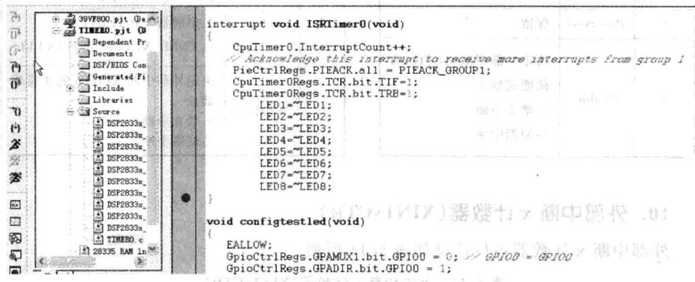

图5.10定时器断点设置

⑧在CCS中选择Debug→Run菜单项，此时户可以发现程序运到断点处，然后查看YX-F28335开发板上面的6个LED的状态。

⑨在CCS中选择Debug→Run菜单项，此时程序第2次运到断点，然后查看YX-F28335开发板上面的6个LED的状态，可以多次运行程序来观察YX-F28335开发板上LED的状态。

①在断点处双击鼠标，将断点去掉，然后选择Debug→Run菜单项，再次观看

LED状态。

## 3.实验原理说明

## (1)定时器操作原理

F28335片上有3个32位的通用定时器，分别为TIMER0、TIMER1、TIMER2。定时器2预留给DSP的实时操作系统BIOS。但是如果没有使用实时操作系统，那么定时器0、定时器1和定时器2都可以被用户使用。定时器的功能如图5.11所示。

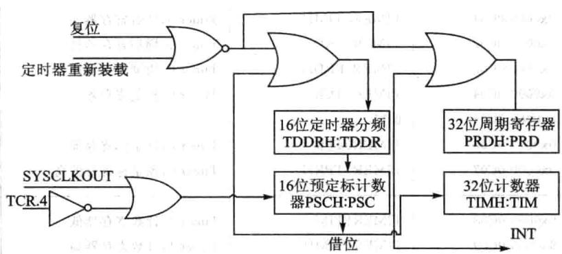

图5.11定时器功能框图

定时器有一个预分频模块和一个定时/计数模块，其中预分频模块包括一个16位的定时器分频寄存器（TDDRH：TDDR）和一个16位的预定标计数器（PSCH：PSC)；定时/计数模块包括一个32位的周期寄存器（PRDH:PRD）和一个32位的计数寄存器（TIMH：TIM）。

当系统时钟（SYSCLKOUT）来一个脉冲，PSCH：PSC预定标计数器减1，当PSCH:PSC预定标计数器减到O的时候，预定标计数器产生下溢后向定时器的32位计数器TIMH:TIM借位，即TIMH:TIM计数器减1，同时PSCH：PSC可以重载定时器分频寄存器（TDDRH:TDDR)的值；当计数寄存器TIMH：TIM减到O产生下溢的时候，计数寄存器会重载周期寄存器（PRDH：PRD)的值，同时定时器会产一个中断信号给CPU。定时器的中断结构如图5.12所示。

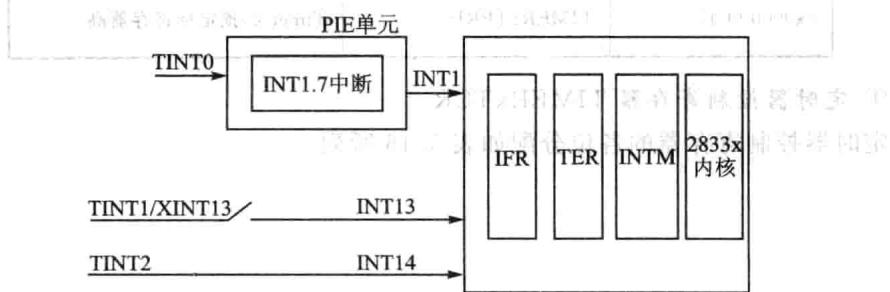

图5.12定时器中断结构

定时器中断属于PIE中断，中断信号经过PIE后，再进入处理器，定时器O的中断属于PIE第组中断中的第7个中断。

## （2）定时器相关寄存器

定时器配置和控制寄存器如表5.15所列。

（）

|地址|寄存器|称|
|---|---|---|
|0x00000C000x00000C010x00000C020x00000C030x00000C040x00000C050x00000C060x00000C07F|TIMEROTIMTIMEROTIMHTIMEROPRDTIMEROPRDHTIMEROTCR保留TIMEROTPRTIMEROTPRH|Timer0，计数寄存器低Timer0，计数寄存器高Timer0，周期寄存器低Timer0,周期寄存器高Timer0，控制寄存器Timer0，预定标寄存器Timer0，预定标寄存器高|
|THHAL0x00000C080x00000C090x00000COA0x00000C0B0x00000C0C0x00000COD0x00000C0E0x00000C0F|TIMER1TIMTIMER1TIMHTIMER1PRDTIMER1PRDHTIMER1TCR保留TIMER1TPRTIMER1TPRH|Timer1,计数寄存器低Timer1.计数寄存器高Timer1.周期寄存器低Timer1,周期寄存器高Timer1.控制寄存器Timer1，预定标寄存器Timer1，预定标寄存器高|
|0x00000C100x00000C110x00000C120x00000C130x00000C140x00000C150x00000C160x00000C17|TIMER2TIMTIMER2TIMHTIMER2PRDTIMER2PRDHTIMER2TCR保留TIMER2TPRTIMER2TPRH|Timer2，计数寄存器低特油效Timer2.计数寄存器高宝Timer2，周期寄存器低MTimer2，周期寄存器高招销锁Timer2.控制寄存器Timer2，预定标寄存器UTTimer2,预定标寄存器高|

表5.15定时器相关寄存器

①定时器控制寄存器TIMERxTCR

定时器控制寄存器的各位分配如表5.16所列。

承退

## 

|位|名称|功能描述|
|---|---|---|
|15|TIF|CPU定时器中断标志位当定时计数器递减到零时，该位置1，可以通过软件向该位写1清零0:写0无影响；1：写1清零|
|14|TIE|定时器中断使能如果定时计数器递减到O，TIE为使能，定时器向CPU申请中断|
|13、12|保留|保留|
|11|FREE|CPU定时器仿真模式|
|||CPU定时器仿真模式FREE SOFT0      0        下次计数器递减操作完成后定时器停止|
|10|SOFT|0      0        下次计数器递减操作完成后定时器停止0                计数器递减到0后定时器停止1      0       自由运行1      1        自由运行|
|9~6|保留|保留|
|5|TRB|定时器重载控制位0:禁止重载；1：使能重载|
|4|TSS|启动和停止定时器的状态位试周机0:为了启动或重新启动，将其清零1：要停止定时器，将其置1|
|3~0|保留|保留|

表5.16定时器控制寄存器

## ②定时器预定标寄存器

表5.17给出了定时器预定标寄存器的各位分配。

|位|名称|功能描述|
|---|---|---|
|15~8|PSC|CPU定时器预定标计数器 PSC保存当前定时器的预定标的值。PSCH:PSC大于0时，每个定时器源时 钟周期PSCH：PSC递减1。PSCH:PSC递减到O时，即是一个定时器周期（定 时器预定标器的输出），PSCH:PSC使用TDDRH：TDDR内的值重新装载， 定时器计数寄存器减1。只要软件将定时器的重新装载位置1，PSCH：PSC 也会重新装载。可以读取PSCH：PSC内的值，但不能直接写这些位。必须从 分频计数寄存器（TDDRH：TDDR）获取要装载的值。复位时PSCH：PSC 清零|

表5.17定时器预定标寄存器

表

续表5.17

|位|名称|功能描述 s|
|---|---|---|
|7~0|TDDR|CPU定时器分频寄存器 每隔（TDDRH：TDDR十1）个定时器源时钟周期，定时器计数器寄存器 （TIMH:TIM)减1。复位时TDDRH：TDDR清零。当PSCH:PSC等于0时， 一个定时器源时钟周期后，重新将TDDRH：TDDR的内容装载到PSCH： PSC，TIMH：TIM减1。当软件将定时器的重新装载位（TRB)置1时，PSCH :PSC也会重新装载|

## ③定时器计数器

定时计数器各位信息如表5.18所列。

|位|名称|功能描述|
|---|---|---|
|15~0|TIM|CPU定时器计数寄存器（TIMH:TIM）。TIM寄存器保存当前32位定时器 计数值的低16位。每隔（TDDRH：TDDR十1）个时钟周期，TIMH：TIM减 1，其中TDDRH:TDDR为定时器预定标分频系数。当TIMH:TIM递减到0 时，TIMH:TIM寄存器重新转载PRDH：PRD寄存器保存的周期值，并产生 定时器中断TINT信号|

表5.18定时器计数器

## ④定时器周期寄存器

定时周期寄存器各位信息如表5.19所列。

|位|名称|功能描述 2|
|---|---|---|
|15~0|PRD|CPU周期寄存器（PRDH:PRD)。PRD寄存器保存32位周期值的低16位， PRDH保存高16位。当TIMH：TIM递减到0时，在下次定时周期开始之前 TIMH:TIM寄存器重新装载PRDH:PRD寄存器保存的周期值；当用户将|
|||定时器控制寄存器（TCR）的定时器重新转载位（TRB）置位时，TIMH：TIM 也会重新装载PRDH:PRD寄存器保存的周期值|

表5.19定时器周期寄存器

## (3)程序清单与注释

①定时器0初始化程序如下：

void InitcpuTimers(void)

// 定时器0初始化

//指向定时0的寄存器地址

CpuTimer0.RegsAddr = &CpuTimeroRegs;

// 设置定时器0的周期寄存器值

CpuTimerORegs.PRD.al1 = 0xFFFFFFFF;

// 设置预定标计数器值为0

## ②定时器0的设置如下所示：

通过以上程序就可以让定时器0每隔段时间产次中断，这段时间的计算公式为：△T=Freq×Period/150000000(s);（其中150000000是CPU的时钟频率，即150MHz的时钟频率)针对此实验，Frep为150，Period为100000，那么△T=0.1s=100ms。

③中断设置程序过程如下：

## ④中断向量表的初始化函数如下：

下的句话就是告诉定时器0的中断地址为中断向量表的INT0

下的两条语句是告诉CPU第组中断将会产，并使能第组中断的第7个小中断。

通过以上中断的设置，定时器0就会每隔100ms进入一次中断服务函数，但是

中断服务函数里面需要清除中断标志位，包括清除PIE第一组的中断标志位和定时器0本身的中断标志位。

⑤中断标志位清除函数如下所：

## 

## 4.实验观察与思考

①如何通过程序改变LED变化的频率？

②假如不定时器中断，通过查询式怎么来改变LED的闪烁效果?

### 5.7手把手教你应用按钮触发外部中断

## 1.实验目的

①掌握外部中断。

②掌握F28335中断机制。

## 2.实验主要步骤

①先打开已经配置的CCS3.3软件。

②将仿真器的USB与计算机连接，将仿真器的另一端JTAG端插到YX-F28335开发板的JTAG针处。

③在CCS中选择→Debug→Connect菜单项，连接目标板，确定目标板连接 成功。

④将ExInt录复制到CCS开发环境中的Myproject目录下。

⑤在CCS菜单栏中选择 project→Open菜单项，加载 ExInt录中的ExInt. pjt。

⑥在CCS菜单栏中选择File→Load Program菜单项，加载Debug录下的ExInt. out。

⑦在CCS菜单栏中选择Debug→Run菜单项，之后用户可以按下YX-F28335开发板上面的S2～S5按钮，观察LED的变化效果。用户将会发现不同的按钮对应不同的LED变化效果。

## 3.实验原理说明

F28335有7个外部引脚中断，GPIO0～GPIO63这64个GPIO都可以通过软件配置成外部中断引脚，但是需要注意的是GPIO0～GPIO31只能配置为外部中断1和2,GPIO32～GPIO63只能配置为外部中断3、4、5、6和7。一旦某一个GPIO被配置为外部中断引脚后，那么边沿脉冲就可以触发此外部中断。本实验采取的是通过按钮来产生边沿信号，其原理图如图5.13所示。

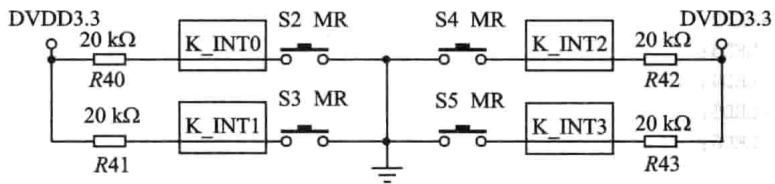

图5.13按钮原理图

下面通过程序详细介绍外部中断实验。外部中断引脚配置过程如下：

在定时器实验中，控制LED是通过对GPIO的数据寄存器写高低电平来操作，而在此实验中是对GPIO的置位寄存器和清零寄存器写1来控制LED。这样控制的优点是GPIO外设响应的时间快，不用延时（用户可以对照前面实验的LED控制程序，通过数据寄存器来控制LED是需要一定的延时，否则GPIO响应不过来）。LED状态宏定义程序如下所示：

## 4.实验观察与思考

①怎么把GPIO53配置为外部中断4,GPIO54配置为外部中断3，其他不变？

②把GPIO53～GPIO56配置为上升沿触发可以吗？如果可以怎么配置？

1
