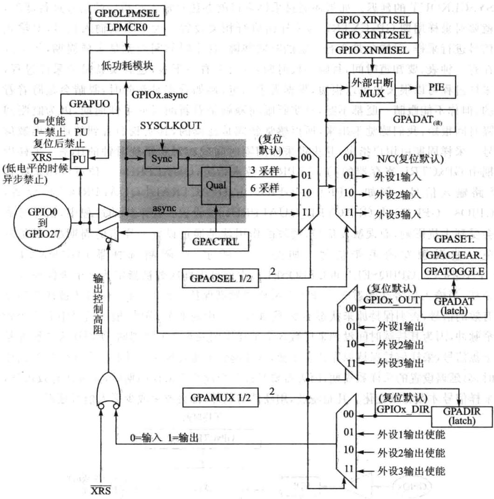
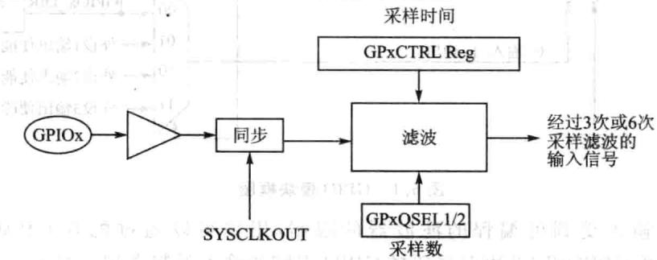
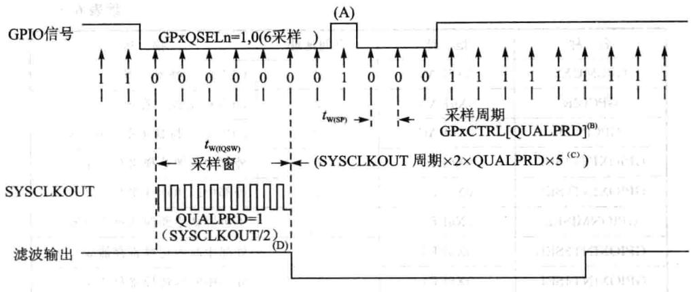
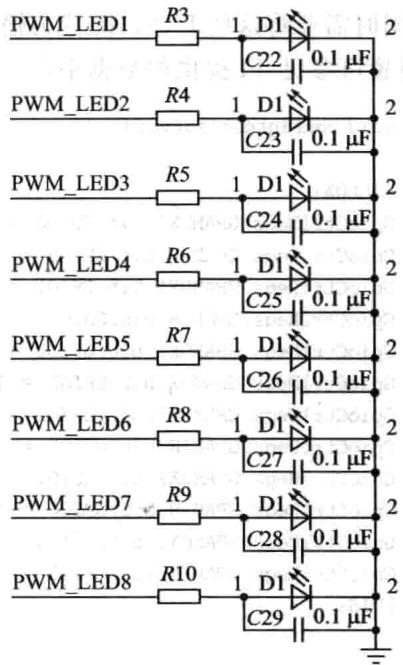
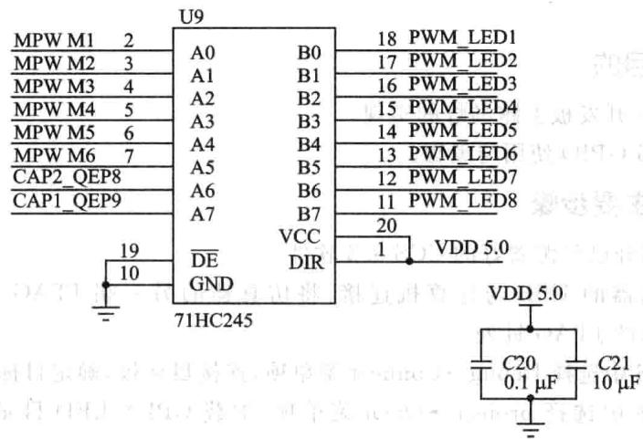

# 第 6 章

## 通用数字量输入/输出(GPIO)

CPU要处理外界二进制信息（数字量），要将其存放在存储器中，就需要外界信息源与CPU或存储器进行交换，这样的交换接口若用来进行通用目的数字量的输输出，就被称为通用数字量输入/输出接口，简称GPIO。F28335DSP有多达88个GPIO口，对应着芯引出的88个引脚，随着芯的封装与尺寸的确定，引脚数目是有限的，所以这88个引脚多数都是功能复用的，即可以灵活配置为输入引脚，也可以灵活配置为输出引脚，即可以作为通用I/O引脚，也可以作为特殊功能口（如SCI、SPI、ECAN等），非常灵活，用户根据需要，可以通过GPIOMUX（输入输出多路选择器，复用开关)寄存器进行相关配置，下面详细介绍GPIO的工作原理及其配置过程。

### 6.1 GPIO工作原理

F28335DSP将这88个GPIO口分成了A、B、C这3组，A组包括GPIO0～GPIO31，B组包括GPIO32～GPIO63，C组包括GPIO64～GPIO87，每个引脚都复用了多个功能，同一时刻，每个引脚只能用该引脚的一个功能。究竟工作在哪个模式下，可以通过GPIOMux（复用开关)寄存器配置每个引脚的具体功能（通数字量I/0或者外设专功能）。如果将这些引脚选择数字量I/O模式，可以通过向寄存器GPxDIR配置数字量I/O的向，既作为输引脚也作为输出引脚;还可以通过量化寄存器GPxQUAL对输信号进量化限制，从可以消除数字量I/O引脚的噪声干扰。此外，有下面4种式对GPIO引脚进读写操作：

①可以通过GPxDAT寄存器独读/写I/O信号。

②利GPxSET寄存器写.1(写0效)对I/O置位。

③利GPxCLEAR寄存器写1(写0效)对I/O清零。

④利GPxTOOGLE寄存器置1后(写0效)翻转I/O输出电平，原来电平变成低电平，原来低电平则变成电平。

GPIO模块框图如图6.1所。从图中最左侧圈内GPIO0～GPIO27为GPIO引脚，在其上位置有个PU，表PULLUP是上拉的意思，也就是这些GPIO引脚是通过软件可编程控制其电平是否上拉，控制寄存器为GPAPUD，O的时候上拉有效，1的时候上拉效，两个三形是控制GPIO作为输还是输出，上边三形为输入通道，GPIO输入后经滤波电路，引脚的功能选择由多路选择器控制，每个引脚有4种功能选择，00为通用1/0引脚，01、10、11分别为外设1、2、3引脚，输入的值都会进GPADAT寄存器，可以通过该寄存器进行读取，在GPIO方向选择为输入的时候，对GPADAT寄存器进置位是无效的，因为这时候它是个读寄存器，其值只受GPIO输信号控制，在其上就是GPIO输引脚引的相关PIE中断，下边三角形为输出通道，输出值为GPADAT内的值，在做输出引脚时，可以通过GPASET等寄存器设置该寄存器的值。

图6.1 GPIO模块框图

GPIO输受到可编程的滤波器的限制，用户可以通过配置GPAQSEL1、GPAQSEL2、GPBQSEL2寄存器选择GPIO引脚的输限制类型。对于个GPIO输入引脚，输人限制可以被SYSCLKOUT同步然后经采样窗进行滤波限制；而对于配置成外设输入的引脚，除同步与采样窗限制外，也可以是异步输入的。

引脚在配置为外设输入时，可以采用异步输人模式，该模式仅用于不需要输入同步的外设或外设自身具有信号同步功能，如通信端口SCI、SPI、eCAN和I2C。如果引脚是GPIO功能，则异步功能模式失效，只能采用同步模式。所有引脚复位时默认的就是同步模式。在该模式中，因为引人的信号与时钟信号初始不同步，所以需要1个SYSCLKOUT进SYSCLKOUT与输信号匹配同步，因此输信号会有1个SYSCLKOUT的延迟。如果还通过采样窗口的办法对输入同步后的信号进行滤波，就要对采样周期GPxCXTRL与采样窗进相关设置。为了限制输信号，对输信号进采样，采样总是会有一定的时间间隔，这个时间间隔就是采样周期，等于现在有个钟表，要知道时间，每隔一段时间，就会去看一下表，这其实就是个采样过程，采样过程可以很长也可以很短，根据需求而定，例如看实时新闻时，眼睛会是盯着看的，但你不能眼睛一眨都不眨，其实眨眼间隔就是看新闻时的采样周期，因为眨眼间隔时间很短，我们感觉不出来，所以感觉新闻是连续的，其实我们看到的还是离散信号。采样周期由用户指定，并决定采样间隔时间或相对于系统时钟的比率。采样周期由GPxCTRL寄存器的QUALPRDn位来指定，QUALPRDn一位可以用来配置8路输入信号。例如，GPIO0～GPIO7由GPACTRAL[QUALPRD0位设置，GPIO8～GPIO15由GPACTRL[QUALPRD1]位设置。在采样的过程中，信号可能会受到干扰影响，而误触发信号，滤波的作用就是通过设置采样窗的周期数，尽量避免一些误触发的毛刺信号。如图6.2所示，在限制选择器（GPAQSEL1、GPAQSEL2、GPBQSEL1和GPBQSEL2)中信号采样次数被指定为3个采样或6个采样，当输信号在经过3个或6个采样周期都保持致时，输信号才被认为是个有效的信号，否则保持原来状态不变，例如图6.3中的那个GPIO输信号中有1个较窄脉冲，因为其持续时间没到采样数3个采样周期或6个采样周期，所以认为该脉冲是扰信号，采样信号保持原先状态不变，这样起到了滤波作，但同时,采样信号在初始时，会延迟设置的采样数周期，因为需要经过3个或6个采样周期后，才确认有效信号，采样信号才做有效变化。凡是滤波，硬件与软件，都会或多或少引信号延迟。

图6.2GPIO滤波采样

图6.3 GPIO滤波采样波形

### 6.2 GPIO寄存器以及编程

## 1.GPIO的寄存器的列表

器客

F28335DSP的GPIO所有寄存器如表6.1所列。

|名称|地址对|324空间地址 5|泰       描述|
|---|---|---|---|
|GPACTRL|0X6F80|2|GPIOA控制寄存器|
|GPAQSEL1|0X6F82|2|GPIOA量化控制寄存器1|
|GPAQSEL2|0X6F84|2|GPIOA量化控制寄存器2|
|GPAMUX1|0X6F86|2|GPIOA选择寄存器1|
|GPAMUX2|0X6F88|2|GPIOA选择寄存器2|
|GPIOADIR|0X6F8A|2 品|GPIOA方向寄存器|
|GPIOAPUD|0X6F8C|2|GPIOA上拉禁止寄存器|
|GPBCTRL|0X6F90|2|GPIOB控制寄存器|
|GPBQSEL1|0X6F92|2|GPIOB量化控制寄存器1|
|GPBQSEL2|0X6F94|2|GPIOB3量化控制寄存器2|
|GPBMUX1|0X6F96|2|GPIOB选择寄存器1|
|GPBMUX2|0X6F98|2|GPIOB选择寄存器2|
|GPBDIR|0X6F9A|2|GPIOB方向寄存器|
|GPBPUD|0X6F9C|2|GPIOB上拉禁止寄存器|
|GPCMUX1|0X6FA6|2|GPIOC选择寄存器1|

表6.1GPIO寄存器

续表6.1

|名称|地址|空间地址|描述|
|---|---|---|---|
|GPCMUX2|0X6FA8|2|GPIOC选择寄存器2|
|GPCDIR|0X6FAA|2|GPIOC方向寄存器|
|GPCPUD  1|0X6FAC|2|GPIOC上拉禁止寄存器|
|GPIOXINT1SEL|0X6FE0||外部中断源选择寄存器1|
|GPIOXINT2SEL|0X6FE1|1|外部中断源选择寄存器2|
|GPIONMISEL|0X6FE2|1|不可屏蔽中断源选择寄存器|
|GPIOXINT3SEL|0X6FE3|1|外部中断源选择寄存器3出|
|GPIOXINT4SEL|0X6FE4|1|外部中断源选择寄存器4|
|GPIOXINT5SEL|0X6FE5|(21)|外部中断源选择寄存器5|
|GPIOXINT6SEL|0X6FE6|1|外部中断源选择寄存器6|
|GPIOXINT7SEL|0X6FE7|星义|外部中断源选择寄存器7|
|GPIOLPMSEL|0X6FE8|1|唤醒低功耗模式源选择寄存器|

## 2.GPxCTRL寄存器

GPxCTRL寄存器将为输引脚指定采样周期，GPACTRL为输引脚0～31指定采样周期，GPACTRL位功能描述如表6.2所列。

||位|字段|功能描述|
|---|---|---|---|
||31~24|QUALPRD3|GPIO24～GPIO31引脚特定的采样周期0x0O：采样周期=TSYSCLKOUT（即系统时钟）0x01:采样周期=2×TSYSCLKOUT（即系统时钟）…QxFF：采样周期=510×TSYSCLKOUT（即系统时钟）|
|23~16|QUALPRD2|GPIO16～GPIO23引脚特定的采样周期具体配置同上||
|15~8|QUALPRD1|GPIO8～GPIO15引脚特定的采样周期具体配置同上||
|7~0|QUALPRDO|GPIO0～GPIO7引脚特定的采样周期具体配置同上||

表6.2 GPIOGPxCTRL寄存器

## 3.GPAQSEL寄存器

GPAQSEL1寄存器用来配置采样数，也可以认为是滤波数，当干扰信号持续采样周

期于该寄存器设置的采样周期数时，干扰信号被滤除。其位分配如表6.3所列。

|位|字段|功能描述|
|---|---|---|
|31~0|GPIO15~GPIO0||

表6.3GPIOGPAQSEL寄存器

## 4.GPxDIR寄存器

GPIO的输输出向由GPxDIR寄存器配置。GPADIR寄存器位分配如表6.4所列。

|位|字段|功能描述|
|---|---|---|
|31~0|GPIO31~GPIO0|当在GPAMUX1或GPAMUX2寄存器中配置指定引脚为GPIO引脚，GPIO A端所管理的引脚对应的方向控制 0:配置为GPIO引脚为输引脚（默认） 1:配置为GPIO引脚为输出引脚|

表6.4GPIOGPxDIR寄存器

其余的寄存器配置与功能在上边或有叙述或有雷同，详细可以参见TI给出的数据册。

## 5.GPIO寄存器编程设置与应用

GPIOMux寄存器来选择28335处理器多功能复引脚的操作模式，每个引脚都可以独地配置为GPIO模式或者是外设专功能模式。如果配置为通数字量I/O模式，还可以通过向控制寄存器设置GPIO的向，通过量化输寄存器（GpxQUAL）配置输入引脚的量化功能。

采C/C++编程实现处理器的GPIO控制，其复用寄存器的相关结构体定义为：

采用上述结构体定义可以直接对GPIO的寄存器进操作，完成外部引脚的初始化操作。例如，将IOA全部设置GPIO功能，输出状态，0量化，代码如下：

由于所有多功能复用引脚都可以通过相应的控制寄存器的位独立配置，因此在使时需要详细了解各GPIO对应的控制位以及对应的值。因此在C/C+十编程的时候，需要用结构体将寄存器每一位都列出来，这样更方便与寄存器配置操作。如GPIO0～15结构体如下所示：

例如，将GPIO0～3配置为PWM1、2功能：

如果复用引脚配置为数字量1/O模式，则可以直接利用数据寄存器对1/O操作(读/写），也可以利用其他辅助寄存器对各I/O进独立操作，如数字I/O置位（GPXSET寄存器）、数字I/O清零（GPXCLRAR寄存器）以及数字I/O电平转换（GPXTOGGLE寄存器）。

同复用寄存器在C/C十+语编程方式一样，数据寄存器也这样定义

通过上面定义的结构体，可以很清楚地看到GPIO的数据寄存器共有4类。分别为GPIODAT、GPIOSET、GPIOCLEAR、GPIOTOGGLE。若某一GPIO设置为输出状态，那么通过对GPIODAT相应位写0或者1，此时此GPIO就会输出相应的状态。

F28335一共有88个GPIO，分为3组，分别是A、B、C。其中A组GPIO可以通过软件配置为外部中断1、2以及NMI功能，B组GPIO可以通过软件配置为外部中断3、4、5、6、7功能。而C组的GPIO不能配置为中断功能。如果将某GPIO配置为外部中断功能，那么下面是设置步骤：

①将数字量I/O配置为GPIO功能。

②将数字量1/O配置为输向。

③将数字量I/O量化配置正确。

④利外部中断选择寄存器选择相应的引脚为外部中断源。

⑤为此GPIO触发信号设置极性，上升沿、下降沿或者双边沿。

⑥使能外部中断即可。

例如，如果将GPIO53～GPIO57分别设置为外部中断3～7，那么配置过程如下：

### 6.3手把手教你实现基于F28335GPIO的跑马灯实验

## 1.实验目的

①F28335开发板上跑马灯的实现。

②F28335GPIO使用与编程。

## 2.实验主要步骤

①先打开已经配置好的CCS3.3软件。

②将仿真器的USB与计算机连接，将仿真器的另一端JTAG端插到YX-F28335开发板的JTAG针处。

③在CCS中选择Debug→Connect菜单项，连接目标板，确定目标板连接成功。

④在CCS中选择project→Open菜单项，加载GPIO_LED录中的GPIO_LED. pjt。

⑤在CCS中选择File→Load Program菜单项，加载Debug目录下的GPIO_LED.out。

⑥在CCS中选择Debug→Run菜单项。

⑦观察YX-F28335开发板上LED跑马灯的效果。

## 3.实验原理说明

## (1)硬件原理

在YX-F28335开发板中，DSP的8个管脚通过74LVC245缓冲芯、限流电阻与8个发光二极管相连，其原理图如图6.4所示，其中D7和D8是CAP/QEP捕捉指示灯，在此实验中只用控制D1~D6，D1～D6的管脚为DSP的GPIO0～GPIO5，此8路LED是共阴的连接方式，当GPIO0～GPIO5为高电平时，则LED被点亮；当GPIO0～GPIO5为低电平的时候，LED熄灭。

74LVC245缓冲芯是总线缓冲芯，如图6.5所示，实现3.3V电压接口信号和5V接口信号的相互接口，DSP的外设端口电压与外设电压并不完全一致，这时候就需要考虑这些驱动缓冲芯。所以第三方厂家提供开发板的同时，实际上提供了一些接口芯方案，对于设计人员来说有一定的参考价值。限流电阻，对于极管来说，导通电阻极低，因此必须考虑导通情况下的限制电流大小。

图6.4LED流水灯原理接线

图6.5 电平转换缓冲芯片

## (2)程序说明

F28335的I/O管脚具有多功能复用，通过对GPAMUX寄存器的设置为0，可以设置I/O的功能，在控制LED的过程中，DSP的管脚配置为普通I/O口就可以了，同时需要将这些I/O口配置为输出口，通过设置GPADIR方向寄存器为1,GPIO口设置可参见TI提供的数据册。GPIO配置如下所示：

为了程序书写直观采用宏定义方式，可以使程序更加直观、方便，程序定义如下：

#define LED1 GpioDataRegs.GPADAT.bit. GPIO0//LED1 代表GPIO0位#define LED2 GpioDataRegs.GPADAT.bit.GPI01 //LED2代表GPI01位#define LED3 GpioDataRegs.GPADAT.bit.GPIO2//LED3代表GPIO2位#define LED4 GpioDataRegs.GPADAT.bit.GPIO3//LED4代表GPI03位#define LED5 GpioDataRegs.GPADAT.bit. GPIO4//LED5代表GPIO4位#define LED6 GpioDataRegs.GPADAT.bit.GPIO5 //LED6 代表GPIO5位

## 实现LED跑马灯效果的程序如下：

//每次延时后取反，实现LED的亮与灭

## 本基M

## 4.实验观察与思考

①如何使LED变化效果的频率变慢?

②如何实现LED的不同变化效果？

