# 第 7 章

## 增强型脉宽调制模块(ePWM)

2000系列的DSP之所以能在电控制领域大放异彩，除了其DSP内核外，更因为其集成了众多适合电检测与控制的外设设备，PWM模块是其中最突出者之，很多电程师就是因为电机控制、电源控制时需要采PWM控制选择使2000系列DSP。

### 7.1 PWM控制基本原理

PWM（脉冲宽度调制）是英文PulseWidthModulation的缩写，简称脉宽调制。PWM控制技术就是对脉冲宽度进调制的技术，即通过对一系列的脉冲的宽度进调制，来等效地获得所需要的波形。在采样控制理论中有个重要的结论：冲量相等而形状不同的窄脉冲加载到具有惯性的环节上时，其效果基本相同。冲量即指窄脉冲的面积。这里所说的效果基本相同，是指环节的输出响应波形基本相同。如果把输出波形用傅里叶变换分析，则其低频段非常接近，仅在高频段略有差异。例如图7.1（a）、（b）、(c)所示的3个窄脉冲形状不同，其中图7.1（a）为矩形脉冲、图7.1(b)为三角形脉冲、7.1(c)为正弦半波脉冲，但它们的面积(即冲量)都等于1，那么当它们分别加在具有惯性的同个环节上时（如图7.2(a)所），电路输为e(t)，窄脉冲，如图7.1（a）、（b）、（c)、(d）所示，其输出响应基本相同，如图7.2(b)所示，电路输出为i(t)。当窄脉冲变为图7.1(d)的单位脉冲函数δ(t)时，一阶惯性环节的响应即为该环节的脉冲过渡函数。

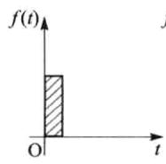

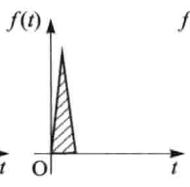

(b)

从输出波形中可以看出，在输出波形的上升段，脉冲形状不同时，输出波形的形状略有不同，但其下降段则乎完全相同。脉冲越窄，各输出波形的差异也越。如果周期性地施加上述脉冲，则响应也是周期性的。用傅里叶级数分解后将可看出，各输出波形在低频段的特性将非常接近，仅在频段上略有差异。面积等效原理是PWM控制技术的重要理论基础。

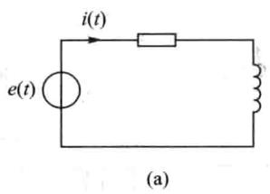

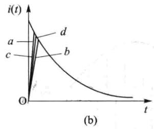

图7.2冲量相同的各种窄脉冲的响应波形

前很多电应用都采用的是正弦交流电，下面介绍如何用系列脉冲来代替一个正弦半波。如图7.3（a)所示，把正弦半波分成N等份，就可以把正弦半波看成是由N个彼此相连的脉冲序列所组成的波形。这些脉冲宽度相等，但幅值不等，且脉冲顶部不是水平直线，而是曲线，各脉冲的幅值按正弦规律变化。如果把上述脉冲序列利相同数量的等幅不等宽的矩形脉冲代替，使矩形脉冲的中点和相应的正弦波部分的中点重合，且使矩形脉冲的相应的正弦波部分面积（冲量）相等，就得到图7.3(b)所示的脉冲序列。这就是PWM波形。可以看出，各脉冲的幅值相等，而宽度是按正弦规律变化的。根据面积等效原理，PWM波形和正弦半波是等效的。对于正弦波的负半周，也可以用同样的方法得到PWM波形。像这种脉冲宽度按正弦规律变化而和正弦波等效的PWM波形，也称SPWM(SinusoidalPWM)波形。

要改变等效输出正弦波的幅值时，只要按照同例系数改变上述各脉冲宽度即可。

在实际应用中，很多部件内部都有自己的惯性环节（积分器），例如电机本身就是非常理想的低通滤波器，PWM信号的一个很重要的用途就是数字电机控制。在电机控制系统中，PWM信号控制功率开关器件的导通和关闭，从而使得功率器件为电机的绕组提供期望的电流和能量。相电流的频率和能量可以控制电机的转速和转矩，这样提供给电机的控制电流和电压都是调制信号，而且这个调制信号的频率比PWM载波频率要低。采用PWM控制式可以为电机绕组提供良好的谐波电压和电流，避免因为环境变化产生的电磁扰动，并且能够显著提高系统的功率因数。为能够给电机提供具有够驱动能力的正弦波控制信号，可以采用PWM输出信号经过NPN或PNP功率开关管实现，如图7.4所示。

功率开关管在输出大电流的情况下，若控制开关管工作在线性区，会使系统产生很大的热损耗，降低电源的使用效率，同时开关管也容易过烫超过结温而炸掉，所以般使开关管作在静态切换状态 即饱和与截止两个状态，在该状态下，开关管有较小的功率耗损，且状态稳定，也符合数字控制逻辑对开

关逻辑的要求。

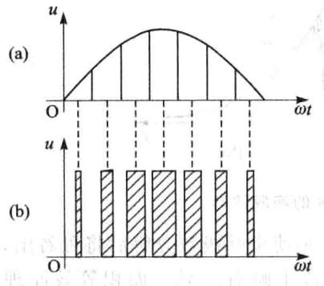

图7.3用PWM波代替正弦半波

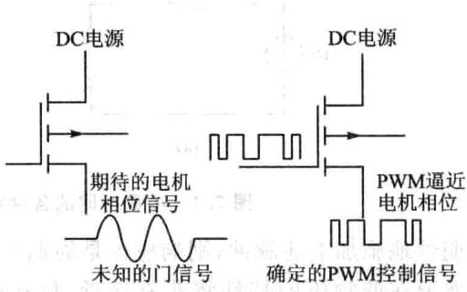

图7.4PWM信号驱动开关管

PWM波形可分为等幅PWM波和不等幅PWM波两种，微控制器输出的电平一般都是确定的，所以一般调整微控制器输出矩形脉冲的占空比，就可以输出等幅不等宽的PWM波，微控制器输出的PWM波功率有限，主要用来驱动功率开关管。通过对功率开关器件的开关控制，可以输出更大功率、更多形状的PWM波形，将功率开关器件的开关拓扑逻辑组合变化，就可以输出不等幅即多电平的大功率PWM波形。PWM就像大功率DA转换器一样，将数字信号转换为模拟信号，只是PWM是用调制脉宽的方法将数字信号等效替代模拟信号。也可以认为PWM电路就是一类特殊的D/A电路。

PWM控制一般包括两部分电路，一部分是功率开关管组成的功率电路，另一部分是由微控制器组成的驱动开关管的驱动电路。微控制器产的单周期PWM驱动信号本身很简单，主要包括4个要素，周期、脉宽、脉冲相位、脉冲个数，但是每个周期的脉冲波形的宽度会变化，有时对脉冲的具体相位也有要求，脉冲宽度如何具体调制，这就要根据具体的控制场合以及功率电路进行算法研发，详情要参照PWM控制相关技术，下面主要介绍F28335如何产生最初的这个脉冲波形，并且每个周期的脉冲波形宽度以及具体相位都是可以配置和调整的。

目前PWM控制技术应用已经极为广泛，在电机拖动、电机控制、整流、逆变、有源电力滤波（APF）、静止无功发生器（SVG）、统一潮流控制器（UPFC）、超导储能（SMES）、LED调光、开关电源等众多领域都有重要应用。

### 7.2F28335PWM结构及组成单元

一个有效的PWM外设能够占用最少的CPU资源和中断，但可以产生灵活配置的脉冲波形，并且可以方便地被理解与使用。单周期的PWM波形很简单，主要就是控制脉冲的周期，脉冲的宽度，脉冲起落的时间，一个周期内的脉冲个数，但事实是产生PWM波形时，要结合实际应用，每个要素都要顾及，需要灵活配置，涉及到强电控制与弱电控制的结合，有一定的难度与技术门槛，需要耐心的探索。

F28335的ePWM模块是个加强模块，与F2812的PWM模块有较不同，在F2812中，PWM模块采用事件管理器控制，与eCAP和eQEP共享定时器信号，而F28335中每个ePWM模块都是个独的模块，这样的体系结构更便我们使用与理解。每个ePWM模块由两路ePWM输出组成，分别为ePWMxA和ePWMxB，这一对PWM输出，可以配置成两路独立的单边沿PWM输出，或者两路独立的但互相对称的双边沿PWM输出，或者一对双边沿非对称的PWM输出，共有6对这样ePWM模块，因为每对PWM模块中的两个PWM输出均可以单独使用，所以也可以认为有12路单路ePWM，除此之外还有6个APWM,这6个APWM通过CAP模块扩展配置，可以独使用，所以F28335最多可以有18路PWM输出。每组ePWM模块都包含以下7个模块：时基模块TB、计数比较模块CC、动作模块AQ、死区产生模块DB、PWM斩波模块PC、错误联防模块TZ、事件触发模块ET，如图7.5所示。

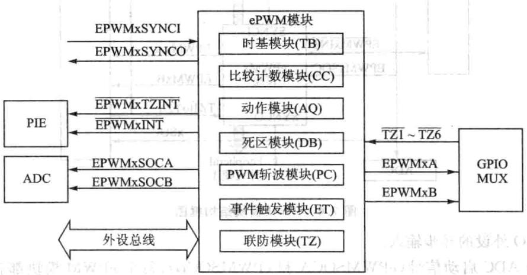

图7.5 PWM组成单元

每组PWM模块主要的输入输出信号如下，如图7.6所示。

①PWM输出信号(ePWMxA和ePWMxB);PWM输出引脚与GPIO引脚复，具体配置时要参照GPIO引脚配置。

②时间基础同步输入（ePWMxSYNCI)和输出（ePWMxSYNCO)信号；同步时钟信号将ePWM各个模块的所有单元联系在一起，每个ePWM模块都可以根据需要被配置为使同步信号，或忽略它的同步输成为独单元。时钟同步输和输出信号仅由ePWM1引脚产生，ePWMl的同步输出也与第一个捕获模块(eCAP1）的同步信号相连接。

③错误联防信号（TZ1～TZ6）；当外部被控单元符合错误条件时，诸如IGBT等功率器件模块过电压或过电流或过热时，这些输人信号为ePWM模块发出错误警告。每个模块都可以被配置为使或忽略错误联防信号，同时TZ1TZ6可以设置

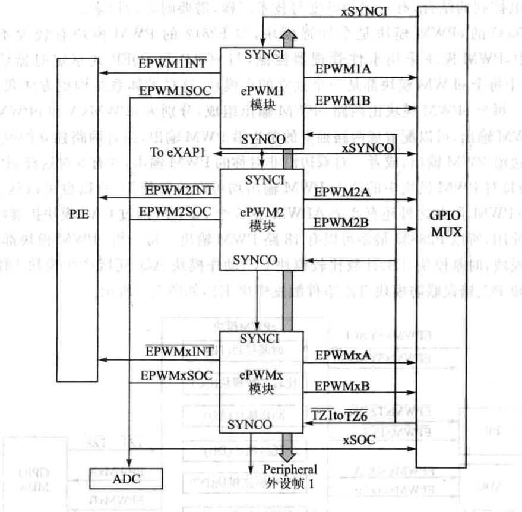

图7.6 PWM模块结构框图

为GPIO外设的异步输。

④ADC启动信号（ePWMSOCA和ePWMSOCB);每个ePWM模块都有两个ADC转换启动信号，任何个ePWM模块都可以启动ADC。触发ADC的转换信号的事件由PWM模块中事件触发模块来配置。

⑤外设总线；外设总线宽度为32位，允许16位和32位数据通过外设总线写ePWM模块寄存器。

每组ePWM模块支持以下特点：

专用16位时基计数器，控制输出的周期和频率。

两个互补对称PWM输出 和 可以配置如下式：

两个独立的单边沿操作的PWM输出。

-两个独立的双边沿操作对称的PWM输出。

－个独的双边沿操作对称的PWM输出。

软件实现PWM信号异步控制。

➢可编程的相位控制以支持超前或滞后其余的PWM模块。

》逐周期硬件同步相位。

双边沿延时死区控制。

》可编程错误联防。

➢产错误时可以强制PWM输出高电平低电平或者是高阻态。

所有的事件都可以触发CPU中断和ADC开始转换信号。

高频PWM斩波，用于基于脉冲变压器的门极驱动。

每组PWM模块的结构原理图如图7.7所示，时钟信号经时基模块TB产时基信号，可以设定PWM波形的周期，通过计数比较模块CC，可以对PWM波形的脉宽进行配置，再由动作模块AQ限定PWM输出状态即脉冲波形的起落，经过死区模块DB，可以将同组内的互补输出PWM波形进边沿延迟，进死区模块及进边沿延迟的原因稍后在死区模块内详细讲述，接着可选择是否进人PWM斩波模块，进第一个脉冲宽度设置和后级脉冲占空比调整以适应基于脉冲变压器的门级驱动控制，若PWM波形输出后，功率器件有错误响应，可以将错误信号引错误联防模块，从而强制复位PWM的输出。也可以通过事件触发模块配置触发一些事件，如ADC转换开始。下面逐一了解这7个模块。

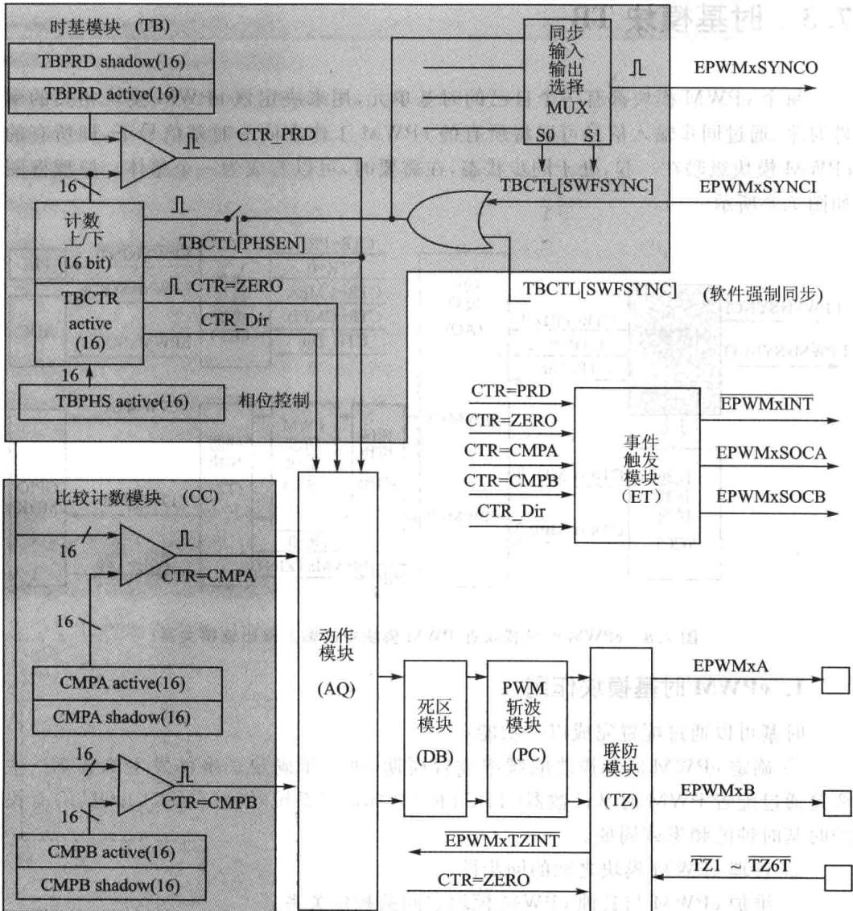

图7.7 PWM模块的结构原理图

### 7.3 时基模块TB

每个ePWM模块都有一个己的时基单元，用来决定该ePWM模块相关的事件时序，通过同步输信号可以将所有的ePWM工作在同一时基信号下，即所有的ePWM模块级联在一·起，处于同步状态，在需要时，可以看成为一个整体。原理框图如图7.8所示。

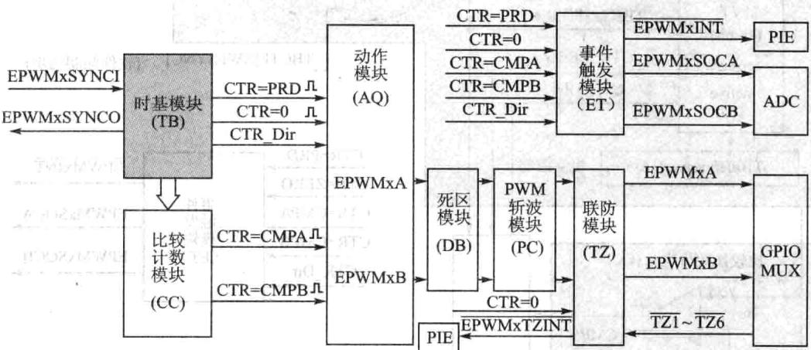

图7.8 ePWM时基模块在PWM模块中的输入输出连接关系

## 1.ePWM时基模块作用

时基可以通过配置完成以下功能：

①确定ePWM时基模块的频率或者周期，进一步确定了事件发生的频率。主要是通过配置PWM时基计数器（TBCTR）来标定与系统时钟（SYSCLKOUT）有关的时基时钟的频率或周期。

②管理ePWM模块之间的同步性。

③维护ePWM与其他ePWM模块之间的相位关系。

④设置时基计数器的计数模式。可以工作在向上计数（递增计数）、向下计数（递减计数）、向上下计数模式（先递增后递减计数）。

⑤产生下列事件：

：时基计数器的值与周期寄存器的值相同（TBCTR=TB-

时基计数器的值为 O

时基计数器按照指定模式进行计数，递增时会达到与周期寄存器的值一致，递减时则会减到最小值0。

⑥配置时基模块的时钟基准，对系统时钟SYSCLKOUT进分频可以得到时基时钟，通过合理分频系统时钟，计数的时候可以工作在相对较低的频率。1

## 2.时基模块的关键信号和寄存器

表7.1为时基模块相关寄存器。

|寄存器|地址|影子|描述|
|---|---|---|---|
|TBCTL|0x0000|无|时基控制寄存器|
|TBSTS|0x0001|无|时基状态寄存器|
|TBPHSHR|0x0002|无|HRPWM扩展相位寄存器|
|TBPHS|0x0003|无|时基相位寄存器|
|TBCTR|0x0004|无|时基计数寄存器|
|TBPRO|0x0005|有|时基周期寄存器|

表7.1时基模块寄存器

时基模块的原理图如图7.9所示，关键信号如下：

①ePWMxSYNCI：时基同步信号输入。输入脉冲用于时基计数器与之前的eP-WM模块同步，每个ePWM模块可以通过软件配置为使或者忽略此信号。对于第一个ePWM模块，这个信号从外部引脚获得。随后的模块的同步信号可以由其他ePWM模块传递过来。例如第2个模块的同步信号可以从第1个模块的同步信号输出获得，第3个模块由第2个模块产生，以此类推。

② ：时基同步信号输出。输出脉冲于随后的ePWM的时基计数器同步。ePWM模块产生该信号来源于下列3个事件源中的一件。

同步输脉冲)。

，时基计数器等于 0

，时基计数器等于比较寄存器。

③CTR=PRD，时基计数器等于指定周期值。无论什么时候当时基计数器的值与激活的周期寄存器(相对于影寄存器而)的值相等的时候，就会产此信号。

④ ，时基计数器等于0。无论什么时候当时基计数器的值为0的时候，会产生此信号。

5 ，时基计数器等于比较寄存器。时基计数器的值等于激活的比较寄存器B的时候，会产此信号。该信号由比较计数模块产，用于同步输出逻辑。

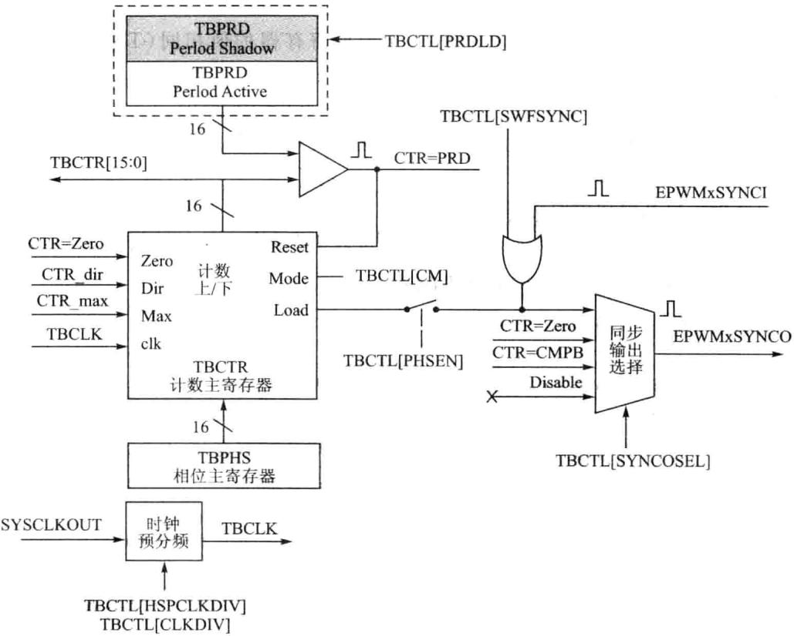

图7.9ePWM时基模块原理框图

⑥CTR_dir：时基计数器向。表明时基计数器的计数向，当高电平时，计数器向上计数，低电平时则向下计数。

⑦CTR_max:时基计数器的值为最值。当时基计数器到最大值时会产此信号。该信号作状态指。

⑧TBCLK：时基时钟信号。这个信号来源于预分频的系统时钟信号，用于所有的ePWM模块。该信号确定了时基计数器增减的速率。

## 3.ePWM的周期和频率的计算

ePWM的频率是由时基周期寄存器值（TBPRD）和时基计数器的计数模式(TBCTRL)共同决定的。时基计数器的计数模式有向上计数（递增)模式、向下计数（递减)模式、向上-下计数（先递增后递减)模式。下边就以周期寄存器设置为4(TB-PRD=4)举例说明。

## (1)向上-下计数模式(先递增后递减)

在此模式下，时基计数器先从0开始向上计数（递增）直到递增到周期寄存器的值4，然后再由4向下计数（递减）直到减到0，再重复以上动作，如图7.10所示。

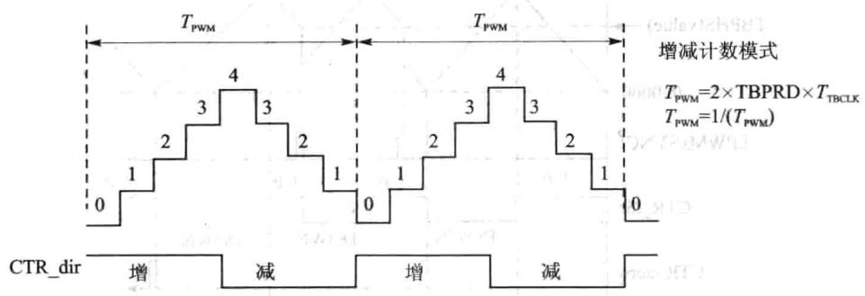

图7.10增减计数模式

在此种模式下，随着同步信号的来临，时基模块的输出波形有两种情形，需要通过设置相位方向TBCTL[PHSDIR]来确定。如果TBCTL[PHSDIR]=0时，那么当同步信号到来时，对应的输出波形如图7.11所。如果TBCTL[PHSDIR]=1时，那么当同步信号到来时，对应的输出波形如图7.12所示。

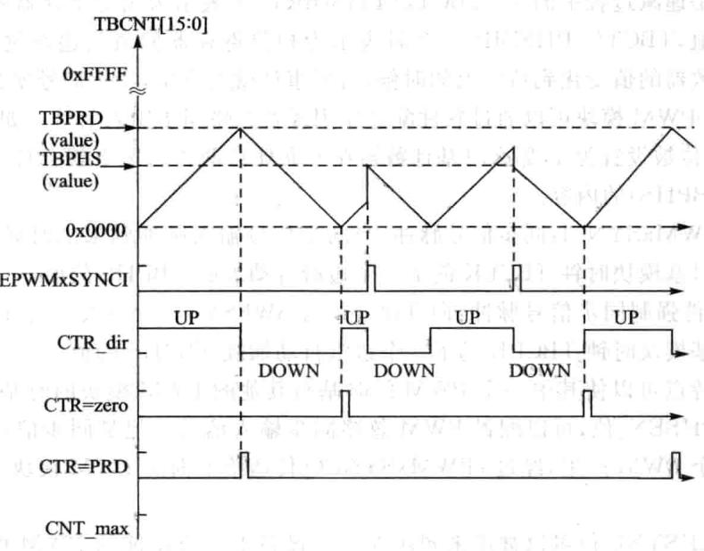

图7.11增减模式下PWM输出波形1

同步信号来临时，不管目前时基计数器已经到什么值，都将置位为相位寄存器的值，这个作用可以协调各路ePWM模块间的固定相位差，对于先递增后递减模式，同一相位寄存器的值，同时对应着两个段，例如相位值3，既出现在递增的过程中，又出现在递减过程中，通过TBCTL寄存器的PHSDIR位的设置，就可以确定究竟是递增过程还是递减过程中的3。TBCTL[PHSDIR]=1表示为相位寄存器的值是递增过程中的值，TBCTL[PHSDIR]=0时表示为相位寄存器的值是递减过程中的值。当时基计数器的值变化到特定值的时候，特定事件就会产，特定信号就会发出。

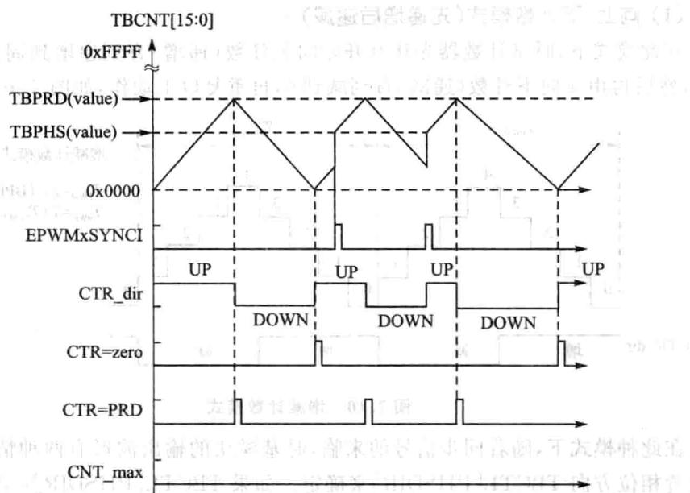

图7.12 增减模式下PWM输出波形2

每个ePWM模块可以通过软件配置使或者忽略同步输信号。如果TBCTL（PHSEN)位被设置为1，那么时基计数器在下面任意两种情况下就会自动加载相位寄存器（TBPHS)的内容。

①ePWMxSYNCI:同步信号脉冲：当同步信号输脉冲到来的时候，时基计数器就会在时基模块时钟TBCLK的下个边沿自动加载TBPHS的值。

②软件强制同步信号脉冲：向TBCTL的SWFSYNC位写1后，时基计数器也会在时基模块时钟TBCLK的下一个边沿自动加载TBPHS的值。

这个特点可以使其中个PWM的时基与其他的PWM模块的时基同步，清除TBCTL[PHSEN]位，可以配置PWM忽略同步输信号。但是同步信号仍然可以通过第一个PWM产生，经过ePWMxSYNCO传递给下面的PWM模块（ePWM2～ePWMx)。

TBCLKSYNC位可以被来同步在个设备上所有使能的PWM模块。该位是系统时钟使能寄存器的一部分。当TBCLKSYNC=0时，ePWM模块时基时钟停止（默认），TBCLKSYNC=1时，所有的ePWM模块在TBCLK的时钟上升沿到来时同时被启动，为了更好地同步各ePWM模块的TBCLK，每个ePWM模块的预分频系统时钟的时基时钟TBCTL的寄存器都要设置为相同的值。设置ePWM时钟的操作步骤如下：

①使能各ePWM模块的时钟。

②设置TBCLKSYNC=0，停止所有已使能的ePWM模块的时基时钟。

③配置预分频值与ePWM工作模式。

④设置TBCLKSYNC=1,启动时基时钟。

## (2)向上计数模式(递增）

在此模式下，时基计数器从0开始向上计数，直到递增到周期寄存器的值后，时基计数器会自动复位到0，重复以上动作，如图7.13所示，在此种模式下，随着同步信号的来临，时基模块的输出波形如图7.14所示。

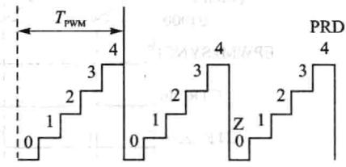

图7.13增计数模式

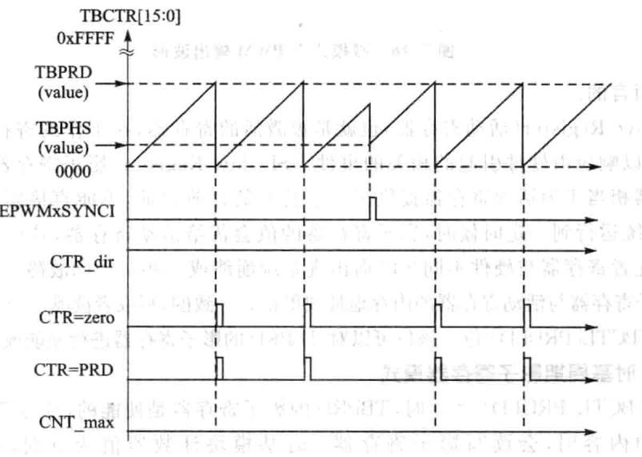

图7.14增模式下PWM输出波形

## (3)向下计数模式（递减）

在此模式下，时基计数器首先加载周期寄存器的值，然后开始递减，直到减到0时，自动再加载周期寄存器的值，重复以上动作，如图7.15所示。在此种模式下，随着同步信号的来临，时基模块的输出波形如7.16所。六

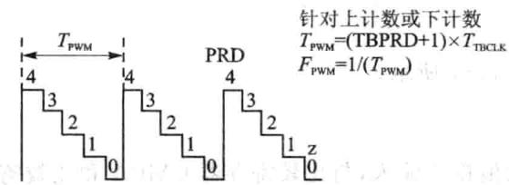

图7.15减计数模式

## 4.影子寄存器

在时基模块中有个周期影子寄存器。影子寄存器允许寄存器可以随硬件进同步更新。在ePWM模块中多处出现了影子寄存器，其意义都相仿。影子寄存器是相对于活动

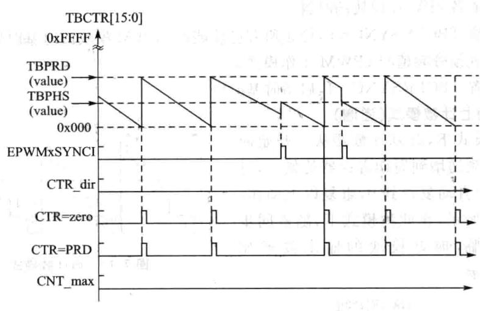

图7.16减模式下PWM输出波形

寄存器而的。

ActiveRegister（活动寄存器）也就是被激活的寄存器，在工作的寄存器，控制着硬件，可以响应由硬件引起的相关的事件。ShadowRegister（影子寄存器)影子寄存器缓存器相当于为活动寄存器提供了一个暂时的存放地址，不能直接影响硬件的控制，当系统运到一定时候时，影子寄存器的值会传给活动寄存器，这样可以防止由于软件配置寄存器与硬件不同步时出现系统崩溃或些奇怪的故障。

影子寄存器与活动寄存器的内存地址映射值是一致的，写或者读哪一个寄存器，主要取决于TBCTLPRDLD位。该位可以对TBPRD的影子寄存器进使能或者禁。

## （1）时基周期影子寄存器模式

当TBCTLPRDLD=0时，TBPRD的影寄存器是使能的，读写TBPRD的映射地址的内容时，会读写影子寄存器。时基模块计数器值为0时，（TBCTR=0x0000)，影子寄存器的值传递给活动寄存器。默认情况下，影子寄存器都是有效的。

## （2）时基周期立即加载模式

当TBCTL[PRDLD]=1时，为即加载模式，读写时基周期寄存器对应的地址时，都是直接到活动寄存器。

### 7.4计数比较模块CC

计数比较模块CC的原理框图如图7.17所。

## 1.计数比较模块的作用

计数器比较模块是以时基计数器的值作为输，与比较寄存器CMPA和比较寄存器CMPB不断进比较，当时基计数器的值等于其中之一时，就会产生相应的

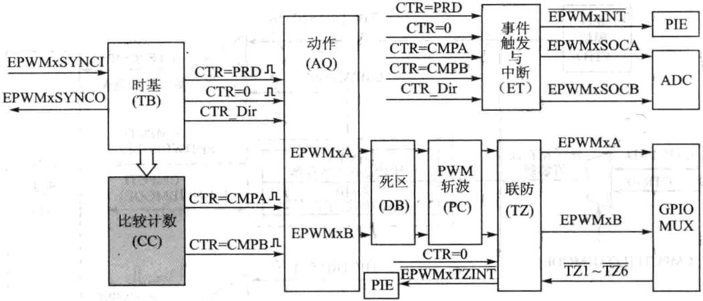

图7.17ePWM计数比较模块原理框图

事件。

①产比较事件具体取决于编程时是采用寄存器A或者B：

CTR=CMPA：时基计数器的值与比较寄存器A的值相同。

CTR=CMPB：时基计数器的值与比较寄存器B的值相同。

②动作模块AC恰当配置后可以控制PWM的占空比。

③采用影寄存器来更新比较值可以有效防在PWM周期内出现故障以及毛刺。

## 2.计数器比较模块的关键信号与寄存器

CC模块涉及的关键寄存器如表7.2所列。

|寄存器|地址|影子|描述|
|---|---|---|---|
|CMPCTL|0x0007|无|计数比较控制寄存器|
|CMPAHR|0x0008|有|HRPWMP计数比较A扩展寄存器|
|CMPA|0x0009|有|计数比较A寄存器|
|CMPB|0x000A|有|计数比较B寄存器|

表7.2 计数器比较模块的关键寄存器

控制框图如图7.18所示。

CTR=CMPA：时基计数器的值与CMPA的值相同，PWM可以根据AC动作。

CTR=CMPB：时基计数器的值与CMPB的值相同时，PWM可以根据AC动作。

➢CTR=PRD：时基计数器的值与周期寄存器的值相同，PWM可以根据AC动作。CMPA与CMPB可以根据相关影寄存器的值进更新。

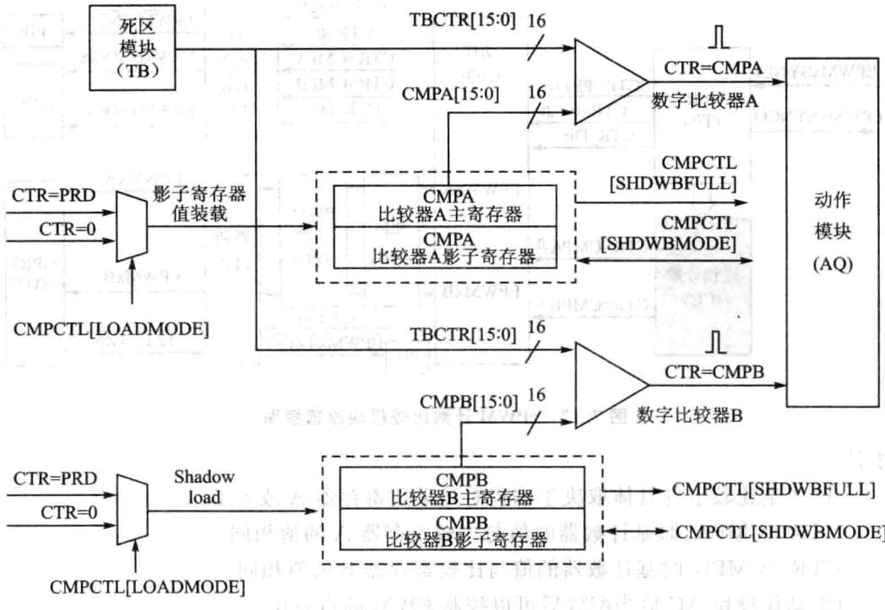

图7.18CC模块结构框图

：时基计数器的值递减到O时，PWM可以根据AC动作。CM-PA与CMPB可以根据相关影子寄存器的值进行更新。器

## 3.计数器比较模块的特点

计数器比较模块可以产生两个独立的比较事件，对于向上（递增）或者向下（递减)计数模式来说，在一个PWM周期内，比较事件只发生一次。而对于向上向下（先递增后递减)计数模式来说，如果比较寄存器的值在0～TBPRD之间，在一个PWM周期内，比较事件就会发生两次。这些事件都会直接影响动作模块。

计数器比较模块比较寄存器CMPA、CMPB各都有个影子寄存器。CMPA影子寄存器通过清除CMPCTL[SHDWAMODE]位使能，CMPB影子寄存器通过清零CMPCTLSHDWBMODE位使能。默认情况下，CMPA和CMPB影子寄存器是使能的。

若CMPA影子寄存器被使能的话，那么在以下几种情况时，影子寄存器的值会传递到有效寄存器中。

CTR=PRD：时基计数器值与周期寄存器值相同。

时基计数器值为0。

立即加载模式：如果影子寄存器被禁止，就进入立即加载模式，一旦将值写入到CMP寄存器时，这个值直接送到有效寄存器中，立即起作用。

### 7.5 动作模块AC

> 🔧 **交互式学习**：[ePWM动作限定模块](../interactive/components/pwm_aq.html)

动作模块在PWM波形形成过程中起到了关键作，它决定了相应事件发时应该输出什么样的电平。动作模块原理框图如图7.19所示。 <ZE1

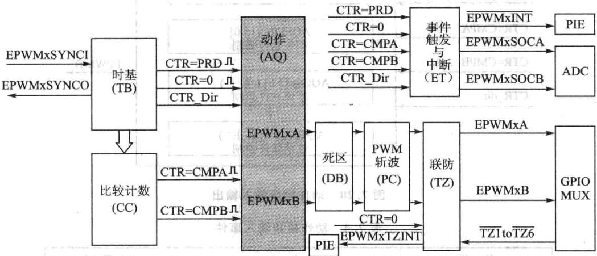

图7.19动作模块框图

## 1.动作模块的作用

①动作模块根据下列事件产生动作（置高、拉低、翻转）；

CTR=PRD：时基模块来的信号，时基计数器的值等于周期寄存器的值。

CTR=ZERO时基模块来的信号，时基计数器的值等于0。

CTR=CMPA计数比较模块来的信号，时基计数器的值等于比较寄存器A的值。

CTR=CMPB计数比较模块来的信号，时基计数器的值等于比较寄存器B的值。

②管理以上事件发生后PWM的输出极性；

③ 针对时基计数器递增或者递减时提供独的动作控制。

## 2.动作模块关键信号与寄存器

动作模块关键寄存器如表7.3所列。动作模块是基于事件驱动的，图7.20展示了动作模块的输入逻辑和输出动作。动作模块的输入事件如表7.4所列。

|寄存器名|地址偏移|影子寄存器|描述|
|---|---|---|---|
|AQCTLA|0x000B|无|ePWMA动作模块控制寄存器|
|AQCTLB|0x000C|无|ePWMB动作模块控制寄存器|
|AQSFRC|0x000D|无|动作模块软件强制寄存器|
|AQCSFRC|0x000E|阳 有|动作模块软件强制持续|

表7.3动作模块的关键寄存器

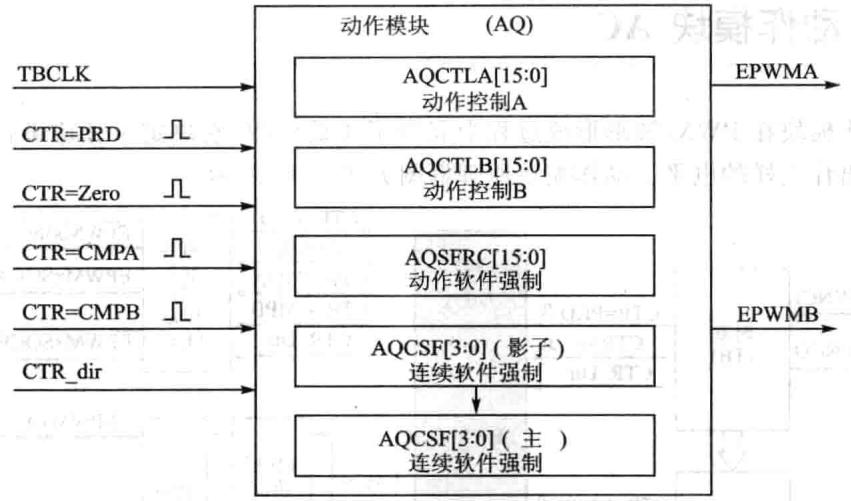

图7.20 动作模块输入输出

|信号|描述|寄存器比较|
|---|---|---|
|CTR=PRD|时基计数器的值等于周期值|TBCTR=TBPRD|
|CTR=Zero|时基计数器的值等于0            中|TBCTR=0x0000|
|CTR=CMPA|时基计数器的值等于比较器A的值|TBCTR=CMPA|
|CTR=CMPB|时基计数器的值等于比较器B的值|TBCTR=CMPB|
|Software forced event|由软件进行初始化的异步事件||

表7.4动作模块输入事件

软件强制是个异步事件，这个控制由AQSFRC和AQCSF两个寄存器处理。动作模块可以控制输出ePWMA和ePWMB的动作。输动作模块的事件也可以被量化，这样就可以控制在递增或递减计数模式时，输出独立的相位。

ePWMA和ePWMB的动作包括：

SETHIGH:使ePWMA和ePWMB输出高电平。

CLEARLOW：使ePWMA和ePWMB输出低电平。

TOOGLE：当ePWMA或者ePWMB当前状态是低电平时，那么下时刻就是高电平，当ePWMA或者ePWMB当前状态时高电平时，那么下时刻就是低电平。

DONOTHING：不对ePWM输出做任何改变。但是还是可以产相应的事件触发信号以及相关中断。

## 3.动作模块事件优先级

在同一时刻，动作模块可能会收到两个及两个以上的事件时，动作模块如何执呢？在这种情况下，就需要硬件提供事件优先级。优先级1最，优先级7最低。根

据不同的计数模式，优先级定义不同。向上向下（先递增后递减)计数模式的优先级定义如表7.5所列。

|优先级|假如时基计数器（TBCNTR)在增长TBCNTR=0增加到TBCNTR=TBPRD|假如时基计数器（TBCNTR）在减少TBCNTR=TBPRD减少到TBCNTR=1|
|---|---|---|
|1（最高）|软件强制|软件强制|
|2|向上计数时，计数器等于计数比较器B(CBU)|向下计数时，计数器等于计数比较器B(CBD)|
|3|向上计数时，计数器等于计数比较器A(CAU)|向下计数时，计数器等于计数比较器A(CAD)|
|4|计数器等于0|计数器等于周期寄存器值|
|5|向下计数时，计数器等于计数比较器B(CBD)|向上计数时，计数器等于计数比较器B(CBU)|
|6（最低）|向下计数时，计数器等于计数比较器A（CAD)|向上计数时，计数器等于计数比较器A(CAU)|

表7.5 动作模块先增后减模式下的事件优先级

软件强制优先级最高，最低是计数器在增的时候，与比较寄存器A匹配事件。向上计数（递增)模式的优先级如表7.6所列。最高同样是软件强制，最低是计数器减到0事件。表7.7给出了向下（递减)计数模式的优先级。

最同样是软件强制，最低是计数器与周期寄存器的值匹配事件。

|优先级|时间|
|---|---|
|1（最高）|软件强制|
|2|计数器等于周期寄存器值（TBPRD）|
|3|向上计数时，计数器等于计数比较器B（CBU)|
|4|向上计数时，计数器等于计数比较器A(CAU)|
|5（最低）|计数器等于0|

表7.6 动作模块递增模式下的事件优先级

|优先级|时间|
|---|---|
|1（最高）|软件强制|
|2|计数器等于周期寄存器值(TBPRD)|
|3|向下计数时，计数器等于计数比较器B(CBU)|
|4|向下计数时，计数器等于计数比较器A（CAU)|
|5（最低）|计数器等于0|

表7.7动作模块递减模式下的事件优先级

## 4.动作模块一般配置条件下的输出波形

PWM波形在通过AC模块后是什么样呢？需要根据时基计数器的作模式来分别讨论。上下计数模式(先递增后递减)的波形图如图7.21所示。在这个模式下占空可以从0～100%变化。当计数器递增到CMPA的值时，PWM输出电平经AC模块被置高，同样，当计数器递减到CMPA时，PWM输出电平被置低。若CM-PA=0时，则PWM信号直输出低电平，占空比为0%，当CMPA=TBPRD时，PWM信号输出高电平，占空比为100%。

实际使中，如果装载CMPA或CMPB为0时，那么设置CMPA或CMPB的值要于或等于1，如果装载CMPA或CMPB为周期寄存器的值时，那么设置

CMPA或CMPB的值要小于或等于TBPRD一1，这就意味着，每个PWM周期至少有一个时基时钟周期的脉冲，在系统角度来看，这个周期很短，所以可以忽略。

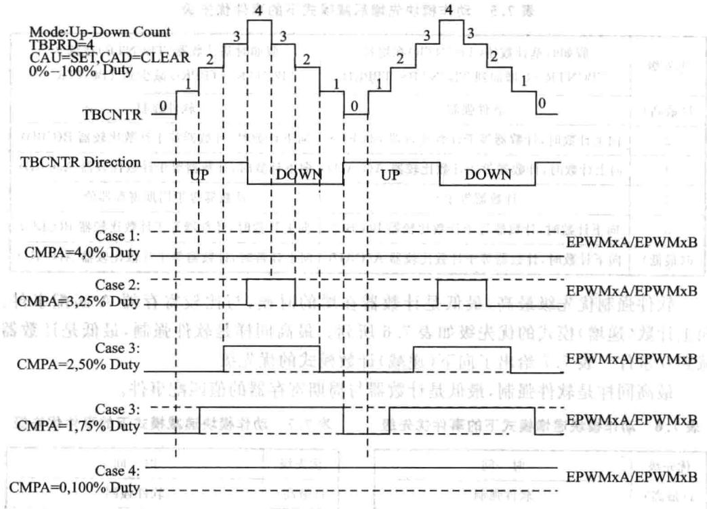

图7.21先递增后递减模式下占空比控制波形图

具体波形的调整与配置程序如下。

[例7.1] 单边非对称波形(ePWMxA和ePWMxB独调制，高电平有效）如图7.22所示。

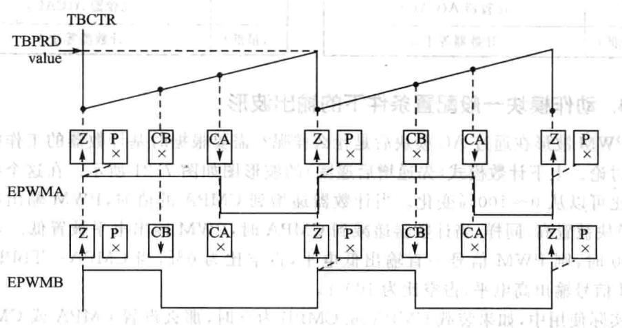

图7.22单边非对称波形(ePWMxA和ePWMxB独立调制，高电平有效）

注意：

②CMPA决定ePWMxA的占空比，CMPB决定ePWMxB占空比。

图7.22的相关配置程序如下：

[例7.2] 向上计数(递增)单边不对称脉冲波形(ePWMA、ePWMB独调制) 如图7.23所示船.

与例题7.1程序不一样的地方只在初始化最后部分，如下：

[例7.3]向上计数（递增）ePWMA独调制，不对称脉冲波形，如图7.24所示。

图7.24的相关配置程序如下：

//设定PWM周期为601个TBCLK时钟周期 //比较器A为200个TBCLK

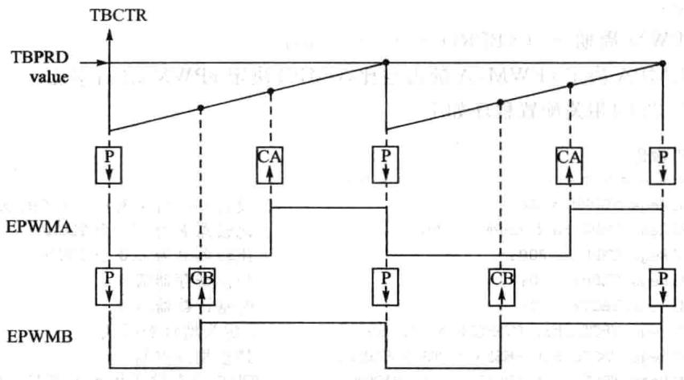

图7.23 向上计数(递增）单边不对称脉冲波形(ePWMA、ePWMB独立调制）

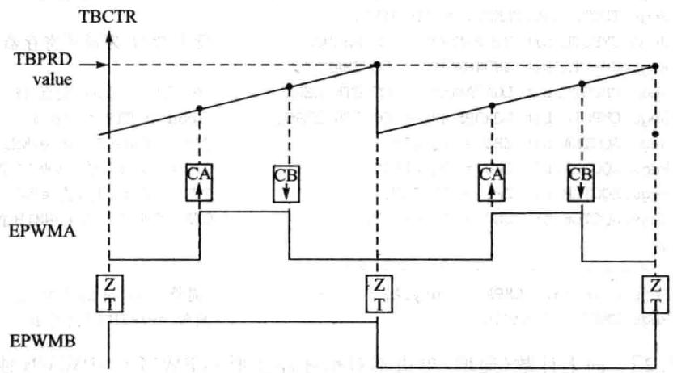

图7.24向上计数（递增）ePWMA独立调制，不对称脉冲波形

ePWM1Regs.CMPB=400; //比较器B为400个TBCLK

ePWM1Regs. TBPHS = 0; //相位寄存器清零

ePWM1Regs.TBCTR=0; //时基计数器清零

ePWM1Regs.TBCTL. bit.CTRMODE = TB_UP; //设定为增计数模式

ePWM1Regs.TBCTL. bit.PHSEN= TB_DISABLE; //禁止相位控制

ePWM1Regs.TBCTL. bit.PRDLD = TB_SHADOW; //TBPRD寄存器采用影子寄存器模式

ePWM1Regs.TBCTL.bit.SYNCOSELTB_SYNC_DISABLE;//禁止同步信号

ePWM1Regs.TBCTL.bit.HSPCLKDIV=TB_DIV1；//设定TBCLK=SYSCLK时基时钟=系统时钟

ePWM1Regs.TBCTL.bit.CLKDIV = TB_DIV1;

ePWM1Regs.CMPCTL.bit.SHDWAMODE= CC_SHADOW； //设定CMPA为影子寄存器模式

ePWM1Regs.CMPCTL.bit.SHDWBMODE = CC_SHADOW;

ePWM1Regs.CMPCTL.bit.LOADAMODE= CC_CTR_ZERO； //在CTR=Zero时装载

ePWM1Regs.AQCTLA.bit:CBU=AQ_CLEAR; //CTR=CBU时，将ePWM1A置低

[例7.4]上下(先递增后递减)计数，双边对称波形,ePWMxA和ePWMxB独立调制，低电平有效，如图7.25所示。

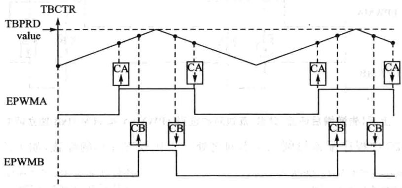

图7.25上下(先递增后递减)计数双边对称波形ePWMxA和ePWMxB独立调制，低电平有效

图7.25的相关配置程序如下：

[例7.5]上下（先递增后递减)计数，双边对称波形,ePWMxA和ePWMxB独立调制，互补型，如图7.26所示。

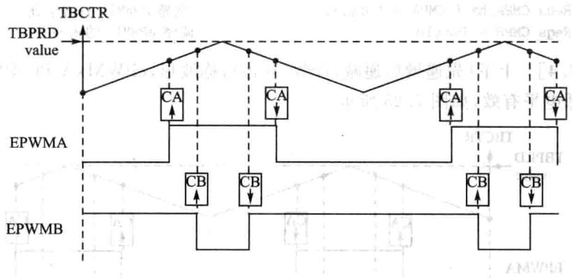

图7.26 上下(先递增后递减)计数双边对称波形ePWMxA和ePWMxB独立调制互补型

图7.25中程序配置与例7.4不同之处在于比较寄存器的配置，如下所示：

[例7.6] 递增递减计数，ePWMxA独输出双边不对称波形，如图7.27 所示。

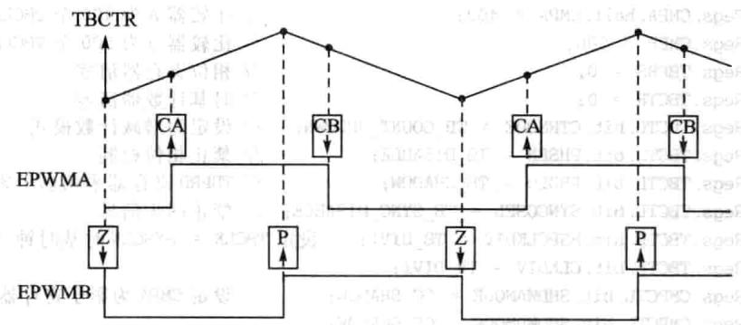

图7.27递增递减计数，ePWMxA独立输出双边不对称波形

图7.27的相关配置程序如下：

//初始化

### 7.6死区产生模块DB

> 🔧 **交互式学习**：[ePWM死区发生器](../interactive/components/pwm_db.html)

## 1.为什么要产生死区

PWM电路通常是一个全桥控制或半桥控制的电路，图7.28是一个典型的三相全桥PWM控制逆变电路原理图。该电路由6个开关管组成，（V1，V4）、（V2，V5）、（V3，V6）三个桥臂，每个开关管都由调制电路产生的PWM波形驱动，PWM波形处于高电平时，开关管导通，处于低电平时关断。显然同一桥臂上的两个开关管不该同时导通，若同时导通，就造成了电源短路。因此输同桥臂上的两个开关管的驱动信号必须要进互补控制，即V1开通，V4须可靠截止。在上节了解到F28335的PWM模块中就可以产互补的PWM对称波形，理想情况下如图7.29所示。

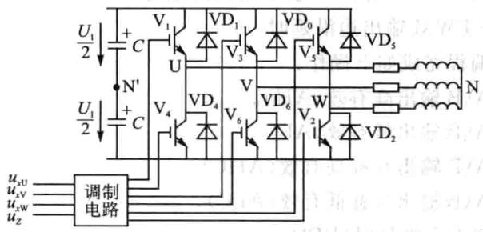

图7.28三相全桥逆变控制电路

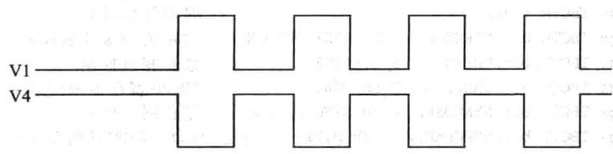

图7.29V1、V4对称互补波形

实际情况中没有绝对的理想脉冲波形，所有的数字信号归根到底都是模拟信号，在脉冲形成时，总会有上升时间与下降时间。V1在上升沿时开通，V2在下降沿过程中关断，但若V1开通时，V2尚未有效关断，这时电源就短路了，瞬间电流会很大，会烧坏功率管，这种现象也许会发，也许不会发，因为并不能完全确定每个管子在上升沿时哪个精确时点开通，在下降沿时哪个精确时点会关断，功率管的制造艺总会有定的分散性，关断与开通的准确时间点，也有一定的随机性，这就存在着很大的不确定性，对于成熟设计而言，不确定就是灾难，要尽量避免不确定性，确保同桥臂上的两个管的开通与关断的状态互补。法很简单，就是确保关断的管有效关断，般在个下降沿时间内，管能够有效关断，因此同桥臂上待开通的管子的上升沿只要滞后于另管的下降沿时间即可，这个时间区域，很有可能两个管子都不在导通状态，所以这个时间区域称为死区。死区的存在能够保证有效的关断管，避免两个管同时导通。

## 2.死区产生模块的作用

F28335的死区模块主要作用就是让两个互补的对称的PWM波形中，上升沿的发出滞后于PWM波的下降时间发出。在实际编程或者实际情况中更灵活些，有可能管子是低电平状态开通，所以延时的式可以更灵活。在动作限定模块中就可以产死区，但是如果要严苛格控制死区的边沿延时和极性，则需要通过死区模块来实现。

死区模块的主要功能如下：

①根据信号ePWMxA输产带死区的信号对(ePWMxA和ePWMxB)，也就是输出对互补PWM输出边沿延时。

②信号对可编程完成如下操作：

输出高有效（AH）。

输出低有效(AL)。

输出互补高有效（AHC）。

➢ePWMA\B输出互补低有效(ALC)。

③加入可编程上升沿延时(RED)。

④加可编程下降沿延时(FED)。

⑤可以忽略延时。

## 3.死区模块工作的特点

死区模块有两组(ePWMxA与ePWMxB)独的选择机制，如图7.30所示，选择过程中主要有3类选择，如下：

①输源选择。死区模块的输源来自动作模块输出的ePWMA和ePWMB，通过DBCTL[IN_MODE]位选择输入源。

ePWMXA是上升沿和下降沿延时的输源，系统默认选择。

》ePWMXA是上升沿延时的输源、ePWMXB是下降沿延时的输源。

➢ePWMXA是下降沿延时的输源、ePWMXB是上升沿延时的输源。

➢ePWMXB是上升沿和下降沿延时的输源。

②输出模式选择。输出模式选择是通过DBCTL[OUT_MODE]位决定的。

③极性选择。极性选择是通过DBCTL[POLSEL]位决定的。

图7.30说明了死区控制的选择机制：

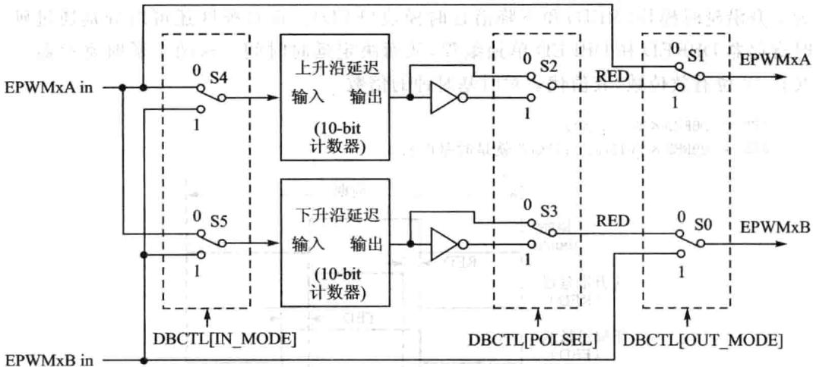

图7.30 死区模块选择输入输出

表7.8给出了死区共有7种选择模式，图7.31给出了不同模式下的波形输出：

》模式1：不经过双边沿延时模块，即禁止死区功能。

模式2～模式5：典型死区应用。

模式6：不经过上升沿延时模块。

模式7：不经过下降沿延时模块。

|模式|Uxh6描述|DBCTL（POLSEL）S3             S2|DBCTL（OUT_MODE)S1               SO|
|---|---|---|---|
|√|EOWMxA、ePWMxB无延迟|X              X|0               0|
|2|AHC高电平（延迟）互补|1                0|1                1|
|3|ALC低电平（延迟）互补|0                1|1                1|
|4|AH（高电平有效）|0                0|1                1|
|5|AL（低电平有效）|1                 1|1|
|6|ePWMxAOut=ePWMxAIn（无延迟）ePWMxBOut=ePWMxAIn（下降沿延迟）|0or            or1|]|
|7|ePWMxAOut=ePWMxAIn（无延迟）ePWMxBOut=ePWMxAIn（下降沿延迟）|0or              or|0|

表7.8死区选择模式部田工区

综上所述，可以把死区看成是由选择模块和延时模块组成的，其中延时模块又分为上升沿延时模块(RED)和下降沿延时模块(FED)。而且死区还可以分别通过延时寄存器DBRED和DBFED单独编程，从决定延时时间。这两个延时寄存器共有10位有效位数，其值代表对时基时钟的倍数。

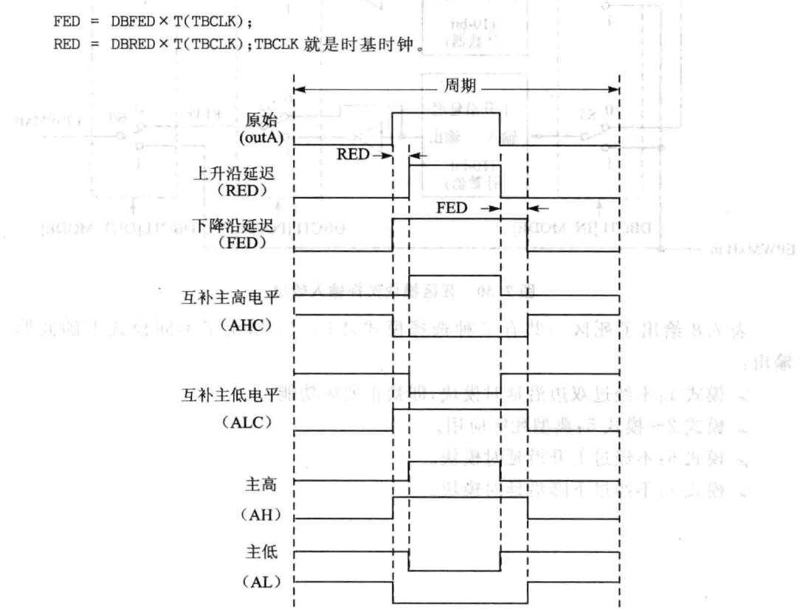

图7.31 死区控制的波形输出

### 7.7 斩波模块PC

PWM斩波器子模块通过高频信号来调制经由动作模块与死区模块产的PWM波形，这个功能在基于脉冲变压器的门极驱动型功率器件控制中很重要。组成框图如图7.32所。

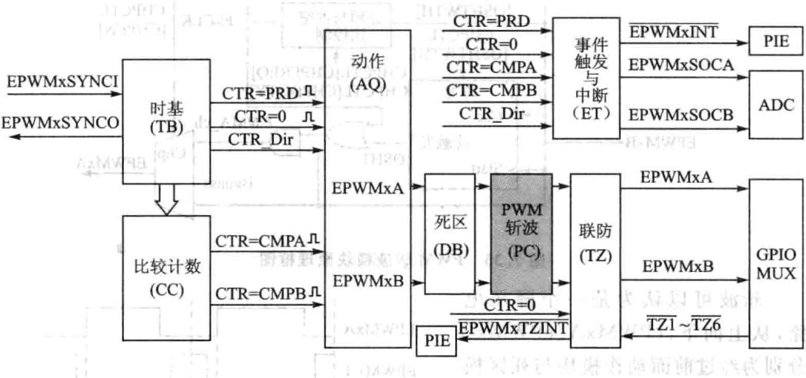

图7.32斩波模块

## 1.PWM斩波模块的作用

PWM斩波模块主要有以下作用：

①可编程斩波（载波)频率。

②可编程第1个脉冲的脉宽。

③可编程第2个以及后面的脉冲占空比。

④可以禁止使用PWM斩波模块。

## 2.PWM斩波模块的特点

PWM斩波模块原理框图如图7.33所。载波时钟来源于系统时钟SYSCLK-OUT。它的频率和占空比由CHPCTL寄存器中的CHPFREQ和CHPDUTY进配置。一次触发模块(one-shot)子模块主要是提供较大能量的第一个脉冲，迅速有效地开通功率开关，改变功率开关的状态，接下来的脉冲只要维持开关的状态就行，例如多数功率器件开通电流要维持电流得多。单触发模块的第个脉冲的宽度可以由OSHTWTH位来确定。PWM斩波器这一功能模块可以用CHPEN位进使能控制。

## 3.PC模块输出波形

图7.34给出了PWM斩波模块作用下的输出波形。

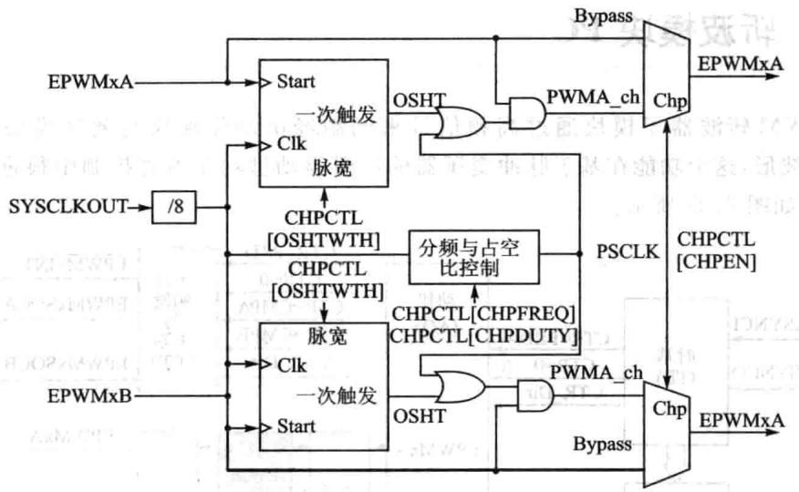

图7.33PWM斩波模块原理框图

斩波可以认为是一个降压电路，从上向下，ePWMxA、ePWMxB分别为经过前面动作模块与死区模块后的输出波形，为斩波模块的输波形，中间PSCLK是斩波模块的时钟信号，输入的ePWMxA相当于一个闸门实际是与PSCLK作与运算，得到ePWMxA斩波波形，经斩波后，ePWMxA的占用能量和平均电压均可以通过占空比等设置进调整，对一些功率器件而言，可以降低开通期间的功耗。

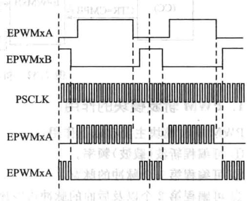

图7.34PWM斩波输出波形

## 4.一次脉冲

①第1个脉冲的宽度可以通过编程为16种值。第1个脉宽计算值为下式：

一次脉冲波形如图7.35所示。

OSHT的波形设置根据首脉冲宽度要求，输入波形与时钟波形进行与运算再与OSHT进行或运算，输出波形与原斩波波形主要差别为首脉冲的宽度得到单独控制，首脉冲的宽度可以根据功率器件的开通特性来设置，以保证功率器件可靠开通。

②占空比控制。基于脉冲变压器的门极驱动电路的设计需要考虑磁极或者变压器及相关电路的特点，要考虑到变压器饱和的情况。为了满足门极驱动的设计要求，第2个及其余脉冲占空比可以通过编程设置，确保在功率器件开通周期内脉冲有正确的极性与驱动能力。斩波器模块通过对CHPDUTY位编程，可以实现7种不同占空比，占空比可以选择的范围是12.5%~87.5%。占空比的设置要根据驱动电路的要求以及器件的开通特性考虑，如图7.36所示。

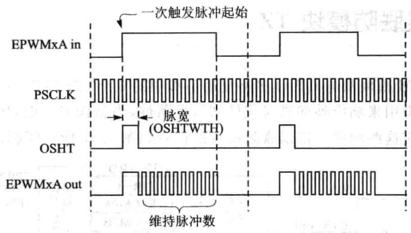

图7.35-次脉冲波形

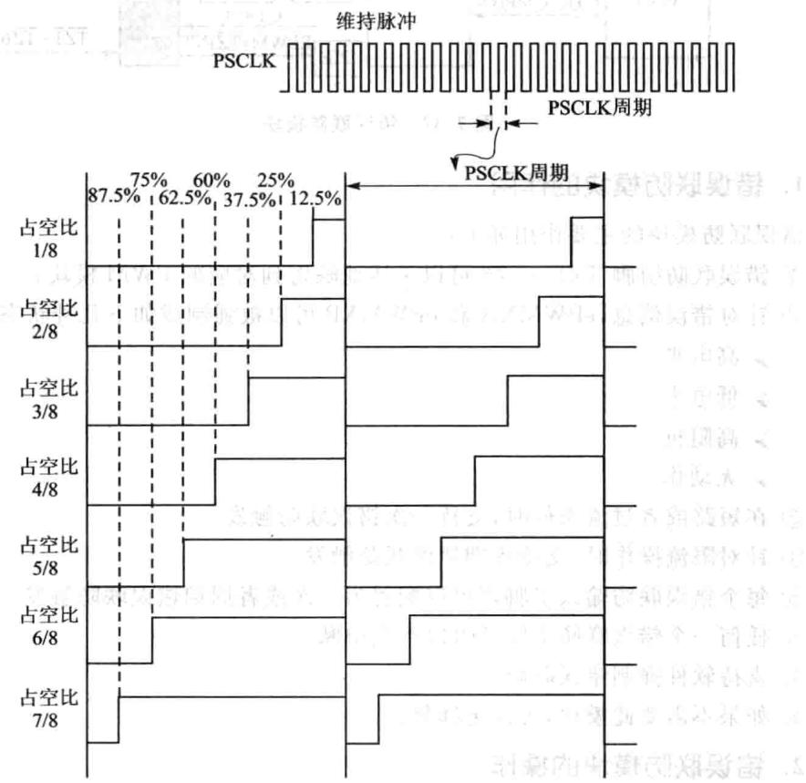

图7.36斩波占空比控制

### 7.8错误联防模块TZ

每个ePWM模块都与GPIO多路复用引脚中的6个TZn（TZ1～TZ6）信号脚连接。这些信号脚用来响应外部错误或外部触发条件，当错误发生时，PWM模块可以通过编程来响应这些问题。错误联防模块的位置如图7.37所示阴影部分。

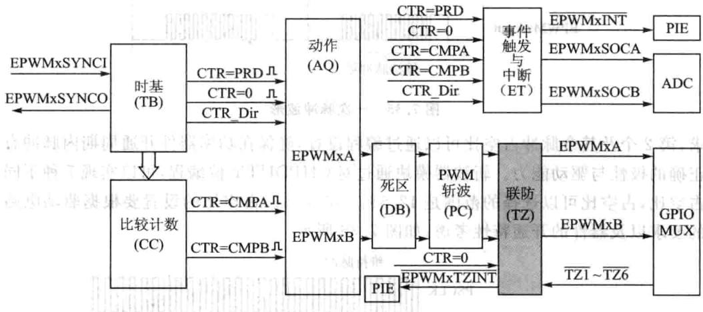

图7.37 错误联防模块

## 1.错误联防模块的作用

错误联防模块的主要作用如下：

①错误联防引脚TZ1～TZ6可以灵活地映射到对应的PWM模块；

②针对错误信息，ePWMXA和ePWMXB可以被强制或如下几种状态：

高电平。

低电平。

》高阻抗。

无动作。

③在短路或者过流条件时，支持次错误联防触发。

④针对限流操作时，支持周期错误联防触发。

⑤每个错误联防输引脚都可以配置为次或者周期错误联防触发。

⑥任何个错误联防引脚都可以产中断。

⑦支持软件强制错误联防。

⑧如果不需要此模块，可以选择禁止。

## 2.错误联防模块的操作

TZ1~TZ6的输引脚为低有效。当这些引脚中的任意个有效时，表明个错误事件发生，每个PWM模块都可以单独配置为禁止或者使能此错误联防触发引脚。ePWM模块选择哪一个错误引脚是通过TZSEL进行设置的，错误信号可以跟系统时钟同步，也可以不同步，同样具有数字滤波功能，跟GPIO引脚功能一样。个系统时钟的低脉冲输即可以有效触发错误控制逻辑。异步触发确保在系统时钟发错误的情况下，错误引脚仍能够触发错误控制逻辑。其余的配置可以参照GPIO的引脚配置。每个TZn输引脚可以单独配置为一次触发或者周期触发。

①周期触发：当周期错误联防事件发生时，TZCTL寄存器中的动作立刻输出到ePWMXA和ePWMXB引脚上，另外，周期错误联防事件标志位（TZFLG[CBC]）被置位，同时当TZEINT寄存器和PIE模块的中断使能时，ePWMX_TZINT中断就会产生。

②单次触发：当单次错误联防事件发时，同样TZCTL寄存器中的动作刻输出到ePWMXA和ePWMXB引脚上，另外单次错误联防事件标志位（TZFLG[OST)被置位，同时当TZEINT寄存器和PIE模块的中断使能时，ePWMX_TZINT中断就会产。

两种模式触发的区别在于，周期错误联防事件标志可以动清零，但是单次错误联防事件标志需要软件清零。

### 7.9事件触发模块

事件触发模块功能框图位置如图7.38中阴影部分所。

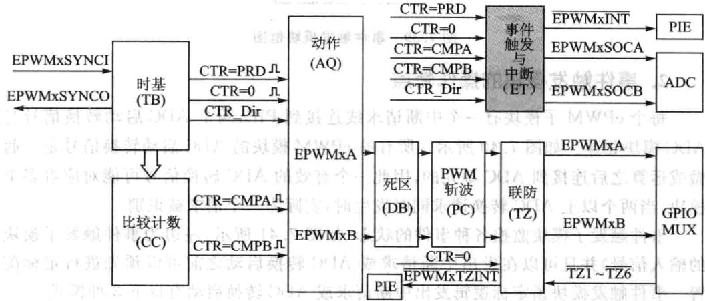

图7.38 事件触发模块

## 1.事件触发模块的作用

①接收来自时基模块和计数比较模块产生的相关事件的输入；

②利用时基模块中的向信息识别是递增还是递减计数模式以便产相应的

事件。

③使用预定标判断逻辑发出中断请求或者ADC开始转换启动信号：

》每个事件。

》每两个事件。

每三个事件。

④允许软件配置，强制产生中断事件或者ADC启动信号。

事件触发模块主要响应时基模块与计数较模块的相关事件，当这些事件发时，PWM事件触发模块产相应的中断事件或ADC启动事件。事件触发模块的原理框图如图7.39所示。

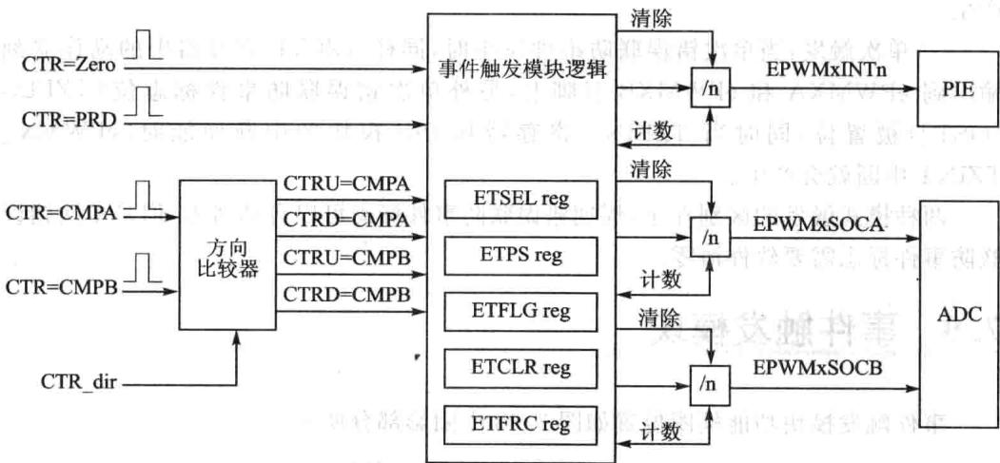

图7.39事件触发模块框图

## 2.事件触发模块的操作特点

每个ePWM模块有个中断请求线连接到PIE，两个ADC启动转换信号与ADC模块相连。如图7.40所。所有的ePWM模块的ADC启动转换信号是起做或运算之后连接到ADC单元的，因此个有效的ADC转换信号可能对应着多个模块，当两个以上ADC转换请求同时发时，实际为一个请求被识别。

事件触发模块监控各种事件的状态（如图7.41所，左边为事件触发模块的输信号)并且可以在发出中断请求或ADC转换启动之前可以预先进定标配置。事件触发模块预定标逻辑发出中断请求或ADC转换启动有以下3种模式：

①每个事件。

②每两个事件。

③每三个事件。

图7.42给出了事件触发器中断产逻辑，中断周期(ETPS[INTPRD])位确定请求中断产生的事件数，可以按照如下操作进行选择；

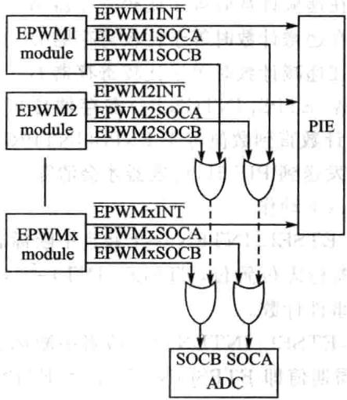

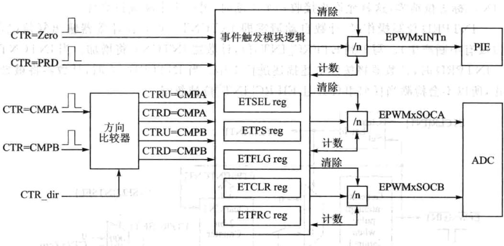

图7.40事件触发模块ADC启动信号图7.41事件触发模块的事件

①不产生中断。

②每个事件产生一次中断。

③每两个事件产生次中断。

④每三个事件产生一次中断。

中断选择（ETSEL[INTSEL]）位设置产生中断的事件，可选事件如下：

①时间基准计数器等于零（TBCTR=0X0000)。

②时间基准计数器等于周期值 

③时间基准计数器在递增计数时等于比较寄存器A。

④时间基准计数器在递减计数时等于比较寄存器A。

⑤时间基准计数器在递增计数时等于比较寄存器B。

⑥时间基准计数器在递减计数时等于较寄存器B。

通过中断事件计数器（ETPS[INTCNT）寄存器位可以得到事件的数量。当ETPSINTCNT递增计数直到数值等于ERPS(INTPRD)确定的值时，停计数且输出置位，只有当中断发送到PIE时，计数器才会清零。当ETPS[INTCNT]等于ETPS（INTPRD）将发生以下动作：

①如果中断被使能，ETSEL[INTEN]=1并且中断标志清零，ETFLG[INT]=0，则产生中断脉冲且中断标志位置位，ETFLG（INT)=1，事件计数器清零，ETPS[INTCN]=0，再重新对事件计数。

②如果中断被禁止，ETSEL[INTEN]=0或者中断标志置位，ETFLG[INT]=1，则当计数器的值等于周期值即ETPS[INTCNT=ETPSINIPRD，计数器停止计数。

如果中断被使能，但是中断标志已经复位，则计数器将输出高电平直到ETFLG[INT]标志位清零，这就允许当接收个中断时，另个中断进等待。

INTPRD位写操作时，计数动清零即INTCNT=0并且计数器输出复位（所以没有中断产生）。写1到ETFRC[INT]位，计数器INTCNT将增加。当INTCNT=INTPRD时，计数器将按照上述描述进作。当INTPRD=0时，计数器将被禁，所以不会检测当任何事件并且EIFRC[INT位被忽略。

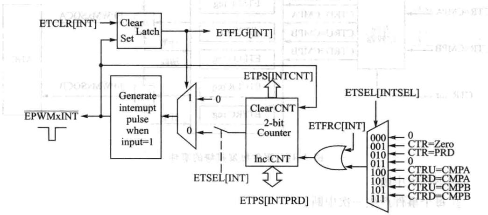

图7.42 事件触发模块的中断产生逻辑

事件触发器产生启动SOCA脉冲的电路如图7.43所示，除了产生连续脉冲外，ETPS[SOCACNT计数器和ETPSSOCAPRD]周期值同上述中断产生逻辑中的计数器和周期寄存器功能相同，所不同的是此模块产生连续的脉冲。当一个脉冲产生时，脉冲标志ETFLG[SOCA]被锁存，但是不会停脉冲的产生。使能/禁位ET-SEL[SOCAEN]于停脉冲的产，但是输事件仍就被继续计数直到其值等于周期寄存器的值。可以通过ETSEL[SOCASEL]和ETSEL[SOCBSEL]位独设置SOCA和SOCB脉冲触发事件。事件触发模块SOCB的产生电路，SOCB产生过程和SOCA相同。

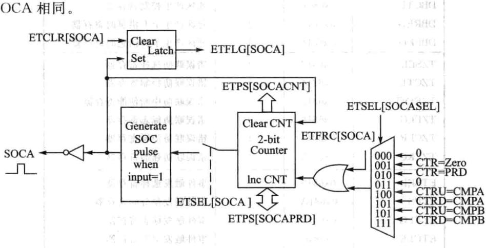

图7.43事件触发模块的SOCA产生电路

### 7.10 PWM模块寄存器

F28335PWM所有的寄存器以及对应的地址如表7.9所列。

|名称|地址|太小|描述|
|---|---|---|---|
|||||
|TBCTLTBSTSTBPHSHRTBPHSTBCTRTBPRD|0x68000x68010x6802|111|时基控制寄存器时基状态寄存器HRPWM相位扩展寄存器|
|0x68020x68030x68040x68050|11|HRPWM相位扩展寄存器时基相位寄存器容警立时基计数寄存器业时基周期寄存器||
|CMPCTLCMPAHRCMPACMPB|0x68070x68080x68090x680A|||
|计数比较控制寄存器HRPWM计数比较扩展寄存器计数比较寄存器A||||
|11|计数比较寄存器A计数比较寄存器B量|||
|AQCTLAAQCTLB|0x680B0x680C||动作控制寄存器A动作控制寄存器B|
|AQSFRCAQCSFRC|0x680D0x680E|]|动作软件强制寄存器动作连续软件强制寄存器|

表7.928335PWM相关寄存器

续表7.9

|名称|地址|大小|描述|
|---|---|---|---|
|DBCTLDBREDDBFED|0x680F0x68100x6811|111|死区产生控制寄存器死区产生上升沿延时寄存器死区产生下降沿延时寄存器|
|TZSELTZCTLTZEINTTZFLGTZCLRTZFRC|0x68120x68140x68150x68160x68170x6818|111|错误联防选择寄存器错误联防控制寄存器错误联防中断使能寄存器错误联防标志寄存器错误联防清零寄存器错误联防强制寄存器|
|ETSELETPSETFLGETCLRETFRC|0x68190x681A0x681B0x681C0x681D|1|事件触发选择寄存器事件触发预分频寄存器事件触发标志寄存器事件触发清零寄存器事件触发软件强制寄存器|
|PCCTL|0x681E|1|PWM斩波控制寄存器|
|HRCNFG|0x6820|1|HRPWM配置寄存器 AV|

## 1.时基模块寄存器

## （1）时基周期寄存器TBPRD

时基周期寄存器TBPRD各位信息如表7.10所列。

|位|名称|值|描述|
|---|---|---|---|
|15~0|TBPRD|0x0000~0xFFFF|时基周期寄存器：时基计数器周期|

表7.10时基周期寄存器TBPRD

## （2）时基相位寄存器TBPHS

时基相位寄存器TBPHS各位信息如表7.11所列。

|位|名称|值|描述|
|---|---|---|---|
|15~0|TBPHS|0x0000~0xFFFF|时基相位寄存器：时基的相位|

表7.11时基相位寄存器TBPHS

## （3）时基计数寄存器TBCTR

时基计数寄存器TBCTR各位信息如表7.12所列。

|位|名称|值|描述|
|---|---|---|---|
|15~0|TBCTR|0x0000~0xFFFF|时基计数器|

表7.12时基计数寄存器TBCTR

## (4）时基控制寄存器TBCTL

时基控制寄存器TBCTL各位信息如表7.13所列。

|位|名称|值|描述|
|---|---|---|---|
|15~14|FREE,SOFT|00011x|仿真模式位，这些位决定了当仿真事件到来时时基计数器的为当一次时基计数器增或者减后计数器停止当计数器完成一个循环就停止自由运行|
|13|PHSDIR|01|相位方向位当时基计数器配置为向上一下模式时，这个位才起作用。这个位决定了当同步信号到来时计数器装载相位寄存器的值后向上还是向下计数。同步信号到来时向下计数同步信号到来时向上计数|
|12~10|CLKDIV|000001010011100101|时基时钟分频位这些位决定了时基时钟分频的值TBCLK = SYSCLKOUT/(HSPCLKDIVXCLKDIV)/1（复位后默认值）1214/8/16/32|
|||110111|/64/128                    嘉态基（）|
||||高速时基时钟分频位这些位决定了时基时钟分频值|
|9~7|HSPCLKDIV|000001010011100101110111|TBCLK=SYSCLKOUT/(HSPCLKDIV×CLKDIV)/1                                          s-/2（复位后默认值）/4/618/10/12/14|
|s-||||
|||||
|||||

表7.13 时基控制寄存器TBCTL

|位|名称|值|器国|
|---|---|---|---|
|6|SWFSYNC|0|软件强制同步脉冲写0没有效果写1强制一次同步脉冲产生|
|||||
|5~4|SYNCOSEL|00011011|同步信号输出选择。这些位选择ePWMxSYNCO信号输出源。 $\mathrm { e P W M x S Y N C I }$ CTR=ZERO：当时基计数器值等于0时CTR=CMPA：当时基计数器等于比较寄存器A禁同步信号输出|
|3|PRDLD|01|周期寄存器装载影子寄存器选择当计数器的值为O时周期寄存器TBPRD装载影子寄存器的值禁止使用影子寄存器|
|2|PHSEN|01|计数寄存器装载相位寄存器使能位禁止装载当同步信号到来时，计数寄存器装载相位寄存器的值|
|1~0|CTRMODE|00011011|计数模式一般情况下，计数模式只设置一次。如果需要改变模式，那么将会在下一个TBCLK的边沿生效向上计数                                  ViUI,T向下计数向上一下计数停止计数（复位后默认）|

J器奇管空量续表7.13

## (5）时基状态寄存器TBSTS

时基状态寄存器TBSTS各位信息如表7.14所列。

|位|名称|值|1241 A022E=2H描述||
|---|---|---|---|---|
|15~3|保留||保留||
|2|CTRMAX|01|时基计数器达到最大值OXFFFF时，锁存位置1计数器没有达到最大值计数器达到最大值，写1可以清除此标志位|2H|
||SYNCI|01|同步输锁存状态位没有同步事件发生同步事件发，写1可以清除此标志位||

表7.14时基状态寄存器TBSTS

型

续表7.14

|位|名称|值|描述|
|---|---|---|---|
|0|CTRDIR||时基计数器方向状态位时基计数器当前向下计数时基计数器当前向上计数|

## 2.计数比较模块寄存器

## (1)计数比较寄存器ACMPA

计数比较寄存器A各位信息如表7.15所列。

|位|名称|描述|
|---|---|---|
|15~0|CMPA|计数比较寄存器。CMPA中的值与时基计数器的值一直在比较，当两个寄存器的值相同时，计数比较模块就会产生CTR=CMPA事件，送给动作模块进行相应动作|

表7.15计数比较寄存器CMPA

## （2）计数比较寄存器BCMPB

计数比较寄存器B各位信息如表7.16所列。

|位|名称|描述|
|---|---|---|
|5~0|CMPB|计数比较寄存器B。CMPB中的值与时基计数器的值一直在比较，当两个寄存器的值相同时，计数比较模块就会产生CTR=CMPB事件，送给动作模块进行相应动作|

表7.16计数比较寄存器CMPB

## (3）计数比较控制寄存器CMPCTL

计数比较控制寄存器CMPCTL各位信息如表7.17所列。

|位|名称|值|描述|||
|---|---|---|---|---|---|
|15~10|保留||保留|||
|9|SHDWBFULL|01|CMPB影子寄存器满标志位CMPB影子缓冲寄存器FIFO未满CMPB影缓冲寄存器FIFO已满，CPU写会覆盖当前影子寄存器的值|||
|||||||
|8|SHDWAFULL|01|CMPA影子寄存器满标志位CMPA影子缓冲寄存器FIFO未满CMPA影子缓冲寄存器FIFO已满，CPU写会覆盖当前影子寄存器的值|||
|7|保留||保留|||

表7.17-计数比较控制寄存器CMPCTL

|位|名称|值|描述|
|---|---|---|---|
|6|SHDWBMODE|01|计数比较B寄存器操作模式影子装载模式：工作在双缓冲下，CPU向影子寄存器写人值立即装载模式：CPU直接向CMPB写入值|
|5|保留||保留|
|4|SHDWAMODE|01|计数比较A寄存器操作模式器管夫建子影子装载模式：工作在双缓冲下，CPU向影子寄存器写入值立即装载模式：CPU直接向CMPA写人值|
|||00|CMPB影子装载模式下，装载条件选择模式在CTR=ZERO时|
|3~2|LOADBMODE|011011|在CTR=PRD时在CTR=ZERO或CTR=PRD时禁止|
||LOADAMODE|00011011|CMPA影子装载模式下，装载条件选择模式在CTR=ZERO时学出甘（5）在CTR=PRD时在CTR=ZERO或CTR=PRD时禁止|
|1~0||||

## 3.动作模块寄存器

## （1）动作控制寄存器AAQCTLA

动作控制寄存器AAQCTLA各位信息如表7.18所列。

|位|名称|值|描述|
|---|---|---|---|
|15~12|保留||保留|
|11~10|CBD|00011011|当向下计数时，时基计数器的值与CMPB寄存器的值相等不动作清零：使ePWMxA输出低置位：使ePWMxA输出高翻转：使ePWMxA输出翻转|
|9~8|CBU|00011011|当向上计数时，时基计数器的值与CMPB寄存器的值相等不动作清零：使ePWMxA输出低置位：使ePWMxA输出高翻转：使ePWMxA输出翻转|

表7.18动作控制寄存器AAQCTLA

续表7.18

|位|名称|值|描述|
|---|---|---|---|
|7~6|CAD|00011011|当向下计数时，时基计数器的值与CMPA寄存器的值相等不动作清零：使ePWMxA输出低置位：使ePWMxA输出高翻转：使ePWMxA输出翻转|
|5~4|CAU|00011011|当向上计数时，时基计数器的值与CMPA寄存器的值相等不动作清零：使ePWMxA输出低置位：使ePWMxA输出高翻转：使ePWMxA输出翻转|
|3~2|PRD|00011011|当时基计数器的值与周期寄存器的值相等时动作不动作清零：使ePWMxA输出低置位：使ePWMxA输出高翻转：使ePWMxA输出翻转|
|1~0|ZRO|00011011|当时基计数器的值等于0时动作不动作清零：使ePWMxA输出低置位：使ePWMxA输出高翻转：使ePWMxA输出翻转|

## (2）动作控制寄存器BAQCTLB

动作控制寄存器BAQCTLB各位信息如表7.19所列。

|位|名称|值|描述|
|---|---|---|---|
|15~12|保留||保留|
|11~10|CBD|00011011|面站当向下计数时，时基计数器的值与CMPB寄存器的值相等不动作清零：使ePWMxB输出低置位：使ePWMxB3输出高翻转：使ePWMx3输出翻转|
|9~8|CBU|00011011|当向上计数时，时基计数器的值与CMPB寄存器的值相等不动作清零：使ePWMxB输出低置位：使ePWMxB输出高翻转：使ePWMxB输出翻转|

表7.19动作控制寄存器BAQCTLB

续表.7.19

|位|名称|值|描述|||
|---|---|---|---|---|---|
|7~6|公CAD|00011011|当向下计数时，时基计数器的值与CMPA寄存器的值相等不动作清零：使ePWMxB输出低置位：使ePWMxB输出高翻转：使ePWMxB输出翻转|||
|请5~4|CAU|00011011|当向上计数时，时基计数器的值与CMPA寄存器的值相等不动作清零：使ePWMxB输出低置位：使ePWMxB输出高翻转：使ePWMxB输出翻转|||
|3~2|PRD|00011011|当时基计数器的值与周期寄存器的值相等时动作不动作清零：使ePWMxB输出低置位：使ePWMxB输出高翻转：使ePWMxB输出翻转|||
|1~0|ZRO|000110|当时基计数器的值等于0时动作不动作清零：使ePWMxB输出低置位：使ePWMxB输出高|||
|||11|翻转：使ePWMxB输出翻转|||

## （3）动作软件强制寄存器AQSFRC皇各TOAH器

动作软件强制寄存器AQSFRC的各位信息如表7.20所列。

|位|名称|值|描述|增量||
|---|---|---|---|---|---|
|15~8|保留||保留|||
|7~6|RLDCSF|00011011|AQCSF有效寄存器装载影子寄存器的条件当计数器值为0                             LR当计数器值为PRD周期寄存器当计数器为O或者为PRD周期寄存器立即加载|||
|5|OTSFB|01|一次性软件强制ePWMxB输出没有任何效果初始化一次性软件强制信号|||

表7.20动作软件强制寄存器AQSFRC

续表7.20

|位|名称|值|描述|
|---|---|---|---|
|4~3|ACTSFB|00011011|当一次性软件强制B输出被调用时的动作不动作清零：使ePWMxB输出低置位：使ePWMxB输出高翻转：使ePWMxB输出翻转|
|2|OTSFA|01|一次性软件强制ePWMxA输出没有任何效果初始化一次性软件强制信号|
|1~0|ACTSFA|00011011|当一次性软件强制A输出被调用时的动作不动作清零：使ePWMxA输出低置位：使ePWMxA输出高翻转：使ePWMxA输出翻转|

## （4）动作连续软件强制寄存器AQCSFRC

动作连续软件强制寄存器AQCSFRC各位信息如表7.21所列。

|位|名称|值|月描述 20联|
|---|---|---|---|
|15~4|保留||保留|
|3~2||51.133|连续软件强制B输出 ES 在立即装载模式下，连续软件强制发生在下一个TBCLK边沿|
|CSFB||在影子装载模式下，连续强制发生在装载后的下一个TBCLK边沿||
|00 01|强制无效 1k|||
|10 11|强制B输出为低 强制B输出为高 （）|||
|1~0|CSFA|月|软件强制禁止 连续软件强制A输出|
||在立即装载模式下，连续软件强制发生在下一个TBCLK边沿 在影子装载模式下，连续强制发生在装载后的下一个TBCLK边沿|||
|00|强制无效|||
|01 10|强制A输出为低 强制A输出为高|||

表7.21 动作连续软件强制寄存器AQCSFRC

## 4.死区模块寄存器

## 器

## （1）死区控制寄存器DBCTL

死区控制寄存器DBCTL各位信息如表7.22所列。

|位|名称|值|描述|
|---|---|---|---|
|15~6|保留||保留|
|5~4|IN_MODE|00011011|死区模块输人控制ePWMxA是双边沿延时输入源ePWMxB是上升沿延时输入源，ePWMxA是下降沿输入源ePWMxA是上升沿延时输源，ePWMxB是下降沿输源ePWMxB是双边沿延时输入沿|
|||||
|3~2|POSEL|00011011|极性选择控制ePWMxA和ePWMxB都不翻转ePWMxA翻转，ePWMxB不翻转ePWMxA不翻转,ePWMxB翻转ePWMxA和ePWMxB都翻转|
|1~0|OUT_MODE|00011011|死区模块输出控制ePWMxA和ePWMxB不经过死区模块禁止上升沿延时，使能下降沿延时代限美新禁止下降沿延时，使能上升沿延时使能双边沿延时|

表7.22死区控制寄存器DBCTL

## （2）死区上升沿延时寄存器DBRED

死区上升沿延时寄存器DBRED的各位信息如表7.23所列。

|位|名称|值|描述|
|---|---|---|---|
|15~10|保留||保留|
|9~0|DEL|0~1023|上升沿延时计数器，10位|

表7.23死区上升沿延时寄存器DBRED

## （3）死区下降沿延时寄存器DBFED)

死区下降沿延时寄存器DBFED各位信息如表7.24所列。

|位|名称|值|描述|
|---|---|---|---|
|15~10|保留||保留|
|9~0|DEL|0~1023|下升沿延时计数器，10位|

表7.24死区下降沿延时寄存器DBFED

## 5.斩波模块寄存器

斩波控制寄存器PCCTL的各位信息如表7.25所列。

|位|名称|值|描述|
|---|---|---|---|
|15~11|保留||保留|
|||000001|斩波时钟占空比占空比=1/8占空比=2/8|
|10~8|CHPDUTY|010011100101110111|占空比=3/8占空比=4/8占空比=5/8占空比=6/8占空比=7/8保留|
|7~5|CHPFREQ|000001010011100101110111|斩波时钟频率分频系数不分频2分频3分频4分频5分频6分频7分频8分频|
|4~1|OSHTWTH|0000000100100011010001010110011110001001101010111100110111101111|第一个脉冲宽度1XSYSCLKOUT/82×SYSCLKOUT/83×SYSCLKOUT/84XSYSCLKOUT/85XSYSCLKOUT/86XSYSCLKOUT/87XSYSCLKOUT/8|
|||||
|8XSYSCLKOUT/89XSYSCLKOUT/810×SYSCLKOUT/811XSYSCLKOUT/812XSYSCLKOUT/813×SYSCLKOUT/814XSYSCLKOUT/815XSYSCLKOUT/816XSYSCLKOUT/8||||
|0|CHPEN|01|PWM斩波使能位禁止斩波功能使能斩波功能|

表7.25 斩波控制寄存器PCCTL

## 6.错误联防模块寄存器

## （1）错误联防选择寄存器TZSEL

错误联防选择寄存器TZSEL各位信息如表7.26所列。

||位|名称|值|描述||
|---|---|---|---|---|---|
|15~14|保留|中|保留|||
||13|OSHT6|01|one-short错误联防6选择（TZ6)单次触发联防禁止TZ6one-short错误联防功能使能TZ6one-short错误联防功能||
||12|OSHT5|元01|禁止TZ5one-short错误联防功能使能TZ5one-short错误联防功能|one-short错误联防5选择（TZ5）单次触发联防禁止TZ5one-short错误联防功能使能TZ5one-short错误联防功能|
||11|OSHT4|01|one-short错误联防4选择（TZ4）单次触发联防禁止TZ4one-short错误联防功能使能TZ4one-short错误联防功能||
|(cid:)|10|OSHT3|01|禁止TZ3oneshort错误联防功能使能TZ3one-short错误联防功能|one-short错误联防3选择（TZ3）单次触发联防禁止TZ3oneshort错误联防功能使能TZ3one-short错误联防功能|
|(cid:)|9|OSHT2|01|禁止TZ2one-short错误联防功能使能TZ2one-short错误联防功能|one-short错误联防2选择（TZ2）单次触发联防禁止TZ2one-short错误联防功能使能TZ2one-short错误联防功能|
|(cid:)|8|OSHT1|01|one-short错误联防1选择（TZ1）单次触发联防禁止TZlone-short错误联防功能使能TZlone-short错误联防功能||
||7~6|保留|3|保留||
|(cid:)|5|CBC6|-01|CBC错误联防6选择（TZ6）周期触发联防禁止TZ6CBC错误联防功能使能TZ6CBCt错误联防功能||
|cid:)|4|CBC5|01|CBC错误联防5选择（TZ5)周期触发联防禁止TZ5CBC错误联防功能使能TZ5CBCt错误联防功能||
|cid:)|3|CBC4|01|CBC错误联防4选择（TZ4）周期触发联防禁止TZ4CBC错误联防功能使能TZ4CBCt错误联防功能||

表7.26 错误联防选择寄存器TZSEL

|位|名称|值|描述中洋员|
|---|---|---|---|
|2|CBC3|01|CBC错误联防3选择（TZ3）周期触发联防禁止TZ3CBC错误联防功能使能TZ3CBCt错误联防功能|
|1|CBC2|0|CBC错误联防2选择（TZ2）周期触发联防禁止TZ2CBC错误联防功能使能TZ2CBCt错误联防功能|
|0|CBC1|01|CBC错误联防1选择（TZ1）周期触发联防禁止TZ1CBC错误联防功能使能TZ1CBCt错误联防功能|

续表7.26（）

## (2）错误联防控制寄存器TZCTL

错误联防控制寄存器TZCTL各位信息如表7.27所列。

|位|名称|值|资所描述|
|---|---|---|---|
|15~4|保留||保留|
||3~2|TZB|00011011|
|1~0|TZA|00011011|当错误事件发生的时候，此位决定了ePWMxA的输出状态高阻状态强制ePWMxA高状态强制ePWMxA低状态不起作用|

表7.27错误联防控制寄存器TZCTL

## （3）错误联防中断使能寄存器TZEINT

错误联防中断使能寄存器TZEINT各位信息如表7.28所列。

|位|名称|值|管政描述|
|---|---|---|---|
|15~3|保留||保留|
|2|OST|01|禁止ONE-SHORT中断使能ONE-SHORT中断|
|1|CBC|01|禁止CBC中断使能CBC中断|
|0|保留||保留|

表728错误联防中断使能寄存器TZEINT

## （4）错误联防中断标志寄存器TZFLG

错误联防中断使能寄存器TZFLG各位信息如表7.29所列。

|位|名称|值|描述|
|---|---|---|---|
|15~3|保留||保留|
|2|OST|0|没有ONE-SHORT事件产生表明ONE-SHORT事件产生|
|1|CBC  AN|01|没有CBC事件产生表明CBC事件产生|
|0|INT|01|表明没有中断事件产生表明中断事件产生|

表7.29错误联防中断标志寄存器TZFLG

## (5）错误联防中断清除寄存器TZCLR

错误联防中断清除寄存器TZCLR各位信息如表7.30所列。

|位|名称|值|描述||
|---|---|---|---|---|
|15~3|保留||保留||
|2|OST|01|单次触发清除标志位没有效果清除OST事件标志位||
||CBC|01|周期触发清除标志位没有效果清除CBC事件标志位||
|0|INT|01|全局中断清除标志位没有效果清除中断标志位||

表7.30错误联防中断清除寄存器TZCLR

## （6）错误联防中断强制寄存器TZFRC

错误联防中断强制寄存器TZFRC各位信息如表7.31所列。

|位|名称|值|描述|
|---|---|---|---|
|15~3|保留||保留|
|2|OST|01|通过软件强制单次触发没有效果强制置OST事件标志位|

表7.31错误联防中断强制寄存器TZFRC

续表7.31

|位|名称|值|描述|
|---|---|---|---|
|1|CBC|01|通过软件强制周期触发没有效果强制置CBC事件标志位|
|0|保留||保留|

## 7.事件触发模块寄存器

## （1）事件触发选择寄存器ETSEL

事件触发选择寄存器ETSEL的各位信息如表7.32所列。

|位|名称|值|描述|
|---|---|---|---|
|15|SOCBEN|01|使能ePWMxSOCB信号产生位禁止ePWMxSOCB信号产生使能ePWMxSOCB信号产生|
|||000001|ePWMxSOCB信号产生条件保留当TBCTR=0时|
|14~12|SOCBSEL|010011100101110111|当TBCTR=TBPRD时保留当TBCTR=CMPA，且向上计数时当TBCTR=CMPA，且向下计数时当TBCTR=CMPB，且向上计数时当TBCTR=CMPB，且向下计数时|
|11|SOCAEN|01|使能ePWMxSOCA信号产生位禁止ePWMxSOCA信号产生使能ePWMxSOCA信号产生|
|10~8|SOCASEL|000001010011100101110111|ePWMxSOCA信号产生条件保留当TBCTR=0时当TBCTR=TBPRD时保留当TBCTR=CMPA，且向上计数时当TBCTR=CMPA，且向下计数时当TBCTR=CMPB，且向上计数时当TBCTR=CMPB，且向下计数时|
|7~4|保留||保留|

表7.32事件触发选择寄存器ETSEL

续表7.32

|位|名称|值|描述||
|---|---|---|---|---|
|3|INTEN|0题|使能ePWM中断产生位禁止中断使能中断器证||
||||雷租||
|2~0|INTSEL|000001010011100101|ePWM中断选择条件保留               器容央书事当TBCTR=0时当TBCTR=TBPRD时容释（保留                   当TBCTR=CMPA，且向上计数时当TBCTR=CMPA，且向下计数时||
|||110111|当TBCTR=CMPB，且向上计数时当TBCTR=CMPB，且向下计数时||

## (2）事件触发分频寄存器ETPS

事件触发分频寄存器ETPS的各位信息如表7.33所列。

|位|名称|值||描述|||
|---|---|---|---|---|---|---|
|15|SOCBCNT|$000121011|这些位对产生ePWMxSOCB条件事件进行计数没有事件发生有1次事件发生有2次事件发生有3次事件发生|这些位对产生ePWMxSOCB条件事件进行计数|S1||
|14~12|SOCBPRD|00011011|ePWMxSOCB信号产生条件禁止SOCB事件计数器|在第1个事件时，产生SOC信号：SOCBCNT=01在第2个事件时，产生SOC信号：SOCBCNT=10在第3个事件时，产生SOC信号：SOCBCNT=11|||
|11~10|SOCACNT日|胡日000110日11|这些位对产生ePWMxSOCA条件事件进行计数没有事件发生有1次事件发生有2次事件发生有3次事件发生|这些位对产生ePWMxSOCA条件事件进行计数|||

表7.33 事件触发分频寄存器ETPS

续表7.33

|位|名称|值|描述|
|---|---|---|---|
|9~8|SOCAPRD|00011011|ePWMxSOCA信号产生条件禁止SOCA事件计数器在第1个事件时，产生SOC信号：SOCACNT=01在第2个事件时，产生SOC信号：SOCACNT=10在第3个事件时，产生SOC信号：SOCACNT=11|
|7~4|保留||保留|
|3~2|INTCNT|00011011|这些位对产生ePWM中断事件进行计数没有事件发生有1次事件发生有2次事件发生有3次事件发生|
|1~0|INTPRD|000110|中断产生条件器喜管盟越书禁止中断事件计数器在第1个事件时，产生SOC信号：SOCBCNT=01在第2个事件时，产生SOC信号：SOCBCNT=10在第3个事件时，产生SOC信号：SOCBCNT=11|
|||11||

## （3）事件触发标志寄存器ETFLG

事件触发标志寄存器ETFLG的各位信息如表7.34所列。

|位|名称|值|描述|
|---|---|---|---|
|15~4|保留||保留|
|3|SOCB|01|ADC转换启动信号BePWMxSOCB事件发生标志位没有ePWMxSOCB事件发生有ePWMxSOCB事件产生|
|2|SOCA|0|ADC转换启动信号AePWMxSOCA事件发生标志位没有ePWMxSOCA事件发生|
|||1|有ePWMxSOCA事件产强制置CBC事件标志位|
|1|保留|H|保留M顺手手|
|0|INT|01|ePWM中断标志位没有中断事件产生有中断事件产生                    如自处实|

表7.34事件触发标志寄存器ETFLG

## （4）事件触发清除寄存器ETCLR

事件触发清除寄存器ETCLR的各位信息如表7.35所列。

|位|名称|值|描述|
|---|---|---|---|
|15~4|保留||保留|
|3|SOCB|01|ADC转换启动信号BePWMxSOCB标志清除位没有效果清除SOCB标志位|
|2|SOCA|01|ADC转换启动信号AePWMxSOCA标志清除位没有效果清除SOCA标志位|
|1|保留||保留|
|0|INT|01|ePWM中断标志清除位没有效果清除中断标志位|

表7.35事件触发清除寄存器ETCLR

## （5）事件触发强制寄存器ETFRC

事件触发强制寄存器ETFRC的各位信息如表7.36所列。

|位|名称|值|描述|
|---|---|---|---|
|15~4|保留||保留|
|3|SOCB|0|SOCB强制位没有效果强制置位SOCB标志位，用于测试目的|
|2|SOCA|01|SOCA强制位没有效果强制置位SOCA标志位，用于测试目的|
|1|保留||保留|
|0|INT|1|INT强制位没有效果强制置位中断标志位，用于测试目的|

表7.36事件触发强制寄存器ETFRC

### 7.11手把手教你实现PWM输出

## 1.实验目的

①掌握F28335PWM输出设置。

②掌握PWM原理。

## 2.实验主要步骤

①先打开已经配置好的CCS3.3软件。

②接着连接仿真器的USB与计算机，将仿真器的另端JTAG端插到YX-F28335开发板的JTAG针处。

③在CCS中选择Debug→Connect菜单项，连接标板，确定标板连接成功。

④将PWM录复制到CCS开发环境中的Myproject录下。

⑤在CCS菜单栏选择 project→Open菜单项，加载PWM录中的PWM,pjt。

⑥在CCS菜单栏选择 FileLoad Program菜单项，加载Debug目录下的PWM.out。

⑦在CCS菜单栏选择Debug→Run，之后打开示波器，将示波器的地线接到开发板的地线端，另一端接到YX-F28335开发板J5的第1脚；将会从示波器上看见如图7.44所示的方波，通过示波器查看PWM的频率应该是10kHz。

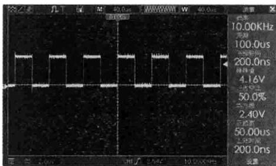

图7.44PWM波形示意

## 3.实验原理说明

实验中，需要产对互补对称，死区为0，频率为10kHz，占空比为50%的PWM波形。

首先规定计数模式为增减计数。

①根据实验要求首先要确定周期寄存器的值。

系统时钟为150MHz,那么周期寄存器的值PRD=SYSCLKOUT/Fpwm×2；

即PRD=150000000/10000×2=7500;

将此值送给时基周期寄存器TBPRD。

②其次要确定比较寄存器的值。由于占空比为50％，那么只需要将比较寄存器的值设为周期寄存器的值半，就可以保证占空比为50%，即CMPA=7500/2=3750。

以下是程序举例：

先是PWM输出引脚GPIO需要进如下所的配置：

PWM初始化设置如下所示：

## 4.实验观察与思考

①如何产20kHz频率的PWM?

②如何产生占空比为1/3的PWM?

③如何产生SPWM?

### 7.12高精度脉宽调制模块(HRPWM)

## 1.高精度脉宽调制模块概述

PWM控制的时候，系统频率一定，随着PWM开关频率的提高，PWM的精度会下降，为了提高PWM的精度，可以采用高精度脉宽调制模块（HRPWM）。当CPU工作频率为100MHz时，若PWM频率高于200kHz，PWM控制精度会下降到910位，这时就应采用HRPWM来提高精度。HRPWM的关键特征如下：

①提高PWM时间控制精度。

②可采用占空比和相移两种控制方法。

③采用比较寄存器与相位控制寄存器的扩展功能，实现更精确的时间间隔控制与边沿位置控制。

④A信号作用在PWM路径上，例如作用在ePWMxA输出上,ePWMxB依然可工作在常规模式。

⑤自检诊断软件模式，可检查边沿位置的逻辑是否运在最优状态。

ePWM外设功能相当于个数模转换器（DAC)，如图7.45所示，当TsYSCLKOUT=10ns,（即时钟频率为100MHz），对传统的PWM来说，有效精度取决于PWM输出频率（或周期）和系统时钟。

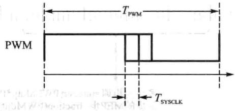

PWM（精度% 

图7.45PWM的精度计算

在PWM模式下，输出高频率的PWM时不能提供足够的精度，就应考虑采用HRPWM。表7.37为PWM与HRPWM在同样系统频率的情况下的精度对比，假定一个MEP步长为180pS。

|PWM频率/kHz|一般精度（PWM)|高精度HRPWM|
|---|---|---|
||位|1%|
|20|12.3|0.0|
|50|11.0|0.0|
|100|10.0|0.1|
|150|9.4|0.2|
|200|9.0|0.2|
|250|8.6|0.3|
|500|7.6|0.5|
|1000|6.6|1.0|
|1500|6.1|1.5|
|2000|5.6|2.0|

表7.37PWM和HRPWM的精度对比

每个应用程序可能会有所不同，但典型的低频PWM工作模式（低于250kHz）般不需要HRPWM。HRPWM的能适于需要采频PWM输出系统的电源转换技术中，例如：单相或多相降压、升压和反激变换器，相移式全桥变换器等。

## 2.高精度脉宽调制模块的操作

HRPWM是基于微边沿定位（MicroEdgePositional,MEP)技术。MEP逻辑通过对常规的PWM发器的原始时钟进细分，从而可以进更精确的边沿定位。时间步长可达150ps的数量级，时间步长的数量级要看特定设备的数据手册。HRPWM也有自检软件诊断模式，用以检查微边沿定位(MEP)逻辑是否运在最优模式。

图7.46展示了原始系统时钟与MEP边沿定位的关系，其中MEP调整步长通过比较器A扩展寄存器（CMPAHR)中的8位设置位进行配置。

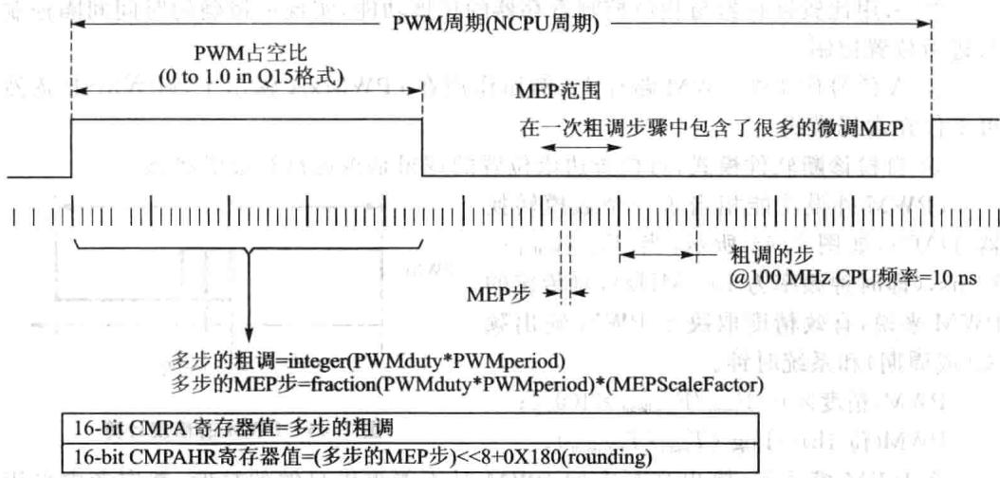

图7.46采用MEP的操作逻辑

要产生HRPWM信号，与常规PWM一样，在给定频率和极性下，要配置TBM、CCM和AQM寄存器，除此之外，还要配置HRPWM寄存器以扩展精度。

HRPWM操作相关寄存器寄存器如表7.38所列。

|寄存器|地址偏移|是否映射|功能描述||
|---|---|---|---|---|
|TBPHSHR|0x0002|否|HRPWM相位（8位）扩展寄存器||
|CMPAHR|0x0008|是|HRPWM占空比（8位）扩展寄存器||
|HRCNFG|0x0020|是|HRPMW配置寄存器||

表7.38 HRPWM寄存器

## (1)HRPMW控制

HRPWM的MEP由两个8位扩展寄存器控制。这两个HRPWM寄存器联合控制PWM操作的16位TBPHS和CMPA寄存器形成2个32位的寄存器。如图7.47所示。

TBPHSHR 时间基准相位精度寄存器。

CMPAHR-计数比较器A高精度寄存器。

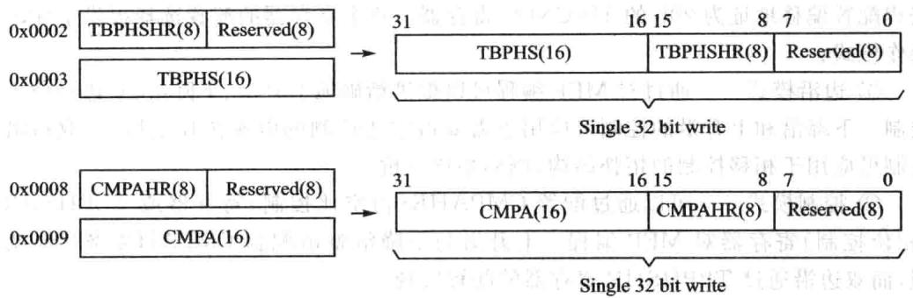

图7.47HRPWM扩展寄存器和存储空间配置

经过扩展后，采用通道A的PWM信号通道便可实现HRPWM控制。图7.48给出了HRPWM与8位扩展寄存器的接逻辑图。

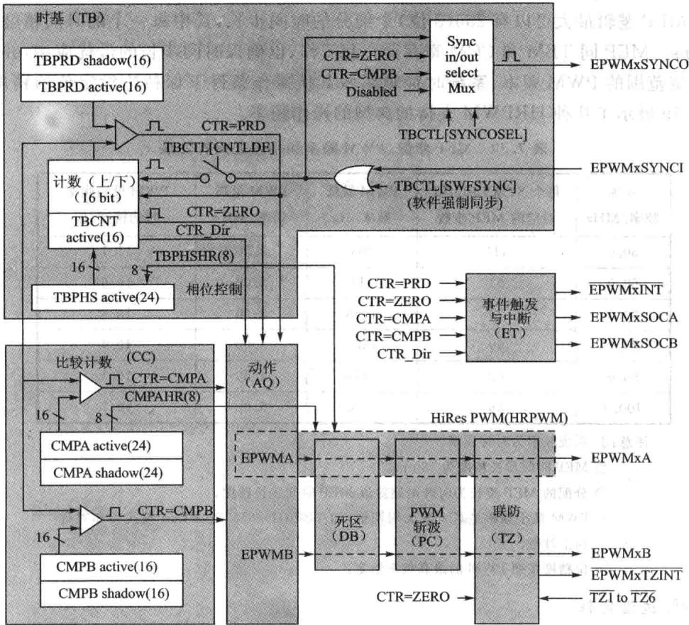

图7.48HRPWM与8位扩展寄存器的接口逻辑图

## (2）配置HRPWM

如果ePWM已经配置成个给定频率和极性的常规PWM，HRPWM需要通过编程配置偏移地址为20h的HRCNFG寄存器。这个寄存器的配置选择提供了如下操作模式：

①边沿模式——通过对MEP编程可以提供精确地上升沿、下降沿、双边沿位置控制。下降沿和上升沿的控制可应用于需要占空比控制的电源拓扑结构，而双边沿控制可应用于相移控制的拓扑结构，例如相移全桥。

②控制模式可以通过配置CMPAHR（占空比控制）寄存器或TBPHSHR（相位控制）寄存器对MEP编程。上升沿与下降沿就由配置CMPAHR寄存器实现，而双边沿通过TBPHSHR寄存器的配置实现。

③影子模式——同常规PWM一样，这种模式提供了影子（双缓冲）选择。这种选择只有在CMPAHR寄存器的值与CMPA寄存器的值一样的时候才有效，而当使用TBPHSHR寄存器时，该模式无效。

## (3)操作方法

MEP逻辑最大可以有255（8位）个细分的时间步长，其中每一个的时间精度为150ps。MEP同TBM和CCM寄存器一起工作，以确保时间步长的最优应用，并且确保宽范围的PWM频率、系统时钟频率域其他操作条件下保持边沿定位的精度。表7.39展示了几种HRPWM持的典型的操作频率。

|系统频率/MHz|每个SYSCLKOUT对应的MEP步数|PWM最低频率/Hz|PWM最高频率/MHz|PWM最高频率时的精度/位|
|---|---|---|---|---|
|50.0|111|763|2.50|11.1|
|60.0|93|916|3.00|10.9|
|月 70.0|79|1068|3.50|10.6|
|80.0|69       月11|1221||4.00|
|90.0|62|1373||4.50|
|100.0|56|1526||5.00|

表7.39MEP步数、PWM频率和精度之间的关系

②MEP时间步长精度为180ps。

③分配的MEP步长为时钟周期除以MEP时间步长精度。

④PWM最小频率是基于最大周期值，如TBPRD=65535。PWM模式为非对称向上计数。

⑤位精度按照PWM的最高频率给定。

①边沿定位

在典型的电源控制系统中(如开关电源、数字电动机、不间断电源等)都需要占空的控制。假设一个特定应用的占空比要求为40.5%，输出的PWM信号为1.25MHz，如果采用系统时钟为100MHz的常规PWM，占空比只能接近40.5%。如图7.49所示，通过32位的比较计数器能获得接近于40.5%的数值，在这种情况下，边沿定位时间精度步长为320ns，而不是324ns，数据参见表7.40所列。。1

采用MEP可以获得更为接近于324ns的边沿定位。表7.40中给出了CMPA的值、22位的MEP步长（CMPAHR寄存器的值）可以获得323.96ns的边沿位置，几乎实现零误差。假定MEP步长精度为180ps。

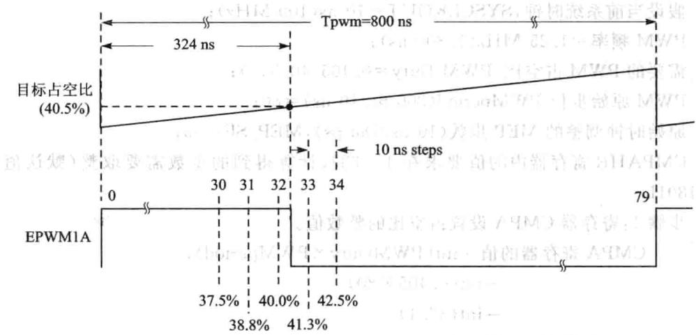

图7.49占空比为40.5%时对应的PWM波形

|CMPA/计数器|占空比|高电平时间|CMPA寄存器/计数|CMPAHR寄存器值/计数|占空比|高电平时间/ns|
|---|---|---|---|---|---|---|
|28|35.0|280|32|18|40.405|323.24|
|29|36.3|290|32|19|40.428|323.42|
|30|37.5|300|32|20|40.450|323.60|
|31|38.8|310|32|21|40.473|323.78|
|32|40.0|320|32|22|40.495|323.96|
|33|41.3|330|32|23|40.518|324.14|
|34|42.5|340|32|24|40.540|324.32|
||||32|25|40.563|324.50|
|Required|||332|26|40.585|324.68|
|32.40|40.5|324|32|27|40.608|324.86|

表7.40CMPA和CMPAHR寄存器值对应的占空比

## ②具体配置

通过设置标准（CMPA）和MEP（CMPAHR）寄存器，可以实现边沿定位的精准时间控制。在实际应用中，需要将要求的占空比和相应的周期值紧密对应，计算出来的数值要写到CMPA与CMPAHR寄存器组合中。

为此，首先要检查相关的比例和映射的步骤。通常软件控制中采用百分比表示占空比，这样做有个好处就是仅仅通过数学计算就可以了，而不用考虑最终的绝对的以时钟计数或高电平时间ns计算的占空比，编程时需要代码具有一定的移植性就要考虑到各种PWM频率下运行的情形。

寄存器赋值前，要得到相关比例需要两个步骤。

假设当前系统时钟,SYSCLKOUT=10ns(100MHz）；

PWM频率=1.25MHz（1/800ns);

需要的PWM占空比，PWMDuty=0.405(40.5%）；

PWM原始步长PWMperiod(800 ns/10 ns)=80；

原始时钟调整的MEP步数（10ns/180ps)，MEP_SF=55;

CMPAHR寄存器内的值要求在1～233，计算得到的数需要取整（默认值）=0180H;

步骤1：寄存器CMPA设置占空比的整数值。

CMPA寄存器值=32(20H)

步骤2：寄存器CMPAHR设置占空比的小数值。

③占空比限制

在高精度模式下，边沿定位并不能对占空比为100%的PWM进调整。具体操作要求如下：当禁诊断功能时，周期启动后至少经过3个时基时钟周期TB-CLK；当SFO诊断功能启动时，周期启动少6个时基时钟周期TBCLK。

占空比调整范围限制如图7.50所示，该限制限定了最低的占空比调节。例如针对接近0％的占空比并不能实现精确地边沿定位。尽管对最初的3～6个周期的HRPWM不可用，但是常规的PWM控制是可以做到占空比为0的。在绝大多数的应中，这种情况并不常见，因为控制器运条件很少要求占空比接近0％。最占空比限制如表7.41所列。

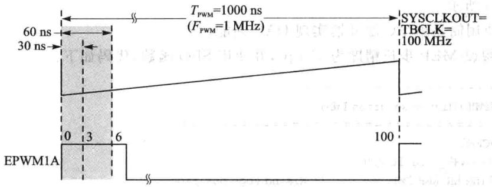

图7.50PWM输出频率为1MHz时低百分比占空比的限制

|PWM频率/kHz|3周期最小占空比|6周期最小占空比|PWM频率/kHz|3周期最小占空比|6周期最小占空比|
|---|---|---|---|---|---|
|200|0.6%|1.2%|1200|3.6%|7.2%|
|400|1.2%|2.4%|1400|4.2%|8.4%|
|600|1.8%|3.6%|1600|4.8%|9.6%|
|800|2.4%|4.8%|1800|5.4%|10.8%|
|1000|出  3.0%|6.0%|2000|6.0%|12%|

表7.413周期与6周期的占空比限制

如果应系统要求HRPWM在低占空比范围内操作，那么HRPWM可以被配置为向下递减计数模式，采MEP来控制上升沿。这种模式不会受到最低占空限制，但会受到最大占空比限制。

## ④参数优化软件(SFO)

MEP逻辑能够在255分步下定位边沿，如前所述，这些分步是在150ps条件下实现的。MEP步长会随着处理器参数、作温度和电压变化。随着电压的降低和温度的升增，随着电压的升和温度的降低减。实际应的时候可以采TI提供的参数优化软件（SFO)设定的HRPWM参数。参数优化软件在HRPWM运过程中动态地调整每个SYSCLKOUT周期的MEP步数。

要有效应用MEP功能，在Q15格式表示的占空比值映射到LCMPA：CM-PAHR]寄存器时，需要将MEP参数（MEP_SF)传值给软件。为此，每个HRPWM模块都内置了检和诊断功能，能够在任何条件下确定优化MEP_SF的值。TI公司提供了有两个优化函数的C调库，它可以采硬件优化和决定MEP_SF的参数。因此，MEP控制和诊断寄存器保留给TI使。

## ⑤优化编程代码的HRPWM实例

a.为了更好地理解HRPWM，举例如下：

非对称PWM(递增模式、高电平有效)控制单相Buck变换器，单相变换器结构

如图7.51所示。

b.使用简易地RC滤波器实现DAC功能。

例：假设MEP步长精度为150ps，并使用SFO函数，代码如下：

下面介绍单相变换器的控制。

图7.52给出了PWM波形，正如前文所述，对ePWM1模块的配置除了MEP使能控制外，其他设置和一般的PWM配置一样。

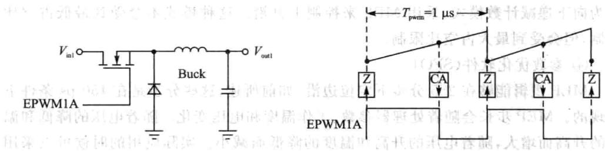

图7.51 ePWM1控制单相变换器的结构图7.52ePWM1控制单相变换器的输出波形

本例代码包括两部分；初始化代码（执行一次）和实时代码（在ISR中执行）。

下面给出了初始化代码。第一部分是对一般PWM的参数配置。第二部分是对HRPWM参数的配置。

//设置为立即装载 //PWM输出频率为1000kHzPWM //2x周期，Q15~Q0定标

## 3.HRPWM寄存器描述

## (1）寄存器概述

HRPWM所需的寄存器的汇总如表7.42所列。

|名称|偏移|大小|描述||
|---|---|---|---|---|
|时间基准寄存器|||||
|TBCTL|0x0000|1/0|时间基准控制寄存器||
|TBSTS|0x0001        品量|1/0|时间基准状态寄存器||
|TBPHSHR|TBPHSHR|1/0|时间基准相位高精度寄存器||
|TBPHS|0x0003|1/0|时间基准相位寄存器||
|TBCNT|0x0004|1/0|时间基准计数寄存器||
|TBPRD|0x0005|1/1|时间基准周期寄存器设置||
|Reserved|0x0006|1/0|保留||
|比较寄存器|||||
|CMPCTL|0x0007|1/0|计数比较控制寄存器||

表7.42HRPWM相关寄存器描述

续表7.42

|名称|偏移|大小|描述|
|---|---|---|---|
|CMPAHR|0x0008|1/1|计数比较A高精度寄存器设置|
|CMPA|0x0009|1/1|计数比较A寄存器设置|
|CMPB|0x000A|1/1|计数比较B寄存器设置|
|ePWM寄存器||||
|ePWM|0x0000至0x001F|32|其他ePWM寄存器，包括上列|
|HRCNFG|0x0020|1|HRPWM配置寄存器|
|ePWM/HRPWM测试寄存器||||
|Reserved|0x00300x003F|16|保留|

## （2）HRPWM配置寄存器（HRCNFG)

HRPWM配置寄存器（HRCNFG)的各位信息如表7.43所列。

|位|名称|描述|
|---|---|---|
|15~4|Reserved|保留|
|3|HRLOAD|映射模式位：选择时间事件，将CMPAHR映射寄存器的值加载到主要寄存器0:CTR=0（计数器等于零）1:CTR=PRD(计数器等于周期值）注：加载模式选择仅当CTLMODE=0被选定（位2）时才有效。可以选择这个事件去配合CMPA加载模式的选定（也即，CMPCTL[LOADMODE]位），在ePWM模块中设置如下：                 器00：LoadonCTR=0;时基计数器等于零（TBCTR=0x0000）01:LoadonCTR=PRD;时基计数器等于周期值（TBCTR=TBP)10:LoadonCTR=0或CTR=PRD(步应用于HRPWM模块）11:冻结（无负载可能）|
|2|CTLMODE|控制模式位：选择能够控制MEP的寄存器（CMP或TBPHS）0:MPAHR(8)寄存器控制边沿位置（即占空比控制模式）（重置默认）1:TBPHSHR(8)寄存器控制边沿位置（即相位控制模式）|
|1~0|EDGMODE|边沿模式位：选择被MEP逻辑控制的PWM边沿00:HRPWM禁用01:MEP上升沿控制10:MEP下降沿控制11:MEP双沿控制|

表7.43HRPWM配置寄存器(HRCNFG)

## (3)计数比较A高精度寄存器(CMPAHR)

计数比较A精度寄存器（CMPAHR)的各位信息如表7.44所列。

|位|名称|描述|
|---|---|---|
|15~8|CMPAHR|比较A高精度寄存器位，实现MEP步长控制。使能HRPWM的最小值位0x0001。MEP在1～255H变化范围内有效|
|7~0|Reserved|保留|

表7.44计数比较A高精度寄存器(CMPAHR)

## （4）时间基准相位高精度寄存器（TBPHSHR）

时间基准相位精度寄存器(TBPHSHR)的各位信息如表7.45所列。

|位|名称|描述|
|---|---|---|
|15~8|TBPHSH|时间基准相位高精度位|
|7~0|Reserved|保留|

表7.45时间基准相位高精度寄存器（TBPHSHR）

## 

