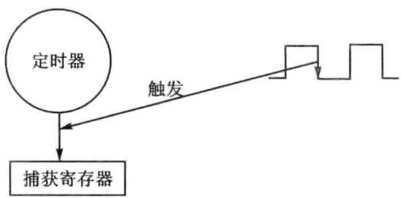
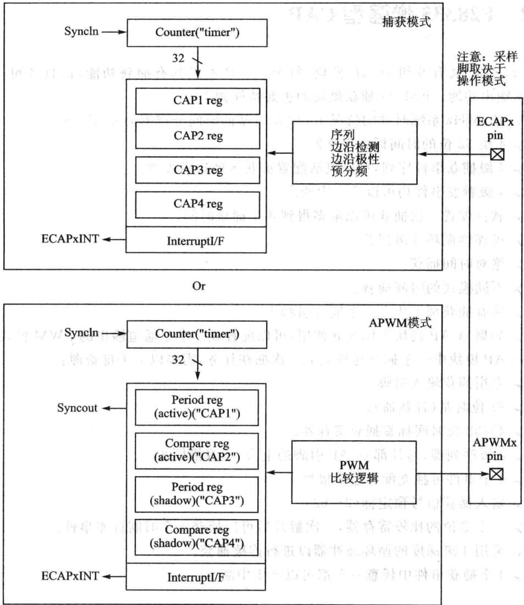
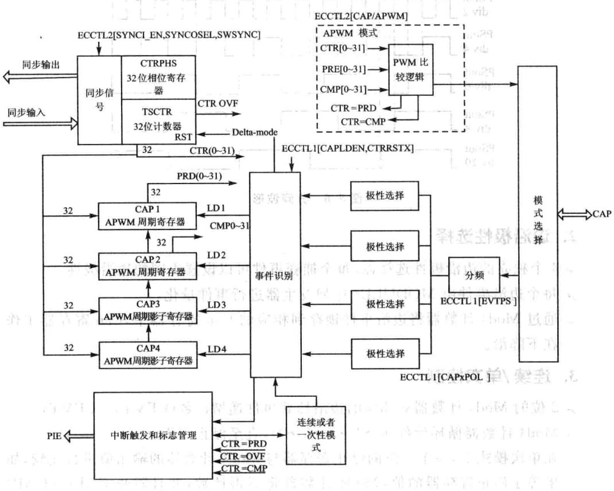
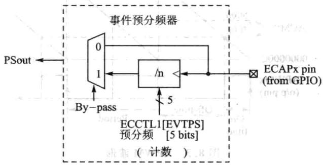
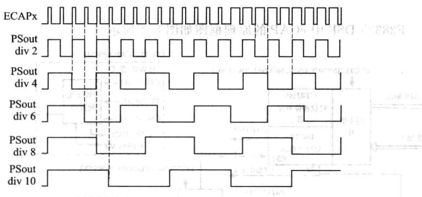
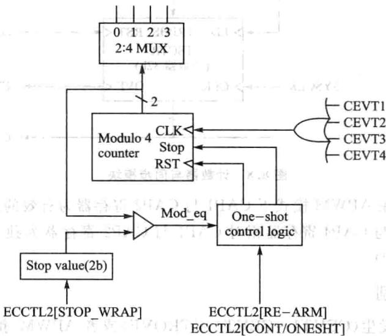
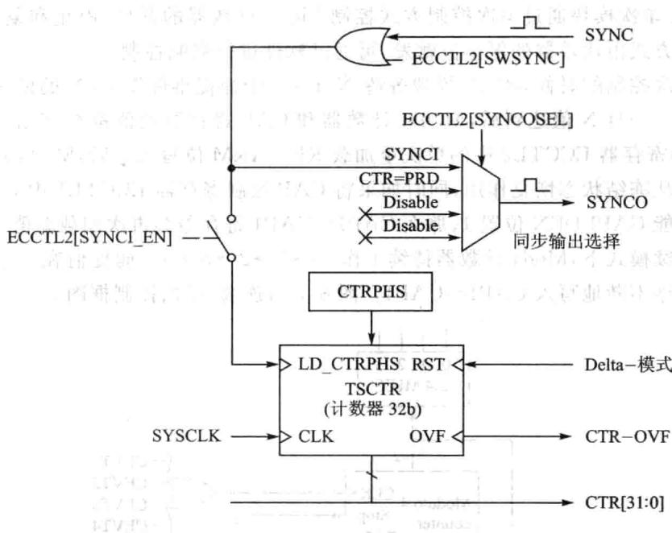
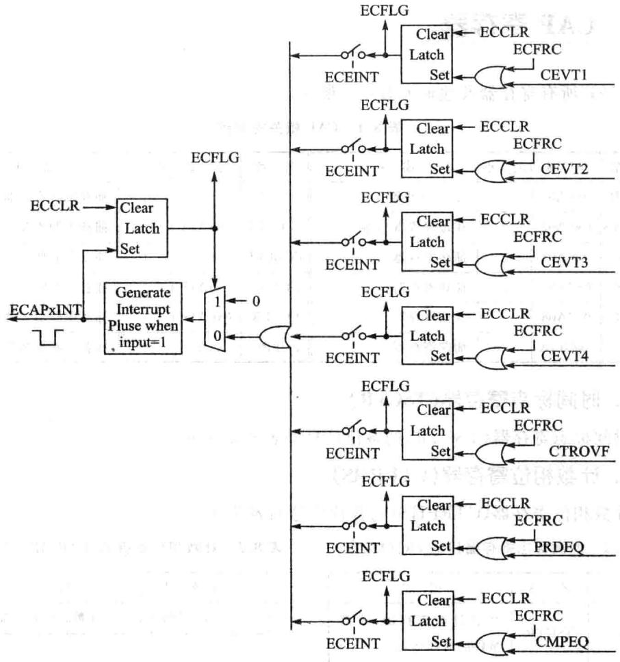

# 第 8 章

## 增强型脉冲捕获模块(eCAP)

“事无巨细，无非因果”,输对输出有着非常重要的影响。脉冲量的输是在数字控制系统中最常见的一类输量，控制器专门设置了脉冲捕获模块(eCAP)来处理脉冲量，通过脉冲捕获模块捕获脉冲量的上升沿与下降沿，进而可以计算脉冲的宽度和占空比，可以采用脉冲信号进行相关控制。

### 8.1脉冲捕获基本原理

捕获单元模块能够捕获外部输入引脚的逻辑状态（电平的高或低、电平翻转时的上升沿或下降沿），并利用内部定时器对外部事件或者引脚状态变化进处理。典型应用如下：

电机测速。

》测量脉冲电平宽度。

➢测量系列脉冲占空比和周期。

➢电流/电压传感器的PWM编码信号的解码。

捕获单元示意图如图8.1所示。控制器给每个捕获单元模块都分配了一个捕获引脚，在捕获引脚上输入待测脉冲波形，捕获模块会捕获到指定捕获的逻辑状态，如图8.1中的下降沿，捕获单元记录下定时器的时间，两个下降沿间的时间差就是脉冲周期，同理也可以

图8.1CAP示意图

捕获脉冲的上升沿，计算上升沿与下降沿之间的时间差就可以获得占空比，所以捕获单元可以用于测量脉冲周期以及脉冲的宽度。在一些数字脉冲测速场合，如电机的常见测速方法之一，在电机某个固定位置通过光电传感器发出一个脉冲，每周一个脉冲，两个脉冲之间的时间，就是电机的转速。在一些精确控制的场合中，一周当然不止发出一个脉冲，这取决于传感器（光电编码器）的选型与性能。

### 8.2F28335增强型CAP

F28335共有6组eCAP模块，每个eCAP不但具有捕获功能，而且还可用作PWM输出功能。F28335捕获模块的主要特征如下：

150MHz系统时钟的情况下,32位时基的时间分辨率为6.67ns。

4组32位的时间标志寄存器。

4级捕获事件序列，可以灵活配置捕获事件边沿极性。

4级触发事件均可以产生中断。

》软件配置次捕获可以最多得到4个捕获时间。

可连续循环4级捕获。

绝对时间捕获。

不同模式的时间捕获。

## 所有捕获都发生在一个输入引脚上。

如果eCAP模块不作捕获使用，可以配置成个单通道输出的PWM模式。

eCAP模块中个捕获通道完成次捕获任务，需要以下关键资源：

专捕获输引脚。

32位时基（计数器）。

➢4×32位时间标签捕获寄存器。

4级序列器，与外部eCAP引脚的上升/下降沿同步。

4个事件可独立配置边沿极性。

输入捕获信号预定标（2～62）。

一个2位的比较寄存器，次触发后可以捕获4个时间标签事件。

》采用4级深度的循环缓冲器以进行连续捕获。

➢4个捕获事件中任意个都可以产生中断。

### 8.3 F28335捕获单元的APWM操作模式

如果eCAP模块不用作捕获输，可以将它用来产生一个单通道的PWM。计数器作在计数增模式，可以提供时基能产不同占空的PWM。CAP1与CAP2寄存器作为主要的周期和比较寄存器，CAP3与CAP4寄存器作为周期和比较寄存器的影子寄存器，其原理框图如图8.2所示。

其功能描述如下：

时间计数器不断与2个32位的比较寄存器比较。

CAP1与CAP2用作周期与比较寄存器。

与影子寄存器APRD、ACMP（CAP3、CAP4）配合形成双缓冲机制。如果选择立即模式，只要数据写入影子寄存器，影子寄存器的值就会立即加载到CAP1或者CAP2寄存器；如果选择周期加载模式，在CTR=PRD的时候，影子寄存器的值就会加载到CAP1或者CAP2寄存器。

图8.2 APWM结构框图

写数值到有效寄存器CAP1/2后，数值也将写到各自相应的影寄存器CAP3/4。

➢在初始化的时候，周期值与较值必须写到有效寄存器CAP1与CAP2，模块会动复制初始化数值到影寄存器中。在之后的数据更改时，只需要使影子寄存器就可以了。

APWM产生波形如图8.3所示。

## 

### 8.4F28335捕获操作模式

F28335DSP中eCAP的原理框图如图8.4所示。

图8.4eCAP原理框图

## 1.事件分频（预定标）

可以对一个输入的捕捉信号进分频系数为N=2～62的分频，这在输信号频率很的时候非常有用。其框图和信号波形分别如图8.5和图8.6所示。

图8.5信号分频结构框图88图8.6分频波形

## 2.边沿极性选择

➢4个独立的边沿极性选择器，每个捕获事件可以设置不同的边沿极性。

 每个边沿事件由MODULE4序列发生器进事件量化。

通过Mod4计数器将边沿事件锁存到相应的Cap寄存器中，Cap寄存器工作在下降沿。

## 3.连续/单次控制

2位的Mod4计数器对相应的边沿捕获事件递增计数(CEVT1～CEVT4)。

Mod4计数器循环计数(0→1→2→3→0)，直至停止工作。

➢在单次模式下，个2位的停寄存器与Mod4计数器的输出值进较，如果等于停寄存器的值，Mod4计数器将不再计数，并且阻CAP1~CAP4寄存器加载数值。

连续/单次模块通过单次控制方式控制Mod4计数器的开始、停止和复位，这种单次控制方式由比较器的停止值触发，可通过软件进行强制控制。

在单次控制的时候，eCAP模块等待N（1～4）个捕捉事件发生，N的值为停止寄存器的值。一旦N值达到后，MOD4计数器和CAP寄存器的值都被冻结。如果向CAP控制寄存器ECCTL2中的单次重加载RE-ARM位写1后，Mod4计数器就会复位并从冻结状态恢复作，同时如果将CAP控制寄存器ECCTL1中CAP寄存器加载使能CAPLDEN位置1，那么CAP1～CAP4寄存器会再次加载新值。

在连续模式下，Mod4计数器持续工作(0→1→2→3→0)，捕捉值在一个环形缓冲按顺序不断地写CAP1~CAP4。图8.7为连续/单次控制框图。

## 

图8.7连续/单次模块控制框图

### 4.32位计数器与相位控制

计数器为事件捕获提供时基，其时钟信号为系统时钟的分频。通过软件或硬件强制，可以用相位寄存器与其他计数器同步。在APWM模式中，这个相位寄存器在模块之间需要相位差时很有。在4个捕捉事件的数值加载中，可以选择复位这个32位计数器，这点对时间偏差捕捉很有用。首先32位计数器的值被捕获到，然后被LD1～LD4中任意一个信号复位为0。其工作原理框图如图8.8所示。

## 5.CAP1~CAP4寄存器

CAP1~CAP4寄存器通过32位的定时/计数器总线加载数值，当相应的捕获事件发生时，CTR[0:31]值加载到相应的CAP寄存器中。

通过控制CAP控制寄存器ECCTL1[CAPLDEN位可以阻捕捉寄存器数值的加载。在单次模式下，个停信号产的时候(StopValue=Mod4)该位被动

图8.8计数器与同步模块

清除（不加载）。在APWM模式下CAP1与CAP2寄存器为有效的周期寄存器和较寄存器；CAP3与CAP4寄存器相对CAP1与CAP2寄存器为独的影子寄存器(APRD与ACMP)。

## 6.中断控制

捕捉事件的发生（CEVT1～CEVT4，CTROVF）或者APWM事件的发生（CTR都将会产生中断请求。

这些事件中的任个事件都可以被选作中断源(从eCAPx模块中)连到PIE。

中断使能寄存器（ECEINT）用于使能/屏蔽中断源。中断标志寄存器（ECFLG）包含中断事件标志和全局中断标志位(INT)。

如果相应的中断事件使能标志位为1,INT标志位为0，那么一个中断脉冲就会告知PIE。

在其他的中断脉冲产生之前，在中断服务程序里必须通过中断清除寄存器（EC-CLR)清除全局中断标志和相应的中断事件。通过强制中断寄存器（ECFRC)可以强制发某个中断事件，这个在测试的时候比较有。其框图如图8.9所示。

注意：CEVT1、CEVT2、CEVT3、CEVT4标志工作在捕捉模式（ECCTL2[CAP/APWM]==0）;CTR=PRD，CTR=CMP标志工作在APWM模式（ECCTL2[CAP/APWM]==1);CNTOVF标志在两种模式下都可工作。

图8.9 eCAP模块中的中断

## 7.影子加载与锁存控制

在捕捉模式下，锁存逻辑阻任何影数据从APRD和ACMP寄存器中加载到CAP1与CAP2中。

在APWM模式下，允许影子寄存器里的数据加载，并且还有两种选择：

即：只要有新的数据写影子寄存器，APRD或ACMP即向CAP1或CAP2加载数据。

》在周期相等的时候：即 的时候有效寄存器从影寄存器加载数据。

### 8.5 CAP寄存器

CAP所有寄存器及地址如表8.1所列。

|名称|地址|大小|描述|名称|地址|大小|描述|
|---|---|---|---|---|---|---|---|
|TSCTR|0x6A00|2|32位计数器|ECCTL1|0x6A14||捕获控制寄存器1|
|CTRPHS|0x6A02|2|相位偏置寄存器|ECCTL2|0x6A15|n1|捕获控制寄存器2|
|CAP1|0x6A04|-2|捕获寄存器1|ECEINT|0x6A16|1|捕获中断使能寄存器|
|CAP2|0x6A05|2|捕获寄存器23|ECFLG|0x6A17||捕获中断标志寄存器|
|CAP3|0x6A06|2|捕获寄存器3|ECCLR|0x6A18||捕获中断清零寄存器|
|CAP4|0x6A0A|2|捕获寄存器4|ECFRC|0x6A19|1=19|捕获中断强制寄存器|

表8.1 CAP相关寄存器

## 1.时间标志寄存器（TSCTR)

时间标志寄存器（TSCTR)的各位信息如表8.2所列。

## 2.计数相位寄存器(CTRPHS)

计数相位寄存器(CTRPHS)的各位信息如表8.3所列。

|位|名称|描述|
|---|---|---|
|31~0|JTTSCTR|32位计数寄存器，捕提事件的时间标志|

表8.2时间标志寄存器（TSCTR)位信息

|位|名称|描述|
|---|---|---|
|31~0|CTRPHS|计数相位寄存器|

表8.3计数相位寄存器（CTRPHS)位信息

## 3.捕获寄存器1(CAP1）

捕获寄存器1（CAP1）的各位信息如表8.4所列空喜断意捕获寄存器2(CAP2）4

捕获寄存器2（CAP2)的各位信息如表8.5所列。

|位|名称|描述|
|---|---|---|
|31~0|器CAP1|这个寄存器的作用：在CMP模式中，加载捕获事件中的时间标志（TSCTR的计数值）；在APWM模式中，起到APRD的作用|

表8.4捕获寄存器1(CAP1）

|位|名称|址描述|
|---|---|---|
||中|这个寄存器的作用：在 CMP模式中，加载捕获事 件中的时间标志（TSCTR|
|31~0|CAP2 的计数值);在APWM模式 中，起到ACMP的作用||

表8.5捕获寄存器2(CAP2)

## 5.捕获寄存器3(CAP3）

捕获寄存器3(CAP3)的各位信息如表8.6所列。

## 6.捕获寄存器4(CAP4)

捕获寄存器4(CAP4）的各位信息如表8.7所列。

|位|名称|描述|
|---|---|---|
|231~0|品江解CAP3|这个寄存器的作用：在CMP模式中，加载捕获事件中的时间标志（TSCTR的计数值)；在APWM模式|
|||中，起到APRD影子寄存器的作用|

表8.6捕获寄存器3(CAP3)

|位|名称|描述|
|---|---|---|
|代同科品31~0|CAP4|这个寄存器的作用：在CMP模式中，加载捕获事|
|件中的时间标志（TSCTR的计数值)；在APWM模式|||
|器|器|中，起到ACMP影子寄存器的作用|

表8.7-捕获寄存器4(CAP4)

## 7.eCAP控制寄存器1(ECCTL1)

eCAP控制寄存器1(ECCTL1)的各位信息如表8.8所列。

|位|名称|描述||
|---|---|---|---|
|15~14|FREE/SOFT|仿真控制00：仿真暂停时TSCTR计数立即停止01:TSCTR一直计数，直到为0||
|13~9|PRESCALE|输入信号分频选择00000:1分频（不分频）;00001:2分频；00010:4分频；00011：6分频；00100：8分频;00101：10分频；.|.;11110:60分频;11111:62分频|
|8|CAPLDEN|在捕获事件中使能CAP1-4寄存器的加载0：禁止在捕获事件中加载CAP1-4寄存器的时间；1：使能在捕获事件中加载CAP1-4寄存器的时间||
|7|CTRRST4|CAP4事件中重置计数器MVT0：在CAP4事件中不重置计数器；1：在CAP4捕获后重置计数器|捕获后重置计费|
|6|CAP4POL|捕提沿选择0:CAP4上升沿捕提（RE）;1：CAP4下降沿捕提（FE）||
|5|CTRRST3|CAP3事件中重置计数器0：在CAP3事件中不重置计数器；1：在CAP3捕获后重置计数器||

表8.8eCAP控制寄存器1(ECCTL1）

续表8.8

|位|名称|描述|
|---|---|---|
|4|CAP3POL|捕捉沿选择 $0 : { \mathrm { C A P 3 } }$ 上升沿捕提（RE）；1：CAP3下降沿捕提（FE）|
|3|CTRRST2|CAP2事件中重置计数器0:在CAP2事件中不重置计数器；1：在CAP2捕获后重置计数器|
|2|CAP2POL|捕捉沿选择 $0 : { \mathrm { C A P 2 } }$ 上升沿捕提（RE）；1：CAP2下降沿捕提（FE）|
||CTRRST1|CAP1事件中重置计数器0:在CAP1事件中不重置计数器；1：在CAP1捕获后重置计数器|
|0|CAP1POL|捕捉沿选择0:CAP1上升沿捕提（RE)；1：CAP1下降沿捕提（FE)|

## 8.eCAP控制寄存器2(ECCTL2)

eCAP控制寄存器2(ECCTL2)的各位信息如表8.9所列。

|位|名称|描述|
|---|---|---|
|15~11|保留|保留|
|10|APWMPOL|APWM输出极性选择。仅限于APWM模式0:输出为高（比较值为高）；1：输出为低（比较值为低）|
|9|CAP/APWM|CAP与APWM模式选择0:eCAP模块工作于捕捉模式。此模式做了下列配置：通过CTR=PRD阻止TSCTR重置V阻影子寄存器加载到CAP1与CAP2寄存器➢允许用户使能加载CAP1～4寄存器CAPx/APWMx引脚作为捕提输人1:eCAP模块工作于APWM模式。此模式做了下列配置：CTR=PRD重置TSCTR允许影子寄存器加载到CAP1与CAP2寄存器禁止时间标志加载到CAP1～4寄存器➢ $\mathrm { C A P x / A P W M x }$ 引脚作为APWM输出|
|8|SWSYNC|软件强制计数器同步。它提供个简便的软件法使些或者所有eCAP时基同步。在APWM模式下也可以通过CTR=PRD实现同步0:无影响1:强制同步。写1后，该位返回一个0注意：选择CTR=PRD意味着仅限于APWM模式|

表8.9 eCAP控制寄存器2(ECCTL2）

续表8.9

|位|名称|描述|
|---|---|---|
|7~6|SYNCO_SEL|同步输出选择00:选择同步输事件为同步信号输出；01:选择CTR=PRD事件为同步信号输出10或11：屏蔽同步信号输出|
|5|SYNCI_EN|计数器（TSCTR）同步输人选择模式0:屏蔽同步输操作;1：允许计数器根据一个SYNCI信号或者S/W事件从TSCTR寄存器中加载|
|4|TSCTR-STOP|计数器停止位控制0：计数器停止；1：计数器计数|
|3|RE-ARM|单次重加载控制。也就是等待停止触发。重加载功能在单次或者连续模式下有效0：无影响；1：以下情况将强制为单次模式》复位Mod4计数器为0允许Mod4计数器持续计数使能捕捉寄存器加载|
|2~1|STOP_WRAP|单次/连续模式下的停止值00：单次模式下，在CAP1的捕提事件发生后产生停止信号连续模式下，在CAP1的捕捉事件发生后计数器正常运行01：单次模式下，在CAP2的捕提事件发生后产生停止信号连续模式下，在CAP2的捕捉事件发生后计数器正常运行10:单次模式下，在CAP3的捕提事件发生后产生停止信号连续模式下，在CAP3的捕提事件发生后计数器正常运行11:单次模式下，在CAP4的捕提事件发生后产生停止信号连续模式下，在CAP4的捕提事件发生后计数器正常运行注意，该位的值与Mod4计数器的值向比较，如果相等，将发生以下两件事件：Mod4计数器暂停➢捕提寄存器不再加载新的数据在单次模式下，后续的中断事件将不会向PIE发出中断请求，除非重新配置模块|
|0|CONT/ONESHT|连续/单次模式0:连续模式1：单次模式|

## 9.eCAP中断使能寄存器(ECEINT)

eCAP中断使能寄存器(ECEINT)的各位信息如表8.10所列。

|位|名称|描述|
|---|---|---|
|15~8|保留|保留      Hj1|
|7|CTR=CMP|计数器匹配中断使能0：屏蔽；1：使能|
|6|CTR=PRD|计数器周期匹配中断使能0:屏蔽；1：使能|
|5|CTROVF|计数器溢出中断使能0：屏蔽；1：使能|
|4~1|CEVT4~CEVT1|捕捉事件4~1中断使能0：屏蔽；1：使能|
|0|保留|保留|

表8.10eCAP中断使能寄存器（ECEINT）

## 10.eCAP中断标志寄存器(ECFLG)

eCAP中断标志寄存器（ECFLG)的各位信息如表8.11所列。

|位|名称  1|描述||
|---|---|---|---|
|15~8|保留告|保留||
|7|CTR=CMP|计数器匹配状态标志位。仅限于APWM模式0：无；1：计数器匹配比较寄存器值（ACMP）||
|6|CTR=PRD|计数器周期匹配状态标志位。仅限于APWM模式0：无；1：计数器匹配周期寄存器值（APER）并重置||
|5动|CTRovF|计数器溢出标志0:无；1：计数器从00000000变化到FFFFFFFF||
|4~1合。|CEVT4~CEVT1|分别表示捕捉事件4～1状态标记，该状态位只在CAP模式下有效0:无事件发生；1：有事件发生||
|0|INT|全局中断标志0：无；1：有中断产生||

表8.11 eCAP中断标志寄存器(ECFLG)

## 11.eCAP中断清除寄存器(ECCLR)

eCAP中断清除寄存器（ECCLR)的各位信息如表8.12所列。

|位|名称|描述|
|---|---|---|
|15~8|保留|保留|
|7|CTR=CMP|计数器匹配状态.                       雪0：无影响；1：清除该位标志位|
|6|CTR=PRD|计数器周期匹配状态0:无影响；1：清除该位标志位|
|5|CTROVF|计数器溢出0：无影响；1：清除该位标志位|
|4~1|CEVT4~CEVT1|捕捉事件4~1标志0:无影响；1：清除该位标志位|
|0|INT|全局中断标志体0：无影响；1：清除该位标志位，不影响中断的使能|

表8.12eCAP中断清除寄存器(ECCLR）

## 12.eCAP强制中断寄存器(ECFRC)

eCAP强制中断寄存器（ECFRC)的各位信息如表8.13所列。

|位|名称|描述|
|---|---|---|
|15~8|保留|保留|
|7|CTR=CMP|强制计数器匹配比较寄存器0：无影响；1：写1置位该标志位|
|6|CTR=PRD|强制计数器匹配周期寄存器0:无影响；1：写1置位该标志位|
|5|CTROVF|强制计数器溢出0：无影响；1：写1置位该标志位|
|4|CEVT4|强制捕提事件4中断0:无影响；1：写1置位该标志位|
|3|CEVT3|强制捕捉事件3中断0:无影响：1：写1置位该标志位|
|2|CEVT2|强制捕提事件2中断0:无影响；1：写1置位该标志位|
||CEVT1|强制捕提事件1中断0:无影响；1：写1置位该标志位|
|0|保留|保留|

表8.13 eCAP强制中断寄存器（ECFRC)

### 8.6手把手教你实现CAP捕获信号发生器信号边沿

## 1.实验目的

①掌握F28335CAP捕获原理。

②运用CAP计算脉冲信号占空比。

## 2.实验主要步骤

①先打开已经配置好的CCS3.3软件。

②将仿真器的USB与计算机连接，将仿真器的另一端JTAG端插到YX-F28335开发板的JTAG针处。

③ 在CCS中选择Debug→Connect菜单项，连接标板，确定标板连接成功。

④将f28335_Cap录复制到CCS开发环境中的Myproject录下。

⑤在CCS菜单中选择project→Open菜单项，加载f28335_Cap录中的f28335_Cap.pjt。

⑥在CCS菜单中选择File→LoadProgram菜单项，加载Debug录下的f28335_Cap.out。

⑦打开信号发生器，调信号发生器产生10kHz的0～3.3V的方波，然后将信号发生器的地线接到开发板的地线端，另一端接到YX-F28335开发板J8的第2脚。

⑧在CCS菜单中选择Debug→Run菜单项，打开CCS的Watch Window，在Watch1窗中输变量T1、T2后回车，户可以看到T1和T2的值为15000。

⑨也可以将信号发生器的地线接到开发板的地线端，另一端接到YX-F28335开发板J8的第3脚，在CCS中选择Debug→Run菜单项，打开CCS的Watch Window，在Watch1窗口中输T3、T4后回车，查看它们的值,若是15000的话，则说明CAP2正常。

## 3.实验原理说明

此实验利用CAP捕捉信号发生器产生的方波，T1和T2、T3和T4所测值的公式为：T=F28335作频率/所测信号频率;F28335作频率为150MHz，信号发生器产生方波的频率为10kHz，所以T的值应该是15000。

eCAP的时钟计数器是以系统时钟为基准的，所以先需设置系统时钟，为eCAP提供基准。

//使能系统时钟为CAP1提供基准//使能系统时钟为CAP2提供基准//其他CAP模块未用到，所以屏蔽

## 设置CAP的输引脚如下：

## CAP工作模式的配置如下所示：

## void SetCap1Mode(void)

## 4.实验观察与思考

①若把F28335的作频率设置为100MHz，则此时T1的值为多少？

②若把信号发器的信号设为30kHz，此时T1的值为多少?

③F28335的CAP能测量300MHz的波信号吗？如果可以，怎么测量？

### 8.7手把手教你实现CAP捕获PWM信号边沿

## 1.实验目的

①掌握PWM原理。

②掌握CAP原理。

## 2.实验主要步骤

①首先打开已经配置好的CCS3.3软件；

②将仿真器的USB与计算机连接，将仿真器的另一端JTAG端插到YX-F28335开发板的JTAG针处。

③ 在CCS中选择DebugConnect菜单项，连接标板，确定目标板连接成功。

④将PWM-CAP录复制到CCS开发环境中的Myproject目录下。

⑤在CCS中选择project→Open菜单项，加载PWM-CAP录中的f28335.Cap. pjt。

⑥在CCS中选择File→Load Program菜单项，加载Debug录下的f28335_

Cap.out。

⑦在CCS中选择Debug→Run，打开CCS的Watch Window,如果是将J8-2和J5-1短接的话，那么在Watch1窗口中输T1、T2后回车，用户将会看到T1和T2的值为15000。

⑧如果是将J8-2和J5-2短接的话，那么在Watch1窗口中输入T3、T4后回 车，将会看到T3和T4的值为15000。

## 3.实验原理说明

此实验是将F28335产的PWM波送给其CAP端进捕捉。这样就可以在不使用示波器和信号发生器情况下，也可以分析其工作原理，达到同样实验学习、理解的目的。将F28335产生10kHz的PWM波，通过短接线，直接将此信号送给CAP输引脚，T值为15000，程序在实现的时候需要对PWM进行设置，然后再启动CAP。

PWM输出引脚配置如下：

PIE中断控制设置程序如下：

## PIE中断向量表的初始化函数如下：

## eCAP初始化设置,CAP使能设置：

## CAP的输引脚设置如下：

## CAP工作模式的配置如下所示：

## PWM设置如下所示：

## 4.实验观察与思考

①通过程序改变PWM的频率，查看T值的变化？

②PWM频率不变，改变占空比，会影响T值吗？为什么？

③在不知道PWM频率和占空比的情况下，通过怎样的软件算法可以得出PWM的频率和占空？
