## 增强型正交编码模块(eQEP)

在运动控制系统中，不仅仅需要获取实时的速度信息，有时候为了精确控制，也需要位置信息以及运动方向信息，F28335中的eQEP模块通过应用正交编码器不仅仅可以获得速度信息，也可以获得方向信息以及位置信息。

### 9.1 正交编码器QEP概述

光电编码器是集光、机、电技术于一体的数字化传感器，通过光电转换将输出轴上的机械几何位移量转换成脉冲或者数字量的传感器，可以高精度测量被测物的转或直线位移量，是目前应用最多的传感器之。它具有分辨率高、精度、结构简单、体积小、使用可靠、易于维护、性价比高等优点。在数控机床、机器人、雷达、光电经纬仪、地面指挥仪、高精度闭环调速系统、伺服系统等诸多领域中得到了泛的应。典型的光电编码器由码盘（Disk）、检测光栅（Mask）、光电转换电路（包括光源、光敏器件、信号转换电路）、机械部件等组成，如图9.1所示。

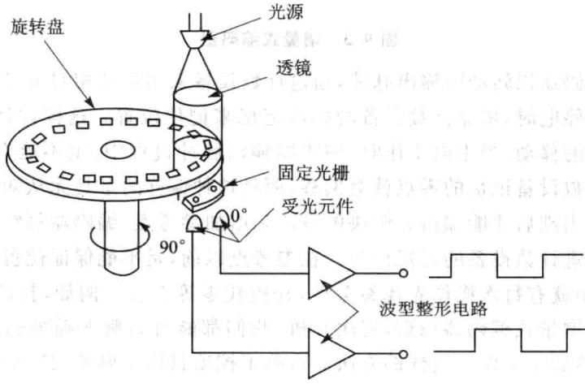

图9.1光电编码器主要结构

一般来说，根据光电编码器产生脉冲的方式不同，可以分为增量式、绝对式以及复合式3大类。按编码器运动部件的运动式来分，可以分为旋转式和直线式两种。

由于直线式运动可以借助机械连接转变为旋转式运动，反之亦然。因此，只有在那些结构形式和运动方式都有利于使用直线式光电编码器的场合才使用。旋转式光电编码器容易做成全封闭型式，易于实现小型化，传感长度较长，具有较长的环境适用能力，因而在实际工业生产中得到广泛的应用。

增量式光电编码器的特点是每产个输出脉冲信号就对应个增量位移，但是不能通过输出脉冲区别出在哪个位置上的增量。它能够产与位移增量等值的脉冲信号，其作用是提供种对连续位移量离散化或增量化以及位移变化（速度）的传感法，它是相对于某个基准点的相对位置增量，不能够直接检测出轴的绝对位置信息。一般来说，增量式光电编码器输出A、B两相互差 电度角的脉冲信号（即所谓的两组正交输出信号），从而可方便地判断出旋转方向。同时还有用作参考零位的Z相标志（指示）脉冲信号，码盘每旋转一周，只发出一个标志信号。标志脉冲通常用来指机械位置或对积累量清零，如图9.2所示。

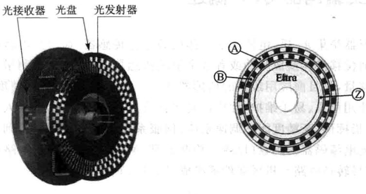

图9.2增量式编码器

增量式编码器以转动时输出脉冲，通过计数设备来知道其相对参考点的位置，当编码器不动或停电时，依靠计数设备的内部记忆来记住位置。这样，当停电后，编码器不能有任何的移动，当来电工作时，编码器输出脉冲过程中，也不能有干扰而丢失脉冲，不然，计数设备记忆的零点就会偏移，而且这种偏移的量是无从知道的，只有错误的产结果出现后才能知道。解决的法是增加参考点，编码器每经过参考点，将参考位置修正进计数设备的记忆位置。在参考点以前，是不能保证位置的准确性的。为此，在控中就有每次操作先找参考点，开机找零等法。例如，打印机扫描仪的定位就是用的增量式编码器原理，每次开机，我们都能听到噼哩啪啦的一阵响，它在找参考零点，然后才作。这样的法对有些控项比较麻烦，甚至不允许开机找零(开机后就要知道准确位置），于是就有了绝对编码器的出现。编码器的基本原理及组成部件与增量式光电编码器基本相同，也是由光源、码盘、检测光栅、光电检测器件和转换电路组成。与增量式光电编码器不同的是，绝对式光电编码器不同的数码分别指每个不同的增量位置，它是种直接输出数字量的传感器。在它的圆形码盘上沿径向有若干同心码道，每条上由透光和不透光的扇形区相间组成，相邻码道的扇区数目是双倍关系，码盘上的码道数就是它的二进制数码的位数，在码盘的一侧是光源，另一侧对应每一码道有一光敏元件；当码盘处于不同位置时，各光敏元件根据受光照与否转换出相应的电平信号，形成二进制数。这种编码器的特点是不要计数器，在转轴的任意位置都可读出一个固定的与位置相对应的数字码。显然，码道越多，分辨率就越高，对于一个具有N位二进制分辨率的编码器，其码盘必须有N条码道。绝对式光电编码器原理如图9.3所示。

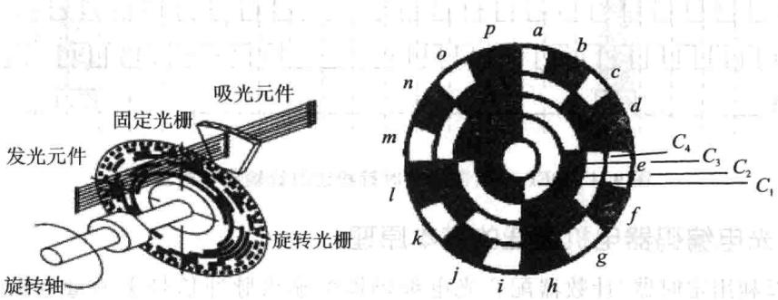

图9.3绝对式编码器

绝对式光电编码器是利用自然二进制、循环二进制（格雷码）、二-十进制等方式进光电转换的。绝对式光电编码器与增量式光电编码器不同之处在于圆盘上透光、不透光的线条图形，绝对光电编码器可有若干编码，根据读出码盘上的编码，检测绝对位置。它的特点是：可以直接读出角度坐标的绝对值；没有累积误差；电源切除后位置信息不会丢失；编码器的精度取决于位数；最高运转速度比增量式光电编码器高。

混合式光电编码器，就是在增量式光电编码器的基础上，增加了一组用于检测永磁伺服电机磁极位置的码道。它输出两组信息：一组信息用于检测磁极位置，带有绝对信息功能，另一组则完全同增量式编码器的输出信息。

由于绝对编码器在位置定位方面明显地优于增量式编码器，已经越来越多地应用于工控定位中。测速需要可以无限累加测量，目前增量型编码器在测速应用方面仍处于无可取代的主流位置。F28335中的eQEP模块主要针对的是增量型的编码器。

## 1.采用增量型光电编码器来判别电机转速向的基本原理

增量型编码器一般安装在电机或其他旋转机构的轴上，在码盘旋转过程中，输出两个信号称为QEPA与QEPB，两路信号相差90°，这就是所谓的正交信号，当电机正转时，脉冲信号A的相位超前脉冲信号B的相位90°，此时逻辑电路处理后可形成电平的向信号Dir。当电机反转时，脉冲信号A的相位滞后脉冲信号B的相位90°，此时逻辑电路处理后的方向信号Dir为低电平。因此根据超前与滞后的关系可以确定电机的转向。其转速辩相的原理如图9.4所示。

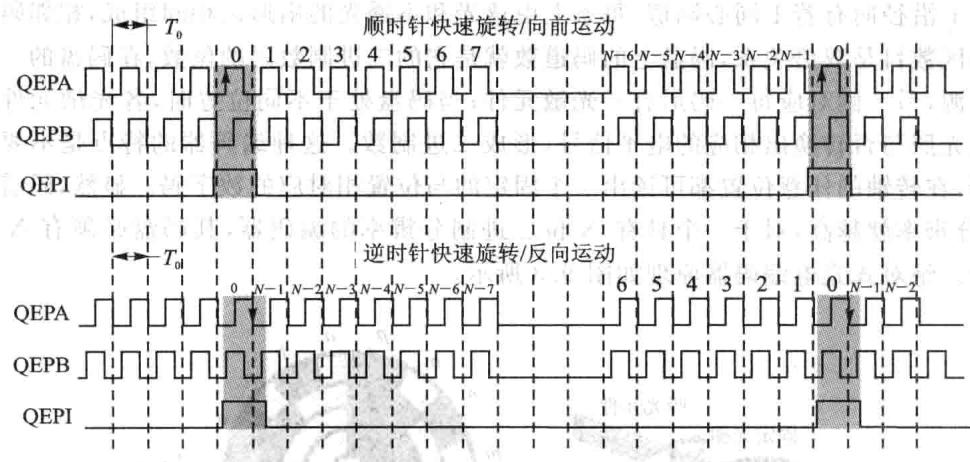

图9.4QEP编码器的顺时针和逆时针输出信号波形

## 2.光电编码器电机测速的基本原理

可以利定时器/计数器配合光电编码器的输出脉冲信号来测量电机的转速。具体的测速方法有M法、T法和M/T法3种。

M法又称之为测频法，其测速原理是在规定的检测时间 内，对光电编码器输出的脉冲信号计数的测速方法，例如光电编码器是N线的，则每旋转一周可以有4N个脉冲，因为两路脉冲的上升沿与下降沿正好是编码器信号4倍频。现在假设检测时间是 ，计数器的记录的脉冲数是M1，则电机的每分钟的转速为：

在实际的测量中，时间 内的脉冲个数不一定正好是整数，而且存在最大半个脉冲的误差。如果要求测量的误差小于规定的范围，比如说是小于百分之一，那么M1就应该大于50。在一定的转速下要增大检测脉冲数M1以减小误差，可以增大检测时间 ，但考虑到实际的应用中检测时间很短，例如伺服系统中的测量速度用于反馈控制，一般应在0.01s以下。由此可见，减小测量误差的方法是采用高线数的光电编码器。

M法测速适用于测量高转速，因为对于给定的光电编码器线数N，测量时间 条件下，转速越高，计数脉冲M1越大，误差也就越小。

T法也称之为测周法，该测速方法是在一个脉冲周期内对时钟信号脉冲进计数的方法。例如时钟频率为 ，计数器记录的脉冲数为 ，光电编码器是N线的，每周输出4N个脉冲，那么电机的每分钟的转速为：

为了减小误差，希望尽可能地记录较多的脉冲数，因此 法测速适用于低运算

行的场合。但转速太低，一个编码器输出脉冲的时间太长，时钟脉冲数会超过计数器最大计数值而产生溢出；另外，时间太长也会影响控制的快速性。与M法测速一样，选用线数较多的光电编码器可以提高对电机转速测量的快速性与精度。

M/T法测速是将M法和T法两种方法结合在一起使用，在一定的时间范围内，同时对光电编码器输出的脉冲个数 和 进行计数，则电机每分钟的转速为

实际工作时，在固定的 时间内对光电编码器的脉冲计数，在第一个光电编码器上升沿定时器开始定时，同时开始记录光电编码器和时钟脉冲数，定时器定时 时间到，对光电编码器的脉冲停计数，而在下一个光电编码器的上升沿到来时，时钟脉冲才停记录。采M/T法既具有M法测速的速优点，又具有T法测速的低速的优点，能够覆盖较的转速范围，测量的精度也较高，在电机的控制中有着十分广泛的应用。

### 9.2 F28335增强型正交编码模块eQEP

## 1.eQEP引脚

F28335有两路eQEP模块，每个模块有4个引脚，分别是：QEPA/XCLK和QEPB/XDIR。这两个引脚被使在正交时钟模式或者直接计数模式。

正交时钟模式：正交编码器提供两路相位差为 的脉冲，相位关系决定了电机旋转的方向信息，脉冲的个数可以决定电机的绝对位置信息。超前或者顺时针旋转时，A路信号超前B路信号，滞后或者逆时针旋转时，B路信号超前A路信号。正交编码器使用这两路输引脚可以产正交时钟和向信号。

直接计数模式：在直接计数模式中，方向和时钟信号直接来自外部，此时QEPA引脚提供时钟输，QEPB引脚提供向输。

:索引或者起始标记。

正交编码器使用索引信号来确定一个绝对的起始位置，此引脚直接与正交编码器的索引输出端相连，当此信号到来时，可以将位置计数器复位清零，也可以初始化或者锁存位置计数器的值。

QEPS：锁存输入引脚。

锁存引脚输的主要作就是当规定事件信号到来时，初始或者锁存位置计数器的值，此引脚通常和传感器或者限制开关相连，来通知电机已经达到了预定位置。

## 2.eQEP功能描述

eQEP主要包括以下几个功能单元：

➢通过GPIOMUX寄存器编程锁定QEPA或者QEPB功能。

正交解码单元（QDU）。

➢位置计数器和位置计算控制单元(PCCU)。

➢正交边沿捕获单元，用于低速测量（QCAP）。

》用于速度/频率测量的时基单元(UTIME)。

》用于检测的看门狗模块。

QEP模块框图如图9.5所示。

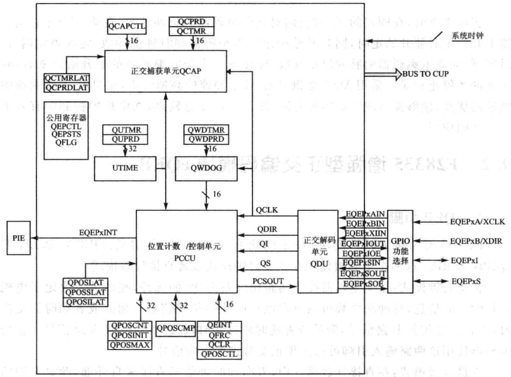

图9.5 QEP模块框图

### 9.3 eQEP正交解码单元(QDU)
> 🔧 **交互式学习**：[eQEP正交解码机制](../interactive/components/qep_decoder.html)

正交解码单元功能框图如图9.6所示。

## 1.位置计数器输入模式

在正交计数模式下，正交解码模块产生位置计数器时钟信号和方向信号，位置计数器的计数模式由QDECCTL寄存器中的QSRC位决定，主要有如下4种模式：

正交-计数模式。

直接-计数模式。

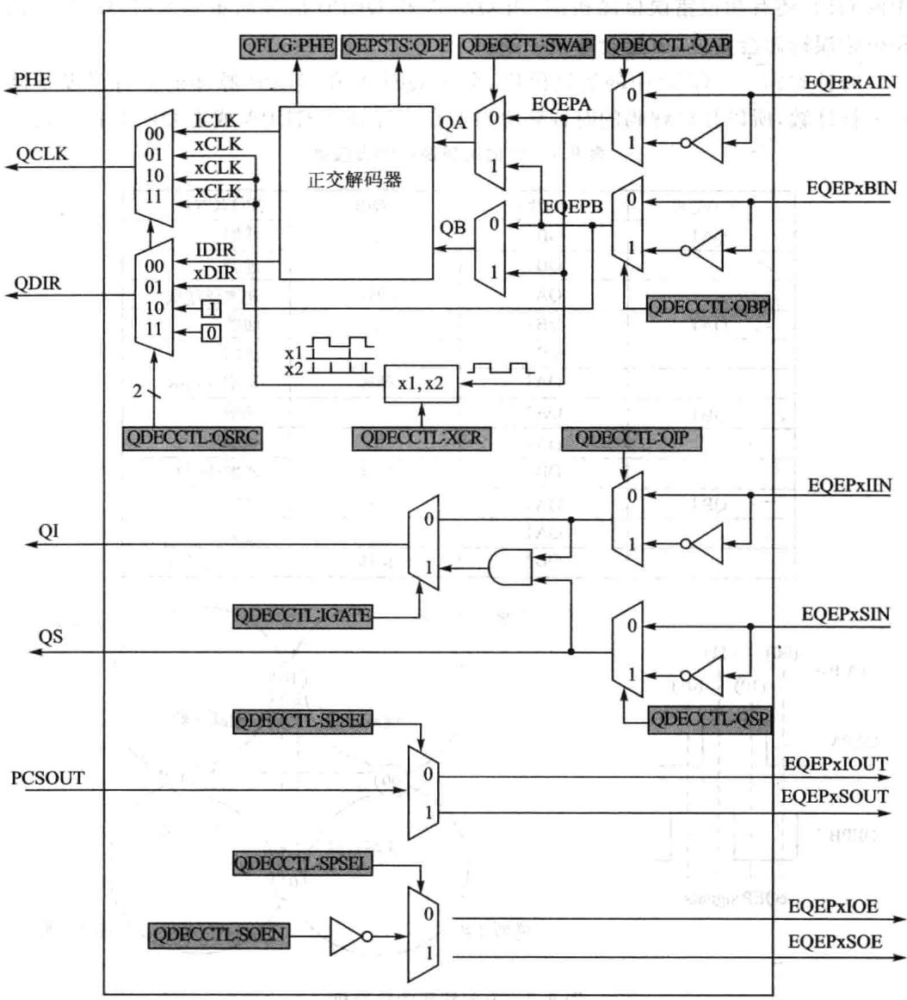

图9.6正交解码单元功能框图

向上-计数模式。

向下-计数模式。

## (1)正交-计数模式

在正交-计数模式下，正交解码器产向信号和时钟信号送给位置计数器。

向解码通过确定QEPA和QEPB两个脉冲信号，哪一个超前，来解码出旋转向逻辑，并且将此向逻辑更新到QEPSTS的QDF位。表9.1给出了向解码逻辑的真值表。图9.7给出了向解码的状态机。TMS320F2833X系列DSP

中的QEP还有相位错误检测机制，当QEPA和QEPB信号同步到来时，QEP中的相位错误标志会置位，而且会申请中断。

时钟解码—QEP中的解码模块，会对QEPA和QEPB脉冲的上升沿及下降沿进计数，所以最后解码的时钟频率将会是实际输QEPA或者QEPB的4倍。

|先前边沿|当前边沿|QDIR|QPOSCNT||
|---|---|---|---|---|
|QA↑|QB↑|上|递增||
||QB+|下|递减||
||QAt|翻转|递增或递减||
|QAV|QB↓|上|递增||
||QB↑|下|递减||
|||QA↑|翻转|递增或递减|
||QB↑|QA↑|下|递增|
|||QA+|上|递减|
|||QB|翻转|递增或递减|
||QB|QA|下|递增|
|||QA↑|上|递减|
||QB↑|翻转|递增或递减||

表9.1方向解码逻辑的真值表

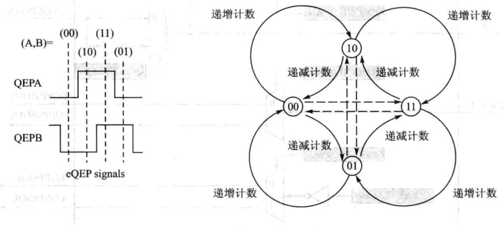

图9.7方向解码的状态机

相位错误标识：在正常操作条件下，正交输QEPA与QEPB在相位上相差90°，边沿信号是不会同时到达的，当同时检测到两者的边沿信号时，QFLG寄存器的相位错误标识(PHE)置位。图9.7中状态机的虚线就代表产生的相位错误的可能。

反向计数：在正常正交计数操作时，QEPA输入送到正交解码器的QA输入，QEPB输入到正交解码器的QB输入。反向计数通过设置QDECCTLL寄存器的Swap位被使能，此时正交解码器的输入取反，从而计数方向也取反。

## (2)方向计数模式

有些位置编码器提供了方向和时钟输出代替正交输出，如图9.8所示，此种情况

下，可以使用方向计数模式。此时QEPA只能作为时钟输，QEPB只能作为方向输入。如果方向为高时，那么计数器会在QEPA输入的上升沿时递增计数，当方向为低时，那么计数器会在QEPA输入的上升沿自动递减计数。

## (3)递增计数模式

计数器的方向信号被硬件规定为递增计数，此时位置计数器根据QDECCTL中的XCR位规定，对QEPA信号计数或者2倍关系计数。

## (4)递减计数模式

计数器的向信号被硬件规定为递减计数，此时位置计数器根据QDECCTL中的XCR位规定，对QEPA信号计数或者2倍关系计数。

## 2.QEP输入极性选择

每个QEP输可以通过QDECCTL寄存器的8～5位决定极性。

## 3.位置比较同步输出

增强型的QEP包括个位置比较单元，主要于产位置较同步信号。当位置计数器的值与位置较寄存器QPOSCMP的值相等时，可以把QEPI或者QEPS配置为输出引脚，于产同步信号输出。具体配置请看QDECCTLSOEN和QDECCTL[SPSEL]。

### 9.4 eQEP位置计数和控制单元(PCCU)

位置计数和控制单元提供了两个配置寄存器QEPCTL和QPOSCTL。用于设置位置计数器操作模式、位置计数器初始化/锁存模式和产生同步信号的位置比较逻辑。

## 1.位置计数操作模式

位置计数器的值可以有不同的方式进捕获。在有些系统中，位置计数器连续累加计数，位置计数器按照当前的参考位置提供计数信息。例如，在安装正交编码器的打印机中，通过将打印机头移动到起始位置从而使计数器复位，也即打印机头在起始位置时为参考位置。而在有些系统中，位置计数器通过索引脉冲实现每次索引脉冲到来时，位置计数器就自动复位，位置计数器提供了相对于索引脉冲的相对位置信息。位置计数器可以配置为如下几种模式：

在索引事件到来时，位置计数器复位。

》在计数值达到设定的最大值时，位置计数器复位。

》第一个索引事件到来时，位置计数器复位。

》在定时（单位时间)事件到达时，位置计数器复位。

上述所有的操作模式，位置计数器都会在上溢时复位到0，在下溢时复位到QPOSMAX最大值。上溢是指位置计数器向上计数达到最大值后，下溢是指位置计数器向下计数达到0之后。

①在索引事件到来时，位置计数器复位[QEPCTL[PCRM]=00]。

如果索引事件发生在正向运动时，那么位置计数器在下一个QEP时钟复位到0。如果索引事件发生在反向运动时，那么位置计数器在下一个QEP时钟复位到QPOSMAX最大设定值。

第一个索引标识为在第一个索引边沿后的正交边沿。eQEP外设记录了第一个索引标识（QEPSTSFIMF）的发以及第一个索引事件标识向（QEPSTS[FIDF)，它也记录了第个索引标识的正交边沿，从而可使这个相关的正交转换于索引事件的复位操作。例如，在正向运动过程中，第一次复位操作发生在QEPB的下降沿，那么所有后来的复位必须分配在正向运动中的QEPB的下降沿或者反向运动中的QEPB的上升沿，如图9.9所示。

在每个索引事件发生时，位置计数器的值锁存到QPOSILAT寄存器中，方向信号更新到QEPSTS[QDLF中。在这种情况下，如果锁存的值不是0或者QPOSMAX值时，位置计数错误标志位和错误中断标志位会置1。在索引事件被标识时，位置计数器错误标识（QEPSTS[PCEF）被更新并且错误中断标识（QFLG[PCE)将被置位，只有通过软件才能清楚这两个错误标识。

这种模式下，索引事件锁存配置QEPCTLIEL]位被忽略，位置计数器错误标识以及中断标识只有在索引事件复位模式下产。

②在计数值达到设定最值时，位置计数器复位[QEPCTL[PCRM]=01]。

如果位置计数器达到QPOSMAX时，那么在正向运动过程中，位置计数器在下个eQEP时钟时置0，且位置计数器上溢标识位置位；如果位置计数器等于0，且在反向运动的条件下，那么位置计数器在QEP的下个时钟复位到QPOSMAX，且位置计数器下溢标识位置位，如图9.10所示。

③第一个索引事件发生时，位置计数器复位[QEPCTL[PCRM]=10]。

如果第个索引事件发在正向运动时，位置计数器会在下一个QEP时钟复位为0;如果第个索引事件发在反向运动时，位置计数器会在下一个QEP时钟复位为QPOSMAX。注意只有在第个索引事件发时，位置计数器才会复位，后面的索引事件，不会使位置计数器复位。

④在定时(单位时间)事件到达时，位置计数器复位[QEPCTL[PCRM]=11]。

在此种模式下，事件发生时QPOSCNT的值会锁存到QPOSLAT寄存器中，然后位置计数器会复位到0或者QPOSMAX，取决于QDECCTLQSRC]设置的向模式。这种模式对测量频率很有效。

## 2.位置计数器锁存

QEP的索引和标记输引脚输事件发时，将位置计数器的值锁存到QPOSILAT和QPOSSLAT中。

## (1)索引事件锁存

在某些应用中，并不要求在每次索引事件到来时复位位置计数器，而是要求在32位模式（QEPCTL[PCRM]=01和QEPCTL[PCRM]=10)下，操作位置计数器。

在这种情况下，eQEP的位置计数器可以在如下事件配置锁存并且在每次索引事件标识时，向信息被记录到QEPSTS[QDLF]中。

①上升沿锁存(QEPCTL[IEL]=01)。

② 下降沿锁存(QEPCTL[IEL]=10)。

③索引事件标识锁存（QEPCTL[IEL]=11)。

这个作为错误检查机制很有用，可以用来检查位置计数器在索引事件之间能否正确累加。例如，1000线的编码器当按照相同方向运动时，在两个索引事件之间应当有4000个脉冲，进累加4000次。

位置计数器的值锁存到QPOSILAT寄存器中时，索引事件中断标志位（QFLG[IEL)被置位。当QEPCTL=0时，索引事件锁存配置位(QEPCTZ(IEL))被忽略。

上升沿锁存（QEPCTL[IEL]=01）——在输索引事件的每次上升沿到来时，位置计数器的值（QPOSCNT)锁存到QPOSILAT寄存器中。

下降沿锁存(QEPCTL[IEL]=10）——在输索引事件的每次下降沿到来时，位置计数器的值（QPOSCNT）锁存到QPOSILAT寄存器中。

索引事件标识锁存/软件索引标识(QEPCTL[IEL]=11）第个索引标识在第个索引边沿后的正交边沿。eQEP外设记录了第一个索引标识（QEPSTS[FIMF])的发生以及第一个索引事件标识方向（QEPSTS[FIDF），它也记录了第一个索引标识的正交边沿，从而可使这个相关的正交转换可以用于位置计数器锁存（QEPCTL[IEL]=11)。

如图9.11所为应用索引事件标识的位置计数器锁存时序图。

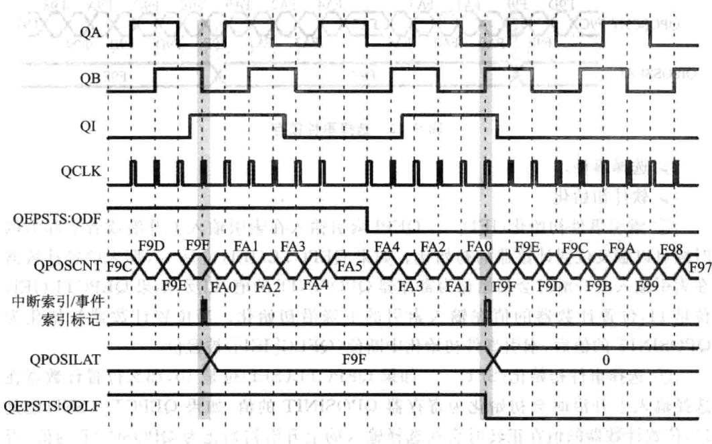

图9.111000线编码器使用索引事件标识锁存位置计数器的时序图

## (2)选择事件锁存

位置计数器的值在选择输入信号的上升沿被锁存到QPOSSLAT寄存器中，并且QEPCTL[SE1位被清零。如果QEPCTL[SE1]位被置位，位置计数器的值在正向运动时，选择输入信号的上升沿进行锁存，反向运动时，选择输入信号的下降沿进锁存。如图9.12所。

当位置计数器的值锁存到寄存器后，选择事件锁存中断标志位(QFLG[SE1)被置位。

## 3。位置计数器初始化

位置计数器可以由以下事件进初始化：

》索引事件。

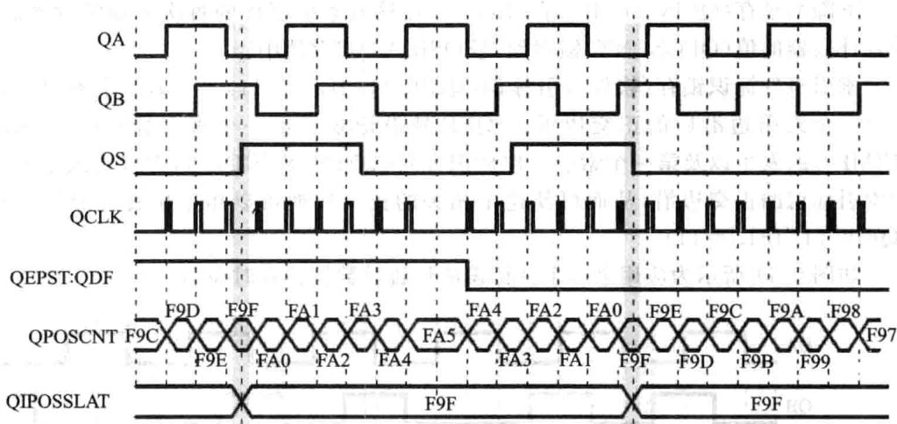

图9.12 选择事件锁存

选择事件。

软件初始化。

①索引事件初始化(IEI)QEPI索引输在索引输上升沿或者下降沿的时候可以触发位置计数器的初始化。如果QEPCTL(IEI)位是10，那么位置计数器在索引输上升沿时会初始化为寄存器QPOSINIT的值，相反，如果QEPCTL(IEI)位是11，位置计数器的值在输入索引的下降沿初始化。当位置计数器初始化为QPOSINIT的值后，索引事件初始化中断位（QFLG[IEI)被置位。

②选择事件初始化(SEI）如果QEPCTL(SEI)位是10，那么位置计数器在选择输上升沿时会初始化为寄存器QPOSINIT的值；如果QEPCTL（SEI）位是11,位置计数器的值在正转时会在选择输的上升沿初始化为QPOSINIT的值，否则，在反转时，在选择输入的下降沿初始化。当位置计数器初始化为QPOSINIT的值后，选择事件初始化中断位（QFLG[IEI)被置位。

③软件初始化(SWI)将QEPCTL(SWI)位设置为1时，位置计数器由软件初始化，而QEPCTL(SWI)位在初始化后会动清除。

### 9.5 eQEP位置比较单元

QEP模块包含个位置较单元，于产同步信号输出或者产匹配中断。原理框图如图9.13所示。

位置较寄存器QPOSCMP有影寄存器，影寄存器模式可以通过QPOSCTL[PSSHDW]使能或者禁。如果影寄存器模式禁时，CPU直接写到有效位置比较寄存器即可。

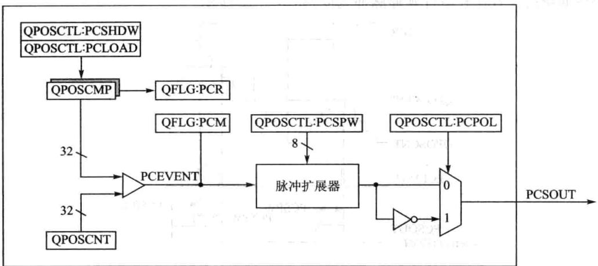

图9.13QEP位置比较单元框图

在影子寄存器模式使能时，可以配置位置比较单元（QPOSCTL[PCLOAD]）位以将影寄存器内的值在下列事件来临时装有效寄存器并且在装载完成后，会产生位置比较就绪中断位（QFLG[PCR）。

较匹配装载。

位置计数器清零装载。

当位置计数器的值（QPOSCNT)与工作位置比较寄存器（QPOSCMP)的值匹配时，位置比较位(QFLG[PCM)被置位，并且会产位置比较同步可调宽脉冲以触发外部设备。

例如，假设QPOSCM=2，在正向计数时，位置比较单元在eQEP位置计数器的1~2转换过程中产一个位置比较事件；而在反向计数时，位置计数器3～2转换过程中产生个位置比较事件，如图9.14所示。

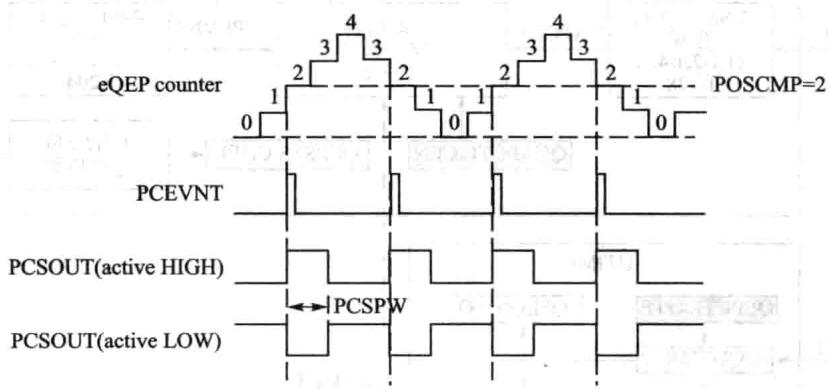

图9.14eQEP位置比较事件发生时序

位置较的脉冲扩展逻辑在位置较匹配时可以输出个可编程的位置比较同步脉冲，当前个位置比较脉冲仍在作并且产新的位置比较匹配时，脉冲扩展器

会根据新的位置比较事件延伸脉冲宽度，如图9.15所示。

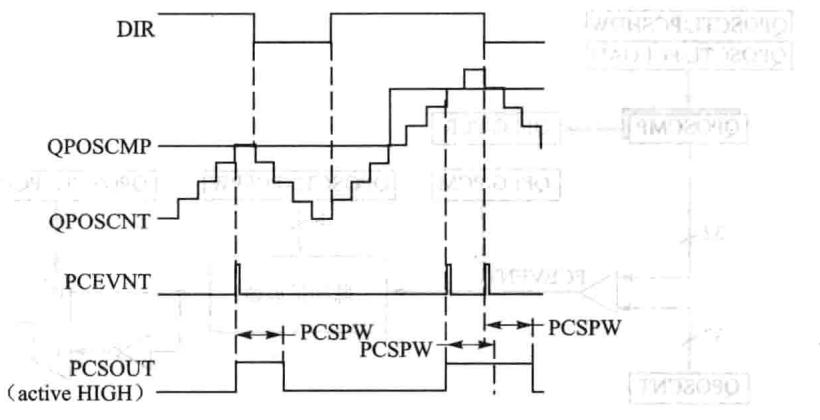

图9.15 eQEP位置比较同步输出脉冲宽度扩展器

### 9.6 eQEP边沿捕获单元

QEP模块包括一个集成的边沿捕获单元来测量转速，如图9.16所示，其中针对慢速和高速，此单元提供了两种方式进行计算。

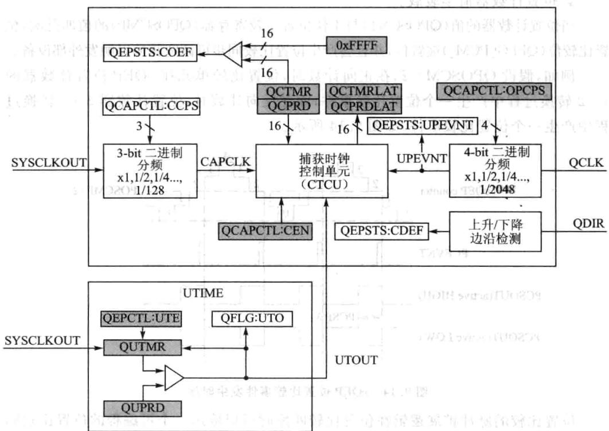

图9.16eQEP边沿捕获单元置

①低速测量公式：

低速测量思想就是在设定编码器脉冲数时，计量在此脉冲数内所消耗的时间，从而计算出速度，即T法。具体工作过程如下：

捕获时钟（QCTMR）以系统时钟分频后的时基作基准运行，在每个单位位置事件发时，QCTMR的值会自动加载到捕获周期寄存器QCPRD中，之后捕获时钟自动清零，同时QEPSTS中的UPEVNT标志位会置1，表明有新值锁存到QCPRD寄存器，通知CPU进行操作。图9.17所示是低速速度测量的时序。此种测量式，只有在下面两个条件满足时才是正确的。

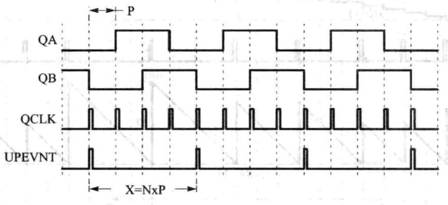

图9.17低速测量时序（QCAPCTL[UPPS]=0010)

条件：单位位置事件之间不能超过捕获时钟的最大值，不能超过65335。

条件二：没有换向发生。

如果上述条件不满足，定时器上溢时，捕获单元的错误标志位QEPSTS[COEF]会置1，如果两个单元位置事件发生向变化，则状态寄存器QEPSTS[CDEF]错误标识被置位。所以这种方式只适用于低速的时候。

②高速测量公式：

高速测量思想是在设定的单位时间里面，计量采集到的脉冲数，即可确定速度值，即M法。

捕获时钟寄存器和捕获周期寄存器可以配置成如下事件发生时，会把值锁存到QCTMRLAT和QPPRDLAT中。

事件一 读QPOSCNT寄存器时。

事件二：单位时间事件发生时。

如果QEPCTL[QCLM位被清零了，那么当CPU读取位置计数器时，捕获时钟和捕获周期寄存器的值分别被锁存到QCTMRLAT和QCPRDLAT寄存器中。

eQEP也沿捕获单元时序如图9.18所。

如果QEPCTL[QCLM]位置1，那么当单位时间事件发时，位置计数器、捕获时钟寄存器和捕获周期寄存器的值分别锁存到QPOSLAT、QCTMRLAT和QCPRDLAT中。

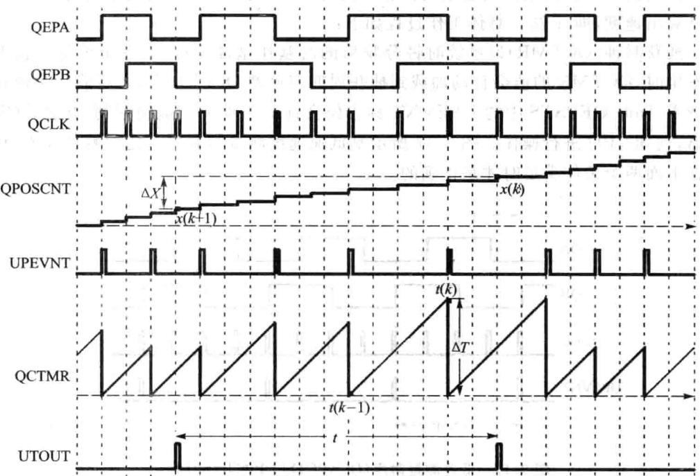

图9.18eQEP边沿捕获单元时序图

### 9.7 eQEP看门狗电路

QEP模块包括个16位的看门狗计数器，来监测正交编码脉冲状态。若有正交编码脉冲到来，看门狗计数器可以复位，如果正交编码脉冲没有到来，当看门狗计数器的值与其周期寄存器的值匹配时，可以产中断信号给CPU。该看门狗单元可以通过软件使能或者禁。看门狗模块原理如图9.19所。

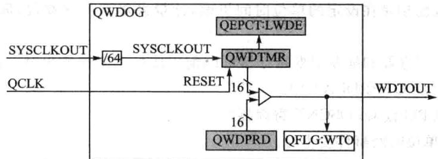

图9.19 eQEP看门狗定时器

### 9.8 eQEP定时器基准单元

QEP模块还包括了一个32位定时器（QUTMR），由SYSCLKOUT提供时钟，可产生用于速度计算的周期性中断。当定时器(QUTMR）与周期寄存器（QUPRD)匹配时，单位超时中断（QFLG[UTO]）被置位。

一个单位事件超时时，eQEP可以配置为锁存位置计数器、捕捉定时器和捕捉周期值，从而用这些锁存的值来计算速度。图9.20给出了定时器的结构图。

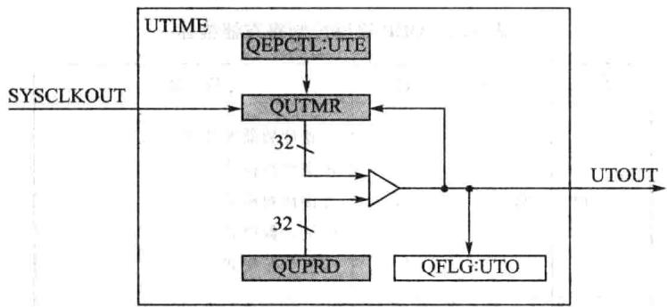

图9.20eQEP定时器结构图

### 9.9 eQEP中断结构

eQEP模块中断的工作机制如图9.21所示。

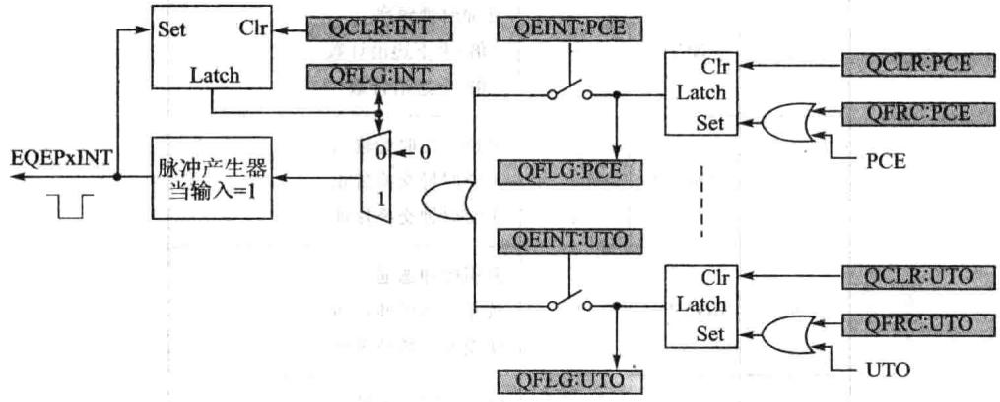

图9.21 eQEP中断结构图

QEP一共可以产生11个中断事件，分别为PCE、PHE、QDC、WTO、PCU、PCO、PCR、PCM、SEL、IEL、UTO。这些中断可以通过中断控制寄存器QEINT来

设置使能或者禁止。如果每个中断都使能，那么中断源会产生中断脉冲送给PIE模块，进而送给CPU。这些中断标志可以通过中断清除寄存器QCLR来清除。而且还可以通过中断强制寄存器来软件强制中断事件，这样对系统测试比较有利。

### 9.10 eQEP寄存器

## 1.QEP解码控制寄存器QDECCTL

QDECCTL解码控制寄存器的位信息与功能描述如表9.2所列。

|位|名称|值|描述|||
|---|---|---|---|---|---|
|1中||||||
|OT||00011011|位置计数器源选择正交计数模式直接计数模式向上计数模式向下计数模式|||
|15~14|QSRC|||||
|13|SOEN|SOEN1|同步信号输出使能禁止位置比较同步输出使能位置比较同步输出|||
|12|SPSEL|0|同步信号引脚选择Index引脚用于输出Strobe引脚用于输出  中|||
|11|XCR|90|外部时钟频率2倍：上下边沿计数1倍：上边沿计数          6口|||
|10|SWAP||交换正交时钟输人正交时钟交换禁止正交时钟交换使能|||
|9|IGATE|0一|索引脉冲选通禁止索引脉冲选通使能索引脉冲选通|||
|8|QAp|201|QEPA输极性无效果反向QEPA极性|||

表9.2QEP解码控制寄存器描述

|位|名称|值|描述|
|---|---|---|---|
|7|QBP|01|QEPB输极性无效果反向QEPB极性|
|6|QIP|01|QEPI输入极性无效果反向QEPI极性|
|5|QSP|01|QEPS输人极性无效果反向QEPS极性|
|4~0|保留||写人总是为0|

续表9.2

## 2.QEP控制寄存器QEPCTL

QEPCTL控制寄存器的位信息与功能描述如表9.3所列。

|位|名称|值|描述|
|---|---|---|---|
|15~14|FREE,SOFT|00011x00011x00011x|仿真控制位位置计数器立刻停止（位置计数器为）位置计数器继续运行位置计数器不受影响看门狗计数器停止（看门狗计时器行为）看门狗计数器继续运行看门狗计数器不受影响捕获定时器立刻停止（捕获定时器行为）捕获定时器继续运行捕获定时器不受影响|
|13~12|PCRM|00011011|位置计数器复位模式当索引事件发生时复位当达到最大位置时复位当第一个索引事件时复位当单位时间事件时复位|
|||||
|11~10|SEI|00011011|索引事件初始位置计数器不动作不动作初始化位置计数器在QEPI信号的上升沿    初始化位置计数器在QEPI信号的下降沿|

表9.3QEP控制寄存器描述

续表9.3

|位|名称|值|描述|
|---|---|---|---|
|9~8|IEI||索引事件初始位置计数器|
|00|不动作|||
|01|不动作|||
|10|初始位置计数器在QEPI上升沿|||
|7||11|初始位置计数器在QEPI下降沿|
||软件初始化位置计数器|||
|SWI|0|不动作||
|1|初始化位置计数器|||
|6|SEL|0|索引事件锁存位置计数器 在QEPS的上升沿锁存位置计数器的值|
|1|如果QDECCTL的QSP=1，那么在QEPS的下降沿锁存数据|||
||在QEPS的顺时针方向：在QEPS的上升沿锁存位置计数器逆|||
||时针：在QEPS的下降沿锁存位置计数器|||
|5~4|IEL|00 01|索引事件锁存位置计数器 保留|
|10|在索引信号上升沿锁存位置计数器|||
|11|在索引信号下降沿锁存位置计数器|||
||软件索引标记|||
|3|QPEN||正交位置计数器使能|
|0 1|软件复位QEP|||
||QEP计数器使能|||
|2|QCLM|0|QEP捕捉锁存模式|
|1|当CPU读位置计数器时，锁存数据|||
||当单位时间事件发生时，锁存数据|||
|1|UTE|0|QEP单位定时器使能 禁止定时器|
|1|使能单位定时器|||
||QEP看门狗使能|||
|0|WDE|0|禁止QEP看门狗|
|1|使能QEP看门狗|||

## 3.QEP位置比较控制寄存器QPOSCTL

QPOSCTL位置控制寄存器的位信息与功能描述如表9.4所列。

|位|名称|值|描述|
|---|---|---|---|
|15|PCSHDW|01|位置比较影子映射使能禁止此功能使能此功能|
|14|PCLOAD|01|位置比较影映射加载模式在QPOSCNT=0时加载在QPOSCNT=QPOSCMP时加载|
|13|PCPOL|01|同步信号输出极性输出高有效脉冲输出低有效脉冲|
|12|PCE|01|位置比较功能使能/禁止禁止此功能使能此功能|
|11~0|PCSPw|0x0000x0010xfff|选择位置比较同步输出脉冲宽度1X4XSYSCLKOUT2X4XSYSCLKOUT                    置4096X4XSYSCLKOUT|

表9.4QEP位置控制寄存器描述

## 4.QEP捕获控制寄存器QCAPCTL

QCAPCTL捕获控制寄存器的位信息与功能描述如表9.5所列。

|位|名称|值|描述|
|---|---|---|---|
|15|CEN|01|使能QEP捕捉功能禁止QEP捕捉单元使能QEP捕捉单元|
|14~7|保留||总是写人0|
|6~4|CCPS|000001010011100101110111|QEP捕提时钟分频数CAPCLK=SYSCLK/1CAPCLK=SYSCLK/2CAPCLK=SYSCLK/4CAPCLK=SYSCLK/8CAPCLK=SYSCLK/16CAPCLK=SYSCLK/32CAPCLK=SYSCLK/64CAPCLK=SYSCLK/128|

表9.5 QEP捕获控制寄存器描述

续表9.5

|位|名称|值|描述|
|---|---|---|---|
|3~0|UPPS|0000 0001 0010 0011 0100 0101 0110 0111 1000 1001 1010 1011|单位位置事件分频数 UPEVNT=QCLK/1 UPEVNT=QCLK/2 UPEVNT=QCLK/4 UPEVNT=QCLK/8 UPEVNT=QCLK/16 UPEVNT=QCLK/32 UPEVNT=QCLK/64 UPEVNT=QCLK/128 UPEVNT=QCLK/256|

## 5.QEP位置计数器QPOSCNT寄存器

QPOSCNT位置计数器的位信息与功能描述如表9.6所列。

|位|名称|描述|
|---|---|---|
|31~0|QPOSCNT|32位位置计数寄存器，它会根据方向进行增或者减计数|

表9.6QEP位置计数器描述

## 6.QEP位置计数器初始化寄存器QPOSINIT

QEP位置计数器初始化寄存器QPOSINIT的位信息与功能描述如表9.7所列。

|位|名称|描述|
|---|---|---|
|31~0|QPOSINIT|这个寄存器的值可以对QPOSCNT进行初始化|

表9.7QEP位置计数器初始化寄存器描述

## 7.QEP最大位置计数器寄存器QPOSMAX

QEP最位置计数器寄存器QPOSMAX的位信息与功能描述如表9.8所列。

|位|名称|描述|
|---|---|---|
|31~0|QPOSMAX|此寄存器为最大的位置计数器的值|

表9.8QEP最大位置计数器寄存器描述

## 8.QEP位置比较寄存器QPOSCMP

QEP位置较寄存器QPOSCMP的位信息与功能描述如表9.9所列。

|位|名称|描述|
|---|---|---|
|31~0|QPOSCMP|当位置计数器的值与位置比较寄存器的值相同时，会输出同步信号或者产生中断|

表9.9 QEP位置比较寄存器描述

## 9.QEP索引I位置加载寄存器QPOSILAT

QEP索引位置加载寄存器QPOSILAT的位信息与功能描述如表9.10所列。

|位|名称|描述|
|---|---|---|
|31~0|QPOSILAT|当索引事件发生时，位置计数器的值会加载到这个寄存器中|

表9.10QEP索引位置加载寄存器描述

## 10.QEP标记位置加载寄存器QPOSSLAT

QEP标记位置加载寄存器QPOSSLAT的位信息与功能描述如表9.11所列。

|位|名称|描述|
|---|---|---|
|31~0|QPOSSLAT|当标记事件发生时，位置计数器的值会加载到这个寄存器中|

表9.11QEP标记位置加载寄存器描述

## 11.QEP位置加载寄存器QPOSLAT

QEP位置加载寄存器QPOSLAT的位信息与功能描述如表9.12所列。

|位|名称|描述|
|---|---|---|
|31~0|QPOSLAT|当单位时间事件发生时，位置计数器的值会加载到这个寄存器中|

表9.12QEP位置加载寄存器描述

## 12.QEP单位时间定时器QUTMR

QEP单位时间定时器QUTMR的位信息与功能描述如表9.13所列。

|位|名称|描述中           e|
|---|---|---|
|31~0|QUTMR|当此定时器的值与单位时间周期寄存器的值相同时，单位时间事件就会发生|

表9.13QEP单位时间定时器寄存器描述

## 13.QEP单位时间周期寄存器QUPRD

QEP单位时间周期寄存器QUPRD的位信息与功能描述如表9.14所列。

|位|名称|描述|
|---|---|---|
|31~0|QUPRD|此寄存器中的值为单位时间周期值|

表9.14QEP单位时间周期寄存器描述

## 14.QEP看狗定时器QWDTMR

QEP看门狗定时器QWDTMR的位信息与功能描述如表9.15所列。

|位|名称|描述|
|---|---|---|
|31~0|QWDTMR|这个为看门狗的定时器，当此值与看门狗的周期寄存器的值相同时，看门狗中断就会产生|

表9.15QEP看门狗定时器寄存器描述

## 15.QEP看狗周期寄存器QWDPRD

QEP看狗定时器QWDPRD的位信息与功能描述如表9.16所列。

|位|名称|描述|
|---|---|---|
|31~0|QWDPRD|看门狗的周期寄存器|

表9.16QEP看门狗周期寄存器描述

## 16.QEP中断使能寄存器QEINT

QEP中断使能寄存器QEINT的位信息与功能描述如表9.17所列。

|位|名称|值|描述|位|名称|值|描述|
|---|---|---|---|---|---|---|---|
|15~12|保留|0|写入全部为0|6|PcO|01|位置计数器上溢中断使能中断禁止|
|11|UTO|01|单位时间事件中断使能中断禁止中断使能|5|PCU|01|位置计数器下溢中断使能中断禁止中断使能|
|10|IEL|01|索引事件锁存中断使能中断禁止中断使能|4|器WTO|家痘01|看门狗事件中断使能中断禁止中断使能|
|9|SEL|01|标记事件锁存中断使能中断禁止中断使能|||||
|3|QDC|01|看门狗方向改变中断使能中断禁止中断使能|||||
|2|QPE|01|正交相位错误中断使能中断禁止中断使能|||||
|8|PCM|01|位置比较匹配中断使能中断禁止C5中断使能|||||
||PcE|01|位置计数器错误中断使能中断禁止中断使能|||||
|7|PCR|01|位置比较准备中断使能中断禁止 特服医豆中断使能中断使能|||||
|0|保留||保留|||||

表9.17QEP中断使能寄存器描述

## 17.QEP中断标志寄存器QFLG

QEP中断标志寄存器QFLG的位信息与功能描述如表9.18所列。

|位|名称|值|描述|位|名称|值|y     描述|
|---|---|---|---|---|---|---|---|
|15~12|保留||写入全部为0|5|PCU|01|位置计数器下溢中断标志没有中断产生中断产生|
|$1ac|UTO|01|单位时间事件中断标志没有中断产生中断产生|4|WTO|0|看门狗事件中断标志没有中断产生中断产生|
|10|IEL|01|索引事件锁存中断标志没有中断产生中断产生|3|QDC|01|正交方向改变中断标志没有中断产生中断产生|
|9|SEL|01|标记事件锁存中断标志没有中断产生中断产生|2|PHE|0|正交相位错误中断标志没有中断产生中断产生|
|8|Pcm|01|QEP比较匹配中断标志没有中断产生中断产生|1|PCE|01|位置计数器错误中断标志没有中断产生中断产生|
|7|PCR|01|QEP较准备中断标志没有中断产生中断产生|0|INT|01|全局中断状态标志没有中断产生中断产生|
|6|PCO|01|位置计数器上溢中断标志没有中断产生中断产生|||||

表9.18QEP中断标志寄存器描述

## 18.QEP中断清除寄存器QCLR

QEP中断清除寄存器QCLR的位信息与功能描述如表9.19所列。

## 19.QEP中断强制寄存器QFRC

QEP中断强制寄存器QFRC的位信息与功能描述如表9.20所列。

|位|名称|值|描述|
|---|---|---|---|
|15~12|保留||写人全部为0|
|11|uTO|01|清除单位时间事件中断标志没有效果清除中断标志|
|10|IEL|01|清除索引事件锁存中断标志没有效果清除中断标志|
|9|SEL|01|清除标记事件锁存中断标志没有效果清除中断标志|
|8|PCM|01|清除QEP比较匹配中断标志没有效果清除中断标志|
|7福|PCR|01|清除QEP比较准备中断标志没有效果清除中断标志|
|6|PCO|01|清除位置计数器上溢中断标志没有效果清除中断标志|
|虚呼5|PCU|01|清除位置计数器下溢中断标志没有效果清除中断标志|
|4|WTO|1|清除看门狗事件中断标志没有效果清除中断标志|
|3|QDC|01|清除正交方向改变中断标志没有效果清除中断标志|
|2|PHE|01|清除正交相位错误中断标志没有效果清除中断标志|
|1|PCE|01|清除位置计数器错误中断标志没有效果清除中断标志|
|0|INT|R01|清除全局中断状态标志没有效果清除中断标志|

表9.19 QEP中断清除寄存器描述

|位|名称|值|描述|
|---|---|---|---|
|5~12|保留||写入全部为0|
|11|UTO|01|强制单位时间事件中断没有效果强制中断产生|
|10|IEL|01|强制索引事件锁存中断没有效果强制中断产生|
|9|SEL|01|强制标记事件锁存中断没有效果强制中断产生|
|1p1.8|PCM|0|强制QEP比较匹配中断没有效果强制中断产生|
|7|PCR具|01|强制QEP比较准备中断没有效果强制中断产生|
|6|PCO|01|强制位置计数器上溢中断没有效果强制中断产生|
|5志阳湖|PCU的对|01|强制位置计数器下溢中断没有效果强制中断产生|
|4|正WTO|01|强制看门狗事件中断标志没有效果强制中断产生|
|3|活QDC|01|强制正交方向改变中断没有效果强制中断产生|
|1O02音中|酱PHE|1|强制正交相位错误中断没有效果强制中断产生|
|STO|奇PCE|01|强制位置计数器错误中断没有效果强制中断产生|
|0|保留||写入全部为0|

表9.20QEP中断强制寄存器描述

## 20.QEP状态寄存器QEPSTS

QEP状态寄存器QEPSTS的位信息与功能描述如表9.21所列。

|位|名称|值|描述|位|名称|值|家菜描述L|
|---|---|---|---|---|---|---|---|
|15~8|保留||写人的值全部为0|3|福2COEF2|器0业-|捕获溢出错误标志无意义新在QEP捕获计时器发生溢出|
|7|UPEVNT|01|单位位置事件标志没有检测此事件检测到此事件，写1清零|||||
|6|FDF|01净|第一个索引标记方向第一个索引标记锁存逆时针方向第一个索引标记锁存顺时针方向|2|CDEF|01|捕获方向错误标志位无意义在捕获事件发生时，方向改变丰|
|5|QDF|01|正交方向标志逆时针方向顺时针方向|1|FIMF|01|第一个索引标记标志位无意义金室第一个索引标记事件发生|
|4|QdLF|01|QEP方向锁存标志在索引标记事件锁存逆时针方向在索引标记事件锁存顺时针方向|||||
|0|惠意PCEF|01|位置计数器错误标志位没有发生错误位置计数器错误|||||

表9.21QEP状态寄存器描述

## 21.QEP捕获定时器QCTMR

QEP捕获定时器QCTMR的位信息与功能描述如表9.22所列

|位|名称|描述|
|---|---|---|
|15~0|QCTMR|这个寄存器为边沿捕获单元提供时基|

表9.22QEP捕获定时器描述

## 22.QEP捕获周期寄存器QCPRD

QEP捕获周期寄存器QCPRD的位信息与功能描述如表9.23所列。

|位|名称|描述|
|---|---|---|
|15~0|QCPRD|QEP边沿捕获周期寄存器|

表9.23QEP捕获周期寄存器描述

## 23.QEP捕获周期锁存寄存器QCPRDLAT

QEP捕获周期锁存寄存器QCPRDLAT的位信息与功能描述如表9.24所列。

|位|名称|限 描述|
|---|---|---|
|15~0|QCPRDLAT|QEP边沿捕获周期锁存寄存器|

表9.24QEP捕获周期锁存寄存器描述

## 24.QEP捕获定时锁存寄存器QCTMRLAT

QEP捕获定时锁存寄存器QCPTMRLAT的位信息与功能描述如表9.25所列。

|位|名称|描述|
|---|---|---|
|15~0|QCTMRLAT|QEP边沿捕获定时锁存寄存器|

表9.25 QEP捕获定时锁存寄存器描述

### 9.11手把手教你实现基于eQEP的电机测速

## 1.实验目的

①掌握编码器信号测速原理。

②掌握eQEP原理。

## 2.实验主要步骤

①先打开已经配置好的CCS3.3软件。

②将仿真器的USB与计算机连接，将仿真器的另一端JTAG端插到YX-F28335开发板的JTAG针处。

③在CCS中选择Debug→Connect菜单项，连接目标板，确定目标板连接成功。

④将QEP-POS-SPEED目录复制到CCS开发环境中的Myproject目录下。

⑤在CCS中选择project→Open菜单项，加载的 目录中的QEP-POS-SPEED.pjt。

⑥在CCS中选择File→Load Program菜单项，加载Debug目录下的QEP-POS-SPEED.out。

⑦在CCS中选择Debug→Run菜单项，打开CCS的Watch Window，如果是将J8-2和J5-1短接的话，在Watch1窗口中输T1、T2后回车，将会看到T1和T2的值为15000。

⑧如果是将J8-2和J5-2短接的话，在Watch1窗口中输T3、T4后回车，将会看到T3和T4的值为15000。

## 3.实验原理说明

此实验通过编码器信号的读取，编码器的信号可以为ABZ增量式1000线编码

器，将编码器与电机转轴连接固定后，可以完成最大速度为6000转/分，最低速度为10转/分，极对数为2的电机测速。

QEP测速主要针对编码器信号，通过编码器信号的运算得到的速度量应用频繁，因此在程序中设置了位置速度结构体。

位置速度结构体定义如下：

## 

如何通过增量式编码器ABZ信号，进电机位置的精确控制?
